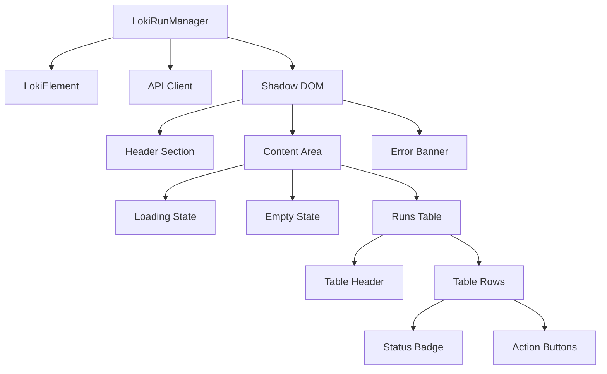
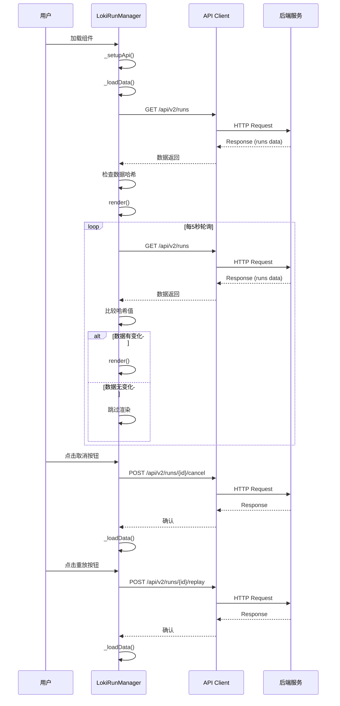
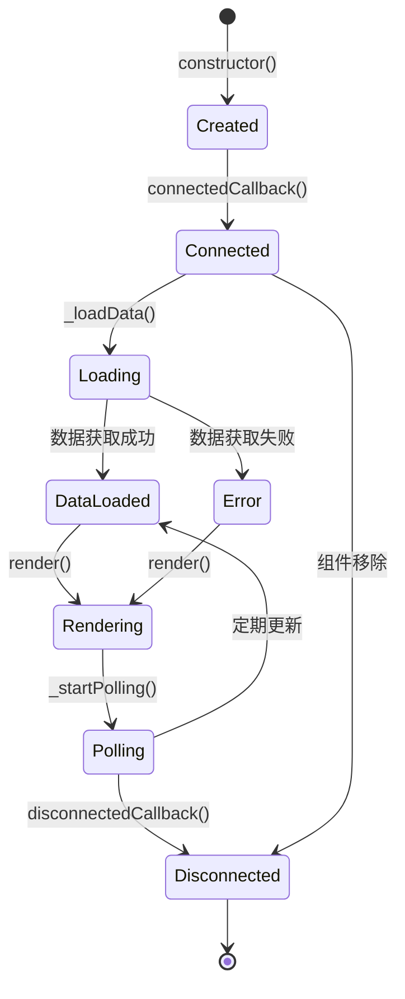

# LokiRunManager 模块文档

## 1. 模块概述

LokiRunManager 是一个基于 Web Components 技术构建的运行管理器组件，属于 Dashboard UI Components 中的任务和会话管理组件。它提供了一个直观的表格界面，用于显示、监控和管理系统中的运行记录。

### 1.1 主要功能

- **运行记录展示**：以表格形式显示所有运行记录，包含运行 ID、项目信息、状态、触发方式、开始时间和持续时间
- **状态管理**：支持多种运行状态的可视化展示，包括运行中、已完成、失败、已取消、待处理和已排队
- **操作控制**：提供取消正在运行的任务和重放已结束任务的功能
- **实时更新**：通过轮询机制自动更新运行状态，确保数据的实时性
- **主题支持**：支持亮色和暗色两种主题
- **项目筛选**：可通过项目 ID 筛选特定项目的运行记录

### 1.2 设计理念

LokiRunManager 采用 Web Components 标准构建，确保了良好的封装性和跨框架兼容性。组件设计遵循单一职责原则，专注于运行管理功能，同时提供了灵活的配置选项以适应不同的使用场景。

## 2. 核心组件详解

### 2.1 LokiRunManager 类

`LokiRunManager` 是模块的核心组件，继承自 `LokiElement` 基类，实现了自定义元素的完整生命周期管理。

#### 2.1.1 属性与状态

| 属性名 | 类型 | 描述 | 默认值 |
|--------|------|------|--------|
| `api-url` | string | API 基础 URL | 当前页面域名 |
| `project-id` | number | 可选的项目 ID 筛选器 | null |
| `theme` | string | 主题设置，'light' 或 'dark' | - |

内部状态：
- `_loading`: 加载状态标识
- `_error`: 错误信息存储
- `_api`: API 客户端实例
- `_runs`: 运行记录数据数组
- `_pollInterval`: 轮询定时器引用
- `_lastDataHash`: 上次数据哈希值，用于避免不必要的渲染

#### 2.1.2 核心方法

##### `connectedCallback()`
组件挂载到 DOM 时调用，负责初始化 API 连接、加载初始数据和启动轮询机制。

```javascript
connectedCallback() {
  super.connectedCallback();
  this._setupApi();
  this._loadData();
  this._startPolling();
}
```

##### `disconnectedCallback()`
组件从 DOM 移除时调用，清理轮询定时器和事件监听器，防止内存泄漏。

##### `attributeChangedCallback(name, oldValue, newValue)`
监听属性变化并作出相应处理：
- `api-url` 变化时更新 API 客户端基础 URL 并重新加载数据
- `project-id` 变化时重新加载数据
- `theme` 变化时应用新主题

##### `_loadData()`
异步加载运行记录数据，核心流程：
1. 构建请求 URL（包含项目筛选参数）
2. 调用 API 获取数据
3. 生成数据哈希并与上次比较，避免重复渲染
4. 更新内部状态并触发重新渲染
5. 错误处理

##### `_cancelRun(runId)`
取消指定运行的方法：
1. 调用取消 API
2. 重新加载数据以更新状态
3. 错误处理与用户反馈

##### `_replayRun(runId)`
重放指定运行的方法：
1. 调用重放 API
2. 重新加载数据以更新状态
3. 错误处理与用户反馈

##### `_startPolling()` 和 `_stopPolling()`
管理轮询机制的方法，支持页面可见性感知：
- 页面不可见时暂停轮询以节省资源
- 页面可见时恢复轮询并立即刷新数据

#### 2.1.3 渲染与事件处理

组件使用 Shadow DOM 进行样式隔离，确保样式不会污染全局环境。渲染过程包括：

1. 根据数据状态显示加载、空状态或数据表格
2. 为每个运行记录生成表格行，包含状态徽章和操作按钮
3. 绑定事件监听器处理刷新、取消和重放操作

### 2.2 辅助函数

#### 2.2.1 `formatRunDuration(durationMs, startedAt, endedAt)`
格式化运行持续时间的工具函数，支持多种输入方式：
- 直接提供持续时间（毫秒）
- 通过开始和结束时间戳计算
- 对于正在运行的任务，使用当前时间作为结束时间

输出格式根据持续时间自动选择：
- 小于 1 秒：显示毫秒
- 小于 1 分钟：显示秒
- 小于 1 小时：显示分钟和秒
- 大于 1 小时：显示小时和分钟

#### 2.2.2 `formatRunTime(timestamp)`
格式化时间戳为用户友好的显示格式，包含月份、日期、小时和分钟。

### 2.3 状态配置

`RUN_STATUS_CONFIG` 对象定义了不同运行状态的视觉表现：

| 状态 | 颜色 | 背景色 | 标签 |
|------|------|--------|------|
| running | 绿色 | 绿色淡背景 | Running |
| completed | 蓝色 | 蓝色淡背景 | Completed |
| failed | 红色 | 红色淡背景 | Failed |
| cancelled | 黄色 | 黄色淡背景 | Cancelled |
| pending | 灰色 | 灰色背景 | Pending |
| queued | 灰色 | 灰色背景 | Queued |

## 3. 架构与数据流程

### 3.1 组件架构

LokiRunManager 采用典型的 Web Components 架构，具有清晰的层次结构：



### 3.2 数据流程



### 3.3 组件生命周期



## 4. 使用指南

### 4.1 基本使用

在 HTML 中直接使用自定义元素：

```html
<loki-run-manager api-url="http://localhost:57374"></loki-run-manager>
```

### 4.2 项目筛选

通过 `project-id` 属性筛选特定项目的运行记录：

```html
<loki-run-manager api-url="http://localhost:57374" project-id="5"></loki-run-manager>
```

### 4.3 主题设置

设置主题为暗色模式：

```html
<loki-run-manager api-url="http://localhost:57374" theme="dark"></loki-run-manager>
```

### 4.4 动态属性设置

通过 JavaScript 动态设置属性：

```javascript
const runManager = document.querySelector('loki-run-manager');

// 更改项目筛选
runManager.projectId = 10;

// 更改 API 地址
runManager.setAttribute('api-url', 'https://api.example.com');

// 切换主题
runManager.setAttribute('theme', 'light');
```

### 4.5 样式自定义

组件使用 CSS 变量定义样式，可以通过覆盖这些变量进行自定义：

```css
loki-run-manager {
  --loki-font-family: 'Your Custom Font', sans-serif;
  --loki-text-primary: #333333;
  --loki-accent: #6366f1;
  --loki-bg-card: #ffffff;
  --loki-border: #e5e7eb;
  /* 更多自定义变量... */
}
```

## 5. API 接口

### 5.1 获取运行列表

**端点**: `GET /api/v2/runs`

**查询参数**:
- `project_id` (可选): 项目 ID，用于筛选特定项目的运行

**响应格式**:
```json
{
  "runs": [
    {
      "id": 1,
      "project_id": 5,
      "project_name": "My Project",
      "status": "running",
      "trigger": "manual",
      "started_at": "2023-05-20T14:30:00Z",
      "ended_at": null,
      "duration_ms": null
    }
  ]
}
```

### 5.2 取消运行

**端点**: `POST /api/v2/runs/{runId}/cancel`

**路径参数**:
- `runId`: 要取消的运行 ID

**响应**: 空响应或简单确认

### 5.3 重放运行

**端点**: `POST /api/v2/runs/{runId}/replay`

**路径参数**:
- `runId`: 要重放的运行 ID

**响应**: 空响应或简单确认

## 6. 注意事项与限制

### 6.1 性能考虑

- **轮询频率**: 当前实现每 5 秒轮询一次，在大型部署中可能需要调整此频率
- **数据量**: 组件没有实现分页，大量运行记录可能影响性能
- **数据哈希**: 使用 JSON 字符串化作为哈希比较，对于非常大的数据集可能不够高效

### 6.2 错误处理

- 组件在首次加载失败时会显示错误信息，但后续轮询失败不会重复显示错误
- 错误信息目前仅显示简单的错误消息，没有提供详细的错误诊断
- 网络连接恢复后，组件不会自动重试，需要手动刷新或等待下一次轮询

### 6.3 安全考虑

- API 客户端没有明确展示认证机制，实际使用时需要确保正确配置
- 组件对用户输入进行了 HTML 转义，防止 XSS 攻击
- 没有实现操作前的确认对话框，误操作可能导致不必要的任务取消

### 6.4 浏览器兼容性

- 组件依赖 Web Components 标准，需要现代浏览器支持
- 对于不支持 Shadow DOM 的浏览器，可能需要使用 polyfill
- CSS 变量在较旧浏览器中可能不被支持

## 7. 扩展与定制

### 7.1 自定义列

要添加自定义列，可以扩展 `LokiRunManager` 类并重写渲染逻辑：

```javascript
class CustomRunManager extends LokiRunManager {
  render() {
    // 自定义渲染逻辑，添加额外列
  }
}

customElements.define('custom-run-manager', CustomRunManager);
```

### 7.2 自定义操作按钮

添加自定义操作按钮需要修改渲染和事件处理逻辑：

```javascript
// 在 render 方法中添加自定义按钮
// 在 _attachEventListeners 方法中添加相应的事件处理
```

### 7.3 集成事件总线

可以扩展组件以支持事件总线，实现与其他组件的更好集成：

```javascript
class EventedRunManager extends LokiRunManager {
  constructor() {
    super();
    this._eventBus = null;
  }
  
  setEventBus(eventBus) {
    this._eventBus = eventBus;
  }
  
  async _cancelRun(runId) {
    await super._cancelRun(runId);
    if (this._eventBus) {
      this._eventBus.emit('run:cancelled', { runId });
    }
  }
}
```

## 8. 与其他模块的关系

LokiRunManager 作为 Dashboard UI Components 的一部分，与多个相关模块有交互：

- **LokiElement**: 基类，提供主题和基础功能
- **API Client**: 通过 `getApiClient` 获取，处理与后端服务的通信
- **LokiTaskBoard**: 相关组件，用于任务管理
- **LokiSessionControl**: 相关组件，用于会话控制
- **Dashboard Backend**: 提供 REST API 接口

更多相关模块的详细信息，请参考相应的文档：
- [LokiTheme](LokiTheme.md) - 主题系统文档
- [LokiTaskBoard](LokiTaskBoard.md) - 任务看板组件文档
- [LokiSessionControl](LokiSessionControl.md) - 会话控制组件文档

## 9. 总结

LokiRunManager 是一个功能完善、设计良好的运行管理组件，提供了直观的用户界面和核心的运行管理功能。它的 Web Components 架构确保了良好的封装性和兼容性，而清晰的代码结构使其易于理解和扩展。

虽然组件在性能优化、错误处理和安全性方面还有一些可以改进的地方，但其核心功能已经满足大多数使用场景的需求。通过适当的配置和扩展，LokiRunManager 可以无缝集成到各种 Dashboard 系统中，为用户提供高效的运行管理体验。
