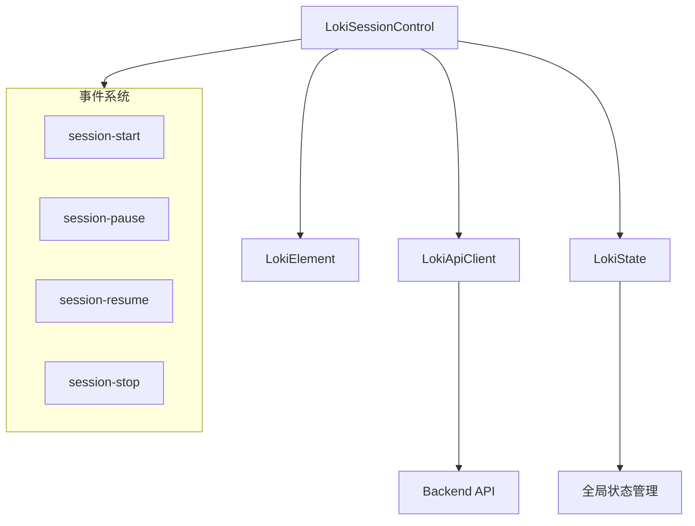
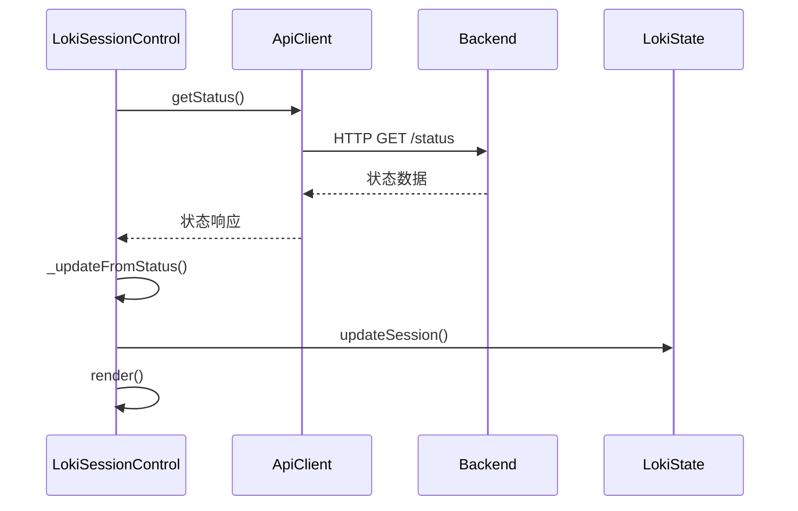

# LokiSessionControl 组件文档

## 概述

LokiSessionControl 是一个用于管理 Loki Mode 会话生命周期的控制面板 Web 组件。它提供了开始、暂停、恢复和停止会话的控制功能，支持紧凑和完整两种布局模式。组件还显示连接状态、版本信息、代理/任务计数以及会话元数据，为用户提供全面的会话监控和管理能力。

该组件基于自定义元素（Custom Elements）标准构建，继承自 LokiElement 基类，集成了主题系统、API 客户端和状态管理功能，可无缝集成到任何支持 Web Components 的应用程序中。

## 核心功能

### 会话控制
- **启动会话**：触发会话开始事件（用户可通过监听此事件实现自定义启动逻辑）
- **暂停会话**：向 API 发送暂停请求并更新界面状态
- **恢复会话**：向 API 发送恢复请求并更新界面状态
- **停止会话**：向 API 发送停止请求并更新界面状态

### 状态显示
- **会话模式**：显示当前会话状态（AUTONOMOUS、PAUSED、STOPPED、ERROR、OFFLINE）
- **运行阶段**：显示当前执行阶段
- **复杂度级别**：显示任务复杂度
- **迭代计数**：显示当前迭代次数
- **运行时间**：格式化显示会话持续时间
- **连接状态**：显示与后端 API 的连接状态
- **版本信息**：显示后端系统版本
- **代理计数**：显示活动代理数量
- **待处理任务**：显示待处理任务数量

### 布局模式
- **完整模式**：显示所有状态信息和控制按钮
- **紧凑模式**：仅显示基本状态和核心控制按钮，适合空间受限的场景

## 架构与组件关系

LokiSessionControl 组件处于整个系统的 UI 层，与多个核心模块紧密协作：



### 组件依赖关系

1. **LokiElement**：提供基础组件功能和主题系统支持
2. **LokiApiClient**：处理与后端 API 的通信，包括状态获取和会话控制命令
3. **LokiState**：管理全局应用状态，同步会话状态信息

## 内部工作原理

### 生命周期管理

LokiSessionControl 组件遵循标准的自定义元素生命周期：

1. **构造阶段**：初始化内部状态和默认值
2. **连接阶段**（connectedCallback）：设置 API 连接、加载初始状态、启动轮询
3. **属性变更**（attributeChangedCallback）：响应属性变化并更新组件
4. **断开连接**（disconnectedCallback）：清理资源，停止轮询，移除事件监听器

### 状态同步机制

组件采用双重机制确保状态实时更新：

1. **事件驱动**：监听 API 客户端发出的状态更新、连接和断开连接事件
2. **轮询机制**：每 3 秒主动请求一次状态，作为事件驱动的补充

这种混合方法确保了即使在事件系统出现问题时，组件也能保持状态的相对同步。

### 状态更新流程



## 使用指南

### 基本使用

将组件添加到 HTML 中即可使用：

```html
<loki-session-control></loki-session-control>
```

### 配置属性

组件支持以下属性配置：

| 属性 | 类型 | 默认值 | 描述 |
|------|------|--------|------|
| `api-url` | 字符串 | `window.location.origin` | API 基础 URL |
| `theme` | 字符串 | 自动检测 | 主题设置，可选值：`light` 或 `dark` |
| `compact` | 布尔值 | false | 是否使用紧凑布局，存在该属性即为 true |

### 完整示例

```html
<!-- 完整模式，指定 API URL 和深色主题 -->
<loki-session-control 
    api-url="http://localhost:57374" 
    theme="dark">
</loki-session-control>

<!-- 紧凑模式 -->
<loki-session-control compact></loki-session-control>
```

### 事件监听

组件会触发以下自定义事件，应用程序可以监听这些事件来实现自定义逻辑：

```javascript
const sessionControl = document.querySelector('loki-session-control');

// 监听会话开始事件
sessionControl.addEventListener('session-start', (e) => {
    console.log('会话开始', e.detail);
    // 自定义启动逻辑
});

// 监听会话暂停事件
sessionControl.addEventListener('session-pause', (e) => {
    console.log('会话暂停', e.detail);
});

// 监听会话恢复事件
sessionControl.addEventListener('session-resume', (e) => {
    console.log('会话恢复', e.detail);
});

// 监听会话停止事件
sessionControl.addEventListener('session-stop', (e) => {
    console.log('会话停止', e.detail);
});
```

## API 参考

### 公共属性

#### `api-url`
API 基础 URL，用于连接后端服务。

```javascript
// 设置属性
element.setAttribute('api-url', 'http://localhost:57374');

// 获取属性
const apiUrl = element.getAttribute('api-url');
```

#### `theme`
主题设置，可选值为 `light` 或 `dark`。

```javascript
element.setAttribute('theme', 'dark');
```

#### `compact`
是否使用紧凑布局，布尔属性。

```javascript
// 启用紧凑模式
element.setAttribute('compact', '');

// 禁用紧凑模式
element.removeAttribute('compact');
```

### 事件

#### `session-start`
当用户点击开始按钮时触发。事件详情包含当前状态信息。

#### `session-pause`
当会话暂停时触发。事件详情包含当前状态信息。

#### `session-resume`
当会话恢复时触发。事件详情包含当前状态信息。

#### `session-stop`
当会话停止时触发。事件详情包含当前状态信息。

### 内部状态结构

组件维护以下内部状态（`_status` 对象）：

```javascript
{
  mode: 'offline',        // 会话模式: offline, running, autonomous, paused, stopped, error
  phase: null,             // 当前执行阶段
  iteration: null,         // 当前迭代次数
  complexity: null,        // 复杂度级别
  connected: false,        // 连接状态
  version: null,           // 系统版本
  uptime: 0,               // 运行时间（秒）
  activeAgents: 0,         // 活动代理数量
  pendingTasks: 0,         // 待处理任务数量
}
```

## 主题与样式

LokiSessionControl 使用 CSS 自定义属性来实现主题化，继承自 LokiElement 的主题系统。

### 可用的 CSS 自定义属性

| 属性 | 描述 |
|------|------|
| `--loki-bg-tertiary` | 控制面板背景色 |
| `--loki-bg-card` | 按钮背景色 |
| `--loki-bg-hover` | 按钮悬停背景色 |
| `--loki-text-primary` | 主要文本颜色 |
| `--loki-text-secondary` | 次要文本颜色 |
| `--loki-text-muted` | 弱化文本颜色 |
| `--loki-border` | 边框颜色 |
| `--loki-accent` | 强调色 |
| `--loki-green` | 绿色（成功/活动状态） |
| `--loki-green-muted` | 弱化绿色 |
| `--loki-yellow` | 黄色（暂停状态） |
| `--loki-yellow-muted` | 弱化黄色 |
| `--loki-red` | 红色（错误/停止状态） |
| `--loki-red-muted` | 弱化红色 |
| `--loki-transition` | 过渡动画时间 |

### 状态颜色映射

| 状态 | 颜色 | 动画 |
|------|------|------|
| running/autonomous | 绿色 | 脉冲动画 |
| paused | 黄色 | 无 |
| stopped | 红色 | 无 |
| error | 红色 | 无 |
| offline | 灰色 | 无 |

## 扩展与定制

### 创建子类

您可以通过继承 LokiSessionControl 来创建自定义版本：

```javascript
import { LokiSessionControl } from 'dashboard-ui/components/loki-session-control.js';

class CustomSessionControl extends LokiSessionControl {
  constructor() {
    super();
    // 自定义初始化
  }
  
  // 重写渲染方法
  render() {
    // 自定义渲染逻辑
    super.render(); // 可选：调用父类渲染
  }
  
  // 添加自定义方法
  _customMethod() {
    // 自定义逻辑
  }
}

// 注册自定义组件
customElements.define('custom-session-control', CustomSessionControl);
```

### 自定义按钮行为

通过事件监听，您可以覆盖或增强默认按钮行为：

```javascript
const sessionControl = document.querySelector('loki-session-control');

// 自定义开始逻辑
sessionControl.addEventListener('session-start', async (e) => {
  e.preventDefault(); // 阻止默认行为（如果有）
  
  // 显示确认对话框
  if (confirm('确定要开始会话吗？')) {
    // 自定义 API 调用
    try {
      const api = getApiClient();
      await api.startSession();
    } catch (error) {
      console.error('启动会话失败', error);
    }
  }
});
```

## 注意事项与限制

### 边缘情况

1. **网络中断处理**：当网络连接中断时，组件会自动将状态设置为 "offline"，并在重新连接后恢复正常状态显示。

2. **API 请求失败**：如果状态请求失败，组件会保持上次已知状态，但会更新连接指示器显示为断开连接。

3. **快速连续操作**：虽然组件会根据状态禁用不适用的按钮，但在 API 响应返回前快速点击可能导致多次请求。建议在实际应用中添加请求去抖动或状态锁定机制。

### 错误处理

组件内部会捕获并记录 API 调用错误，但不会向用户显示错误消息。在生产环境中，建议监听错误事件并提供用户友好的错误提示：

```javascript
// 监听 API 错误（需要在 ApiClient 中实现错误事件）
window.addEventListener('api-error', (e) => {
  if (e.detail.component === 'session-control') {
    // 显示错误通知
    showNotification('会话控制错误', e.detail.message, 'error');
  }
});
```

### 性能考虑

1. **轮询间隔**：默认轮询间隔为 3 秒，这在大多数情况下提供了良好的实时性和性能平衡。如需调整，可以修改 `_startPolling` 方法中的间隔值。

2. **DOM 更新**：每次状态更新都会触发完整的重新渲染。虽然这在当前组件规模下不是问题，但如果计划大幅扩展组件，考虑实现虚拟 DOM 或增量更新机制。

## 与其他模块的关系

LokiSessionControl 是 Dashboard UI Components 中的一个核心组件，与以下模块紧密协作：

- **LokiTheme**：提供主题系统支持，参考 [LokiTheme](LokiTheme.md)
- **LokiApiClient**：处理 API 通信，参考 [LokiApiClient](LokiApiClient.md)
- **LokiState**：管理全局状态，参考 [LokiState](LokiState.md)
- **LokiTaskBoard**：任务管理组件，通常与会话控制一起使用，参考 [LokiTaskBoard](LokiTaskBoard.md)

## 总结

LokiSessionControl 组件提供了一个功能完整、易于集成的会话管理界面，适用于任何需要控制和监控 Loki Mode 会话的应用程序。它的模块化设计、主题支持和事件驱动架构使其既可以作为独立组件使用，也可以作为更复杂仪表板的一部分。

通过本指南，您应该能够全面理解该组件的工作原理、使用方法和扩展可能性，从而在自己的项目中有效地利用它。
