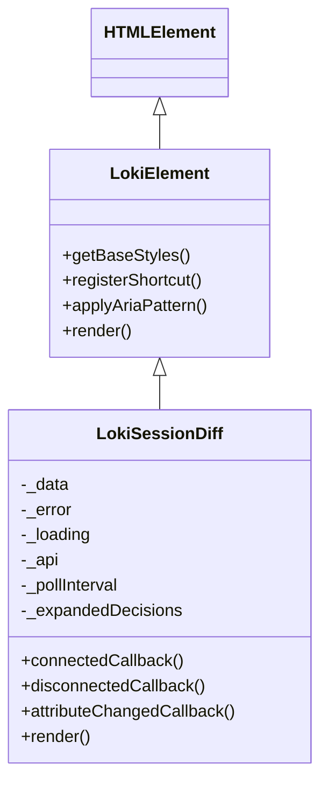
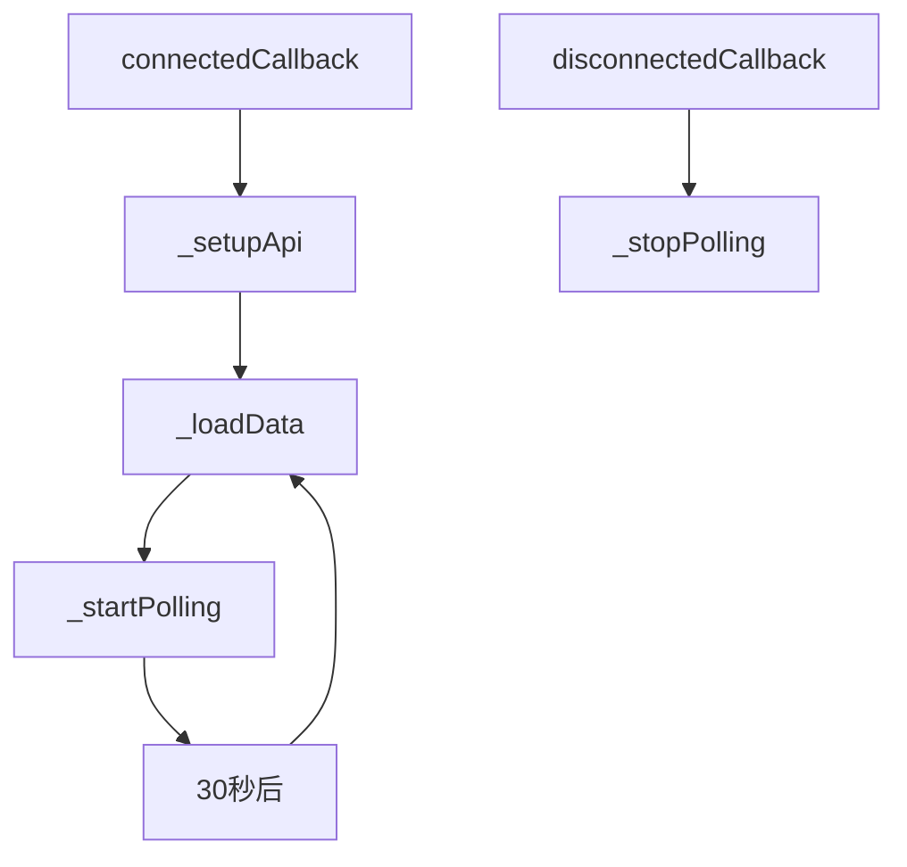
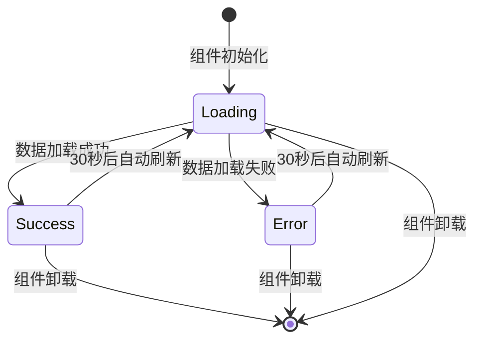

# LokiSessionDiff 组件文档

## 概述

**LokiSessionDiff** 是一个用于显示自上次会话以来发生变更的Web组件，是Dashboard UI Components库中的重要组成部分。该组件通过轮询API接口 `/api/session-diff` 来获取会话差异数据，并以可视化方式展示关键统计信息、突出点和决策详情。

### 主要功能

- 自动轮询API获取最新会话差异
- 显示时间区间覆盖范围
- 统计关键指标（创建/完成/阻塞任务数量及错误数）
- 高亮显示重要变更
- 可折叠的决策详情展示
- 完整的主题支持（包括浅色/深色/高对比度等主题）
- 实时数据更新（默认30秒刷新一次）

## 组件架构与依赖关系

### 继承关系与核心依赖



**LokiSessionDiff** 组件继承自 **LokiElement**，这是整个Dashboard UI组件库的基础类，提供了主题管理、键盘处理和基础样式支持等功能。

### 核心组件依赖

| 组件 | 用途 | 参考文档 |
|--------|------|----------|
| LokiElement | 提供主题系统、样式管理和基础组件功能 | [LokiElement.md](LokiElement.md) |
| getApiClient | 创建API客户端，用于与后端通信 | [LokiApiClient.md](LokiApiClient.md) |

## 核心功能与内部工作原理

### 1. 组件初始化与生命周期

```javascript
constructor() {
  super();
  this._data = null;
  this._error = null;
  this._loading = true;
  this._api = null;
  this._pollInterval = null;
  this._expandedDecisions = new Set();
}
```

在构造函数中，组件初始化了所有内部状态变量，包括数据存储、错误处理、加载状态、API客户端、轮询计时器和已展开的决策项集合。

### 2. 数据加载与轮询机制



**关键特性：**
- **自动轮询**：组件默认每30秒自动刷新一次数据
- **生命周期管理**：组件挂载时启动轮询，卸载时自动清理
- **错误恢复**：即使出现错误，轮询也会继续尝试获取最新数据

### 3. 数据结构与渲染

组件期望从API获取的数据结构如下：

```javascript
{
  period: "2023-10-01 to 2023-10-02",  // 时间区间
  counts: {
    tasks_created: 5,     // 新创建任务数
    tasks_completed: 3,   // 完成任务数
    tasks_blocked: 1,     // 阻塞任务数
    errors: 0             // 错误数
  },
  highlights: [           // 重要变更列表
    "新功能A已开发完成",
    "关键bug B已修复"
  ],
  decisions: [            // 决策列表
    {
      title: "重构数据库连接池",
      reasoning: "为提高性能，我们决定重构连接池..."
    }
  ]
}
```

### 4. 交互行为

组件支持以下交互：

1. **决策项展开/收起**：点击决策标题可以显示/隐藏详细推理
2. **属性动态更新**：`api-url` 和 `theme` 属性变更时会自动响应
3. **主题切换**：支持通过属性或系统设置自动切换主题

## 使用方法与配置

### 基本用法

```html
<!-- 使用默认配置 -->
<loki-session-diff></loki-session-diff>

<!-- 自定义API URL -->
<loki-session-diff api-url="https://api.example.com"></loki-session-diff>

<!-- 指定主题 -->
<loki-session-diff theme="dark"></loki-session-diff>

<!-- 组合配置 -->
<loki-session-diff 
  api-url="https://api.example.com" 
  theme="vscode-dark">
</loki-session-diff>
```

### JavaScript 动态创建

```javascript
// 动态创建组件
const diffElement = document.createElement('loki-session-diff');
diffElement.setAttribute('api-url', 'https://api.example.com');
document.body.appendChild(diffElement);

// 或使用构造函数（如果已暴露）
import { LokiSessionDiff } from 'dashboard-ui/components/loki-session-diff.js';
const diffElement = new LokiSessionDiff();
diffElement.setAttribute('api-url', 'https://api.example.com');
document.body.appendChild(diffElement);
```

### 组件属性

| 属性名 | 类型 | 默认值 | 描述 |
|--------|------|--------|------|
| api-url | string | window.location.origin | API基础URL |
| theme | string | (系统设置) | 组件主题，可以是 'light', 'dark', 'high-contrast', 'vscode-light', 'vscode-dark' |

## API响应要求

为了LokiSessionDiff组件正常工作，后端API需要满足以下要求：

### 端点要求

- **URL**: `/api/session-diff`
- **方法**: `GET`
- **认证**: 根据后端配置可能需要认证令牌
- **响应格式**: JSON

### 响应结构示例

```json
{
  "period": "2023-10-05T08:00:00 to 2023-10-05T18:30:00",
  "counts": {
    "tasks_created": 7,
    "tasks_completed": 5,
    "tasks_blocked": 2,
    "errors": 1
  },
  "highlights": [
    "成功部署新的认证系统",
    "优化了数据库查询性能",
    "修复了关键安全漏洞"
  ],
  "decisions": [
    {
      "title": "使用Redis作为缓存层",
      "reasoning": "为了提高系统响应速度，决定引入Redis作为缓存层，预计可减少数据库负载约40%。"
    },
    {
      "title": "重构用户模块",
      "reasoning": "原用户模块代码耦合度高，难以维护。计划分阶段重构，首先从认证部分开始。"
    }
  ]
}
```

## 样式与主题

LokiSessionDiff组件完全集成了LokiTheme系统，支持以下主题：

1. **light** - 浅色主题
2. **dark** - 深色主题
3. **high-contrast** - 高对比度主题
4. **vscode-light** - VSCode浅色主题
5. **vscode-dark** - VSCode深色主题

组件使用CSS变量定义样式，这些变量由LokiTheme系统管理，确保与其他Loki UI组件的视觉一致性。

### 自定义样式

您可以通过CSS自定义组件样式：

```css
/* 自定义组件容器样式 */
loki-session-diff::part(diff-container) {
  background-color: #f0f0f0;
  border-radius: 8px;
}

/* 或者使用CSS变量覆盖主题值 */
loki-session-diff {
  --loki-accent: #4f46e5;
  --loki-red: #ef4444;
}
```

## 事件与状态管理

### 内部状态

组件维护以下内部状态：

- `_data`: 存储从API获取的数据
- `_error`: 存储错误信息（如有）
- `_loading`: 表示是否正在加载数据
- `_api`: API客户端实例
- `_pollInterval`: 轮询定时器ID
- `_expandedDecisions`: 已展开的决策项索引集合

### 状态转换流程



## 边界情况与错误处理

### 错误状态展示

当API请求失败时，组件会显示一个友好的错误状态，而不是崩溃。错误消息会被捕获并存储在`_error`变量中，但目前只会显示一个通用的"没有可用的会话差异"信息。

### 加载状态

在数据加载过程中，组件会显示一个旋转的加载指示器和"Loading session diff..."文本，提供良好的用户体验。

### 空数据处理

如果API返回空数据或数据结构不符合预期，组件会显示空状态，同时保持UI的完整性。

### 内存泄漏防护

组件实现了适当的生命周期管理，确保在`disconnectedCallback`中清除轮询定时器，防止内存泄漏。

## 扩展性与定制

### 扩展LokiSessionDiff

您可以通过继承LokiSessionDiff来创建自定义版本：

```javascript
import { LokiSessionDiff } from 'dashboard-ui/components/loki-session-diff.js';

class CustomSessionDiff extends LokiSessionDiff {
  // 自定义轮询间隔
  _startPolling() {
    this._pollInterval = setInterval(() => this._loadData(), 60000); // 60秒
  }
  
  // 自定义数据处理
  async _loadData() {
    try {
      const rawData = await this._api._get('/api/session-diff');
      // 自定义数据处理逻辑
      this._data = this._processCustomData(rawData);
      this._error = null;
    } catch (err) {
      this._error = err.message;
      this._data = null;
    }
    this._loading = false;
    this.render();
  }
  
  _processCustomData(data) {
    // 自定义数据处理逻辑
    return data;
  }
  
  // 注册自定义元素
  static register() {
    if (!customElements.get('custom-session-diff')) {
      customElements.define('custom-session-diff', CustomSessionDiff);
    }
  }
}

CustomSessionDiff.register();
```

## 性能考虑

1. **轮询优化**：默认30秒的轮询间隔是平衡实时性和性能的选择，可根据实际需求调整
2. **渲染优化**：组件使用Shadow DOM确保样式隔离，避免影响页面其他元素
3. **资源清理**：确保在组件卸载时清理定时器和事件监听器

## 相关模块与参考

- [LokiElement](LokiElement.md) - 所有Loki UI组件的基类
- [LokiTheme](LokiTheme.md) - 主题系统文档
- [LokiApiClient](LokiApiClient.md) - API客户端文档
- [LokiSessionControl](LokiSessionControl.md) - 会话控制组件
- [LokiTaskBoard](LokiTaskBoard.md) - 任务看板组件

## 总结

LokiSessionDiff组件是一个功能完整、设计精良的Web组件，为用户提供了查看会话间变更的直观界面。它具有良好的错误处理、主题支持和交互体验，同时保持了代码的可维护性和可扩展性。通过合理配置API端点和轮询间隔，可以将其集成到各种需要显示会话差异的应用中。
