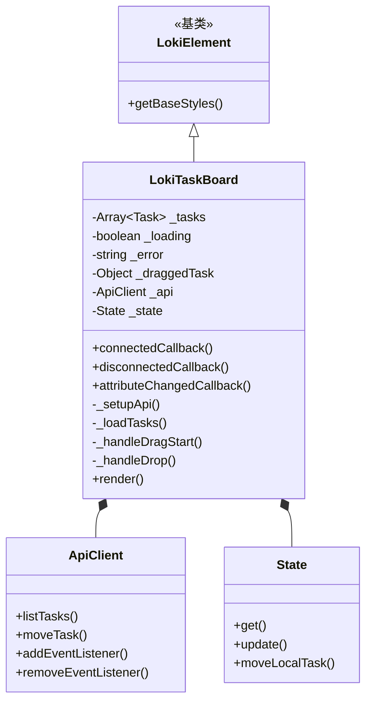
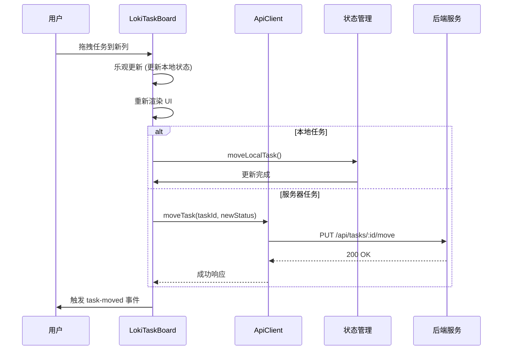
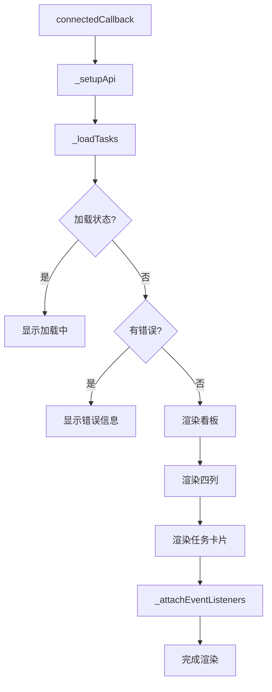

# LokiTaskBoard 组件文档

## 目录
1. [概述](#概述)
2. [核心功能](#核心功能)
3. [架构设计](#架构设计)
4. [组件API](#组件api)
5. [使用指南](#使用指南)
6. [事件系统](#事件系统)
7. [样式主题](#样式主题)
8. [注意事项与限制](#注意事项与限制)

---

## 概述

LokiTaskBoard 是一个功能完善的看板式任务管理组件，提供了直观的任务可视化和交互功能。该组件采用 Web Component 技术构建，支持独立使用，不依赖特定的前端框架。

### 设计理念

组件设计遵循以下核心理念：
- **简洁直观**：通过四列布局清晰展示任务状态流转
- **高效交互**：支持拖拽排序、键盘导航和快速操作
- **主题适配**：自动适配明暗主题，提供一致的视觉体验
- **状态同步**：实时与后端API同步，支持本地缓存和离线任务

## 核心功能

### 1. 四列看板布局

组件固定使用四列布局来管理任务流程：

| 列名 | 状态值 | 颜色标识 | 用途 |
|------|--------|----------|------|
| Pending | `pending` | 灰色 | 待处理任务 |
| In Progress | `in_progress` | 蓝色 | 进行中任务 |
| In Review | `review` | 紫色 | 审核中任务 |
| Completed | `done` | 绿色 | 已完成任务 |

### 2. 拖拽交互

- **任务拖拽**：支持在列间拖拽任务卡片改变状态
- **视觉反馈**：拖拽过程中提供视觉提示和悬停效果
- **只读模式**：可禁用拖拽功能，只展示任务

### 3. 数据管理

- **API集成**：自动与后端API同步任务数据
- **本地缓存**：支持本地任务和缓存机制
- **实时更新**：监听任务创建、更新、删除事件
- **乐观更新**：先更新UI再确认API调用结果

### 4. 键盘导航

- **任务选择**：使用Tab键在任务卡片间导航
- **任务详情**：Enter或Space键打开任务详情
- **快速导航**：ArrowUp/ArrowDown在任务列表中移动焦点

## 架构设计

### 组件层次结构



### 数据流程图



### 组件渲染流程



## 组件API

### 属性 (Attributes)

| 属性名 | 类型 | 默认值 | 说明 |
|--------|------|--------|------|
| `api-url` | string | `window.location.origin` | API 基础 URL |
| `project-id` | string | - | 按项目 ID 过滤任务 |
| `theme` | string | auto-detect | 主题设置：'light' 或 'dark' |
| `readonly` | boolean | false | 只读模式，禁用拖拽和编辑 |

### 方法 (Methods)

#### 公共方法

组件继承自 `LokiElement`，主要通过属性和事件进行交互。

#### 内部方法

| 方法名 | 参数 | 返回值 | 说明 |
|--------|------|--------|------|
| `_setupApi()` | - | void | 设置 API 客户端和事件监听 |
| `_loadTasks()` | - | Promise&lt;void&gt; | 加载任务数据 |
| `_getTasksByStatus(status)` | status: string | Task[] | 根据状态获取任务列表 |
| `_handleDragStart(e, task)` | e: Event, task: Task | void | 处理拖拽开始 |
| `_handleDrop(e, newStatus)` | e: Event, newStatus: string | Promise&lt;void&gt; | 处理拖拽放置 |
| `_openAddTaskModal(status)` | status: string | void | 打开添加任务模态框 |
| `_openTaskDetail(task)` | task: Task | void | 打开任务详情 |
| `_escapeHtml(text)` | text: string | string | HTML 转义防止 XSS |
| `_navigateTaskCards(card, direction)` | card: Element, direction: string | void | 键盘导航任务卡片 |

### 任务数据结构 (Task)

```javascript
{
  id: number | string,        // 任务唯一标识
  title: string,              // 任务标题
  status: string,             // 任务状态: pending, in_progress, review, done
  priority: string,           // 优先级: critical, high, medium, low
  type: string,               // 任务类型
  assigned_agent_id: number,  // 分配的代理 ID (可选)
  isLocal: boolean,           // 是否为本地任务
  fromServer: boolean         // 是否来自服务器
}
```

## 使用指南

### 基本使用

```html
<!-- 基础使用 -->
<loki-task-board></loki-task-board>

<!-- 指定 API URL 和项目 -->
<loki-task-board 
  api-url="http://localhost:57374" 
  project-id="1">
</loki-task-board>

<!-- 暗色主题 -->
<loki-task-board theme="dark"></loki-task-board>

<!-- 只读模式 -->
<loki-task-board readonly></loki-task-board>
```

### JavaScript 集成

```javascript
// 在 JavaScript 中使用
const taskBoard = document.createElement('loki-task-board');
taskBoard.setAttribute('api-url', 'http://localhost:57374');
taskBoard.setAttribute('project-id', '123');
document.body.appendChild(taskBoard);

// 动态修改属性
taskBoard.setAttribute('theme', 'dark');
taskBoard.setAttribute('readonly', '');

// 监听事件
taskBoard.addEventListener('task-moved', (e) => {
  console.log('Task moved:', e.detail);
});

taskBoard.addEventListener('task-click', (e) => {
  console.log('Task clicked:', e.detail.task);
});

taskBoard.addEventListener('add-task', (e) => {
  console.log('Add task requested for status:', e.detail.status);
  // 显示添加任务表单
});
```

### 框架集成示例

#### React

```jsx
import { useEffect, useRef } from 'react';
import 'dashboard-ui/components/loki-task-board.js';

function TaskBoardComponent() {
  const boardRef = useRef(null);

  useEffect(() => {
    const board = boardRef.current;
    
    const handleTaskMoved = (e) => {
      console.log('Task moved:', e.detail);
    };

    const handleTaskClick = (e) => {
      console.log('Task clicked:', e.detail.task);
    };

    board.addEventListener('task-moved', handleTaskMoved);
    board.addEventListener('task-click', handleTaskClick);

    return () => {
      board.removeEventListener('task-moved', handleTaskMoved);
      board.removeEventListener('task-click', handleTaskClick);
    };
  }, []);

  return (
    <loki-task-board
      ref={boardRef}
      api-url="http://localhost:57374"
      project-id="1"
      theme="dark"
    />
  );
}
```

#### Vue

```vue
<template>
  <loki-task-board
    ref="taskBoard"
    :api-url="apiUrl"
    :project-id="projectId"
    :theme="theme"
    @task-moved="handleTaskMoved"
    @task-click="handleTaskClick"
    @add-task="handleAddTask"
  />
</template>

<script setup>
import { ref, onMounted, onBeforeUnmount } from 'vue';
import 'dashboard-ui/components/loki-task-board.js';

const apiUrl = ref('http://localhost:57374');
const projectId = ref('1');
const theme = ref('dark');
const taskBoard = ref(null);

const handleTaskMoved = (e) => {
  console.log('Task moved:', e.detail);
};

const handleTaskClick = (e) => {
  console.log('Task clicked:', e.detail.task);
};

const handleAddTask = (e) => {
  console.log('Add task:', e.detail.status);
};
</script>
```

## 事件系统

### 自定义事件

| 事件名 | 触发时机 | detail 数据 |
|--------|----------|-------------|
| `task-moved` | 任务被拖拽到新列后 | `{ taskId, oldStatus, newStatus }` |
| `add-task` | 点击添加任务按钮时 | `{ status }` |
| `task-click` | 点击任务卡片时 | `{ task }` |

### API 事件监听

组件内部监听以下 API 事件：

| 事件名 | 说明 | 响应 |
|--------|------|------|
| `TASK_CREATED` | 新任务创建 | 重新加载任务列表 |
| `TASK_UPDATED` | 任务更新 | 重新加载任务列表 |
| `TASK_DELETED` | 任务删除 | 重新加载任务列表 |

## 样式主题

### CSS 变量

组件使用以下 CSS 自定义属性，可通过主题系统或直接覆盖进行定制：

```css
:host {
  /* 背景色 */
  --loki-bg-secondary: #1a1a1a;
  --loki-bg-tertiary: #2a2a2a;
  --loki-bg-card: #252525;
  --loki-bg-hover: #2d2d2d;
  --loki-bg-accent-muted: rgba(99, 102, 241, 0.1);
  
  /* 文字色 */
  --loki-text-primary: #ffffff;
  --loki-text-secondary: #a0a0a0;
  --loki-text-muted: #6b6b6b;
  
  /* 品牌色 */
  --loki-accent: #6366f1;
  --loki-blue: #3b82f6;
  --loki-purple: #8b5cf6;
  --loki-green: #22c55e;
  --loki-red: #ef4444;
  --loki-yellow: #eab308;
  
  /* 半透明色 */
  --loki-red-muted: rgba(239, 68, 68, 0.1);
  --loki-yellow-muted: rgba(234, 179, 8, 0.1);
  --loki-green-muted: rgba(34, 197, 94, 0.1);
  
  /* 边框 */
  --loki-border: #333333;
  --loki-border-light: #404040;
  
  /* 动画 */
  --loki-transition: 0.2s ease;
}
```

### 响应式布局

组件内置响应式设计：

| 断点 | 布局 |
|------|------|
| > 1200px | 4 列布局 |
| 768px - 1200px | 2 列布局 |
| < 768px | 1 列布局 |

## 注意事项与限制

### 状态处理

1. **任务状态映射**：组件会将任务状态转换为小写并将连字符替换为下划线，确保兼容性
   ```javascript
   // 内部转换逻辑
   const taskStatus = t.status?.toLowerCase().replace(/-/g, '_');
   ```

2. **乐观更新**：拖拽操作先更新 UI，API 失败时会自动回滚
   - 用户体验优先
   - 需注意网络延迟可能导致的临时不一致

### 数据安全

1. **XSS 防护**：所有用户输入的文本都会经过 HTML 转义
   ```javascript
   _escapeHtml(text) {
     const div = document.createElement('div');
     div.textContent = text;
     return div.innerHTML;
   }
   ```

2. **属性验证**：组件对传入的属性进行基本验证，但建议在使用前进行数据验证

### 性能考虑

1. **任务数量**：建议单项目任务数不超过 500 个，过多任务可能影响渲染性能
2. **重渲染**：每次任务变更都会触发完整重渲染，可考虑虚拟滚动优化大量任务场景

### 错误处理

1. **API 失败**：API 调用失败时会显示错误信息并回退到本地缓存
2. **网络断开**：支持本地任务操作，网络恢复后可同步
3. **数据一致性**：提供 `refresh` 按钮允许手动刷新任务列表

### 浏览器兼容性

- 支持所有现代浏览器（Chrome、Firefox、Safari、Edge）
- 需要支持 Web Components、Shadow DOM 和 Custom Events
- IE11 及以下版本不支持

### 已知限制

1. **固定列数**：当前只支持 4 列固定布局，不支持自定义列
2. **任务排序**：不支持在同一列内手动排序任务
3. **批量操作**：不支持批量选择和操作任务
4. **筛选搜索**：内置不支持任务筛选和搜索功能

### 扩展性

组件设计考虑了一定的扩展性：
- 可通过 CSS 变量自定义主题
- 可通过事件系统集成外部功能
- 可继承 `LokiTaskBoard` 类进行功能扩展

如需更复杂的定制，建议参考相关模块文档：
- [LokiTheme](LokiTheme.md) - 主题系统
- [LokiState](LokiState.md) - 状态管理
- [LokiApiClient](LokiApiClient.md) - API 客户端
