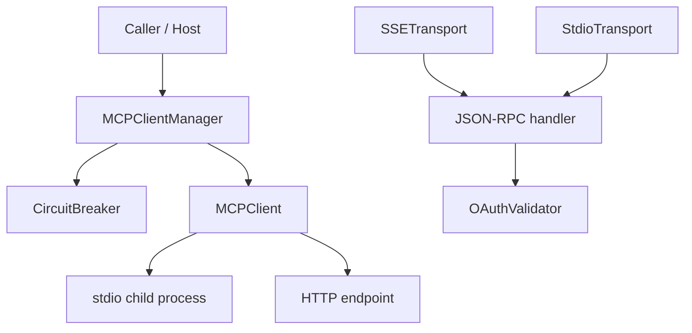

# MCP Protocol

MCP Protocol 模块本质上是系统和外部（或本地）MCP server 之间的“协议网关 + 故障隔离层”。它存在的原因很现实：如果每个调用方都自己处理配置加载、握手、工具发现、路由、重连、超时和熔断，系统会迅速演变成一堆脆弱的点对点脚本。这个模块把这些横切复杂度集中到一处，让上层只面对一个稳定接口：**按 tool name 调用**。

---

## 1. 这个模块解决什么问题（先讲问题空间）

在 MCP 接入场景里，困难通常不在“发一次 JSON-RPC”，而在“长期稳定地管理一组异构、不稳定的 server”：

1. **多后端路由复杂**：一个进程可能同时连多个 MCP server，tool 名称到 server 的映射必须可追踪、可控。
2. **故障会级联**：某个 server 持续失败时，如果继续盲目调用，会拖慢整个系统。
3. **传输形态不一致**：有的 server 走 stdio（子进程），有的走 HTTP；调用方不应被迫感知这些细节。
4. **安全边界容易被忽视**：配置目录穿越、YAML 原型污染、危险命令执行、超大响应占内存，都是真实风险。

MCP Protocol 的设计就是把这些问题收束为三层：
- **编排层**：`MCPClientManager`
- **单连接协议运行时**：`MCPClient`
- **韧性与边界防护**：`CircuitBreaker`、`OAuthValidator`、`SSETransport` / `StdioTransport`

---

## 2. 心智模型（Mental Model）

可以把它想成“机场系统”：

- `MCPClientManager` 是**塔台**：维护“哪个航班（tool）走哪条跑道（server）”。
- `MCPClient` 是**跑道地面控制**：负责和单个 server 完成标准通信流程（`initialize`、`tools/list`、`tools/call`）。
- `CircuitBreaker` 是**跑道熔断器**：连续事故太多就封跑道（OPEN），过一段时间放一架测试航班（HALF_OPEN）。
- `SSETransport` / `StdioTransport` 是**不同航站楼入口**：同一套 handler，通过不同 I/O 通道对外服务。
- `OAuthValidator` 是**安检口**：启用认证时，所有请求先过 token 校验。

这套模型的关键收益是：上层不用理解底层传输与恢复策略，只关心“调用是否成功、失败属于哪类”。

---

## 3. 架构总览

### 架构叙事（按职责）

- `MCPClientManager`：模块中枢。负责加载配置、创建 client/breaker、发现工具、建立路由、统一 shutdown。
- `MCPClient`：单 server 通信实现。封装 JSON-RPC request/response、pending 请求表、超时、stdio/HTTP 分支。
- `CircuitBreaker`：每个 server 一份状态机，做快速失败和恢复试探。
- `SSETransport` / `StdioTransport`：服务端传输适配器，把外部输入转成 handler 调用，再把结果写回。
- `OAuthValidator`：认证策略执行器；未配置时可兼容放行，配置后执行 Bearer token 校验。

---

## 4. 关键数据流（端到端）

### 4.1 工具发现路径（`discoverTools`）

真实调用链（来自代码）是：

1. `MCPClientManager.discoverTools()`
2. `_loadConfig()` 读取 `.loki/config.json`，不存在则尝试 `.loki/config.yaml`
3. 为每个 `mcp_servers[i]` 创建：
   - `new MCPClient(...)`
   - `new CircuitBreaker(...)`
4. 通过 `breaker.execute(() => client.connect())` 建连
5. `MCPClient.connect()` 内部执行：
   - （stdio 模式）`_connectStdio()`
   - `_sendRequest('initialize', ...)`
   - `_sendNotification('initialized', {})`
   - `_sendRequest('tools/list', {})`
6. Manager 注册 `_toolRouting`（tool -> server）与 `_toolSchemas`（tool -> schema）

**设计意义**：连接阶段就走断路器，不把“连接失败”和“调用失败”割裂处理，故障语义更统一。

### 4.2 工具调用路径（`callTool`）

1. `MCPClientManager.callTool(toolName, args)`
2. 用 `_toolRouting` 找到 `serverName`
3. 找到对应 `client` 与 `breaker`
4. `breaker.execute(() => client.callTool(toolName, args))`
5. `MCPClient.callTool(...)` -> `_sendRequest('tools/call', { name, arguments })`
6. 根据 transport 分支：
   - stdio：`_writeStdio(...)`，由 `_onStdioData` / `_handleStdioLine` 回收响应
   - HTTP：`_writeHttp(...)` POST 并解析 JSON

### 4.3 断路器状态流

`CircuitBreaker` 状态机：`CLOSED -> OPEN -> HALF_OPEN`。

- CLOSED：正常放行；连续失败达到阈值后 OPEN。
- OPEN：快速拒绝；到 `resetTimeout` 后自动进入 HALF_OPEN（含 timer + `unref()`）。
- HALF_OPEN：允许试探；首个成功回 CLOSED，首个失败回 OPEN。

### 4.4 服务端传输路径（SSE / STDIO）

- `SSETransport`：
  - `POST /mcp` 处理 JSON-RPC（支持 batch）
  - `GET /mcp/events` 保持 SSE 连接，`broadcast(event, data)` 推送通知
  - `GET /mcp/health` 健康检查
- `StdioTransport`：
  - stdin 按换行切包（NDJSON）
  - 每条消息交给 handler
  - stdout 输出 JSON 响应

---

## 5. 关键设计选择与取舍

### 5.1 选择“Manager + Client”分层，而不是一个全能类

- **收益**：单连接协议复杂度与多连接编排复杂度解耦，测试和演进边界清晰。
- **代价**：状态分散在多个 Map / 实例中，需要严格生命周期管理。

### 5.2 内置 Circuit Breaker，而非默认重试

- **收益**：快速失败，防止对坏后端持续施压；降低级联故障概率。
- **代价**：短暂抖动时更早暴露失败，需要上层按业务语义决定是否补偿重试。

### 5.3 YAML 只实现最小子集（`_parseMinimalYaml`）

- **收益**：实现可控，且在所有赋值路径屏蔽 `__proto__` / `constructor` / `prototype`，降低原型污染风险。
- **代价**：不兼容复杂 YAML 语法。

### 5.4 安全默认值偏保守

- `validateConfigDir` 强制配置目录在 `process.cwd()` 下
- `validateCommand` 禁止 shell 解释器类命令
- stdio / HTTP 都有响应体上限（`MAX_BUFFER_BYTES` / `MAX_RESPONSE_BYTES`）
- `SSETransport` 默认 `host=127.0.0.1`、CORS 仅 localhost

**结论**：明显是“默认安全优先”而非“最大灵活性优先”。

---

## 6. 子模块导读

- [client_orchestration_and_resilience.md](client_orchestration_and_resilience.md)  
  重点讲 `MCPClientManager` + `MCPClient` + `CircuitBreaker` 的编排与容错机制，是理解运行态行为的主文档。

- [transport_adapters.md](transport_adapters.md)  
  聚焦 `SSETransport` 与 `StdioTransport` 的 I/O 模型、batch 语义、错误返回与连接管理。

- [oauth_validation.md](oauth_validation.md)  
  聚焦 `OAuthValidator` 的启用逻辑、token/header 校验、PKCE 校验与 token 生命周期。

（历史拆分文档仍可参考：`mcp_client_protocol_runtime.md`、`client_manager_and_routing.md`、`circuit_breaker_resilience.md`、`transport_stdio_and_sse.md`。）

---

## 7. 与其他模块的关系（跨模块依赖）

从当前提供的依赖信息看，MCP Protocol 主要扮演**协议接入基础设施**角色，被上层编排、插件与管理面消费：

- 与 [Plugin System](Plugin System.md)：`src.plugins.mcp-plugin.MCPPlugin` 通常会把 MCP 接入能力插件化，MCP Protocol 提供其底层连接与调用能力。
- 与 [API Server & Services](API Server & Services.md)：服务层可能通过 MCP 工具调用扩展执行能力。
- 与 [Dashboard Backend](Dashboard Backend.md) / [Dashboard Frontend](Dashboard Frontend.md)：管理面可观测工具调用结果与运行状态（具体耦合点需结合各模块实现）。
- 与 [Policy Engine](Policy Engine.md)：策略层可包裹在 MCP 调用前后（例如审批、成本、合规），MCP Protocol 不内置这些策略。
- 与 [Audit](Audit.md) / [Observability](Observability.md)：MCP Protocol 本身会发事件和错误，但完整审计与指标导出应由这些模块承接。

> 注：外部依赖列表中存在部分非直接语义依赖项（可能来自静态分析噪音）。本文仅依据已提供源码中的明确调用路径描述。

---

## 8. 新贡献者最容易踩的坑

1. **`discoverTools()` 是幂等缓存**：初始化后不会自动重读配置；配置变更需 `shutdown()` 后重新 discover。
2. **tool 重名冲突“告警但不覆盖”**：先注册优先，后者被忽略。多团队接入时要先定命名规范。
3. **stdio framing 是“每行一条 JSON”**：服务端若不换行输出，客户端 pending 会超时。
4. **HTTP `url` 必须是完整 endpoint**：不会自动拼路径。
5. **`MCPClient.callTool()` 要求已连接**：绕过 manager 直连 client 时，必须先 `connect()`。
6. **断路器按“连续失败”计数**：间歇成功会清零计数，可能让 OPEN 出现得比预期晚。
7. **`OAuthValidator` 默认可关闭认证**：无配置时是兼容放行，生产环境需显式配置并校验部署基线。

---

## 9. 实践建议（面向维护者）

- 把 tool 命名当作公共 API 管理，避免跨 server 冲突。
- 在上层明确重试策略，不要直接把重试塞进 `MCPClientManager.callTool()`。
- 对 `CircuitBreaker` 的 `failureThreshold` / `resetTimeout` 做按环境调参（开发、预发、生产）。
- 若要对外暴露 `SSETransport`，请同时落实鉴权、网关和限流，不要只改 `host` / CORS。
