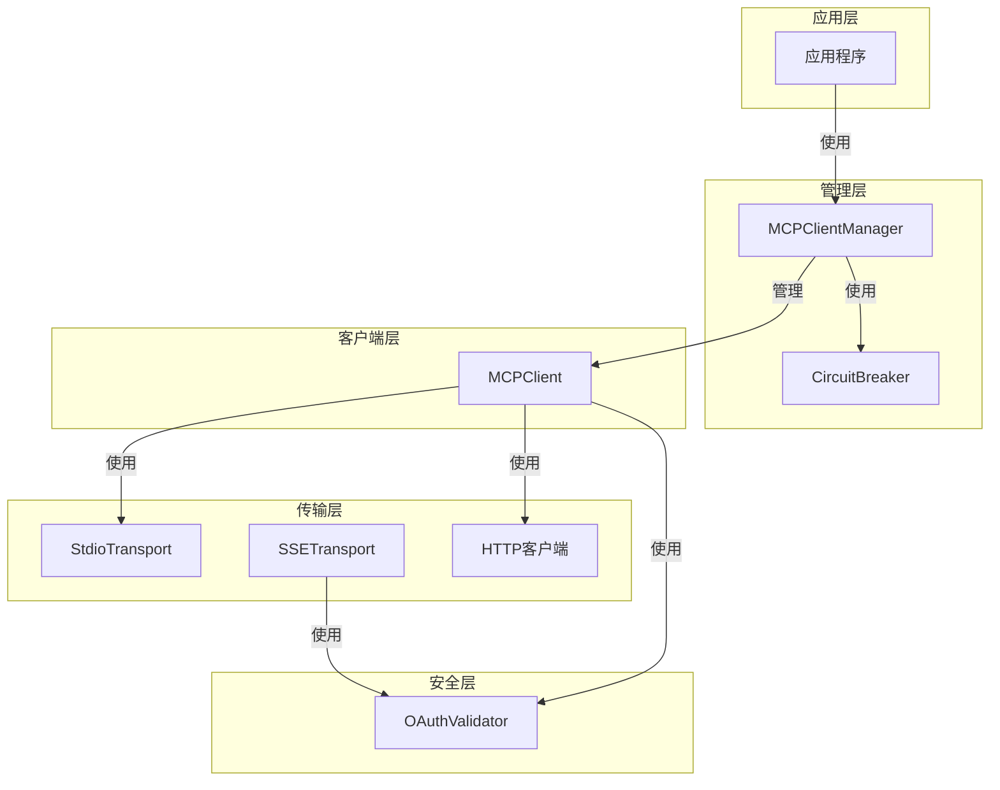
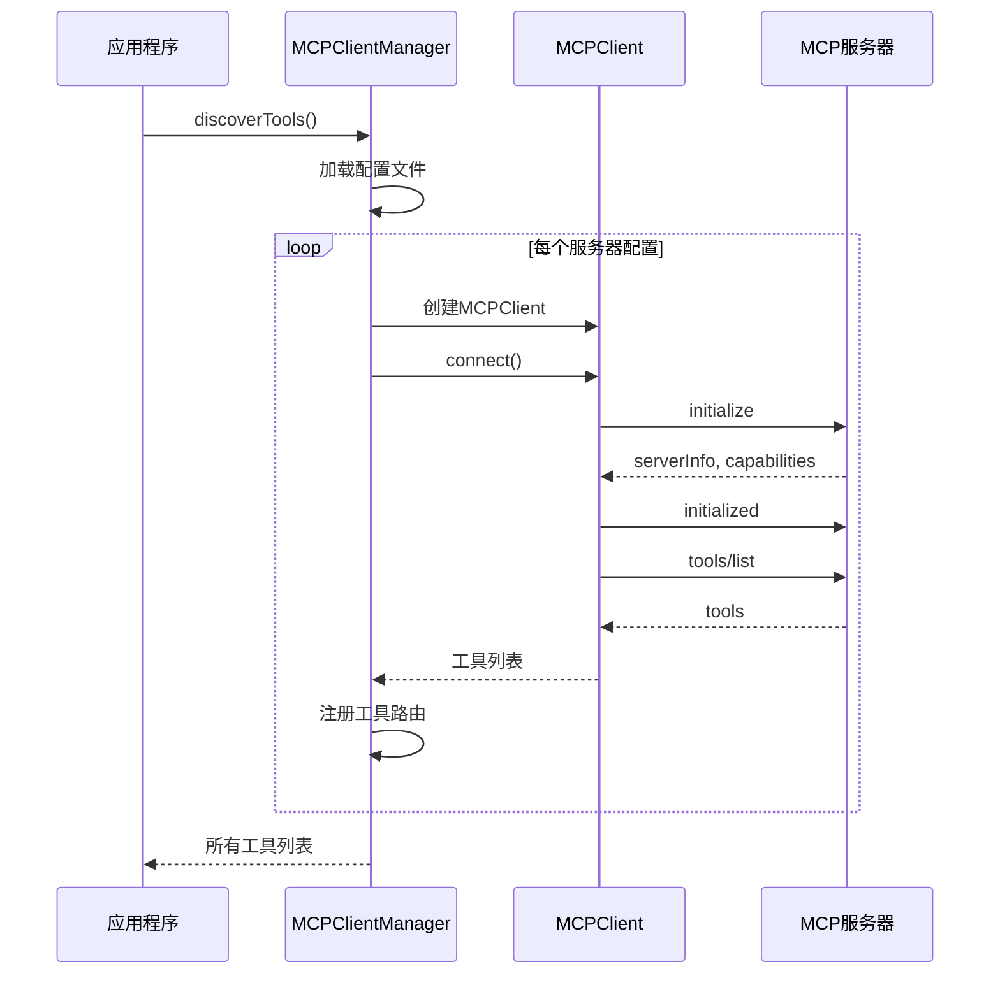
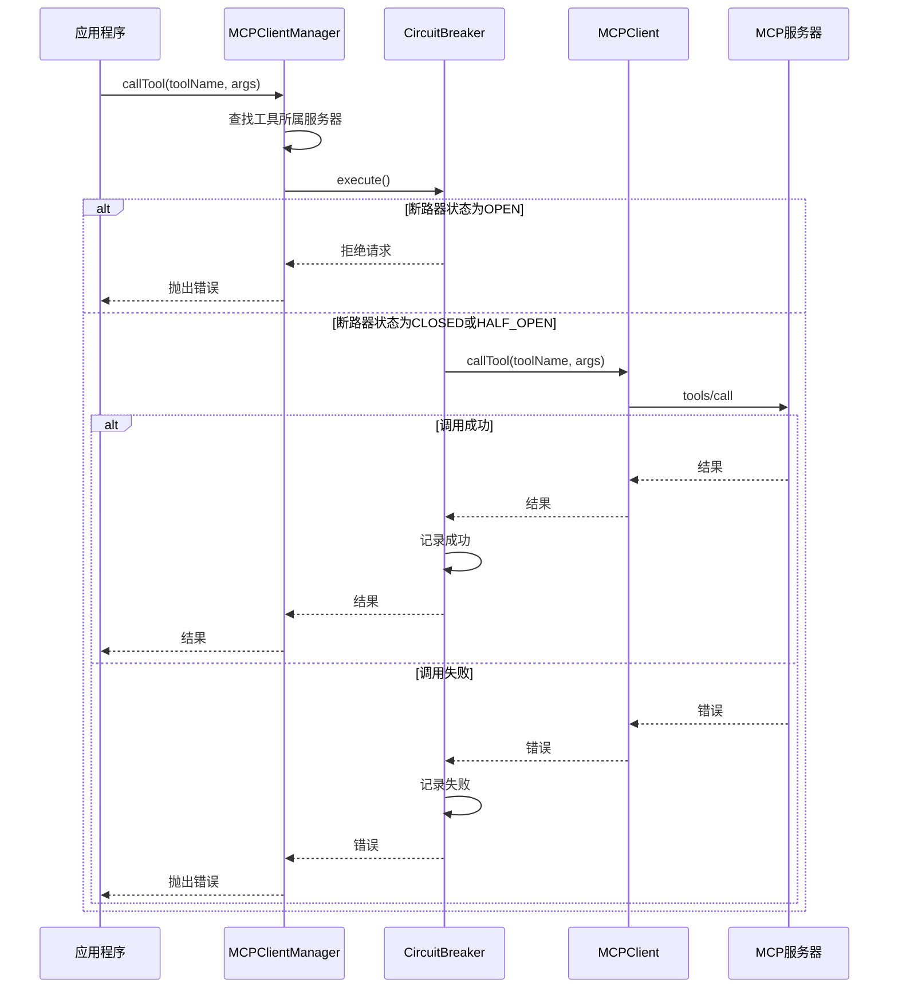

# MCP Protocol 模块文档

## 1. 模块概述

MCP Protocol模块是一个完整的Model Context Protocol (MCP)客户端和服务器实现，提供了标准化的工具调用、服务发现和通信机制。该模块设计用于在多代理系统中实现可靠的服务间通信，支持多种传输协议和安全认证机制。

本模块由多个子模块组成，每个子模块负责特定功能：
- [CircuitBreaker](CircuitBreaker.md)：熔断器模式实现，保护系统免受故障服务影响
- [MCPClientManager](MCPClientManager.md)：管理多个MCP客户端连接和工具路由
- [MCPClient](MCPClient.md)：单个MCP服务器的客户端实现
- [Transport](Transport.md)：提供SSE和stdio两种传输协议实现
- [OAuthValidator](OAuthValidator.md)：OAuth 2.1 + PKCE认证机制

### 1.1 核心功能

- **多服务器连接管理**：通过MCPClientManager管理多个MCP服务器连接
- **工具自动发现与路由**：自动发现服务器提供的工具并智能路由调用
- **多种传输协议支持**：支持stdio和HTTP(S)两种通信方式
- **SSE (Server-Sent Events)支持**：提供实时服务器推送通知
- **断路器模式**：实现故障检测和恢复机制，提高系统稳定性
- **OAuth 2.1认证**：支持PKCE流程的安全认证

### 1.2 设计理念

MCP Protocol模块遵循以下设计原则：
- **安全性优先**：内置路径遍历防护、原型污染防护、命令注入防护等安全机制
- **可靠性**：通过断路器模式、超时控制、重试机制确保通信可靠性
- **可扩展性**：模块化设计，支持自定义传输协议和认证方式
- **向后兼容**：在引入新功能的同时保持与现有系统的兼容性

## 2. 架构设计

MCP Protocol模块采用分层架构，将通信传输、协议处理、连接管理和安全认证清晰分离。



### 2.1 组件关系

- **MCPClientManager**：作为核心管理器，协调多个MCPClient实例，每个实例对应一个MCP服务器连接
- **CircuitBreaker**：为每个服务器连接提供故障保护，防止级联故障
- **MCPClient**：实现MCP协议的客户端逻辑，处理与单个服务器的通信
- **传输层组件**：提供具体的通信实现，包括stdio和HTTP(S)
- **OAuthValidator**：处理认证和授权，保护MCP服务器资源

## 3. 核心组件

### 3.1 CircuitBreaker

CircuitBreaker组件实现了断路器模式，用于防止在服务故障时继续发送请求，从而保护系统免受级联故障的影响。

**主要特性：**
- 三种状态管理：CLOSED（正常）、OPEN（熔断）、HALF_OPEN（恢复测试）
- 可配置的故障阈值和恢复超时
- 事件发射机制，允许外部监听状态变化

详细信息请参考[CircuitBreaker子模块文档](CircuitBreaker.md)。

### 3.2 MCPClientManager

MCPClientManager是MCP Protocol模块的中央协调器，负责管理多个MCP服务器连接、工具发现和路由。

**主要职责：**
- 从配置文件加载服务器配置
- 管理多个MCPClient实例的生命周期
- 自动发现服务器提供的工具
- 智能路由工具调用到正确的服务器
- 为每个连接维护CircuitBreaker实例

详细信息请参考[MCPClientManager子模块文档](MCPClientManager.md)。

### 3.3 MCPClient

MCPClient实现了与单个MCP服务器通信的客户端逻辑，支持stdio和HTTP两种传输方式。

**主要功能：**
- 实现MCP协议的JSON-RPC 2.0通信
- 处理初始化握手、工具列表获取和工具调用
- 管理连接状态和生命周期
- 提供超时控制和错误处理

详细信息请参考[MCPClient子模块文档](MCPClient.md)。

### 3.4 传输层组件

#### SSETransport

SSETransport实现了基于Server-Sent Events的服务器端传输层，支持实时通知推送。

**主要端点：**
- `POST /mcp`：处理JSON-RPC请求
- `GET /mcp/events`：SSE事件流
- `GET /mcp/health`：健康检查端点

详细信息请参考[传输层子模块文档](Transport.md)。

#### StdioTransport

StdioTransport实现了基于标准输入输出的传输层，适用于子进程通信场景。

**主要特性：**
- 读取换行符分隔的JSON请求
- 写入JSON响应到标准输出
- 支持批量请求处理

详细信息请参考[传输层子模块文档](Transport.md)。

### 3.5 OAuthValidator

OAuthValidator提供了OAuth 2.1 + PKCE认证机制，保护MCP服务器资源。

**主要功能：**
- 验证Bearer令牌
- 支持PKCE代码挑战验证
- 从配置文件或环境变量加载认证配置
- 提供令牌颁发和撤销功能（用于测试）

详细信息请参考[OAuthValidator子模块文档](OAuthValidator.md)。

## 4. 工作流程

### 4.1 初始化流程



### 4.2 工具调用流程



## 5. 配置与使用

### 5.1 配置文件

MCP Protocol模块支持JSON和YAML两种配置文件格式，默认从`.loki/config.json`或`.loki/config.yaml`加载配置。

**配置示例：**

```json
{
  "mcp_servers": [
    {
      "name": "example-server",
      "command": "node",
      "args": ["./example-server.js"],
      "timeout": 30000
    },
    {
      "name": "remote-server",
      "url": "https://api.example.com/mcp",
      "auth": "bearer",
      "token_env": "REMOTE_SERVER_TOKEN"
    }
  ]
}
```

### 5.2 基本使用

```javascript
const { MCPClientManager } = require('./src/protocols/mcp-client-manager');

// 创建管理器实例
const manager = new MCPClientManager({
  configDir: '.loki',
  timeout: 30000,
  failureThreshold: 3,
  resetTimeout: 30000
});

// 发现工具
async function initialize() {
  const tools = await manager.discoverTools();
  console.log('Available tools:', tools);
  
  // 调用工具
  const result = await manager.callTool('example-tool', { param: 'value' });
  console.log('Tool result:', result);
}

// 关闭连接
async function shutdown() {
  await manager.shutdown();
}
```

## 6. 安全考虑

MCP Protocol模块内置了多种安全机制：

1. **路径遍历防护**：validateConfigDir确保配置目录在项目根目录内
2. **原型污染防护**：YAML解析器拒绝__proto__、constructor和prototype键
3. **命令注入防护**：阻止shell解释器作为命令执行
4. **缓冲区溢出防护**：限制stdio和HTTP响应的大小
5. **OAuth 2.1认证**：支持PKCE流程的安全认证

详细安全说明请参考各子模块文档。

## 7. 与其他模块的集成

MCP Protocol模块与系统中的其他模块有紧密集成：

- **Plugin System**：通过MCPPlugin将MCP服务器集成为插件
- **Swarm Multi-Agent**：为多代理系统提供工具调用能力
- **Memory System**：可以通过MCP工具访问记忆系统功能
- **Python SDK / TypeScript SDK**：提供SDK访问MCP功能

相关模块文档：
- [Plugin System](Plugin System.md)
- [Swarm Multi-Agent](Swarm Multi-Agent.md)
- [Memory System](Memory System.md)

## 8. 限制与注意事项

1. **配置文件位置**：配置文件必须位于项目根目录内，无法访问外部目录
2. **YAML支持**：仅支持YAML的最小子集，复杂YAML结构可能无法解析
3. **HTTP传输**：URL必须是完整的端点URL，不会自动添加路径
4. **断路器状态**：断路器状态在内存中维护，进程重启后会重置
5. **OAuth认证**：生产环境应使用外部OAuth提供商，而不是内置的测试功能

## 9. 扩展开发

MCP Protocol模块设计为可扩展的，支持以下扩展点：

1. **自定义传输协议**：可以实现新的Transport类来支持其他通信方式
2. **自定义认证**：可以扩展OAuthValidator或实现新的认证器
3. **自定义断路器配置**：可以为不同服务器设置不同的断路器参数

扩展开发指南请参考各子模块文档。
