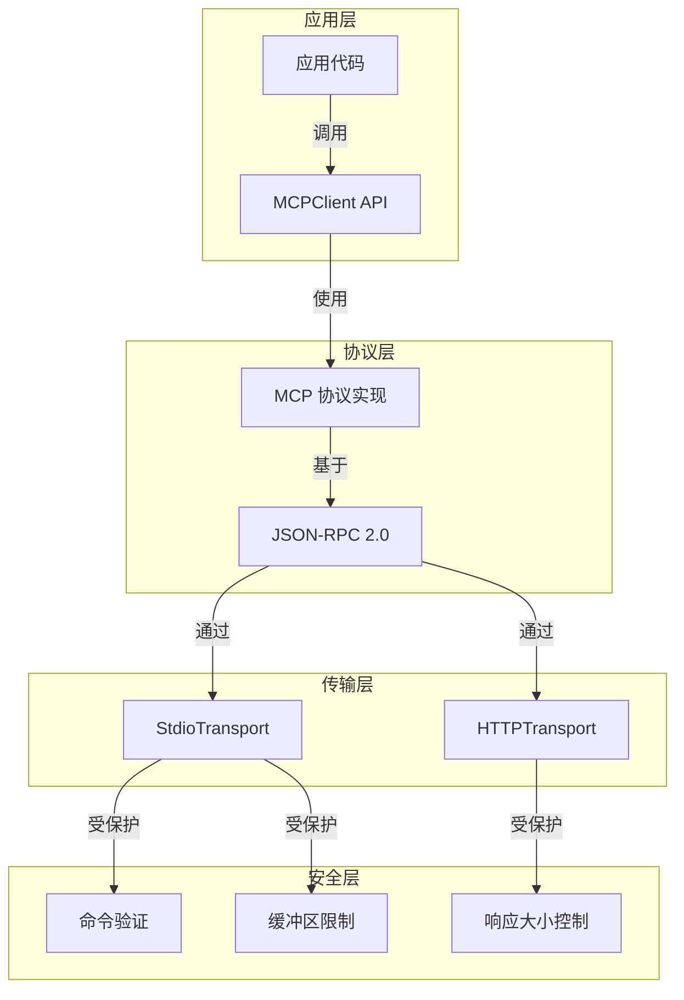
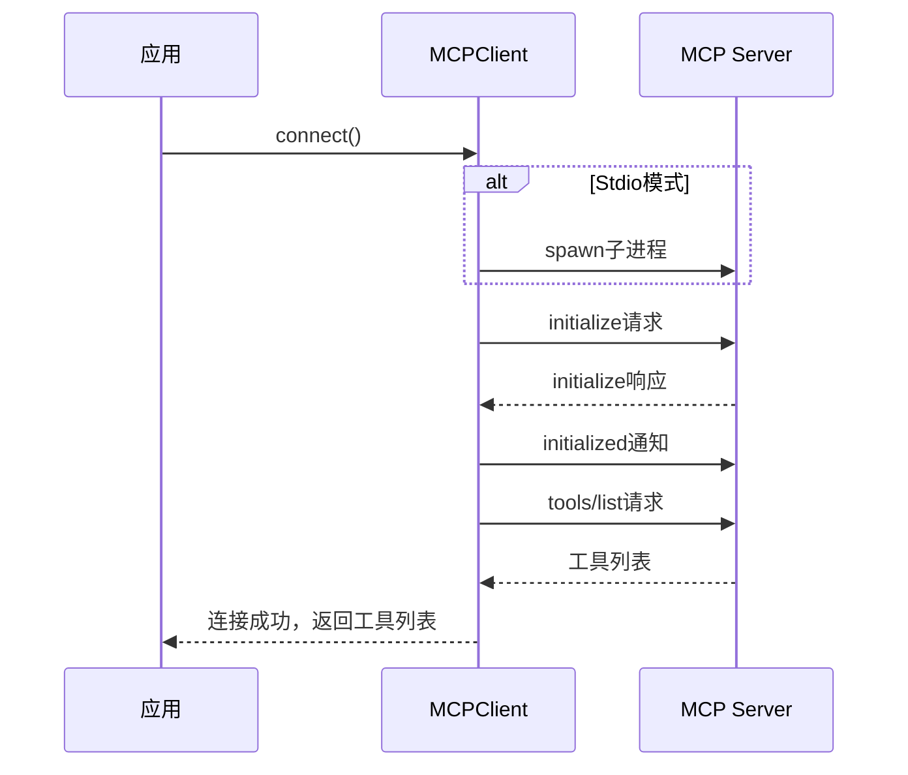
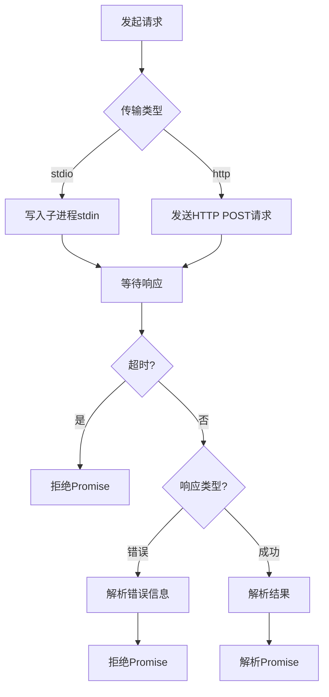

# MCPClient 模块文档

## 目录
- [概述](#概述)
- [核心组件](#核心组件)
- [架构设计](#架构设计)
- [使用指南](#使用指南)
- [API 参考](#api-参考)
- [安全考虑](#安全考虑)
- [错误处理](#错误处理)
- [最佳实践](#最佳实践)

---

## 概述

MCPClient 是一个实现了 MCP (Model Context Protocol) 协议客户端的核心模块，它提供了与 MCP 服务器通信的标准化方式。该模块支持两种主要的传输方式：通过标准输入输出（stdio）的子进程通信和通过 HTTP 的 JSON-RPC 通信。

### 主要功能

- **双传输模式支持**：同时支持 stdio 子进程和 HTTP 两种通信方式
- **完整的 MCP 协议实现**：包括初始化握手、工具发现、工具调用和优雅关闭
- **安全机制**：内置命令验证、缓冲区限制和响应大小控制
- **并发控制**：确保连接操作的原子性和请求的有序处理
- **事件驱动架构**：基于 EventEmitter 提供丰富的事件通知机制

### 设计理念

MCPClient 的设计遵循了以下原则：
- **安全性优先**：严格验证输入，限制资源使用
- **简洁性**：提供清晰直观的 API 接口
- **可靠性**：完善的错误处理和资源清理机制
- **可扩展性**：易于添加新的传输方式或协议功能

## 核心组件

### MCPClient 类

`MCPClient` 是该模块的核心类，继承自 `EventEmitter`，提供了与 MCP 服务器通信的完整功能。

#### 主要特性

- **传输抽象**：统一的接口屏蔽了底层传输差异
- **请求管理**：自动处理请求 ID 分配和超时控制
- **状态管理**：维护连接状态和服务器信息
- **工具缓存**：缓存可用工具列表，支持刷新

#### 关键属性

| 属性 | 类型 | 描述 |
|------|------|------|
| `name` | `string` | 客户端名称（只读） |
| `connected` | `boolean` | 连接状态（只读） |
| `serverInfo` | `object` | 服务器信息（只读） |
| `tools` | `Array` | 可用工具列表（只读） |

### 辅助组件

#### 常量定义

- `MAX_BUFFER_BYTES`：10MB，stdio 缓冲区最大大小
- `MAX_RESPONSE_BYTES`：50MB，HTTP 响应最大大小
- `BLOCKED_COMMANDS`：禁止的命令集合

#### 验证函数

- `validateCommand(command)`：验证命令安全性，防止 shell 注入攻击

## 架构设计

### 系统架构

MCPClient 采用分层架构设计，将传输层、协议层和应用层清晰分离：



### 传输模式对比

#### Stdio 模式

适用于本地 MCP 服务器，通过子进程的标准输入输出进行通信：

- **优势**：低延迟、无需网络配置、适合本地工具集成
- **限制**：需要管理子进程生命周期、仅本地通信

#### HTTP 模式

适用于远程 MCP 服务器，通过 HTTP POST 请求进行 JSON-RPC 通信：

- **优势**：支持远程服务、可复用现有 HTTP 基础设施
- **限制**：网络开销、需要处理 HTTP 连接管理

### 连接流程



### 请求处理流程



## 使用指南

### 基本用法

#### 初始化客户端

首先需要创建 MCPClient 实例，配置传输方式和相关参数：

```javascript
const { MCPClient } = require('./src/protocols/mcp-client');

// Stdio 模式示例
const stdioClient = new MCPClient({
  name: 'my-local-server',
  command: 'node',
  args: ['./my-mcp-server.js'],
  timeout: 30000
});

// HTTP 模式示例
const httpClient = new MCPClient({
  name: 'my-remote-server',
  url: 'https://api.example.com/mcp',
  auth: 'bearer',
  token_env: 'MCP_API_TOKEN',
  timeout: 30000
});
```

#### 连接服务器

连接到 MCP 服务器并获取可用工具：

```javascript
async function connectAndUseTools(client) {
  try {
    const tools = await client.connect();
    console.log('Connected! Available tools:', tools);
    
    // 使用工具
    if (tools.some(t => t.name === 'my-tool')) {
      const result = await client.callTool('my-tool', { param1: 'value1' });
      console.log('Tool result:', result);
    }
    
    // 刷新工具列表
    const updatedTools = await client.refreshTools();
    console.log('Updated tools:', updatedTools);
    
  } catch (error) {
    console.error('Error:', error);
  } finally {
    // 优雅关闭
    await client.shutdown();
  }
}
```

### 事件监听

MCPClient 提供了丰富的事件通知机制：

```javascript
client.on('connected', (data) => {
  console.log(`Connected to ${data.name}`);
  console.log('Available tools:', data.tools);
});

client.on('disconnected', (data) => {
  console.log(`Disconnected from ${data.name}`);
});

client.on('stderr', (data) => {
  console.log(`Server stderr [${data.name}]:`, data.data);
});

client.on('exit', (data) => {
  console.log(`Server exit [${data.name}]: code=${data.code}, signal=${data.signal}`);
});

client.on('error', (error) => {
  console.error('Client error:', error);
});
```

### 配置选项

#### 完整配置对象

| 参数 | 类型 | 必填 | 描述 |
|------|------|------|------|
| `name` | `string` | 是 | 客户端实例名称 |
| `command` | `string` | 否 | Stdio 模式的命令路径 |
| `args` | `string[]` | 否 | Stdio 模式的命令参数 |
| `url` | `string` | 否 | HTTP 模式的完整 URL |
| `auth` | `string` | 否 | 认证类型（目前支持 'bearer'） |
| `token_env` | `string` | 否 | 存放认证 token 的环境变量名 |
| `timeout` | `number` | 否 | 请求超时时间（毫秒），默认 30000 |

## API 参考

### MCPClient 类

#### 构造函数

```javascript
new MCPClient(config)
```

**参数：**
- `config` (Object) - 配置对象，必须包含 `name` 字段

**抛出：**
- `Error` - 如果配置无效或命令被阻止

#### 实例方法

##### connect()

建立与 MCP 服务器的连接。

```javascript
async connect(): Promise<Array>
```

**返回值：**
- `Promise<Array>` - 解析为可用工具列表的 Promise

**特点：**
- 并发安全：多个同时调用会共享同一个连接 Promise
- 幂等：已连接时直接返回缓存的工具列表

##### callTool(toolName, args)

调用服务器提供的工具。

```javascript
async callTool(toolName: string, args?: Object): Promise<any>
```

**参数：**
- `toolName` (string) - 要调用的工具名称
- `args` (Object) - 工具参数（可选）

**返回值：**
- `Promise<any>` - 工具执行结果

**抛出：**
- `Error` - 如果客户端未连接或工具调用失败

##### refreshTools()

刷新可用工具列表。

```javascript
async refreshTools(): Promise<Array>
```

**返回值：**
- `Promise<Array>` - 更新后的工具列表

**抛出：**
- `Error` - 如果客户端未连接

##### shutdown()

优雅关闭连接。

```javascript
async shutdown(): Promise<void>
```

**特点：**
- 发送 shutdown 通知
- 清理所有 pending 请求
- 终止子进程（stdio 模式）
- 幂等：多次调用安全

#### 实例属性

##### name (只读)

```javascript
client.name: string
```

客户端实例名称。

##### connected (只读)

```javascript
client.connected: boolean
```

当前连接状态。

##### serverInfo (只读)

```javascript
client.serverInfo: Object | null
```

服务器信息，连接成功后可用。

##### tools (只读)

```javascript
client.tools: Array | null
```

可用工具列表，连接成功后可用。

### 辅助函数

#### validateCommand(command)

验证命令安全性。

```javascript
validateCommand(command: string): void
```

**参数：**
- `command` (string) - 要验证的命令

**抛出：**
- `Error` - 如果命令无效或被阻止

### 导出常量

```javascript
const { 
  MCPClient, 
  MAX_BUFFER_BYTES, 
  MAX_RESPONSE_BYTES, 
  BLOCKED_COMMANDS, 
  validateCommand 
} = require('./src/protocols/mcp-client');
```

## 安全考虑

### 命令验证

MCPClient 实施严格的命令验证机制，防止 shell 注入攻击：

- **阻止的解释器**：所有常见的 shell 解释器都被明确阻止
- **路径检查**：命令的基名和完整路径都会被检查
- **扩展名处理**：自动处理 `.exe` 扩展名以确保 Windows 兼容性

**被阻止的命令列表：**
```javascript
BLOCKED_COMMANDS = new Set([
  'sh', 'bash', 'zsh', 'fish', 'dash', 'ksh', 'tcsh', 'csh',
  'cmd', 'cmd.exe', 'powershell', 'powershell.exe', 'pwsh', 'pwsh.exe',
  'wscript', 'cscript', 'perl', 'ruby'
]);
```

### 资源限制

为防止资源耗尽攻击，实施了以下限制：

- **Stdio 缓冲区**：最大 10MB，超过会触发断开连接
- **HTTP 响应**：最大 50MB，超过会中止请求
- **超时控制**：所有请求都有超时限制，防止挂起

### 认证机制

HTTP 模式支持 Bearer Token 认证：

```javascript
const client = new MCPClient({
  name: 'secure-server',
  url: 'https://api.example.com/mcp',
  auth: 'bearer',
  token_env: 'MCP_API_TOKEN'  // 从环境变量读取 token
});
```

**安全建议：**
- 永远不要在代码中硬编码认证 token
- 使用环境变量或安全的密钥管理系统
- 定期轮换认证凭证

## 错误处理

### 常见错误类型

#### 配置错误

```javascript
try {
  const client = new MCPClient({});  // 缺少 name
} catch (error) {
  console.error('Configuration error:', error.message);
  // "MCPClient requires a config with at least a name"
}
```

#### 命令验证错误

```javascript
try {
  const client = new MCPClient({
    name: 'bad-client',
    command: 'bash'  // 被阻止的命令
  });
} catch (error) {
  console.error('Security error:', error.message);
  // "MCPClient: command "bash" is a blocked shell interpreter..."
}
```

#### 连接错误

```javascript
try {
  await client.connect();
} catch (error) {
  if (error.code === 'ENOENT') {
    console.error('Command not found');
  } else {
    console.error('Connection failed:', error);
  }
}
```

#### 超时错误

```javascript
try {
  await client.callTool('slow-tool', {});
} catch (error) {
  if (error.code === 'TIMEOUT') {
    console.error('Request timed out');
  }
}
```

#### 工具调用错误

```javascript
try {
  await client.callTool('nonexistent-tool', {});
} catch (error) {
  console.error('Tool error:', error.message);
  console.error('Error code:', error.code);
  console.error('Error data:', error.data);
}
```

### 错误恢复策略

#### 重连机制

```javascript
async function connectWithRetry(client, maxRetries = 3) {
  for (let i = 0; i < maxRetries; i++) {
    try {
      return await client.connect();
    } catch (error) {
      if (i === maxRetries - 1) throw error;
      console.log(`Retry ${i + 1}/${maxRetries}...`);
      await new Promise(r => setTimeout(r, 1000 * (i + 1)));
    }
  }
}
```

#### 优雅降级

```javascript
async function safeCallTool(client, toolName, args, fallback) {
  try {
    if (!client.connected) {
      await client.connect();
    }
    return await client.callTool(toolName, args);
  } catch (error) {
    console.warn(`Tool ${toolName} failed, using fallback`);
    return fallback;
  }
}
```

## 最佳实践

### 实例管理

#### 单例模式

对于特定的 MCP 服务器，使用单例模式避免重复连接：

```javascript
let clientInstance = null;

async function getMcpClient() {
  if (!clientInstance) {
    clientInstance = new MCPClient({
      name: 'shared-server',
      command: 'node',
      args: ['./shared-server.js']
    });
    await clientInstance.connect();
    
    // 清理逻辑
    process.on('exit', () => {
      if (clientInstance) {
        clientInstance.shutdown();
      }
    });
  }
  return clientInstance;
}
```

### 资源清理

#### 进程退出处理

```javascript
function setupCleanup(client) {
  const cleanup = async () => {
    console.log('Shutting down MCP client...');
    await client.shutdown();
    process.exit(0);
  };

  process.on('SIGINT', cleanup);
  process.on('SIGTERM', cleanup);
  process.on('uncaughtException', async (error) => {
    console.error('Uncaught exception:', error);
    await client.shutdown();
    process.exit(1);
  });
}
```

### 性能优化

#### 工具缓存

利用内置的工具缓存，避免频繁刷新：

```javascript
// 只在必要时刷新工具
async function getTool(client, toolName, forceRefresh = false) {
  if (forceRefresh || !client.tools) {
    await client.refreshTools();
  }
  return client.tools.find(t => t.name === toolName);
}
```

#### 批量操作

如果服务器支持，优先使用批量操作：

```javascript
// 假设服务器支持批量工具调用
async function callToolsBatch(client, toolCalls) {
  const results = [];
  for (const call of toolCalls) {
    results.push(await client.callTool(call.name, call.args));
  }
  return results;
}
```

### 监控和调试

#### 完整的事件监控

```javascript
function setupMonitoring(client) {
  const startTime = Date.now();
  
  client.on('connected', (data) => {
    console.log(`[${data.name}] Connected after ${Date.now() - startTime}ms`);
  });
  
  client.on('stderr', (data) => {
    console.warn(`[${data.name}] Server stderr:`, data.data);
  });
  
  client.on('exit', (data) => {
    const uptime = Date.now() - startTime;
    console.log(`[${data.name}] Exited after ${uptime}ms`);
    console.log(`  Code: ${data.code}, Signal: ${data.signal}`);
  });
  
  client.on('error', (error) => {
    console.error(`[${client.name}] Error:`, error);
  });
}
```

### 测试策略

#### 模拟 MCP 服务器

在测试中使用模拟服务器：

```javascript
const { spawn } = require('child_process');
const path = require('path');

async function createTestClient() {
  const testServerPath = path.join(__dirname, 'test-mcp-server.js');
  const client = new MCPClient({
    name: 'test-client',
    command: 'node',
    args: [testServerPath]
  });
  
  await client.connect();
  return client;
}
```

## 与其他模块集成

### MCPClientManager

MCPClient 通常与 [MCPClientManager](MCPClientManager.md) 一起使用，用于管理多个 MCP 客户端实例：

```javascript
// 参见 MCPClientManager 文档了解更多信息
const { MCPClientManager } = require('./src/protocols/mcp-client-manager');

const manager = new MCPClientManager();
await manager.addClient({
  name: 'server1',
  command: 'node',
  args: ['./server1.js']
});
```

### CircuitBreaker

对于生产环境，建议使用 [CircuitBreaker](CircuitBreaker.md) 来提高可靠性：

```javascript
// 参见 CircuitBreaker 文档了解更多信息
const { CircuitBreaker } = require('./src/protocols/mcp-circuit-breaker');

const breaker = new CircuitBreaker({
  failureThreshold: 5,
  resetTimeout: 30000
});

async function safeCall(client, toolName, args) {
  return breaker.execute(() => client.callTool(toolName, args));
}
```

## 总结

MCPClient 模块提供了一个健壮、安全且易于使用的 MCP 协议客户端实现。通过合理的架构设计和完善的错误处理机制，它能够满足从简单集成到复杂生产环境的各种需求。

使用 MCPClient 时，记住：
- 始终验证配置和输入
- 正确处理错误和清理资源
- 利用事件机制进行监控
- 遵循安全最佳实践

如需了解更多相关模块的信息，请参考：
- [MCPClientManager](MCPClientManager.md) - 多客户端管理
- [CircuitBreaker](CircuitBreaker.md) - 熔断器模式
- [MCP Protocol](MCP-Protocol.md) - 协议概述

