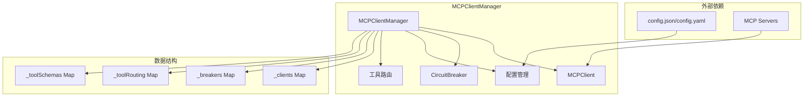
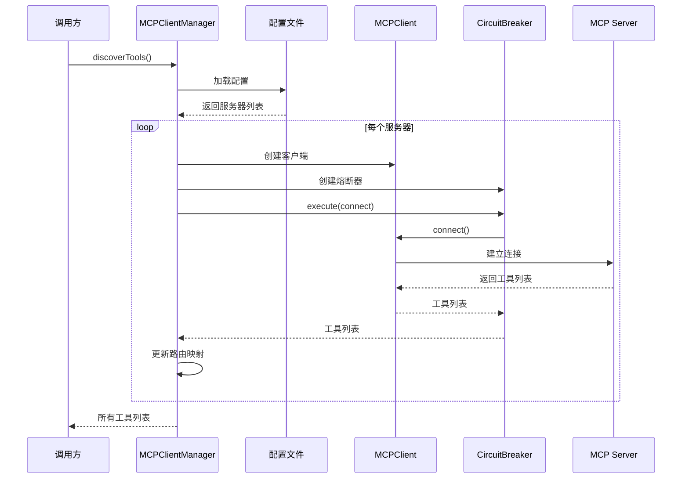

# MCPClientManager 模块文档

## 概述

MCPClientManager 是一个用于管理多个 MCP (Model Context Protocol) 服务器连接的核心模块。它负责从配置文件读取服务器配置、自动建立连接、管理工具路由，并提供统一的工具调用接口。该模块通过熔断器模式确保系统的稳定性，并提供安全的配置解析机制。

### 设计理念

- **集中管理**: 统一管理多个 MCP 服务器的连接和工具调用
- **自动路由**: 根据工具名称自动路由到正确的服务器
- **安全优先**: 内置路径遍历防护和原型污染防护
- **弹性设计**: 使用熔断器模式防止级联故障
- **幂等操作**: 关键操作设计为幂等，确保安全性

## 架构与组件关系



### 核心组件说明

1. **MCPClientManager 主类**: 模块的核心入口，协调所有组件工作
2. **MCPClient**: 负责与单个 MCP 服务器通信的客户端
3. **CircuitBreaker**: 熔断器模式实现，防止故障级联
4. **配置管理**: 负责加载和解析配置文件
5. **工具路由**: 管理工具名称到服务器的映射关系

## 核心功能详解

### 1. 初始化与配置

```javascript
const manager = new MCPClientManager({
  configDir: '.loki',      // 配置文件目录
  timeout: 30000,          // 连接超时时间（毫秒）
  failureThreshold: 3,      // 熔断器失败阈值
  resetTimeout: 30000      // 熔断器重置超时
});
```

#### 配置验证机制

MCPClientManager 使用 `validateConfigDir` 函数确保配置目录的安全性：

- 路径必须解析在项目根目录内，防止路径遍历攻击
- 强制要求配置目录位于 `process.cwd()` 下或其子目录中

### 2. 工具发现与连接

`discoverTools()` 方法是模块的核心功能之一，它执行以下操作：

1. 加载配置文件
2. 为每个配置的 MCP 服务器创建客户端和熔断器
3. 连接到服务器并获取可用工具
4. 建立工具名称到服务器的路由映射
5. 存储工具的完整架构信息



### 3. 工具调用机制

`callTool(toolName, args)` 方法提供了统一的工具调用接口：

1. 根据工具名称查找对应的服务器
2. 获取该服务器的客户端和熔断器
3. 通过熔断器执行工具调用
4. 返回调用结果

```javascript
try {
  const result = await manager.callTool('myTool', { param1: 'value1' });
  console.log('工具调用结果:', result);
} catch (error) {
  console.error('工具调用失败:', error.message);
}
```

### 4. 配置文件解析

MCPClientManager 支持两种配置文件格式：

#### JSON 配置 (config.json)

```json
{
  "mcp_servers": [
    {
      "name": "server1",
      "command": "node",
      "args": ["server.js"],
      "timeout": 30000
    },
    {
      "name": "server2",
      "url": "https://example.com/mcp",
      "auth": "bearer",
      "token_env": "MCP_TOKEN"
    }
  ]
}
```

#### YAML 配置 (config.yaml)

模块包含一个极简的 YAML 解析器，支持基本的 YAML 结构：

```yaml
mcp_servers:
  - name: server1
    command: node
    args: ["server.js"]
  - name: server2
    url: https://example.com/mcp
    auth: bearer
```

### 5. 安全特性

#### 路径遍历防护

`validateConfigDir` 函数确保配置目录不会超出项目根目录范围，防止路径遍历攻击。

#### 原型污染防护

YAML 解析器会静默跳过 `__proto__`、`constructor` 和 `prototype` 等危险键名，防止原型污染攻击。

### 6. 熔断器模式

每个 MCP 服务器连接都配有独立的熔断器，具有以下状态：

- **CLOSED**: 正常状态，允许请求通过
- **OPEN**: 故障状态，快速失败，不发送请求
- **HALF-OPEN**: 半开状态，尝试恢复，允许少量请求测试

熔断器的行为可以通过以下参数配置：
- `failureThreshold`: 触发熔断的连续失败次数
- `resetTimeout`: 从 OPEN 状态转换到 HALF-OPEN 状态的等待时间

## 公共 API 参考

### MCPClientManager 类

#### 构造函数

```javascript
new MCPClientManager(options?)
```

**参数**:
- `options` (可选): 配置选项对象
  - `configDir` (string): 配置文件目录，默认 `'.loki'`
  - `timeout` (number): 连接超时时间（毫秒），默认 `30000`
  - `failureThreshold` (number): 熔断器失败阈值，默认 `3`
  - `resetTimeout` (number): 熔断器重置超时（毫秒），默认 `30000`

#### 属性

- `initialized` (boolean, 只读): 是否已完成初始化
- `serverCount` (number, 只读): 已连接的服务器数量

#### 方法

##### discoverTools()

发现并连接到所有配置的 MCP 服务器，获取可用工具。

```javascript
async discoverTools(): Promise<Array<Tool>>
```

**返回值**: 包含所有可用工具的 Promise 数组

**注意**: 此方法是幂等的，多次调用不会产生副作用

##### getToolsByServer(serverName)

获取指定服务器提供的所有工具。

```javascript
getToolsByServer(serverName: string): Array<Tool>
```

**参数**:
- `serverName` (string): 服务器名称

**返回值**: 该服务器提供的工具数组

##### getAllTools()

获取所有已发现的工具。

```javascript
getAllTools(): Array<Tool>
```

**返回值**: 所有可用工具的数组

##### callTool(toolName, args)

调用指定的工具。

```javascript
async callTool(toolName: string, args: object): Promise<any>
```

**参数**:
- `toolName` (string): 工具名称
- `args` (object): 工具参数

**返回值**: 工具执行结果的 Promise

**异常**:
- 当找不到对应工具的服务器时抛出错误
- 当客户端或熔断器不存在时抛出错误
- 当工具调用失败时通过熔断器抛出错误

##### getServerState(serverName)

获取指定服务器的熔断器状态。

```javascript
getServerState(serverName: string): string | null
```

**参数**:
- `serverName` (string): 服务器名称

**返回值**: 熔断器状态（'CLOSED' | 'OPEN' | 'HALF-OPEN'），如果服务器不存在则返回 null

##### shutdown()

关闭所有服务器连接并清理资源。

```javascript
async shutdown(): Promise<void>
```

**返回值**: 完成关闭操作的 Promise

### validateConfigDir 函数

验证配置目录的安全性。

```javascript
validateConfigDir(configDir: string): string
```

**参数**:
- `configDir` (string): 配置目录路径

**返回值**: 解析后的安全路径

**异常**: 当路径解析到项目根目录外时抛出错误

## 实际使用示例

### 基本使用流程

```javascript
const { MCPClientManager } = require('./src/protocols/mcp-client-manager');

// 创建管理器实例
const manager = new MCPClientManager({
  configDir: '.loki',
  timeout: 30000
});

async function main() {
  try {
    // 发现工具
    const tools = await manager.discoverTools();
    console.log(`发现 ${tools.length} 个可用工具`);
    
    // 检查某个工具是否可用
    const toolName = 'myCustomTool';
    const allTools = manager.getAllTools();
    const toolExists = allTools.some(t => t.name === toolName);
    
    if (toolExists) {
      // 调用工具
      const result = await manager.callTool(toolName, { 
        input: 'example data' 
      });
      console.log('工具执行结果:', result);
    }
    
    // 查看服务器状态
    const serverNames = Array.from(manager._clients.keys());
    serverNames.forEach(name => {
      const state = manager.getServerState(name);
      console.log(`服务器 ${name} 状态: ${state}`);
    });
    
  } catch (error) {
    console.error('操作失败:', error);
  } finally {
    // 优雅关闭
    await manager.shutdown();
  }
}

main();
```

### 错误处理与重试策略

```javascript
async function safeCallTool(manager, toolName, args, maxRetries = 3) {
  let lastError;
  
  for (let i = 0; i < maxRetries; i++) {
    try {
      return await manager.callTool(toolName, args);
    } catch (error) {
      lastError = error;
      
      // 检查是否是熔断器打开的错误
      if (error.message.includes('circuit breaker is OPEN')) {
        console.warn(`熔断器已打开，等待后重试 (${i + 1}/${maxRetries})`);
        await new Promise(resolve => setTimeout(resolve, 1000 * (i + 1)));
      } else {
        // 其他错误直接重试
        console.warn(`工具调用失败，重试 (${i + 1}/${maxRetries}):`, error.message);
      }
    }
  }
  
  throw lastError;
}
```

## 注意事项与限制

### 配置限制

1. **配置目录安全**: 配置目录必须位于项目根目录内，不能使用绝对路径指向外部目录
2. **YAML 解析限制**: 内置的 YAML 解析器只支持极简的 YAML 子集，复杂的 YAML 结构可能无法正确解析
3. **工具名称冲突**: 如果多个服务器提供相同名称的工具，只有第一个注册的工具会被使用，后续的会被忽略并发出警告

### 运行时注意事项

1. **初始化要求**: 必须先调用 `discoverTools()` 完成初始化，然后才能调用其他方法
2. **幂等性**: `discoverTools()` 是幂等的，但其他方法不是，重复调用可能产生意外结果
3. **资源清理**: 使用完毕后必须调用 `shutdown()` 方法清理资源，否则可能导致进程无法正常退出
4. **熔断器状态**: 熔断器状态会影响工具调用的成功率，需要监控服务器状态

### 错误条件

1. **配置文件错误**: 配置文件格式错误或无法读取时，会记录错误但不会抛出异常
2. **服务器连接失败**: 单个服务器连接失败不会影响其他服务器，只会记录错误日志
3. **工具不存在**: 调用不存在的工具会立即抛出错误
4. **熔断器打开**: 当熔断器处于 OPEN 状态时，工具调用会快速失败

## 相关模块参考

- [MCPClient](MCPClient.md): 单个 MCP 服务器客户端实现
- [CircuitBreaker](CircuitBreaker.md): 熔断器模式实现
- [SSETransport](SSETransport.md): SSE 传输协议实现
- [StdioTransport](StdioTransport.md): 标准输入输出传输协议实现
