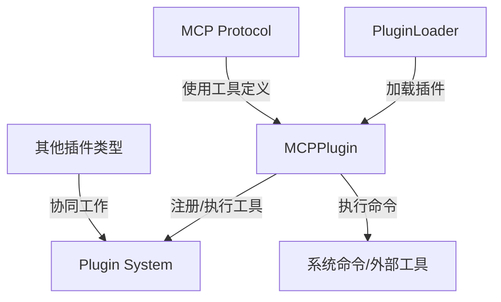

# MCPPlugin 模块文档

## 概述

MCPPlugin 模块是 Plugin System 的核心组件之一，专门用于管理和执行基于 MCP (Model Context Protocol) 协议的自定义工具插件。该模块提供了一套完整的工具注册、注销、执行和发现机制，使系统能够灵活地扩展功能集，而无需修改核心代码。

### 设计理念

MCPPlugin 模块的设计遵循插件化架构原则，通过以下核心理念实现功能的可扩展性：

- **动态注册**：允许在运行时动态添加和移除工具，无需重启系统
- **参数化执行**：支持参数化命令模板，通过安全的参数替换机制执行命令
- **协议兼容性**：生成符合 MCP 协议标准的工具定义，便于与其他系统集成
- **安全执行**：提供参数转义、超时控制、工作目录隔离等安全机制

### 模块定位

MCPPlugin 模块在整个系统架构中处于 Plugin System 子系统下，与其他插件类型（如 AgentPlugin、GatePlugin、IntegrationPlugin）协同工作。它主要为系统提供了执行外部命令和工具的能力，这些工具可以通过 MCP 协议被其他组件发现和调用。

## 核心组件

### MCPPlugin 类

MCPPlugin 类是该模块的唯一核心组件，采用静态方法设计模式，提供工具管理和执行的所有功能。该类不需要实例化，所有方法都可以直接通过类名调用。

#### 主要特性

- **工具注册表**：使用内存中的 Map 结构存储已注册的工具
- **配置验证**：在注册时验证工具配置的有效性
- **安全执行**：提供参数转义、超时控制和环境变量隔离
- **协议转换**：将内部工具定义转换为 MCP 协议兼容格式

## 架构与组件关系

MCPPlugin 模块作为 Plugin System 的一部分，与其他组件有着明确的交互关系：



### 组件交互说明

1. **PluginLoader**: 负责从文件系统或其他源加载插件配置，并通过 MCPPlugin.register() 方法注册工具
2. **MCP Protocol**: 通过 MCPPlugin.getMCPDefinition() 获取工具定义，以便在协议中暴露这些工具
3. **Plugin System**: 作为所有插件类型的协调者，管理插件的生命周期
4. **系统命令/外部工具**: MCPPlugin.execute() 方法最终会调用这些外部资源

## 核心功能详解

### 工具注册

`register` 方法用于将自定义 MCP 工具插件注册到系统中。

#### 参数

- `pluginConfig`: 工具配置对象，必须包含以下属性：
  - `type`: 必须为 "mcp_tool"
  - `name`: 工具的唯一标识符
  - `description`: 工具的描述信息
  - `command`: 要执行的命令模板，可以包含参数占位符
  - `parameters`: (可选) 参数定义数组
  - `timeout_ms`: (可选) 超时时间，默认为 30000 毫秒
  - `working_directory`: (可选) 工作目录，默认为 "project"

#### 返回值

- 成功时返回 `{ success: true }`
- 失败时返回 `{ success: false, error: "错误信息" }`

#### 工作原理

1. 验证配置对象的类型和必需字段
2. 检查工具名称是否已被注册
3. 创建标准化的工具定义对象
4. 将工具定义存储在内部注册表中

### 工具注销

`unregister` 方法用于从系统中移除已注册的工具。

#### 参数

- `pluginName`: 要移除的工具名称

#### 返回值

- 成功时返回 `{ success: true }`
- 失败时返回 `{ success: false, error: "错误信息" }`

### 工具执行

`execute` 方法是 MCPPlugin 的核心功能，用于执行已注册的工具命令。

#### 参数

- `pluginConfig`: 工具配置对象
- `params`: 输入参数对象，键值对形式
- `projectDir`: (可选) 项目目录，用于指定执行环境的工作目录

#### 返回值

返回一个 Promise，解析为以下结构：
- `success`: 布尔值，表示执行是否成功
- `output`: 命令的输出内容（stdout + stderr）
- `duration_ms`: 执行耗时，以毫秒为单位

#### 工作原理

1. 从配置中提取命令和超时设置
2. 记录开始时间
3. 验证命令是否存在
4. 使用 `_sanitizeValue` 方法安全地替换命令模板中的参数
5. 使用 `child_process.execFile` 执行命令，配置工作目录、超时和环境变量
6. 处理执行结果，包括成功、错误和超时情况
7. 返回标准化的执行结果

### 工具定义获取

`getMCPDefinition` 方法用于获取符合 MCP 协议标准的工具定义。

#### 参数

- `name`: 工具名称

#### 返回值

- 成功时返回 MCP 兼容的工具定义对象
- 失败时返回 null

#### 工作原理

1. 从内部注册表中获取工具定义
2. 将工具的参数定义转换为 JSON Schema 格式
3. 构建符合 MCP 协议的工具定义结构

### 工具列表获取

`listRegistered` 方法用于获取所有已注册工具的列表。

#### 返回值

返回一个包含所有已注册工具定义的数组。

### 辅助方法

#### _sanitizeValue

用于对参数值进行 shell 安全转义，防止命令注入攻击。

**工作原理**：
1. 将值转换为字符串
2. 使用 POSIX 单引号转义机制，将内部的单引号替换为 `'\''`
3. 用单引号包裹整个值

#### _clearAll

用于清空所有已注册的工具，主要用于测试目的。

## 使用示例

### 基本工具注册与执行

```javascript
const { MCPPlugin } = require('./src/plugins/mcp-plugin');

// 注册一个简单的工具
const result = MCPPlugin.register({
  type: 'mcp_tool',
  name: 'file_analyzer',
  description: '分析文件内容并返回统计信息',
  command: 'wc -l {{params.file_path}}',
  parameters: [
    {
      name: 'file_path',
      type: 'string',
      description: '要分析的文件路径',
      required: true
    }
  ],
  timeout_ms: 5000
});

if (result.success) {
  console.log('工具注册成功');
}

// 执行工具
MCPPlugin.execute({
  name: 'file_analyzer',
  command: 'wc -l {{params.file_path}}',
  timeout_ms: 5000
}, {
  file_path: '/path/to/file.txt'
}).then(result => {
  if (result.success) {
    console.log('执行结果:', result.output);
  } else {
    console.error('执行失败:', result.output);
  }
});
```

### 获取 MCP 协议工具定义

```javascript
// 获取单个工具的 MCP 定义
const mcpDef = MCPPlugin.getMCPDefinition('file_analyzer');
if (mcpDef) {
  console.log('MCP 工具定义:', JSON.stringify(mcpDef, null, 2));
}

// 获取所有已注册工具
const allTools = MCPPlugin.listRegistered();
console.log('已注册工具:', allTools);
```

### 高级参数替换

```javascript
// 注册一个使用多个参数的工具
MCPPlugin.register({
  type: 'mcp_tool',
  name: 'search_and_replace',
  description: '在文件中搜索并替换文本',
  command: 'sed -i "s/{{params.search}}/{{params.replace}}/g" {{params.file}}',
  parameters: [
    {
      name: 'search',
      type: 'string',
      description: '要搜索的文本',
      required: true
    },
    {
      name: 'replace',
      type: 'string',
      description: '替换文本',
      required: true
    },
    {
      name: 'file',
      type: 'string',
      description: '目标文件',
      required: true
    }
  ]
});

// 执行时，参数会被安全地转义
MCPPlugin.execute({
  name: 'search_and_replace',
  command: 'sed -i "s/{{params.search}}/{{params.replace}}/g" {{params.file}}'
}, {
  search: 'old text',
  replace: 'new text with "quotes" and $special$ characters',
  file: '/path/to/file.txt'
});
```

## 配置与集成

### 与 PluginLoader 集成

MCPPlugin 通常与 PluginLoader 一起使用，后者负责从配置文件或其他源加载插件配置：

```javascript
// 假设有一个插件配置文件
const pluginConfigs = require('./mcp-tools.json');

// 使用 PluginLoader 加载并注册所有工具
const { PluginLoader } = require('./src/plugins/loader/PluginLoader');
const loader = new PluginLoader();
loader.loadFromConfig(pluginConfigs);
```

### 与 MCP Protocol 集成

MCPPlugin 生成的工具定义可以直接用于 MCP 协议实现：

```javascript
const { MCPClient } = require('./src/protocols/mcp-client/MCPClient');
const mcpClient = new MCPClient();

// 将所有已注册的工具添加到 MCP 客户端
const tools = MCPPlugin.listRegistered();
tools.forEach(tool => {
  const mcpDef = MCPPlugin.getMCPDefinition(tool.name);
  if (mcpDef) {
    mcpClient.registerTool(mcpDef, async (params) => {
      const result = await MCPPlugin.execute(tool, params);
      return result.output;
    });
  }
});
```

## 安全考虑

MCPPlugin 模块执行外部命令，因此安全性是一个重要考虑因素：

1. **参数转义**：`_sanitizeValue` 方法确保所有参数值都被正确转义，防止命令注入攻击
2. **超时控制**：每个工具执行都有超时限制，防止长时间运行的命令占用资源
3. **工作目录隔离**：可以指定工作目录，限制命令对文件系统的访问范围
4. **环境变量控制**：执行命令时设置特定的环境变量，便于识别和审计

## 限制与注意事项

1. **内存存储**：工具注册信息存储在内存中，系统重启后会丢失，需要重新注册
2. **Shell 执行**：命令通过 `/bin/sh` 执行，可能存在平台兼容性问题
3. **输出限制**：命令输出被限制在 1MB 以内，超过部分会被截断
4. **并发执行**：没有内置的并发控制机制，需要上层应用处理
5. **错误处理**：命令执行的错误信息会被合并到输出中，需要应用层进行解析

## 未来改进方向

1. **持久化存储**：支持将工具注册信息保存到数据库或文件中
2. **更多传输方式**：除了 stdio，还可以支持通过网络或其他协议执行工具
3. **增强的安全控制**：添加更细粒度的权限控制和沙箱机制
4. **工具依赖管理**：支持工具之间的依赖关系和执行顺序
5. **执行监控**：添加更详细的执行日志和性能指标收集

## 相关模块

- [PluginLoader](PluginLoader.md) - 插件加载器，负责从各种源加载插件配置
- [MCP Protocol](MCPProtocol.md) - MCP 协议实现，使用 MCPPlugin 提供的工具定义
- [AgentPlugin](AgentPlugin.md) - 代理插件，另一种插件类型
- [GatePlugin](GatePlugin.md) - 网关插件，用于实现访问控制
- [IntegrationPlugin](IntegrationPlugin.md) - 集成插件，用于与外部系统集成
