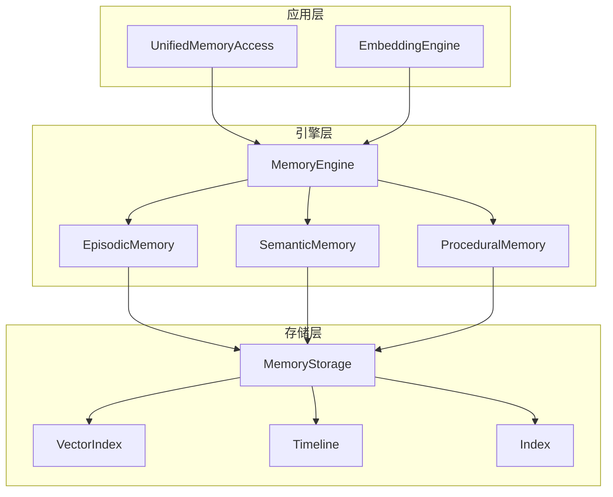
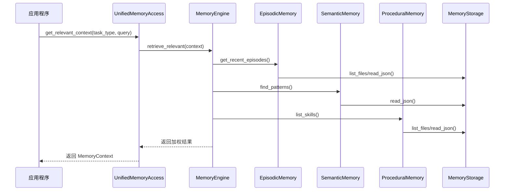

# Memory Engine 模块文档

## 目录
- [概述](#概述)
- [架构设计](#架构设计)
- [核心组件](#核心组件)
- [数据模型](#数据模型)
- [使用指南](#使用指南)
- [配置与扩展](#配置与扩展)
- [高级功能](#高级功能)
- [注意事项与限制](#注意事项与限制)

## 概述

### 模块简介

Memory Engine 是 Loki Mode 系统的核心记忆引擎，负责管理和组织 AI 代理在执行任务过程中产生的各种记忆数据。该模块实现了一种分层记忆架构，包括情景记忆、语义记忆和过程记忆三种类型，为代理提供持续学习和经验复用能力。

### 设计理念

Memory Engine 的设计受到认知科学和神经科学启发，采用了与人类记忆系统类似的分层结构：

1. **情景记忆 (Episodic Memory)**：存储具体的交互痕迹和任务执行历史
2. **语义记忆 (Semantic Memory)**：保存从经验中抽象出的通用模式和知识
3. **过程记忆 (Procedural Memory)**：记录可复用的技能和行动序列

这种设计允许系统不仅记住"发生了什么"，还能理解"为什么会发生"以及"将来如何做得更好"。

### 核心特性

- **任务感知检索**：根据不同任务类型动态调整记忆检索权重，基于 arXiv 2512.18746 (MemEvolve) 的研究成果，相比静态权重可提升 17% 的性能
- **渐进式加载**：支持按需加载记忆内容，优化 token 消耗
- **多模态存储**：同时支持结构化 JSON 数据和 Markdown 文档
- **时间衰减机制**：记忆重要性随时间自动衰减，保持记忆系统的时效性
- **Zettelkasten 式链接**：支持记忆项之间的关联链接，构建知识网络

## 架构设计

### 系统架构图



### 组件交互流程



### 目录结构

Memory Engine 使用以下目录结构组织数据：

```
.loki/memory/
├── episodic/           # 情景记忆存储
│   ├── 2026-01-06/
│   │   └── task-ep-*.json
│   └── 2026-01-07/
│       └── task-ep-*.json
├── semantic/           # 语义记忆存储
│   ├── patterns.json
│   └── anti-patterns.json
├── skills/             # 过程记忆存储
│   ├── *.md
│   └── *.json
├── ledgers/            # 分类账
├── handoffs/           # 交接记录
├── learnings/          # 学习成果
├── index.json          # 记忆索引
└── timeline.json       # 时间线记录
```

## 核心组件

### MemoryEngine

`MemoryEngine` 是整个记忆系统的核心协调器，提供对所有记忆类型的统一访问接口。

#### 主要功能

- **生命周期管理**：初始化、清理和统计记忆系统
- **记忆存储**：存储和检索各类记忆数据
- **统一检索**：跨记忆类型的相关记忆检索
- **索引维护**：管理记忆索引和时间线

#### 初始化

```python
from memory.engine import MemoryEngine

# 使用默认配置初始化
engine = MemoryEngine(base_path=".loki/memory")

# 或者提供自定义存储后端
engine = MemoryEngine(storage=my_custom_storage, base_path=".loki/memory")

# 初始化记忆系统
engine.initialize()
```

#### 核心方法

##### `initialize()`
初始化记忆系统，创建必要的目录结构和基础文件。

**参数**：无
**返回值**：无
**副作用**：创建目录结构、初始化 index.json 和 timeline.json

##### `get_stats()`
获取记忆系统统计信息。

**参数**：无
**返回值**：包含记忆计数和元数据的字典
```python
{
    "episodic_count": 15,
    "semantic_pattern_count": 8,
    "anti_pattern_count": 3,
    "skill_count": 12,
    "total_memories": 38,
    "total_tokens": 125000,
    "last_updated": "2026-01-07T14:30:00+00:00"
}
```

##### `cleanup_old(days=30)`
清理未被引用的旧情景记忆。

**参数**：
- `days` (int): 保留记忆的天数，默认 30 天

**返回值**：删除的记忆数量

**示例**：
```python
# 清理 60 天前的旧记忆
removed = engine.cleanup_old(days=60)
print(f"已删除 {removed} 条旧记忆")
```

##### `store_episode(trace)`
存储情景记忆追踪。

**参数**：
- `trace` (EpisodeTrace): 要存储的情景记忆实例

**返回值**：情景记忆 ID (str)

**示例**：
```python
from memory.schemas import EpisodeTrace, ActionEntry

# 创建情景记忆
trace = EpisodeTrace.create(
    task_id="task-001",
    agent="code-agent",
    goal="实现用户认证功能",
    phase="ACT"
)
trace.action_log.append(ActionEntry(
    tool="write_file",
    input="auth.py",
    output="文件创建成功"
))
trace.outcome = "success"

# 存储情景记忆
episode_id = engine.store_episode(trace)
```

##### `retrieve_relevant(context, top_k=5)`
跨所有记忆类型检索相关记忆。

**参数**：
- `context` (Dict): 查询上下文，包含 goal、task_type 等信息
- `top_k` (int): 返回结果数量，默认 5

**返回值**：相关记忆项列表，每项包含来源元数据

**示例**：
```python
context = {
    "goal": "修复登录 API 的错误",
    "task_type": "debugging"
}

results = engine.retrieve_relevant(context, top_k=10)
for item in results:
    print(f"[{item['_source']}] {item.get('goal', item.get('pattern', ''))}")
```

### EpisodicMemory

`EpisodicMemory` 是情景记忆操作的封装类，提供专注于情景记忆追踪的接口。

#### 主要功能

- 存储和检索具体的交互痕迹
- 按时间范围查询情景记忆
- 基于相似度的情景记忆搜索

#### 使用示例

```python
from memory.engine import MemoryEngine, EpisodicMemory
from memory.schemas import EpisodeTrace

engine = MemoryEngine()
episodic = EpisodicMemory(engine)

# 存储情景记忆
trace = EpisodeTrace.create(
    task_id="task-001",
    agent="code-agent",
    goal="实现用户认证功能"
)
episode_id = episodic.store(trace)

# 获取单个情景记忆
trace = episodic.get(episode_id)

# 获取最近的情景记忆
recent = episodic.get_recent(limit=10)

# 搜索情景记忆
results = episodic.search("用户认证", top_k=5)
```

### SemanticMemory

`SemanticMemory` 是语义记忆操作的封装类，提供专注于模式管理的接口。

#### 主要功能

- 存储和检索语义模式
- 按类别和置信度筛选模式
- 记录模式使用统计

#### 使用示例

```python
from memory.engine import MemoryEngine, SemanticMemory
from memory.schemas import SemanticPattern

engine = MemoryEngine()
semantic = SemanticMemory(engine)

# 创建并存储语义模式
pattern = SemanticPattern.create(
    pattern="数据库连接应使用上下文管理器确保资源释放",
    category="error-handling",
    conditions=["使用数据库连接", "需要资源管理"],
    correct_approach="使用 with 语句管理数据库连接",
    incorrect_approach="直接创建连接而不确保关闭"
)
pattern_id = semantic.store(pattern)

# 查找模式
patterns = semantic.find(category="error-handling", min_confidence=0.7)

# 增加使用计数
semantic.increment_usage(pattern_id)
```

### ProceduralMemory

`ProceduralMemory` 是过程记忆操作的封装类，提供专注于技能管理的接口。

#### 主要功能

- 存储和检索可复用技能
- 技能以 Markdown 格式保存，便于阅读和编辑
- 支持常见错误和修复方法的记录

#### 使用示例

```python
from memory.engine import MemoryEngine, ProceduralMemory
from memory.schemas import ProceduralSkill

engine = MemoryEngine()
procedural = ProceduralMemory(engine)

# 创建技能
skill = ProceduralSkill.create(
    name="REST API 实现",
    description="实现标准 REST API 端点的步骤",
    steps=[
        "定义数据模型",
        "创建数据库迁移",
        "实现序列化器",
        "编写视图函数",
        "配置 URL 路由",
        "编写测试用例"
    ]
)

# 添加常见错误
skill.add_error_fix(
    error="405 Method Not Allowed",
    fix="检查 URL 路由和视图函数的 HTTP 方法是否匹配"
)

# 存储技能
skill_id = procedural.store(skill)

# 列出所有技能
all_skills = procedural.list_all()
```

## 数据模型

### EpisodeTrace

`EpisodeTrace` 表示具体的交互痕迹，记录任务执行的完整过程。

#### 字段说明

| 字段 | 类型 | 说明 |
|------|------|------|
| `id` | str | 唯一标识符，格式为 `ep-YYYY-MM-DD-XXX` |
| `task_id` | str | 关联的任务 ID |
| `timestamp` | datetime | 情景开始时间 |
| `duration_seconds` | int | 执行持续时间（秒） |
| `agent` | str | 执行任务的代理类型 |
| `phase` | str | RARV 阶段：REASON、ACT、REFLECT、VERIFY |
| `goal` | str | 任务目标描述 |
| `action_log` | List[ActionEntry] | 执行的操作列表 |
| `outcome` | str | 任务结果：success、failure、partial |
| `errors_encountered` | List[ErrorEntry] | 遇到的错误列表 |
| `artifacts_produced` | List[str] | 生成的文件列表 |
| `git_commit` | Optional[str] | Git 提交哈希 |
| `tokens_used` | int | 消耗的 token 数量 |
| `files_read` | List[str] | 读取的文件列表 |
| `files_modified` | List[str] | 修改的文件列表 |
| `importance` | float | 重要性分数 (0.0-1.0)，随时间衰减 |
| `last_accessed` | Optional[datetime] | 最后访问时间 |
| `access_count` | int | 访问次数 |

#### 使用示例

```python
from memory.schemas import EpisodeTrace, ActionEntry, ErrorEntry
from datetime import datetime, timezone

# 使用工厂方法创建
trace = EpisodeTrace.create(
    task_id="task-001",
    agent="code-agent",
    goal="实现用户登录功能",
    phase="ACT"
)

# 或者完整构造
trace = EpisodeTrace(
    id="ep-2026-01-07-abc123",
    task_id="task-001",
    timestamp=datetime.now(timezone.utc),
    duration_seconds=120,
    agent="code-agent",
    phase="ACT",
    goal="实现用户登录功能",
    action_log=[
        ActionEntry(
            tool="write_file",
            input="login.py",
            output="文件创建成功",
            timestamp=0
        )
    ],
    outcome="success",
    files_read=["models.py"],
    files_modified=["login.py", "urls.py"]
)

# 验证数据
errors = trace.validate()
if errors:
    print("验证错误:", errors)
```

### SemanticPattern

`SemanticPattern` 表示从情景记忆中抽象出的通用模式。

#### 字段说明

| 字段 | 类型 | 说明 |
|------|------|------|
| `id` | str | 唯一标识符，格式为 `sem-XXX` |
| `pattern` | str | 模式描述 |
| `category` | str | 类别，如 error-handling、testing、architecture |
| `conditions` | List[str] | 适用条件列表 |
| `correct_approach` | str | 正确做法 |
| `incorrect_approach` | str | 应避免的错误做法 |
| `confidence` | float | 置信度 (0-1) |
| `source_episodes` | List[str] | 贡献此模式的情景记忆 ID 列表 |
| `usage_count` | int | 使用次数 |
| `last_used` | Optional[datetime] | 最后使用时间 |
| `links` | List[Link] | Zettelkasten 风格的关联链接 |
| `importance` | float | 重要性分数 (0.0-1.0)，随时间衰减 |
| `last_accessed` | Optional[datetime] | 最后访问时间 |
| `access_count` | int | 访问次数 |

#### 使用示例

```python
from memory.schemas import SemanticPattern, Link

# 创建模式
pattern = SemanticPattern.create(
    pattern="API 端点应始终包含适当的错误处理",
    category="error-handling",
    conditions=["创建 API 端点", "处理用户输入"],
    correct_approach="使用 try-except 块捕获异常并返回有意义的错误消息",
    incorrect_approach="假设输入总是有效且不处理异常"
)

# 添加链接
pattern.add_link(
    to_id="sem-other-pattern",
    relation="related-to",
    strength=0.8
)

# 增加使用计数
pattern.increment_usage()

# 验证
errors = pattern.validate()
```

### ProceduralSkill

`ProceduralSkill` 表示可复用的技能和行动序列。

#### 字段说明

| 字段 | 类型 | 说明 |
|------|------|------|
| `id` | str | 唯一标识符，格式为 `skill-xxx` |
| `name` | str | 人类可读的技能名称 |
| `description` | str | 技能描述 |
| `prerequisites` | List[str] | 前置条件列表 |
| `steps` | List[str] | 有序执行步骤列表 |
| `common_errors` | List[ErrorFix] | 常见错误及其修复方法 |
| `exit_criteria` | List[str] | 成功完成的退出标准 |
| `example_usage` | Optional[str] | 使用示例 |
| `importance` | float | 重要性分数 (0.0-1.0)，随时间衰减 |
| `last_accessed` | Optional[datetime] | 最后访问时间 |
| `access_count` | int | 访问次数 |

#### 使用示例

```python
from memory.schemas import ProceduralSkill

# 创建技能
skill = ProceduralSkill.create(
    name="数据库迁移",
    description="安全地执行数据库架构变更的步骤",
    steps=[
        "备份当前数据库",
        "在开发环境测试迁移脚本",
        "在暂存环境测试迁移脚本",
        "创建迁移回滚计划",
        "在维护窗口执行迁移",
        "验证迁移结果"
    ]
)

# 添加前置条件
skill.prerequisites = [
    "有数据库备份权限",
    "已创建迁移脚本",
    "已通知相关团队"
]

# 添加常见错误
skill.add_error_fix(
    error="锁超时",
    fix="在低峰期执行，或使用联机迁移工具"
)

# 添加退出标准
skill.exit_criteria = [
    "所有迁移已应用",
    "应用程序能正常连接数据库",
    "数据完整性检查通过"
]

# 验证
errors = skill.validate()
```

## 使用指南

### 基本使用流程

以下是 Memory Engine 的典型使用流程：

```python
from memory.engine import MemoryEngine
from memory.schemas import EpisodeTrace, SemanticPattern, ProceduralSkill

# 1. 初始化引擎
engine = MemoryEngine(base_path=".loki/memory")
engine.initialize()

# 2. 存储情景记忆
trace = EpisodeTrace.create(
    task_id="task-001",
    agent="code-agent",
    goal="修复登录功能的 bug"
)
# ... 添加操作记录 ...
episode_id = engine.store_episode(trace)

# 3. 存储语义模式
pattern = SemanticPattern.create(
    pattern="当处理用户输入时始终验证数据格式",
    category="input-validation",
    correct_approach="使用 Pydantic 模型验证输入",
    incorrect_approach="直接使用未经验证的用户输入"
)
pattern_id = engine.store_pattern(pattern)

# 4. 存储技能
skill = ProceduralSkill.create(
    name="Bug 修复流程",
    description="系统地修复 bug 的标准流程",
    steps=["复现问题", "定位根因", "实现修复", "编写测试", "验证修复"]
)
skill_id = engine.store_skill(skill)

# 5. 检索相关记忆
context = {
    "goal": "修复用户输入验证问题",
    "task_type": "debugging"
}
results = engine.retrieve_relevant(context, top_k=5)

# 6. 获取统计信息
stats = engine.get_stats()
print(f"总记忆数: {stats['total_memories']}")
```

### 任务感知检索

Memory Engine 支持根据不同任务类型自动调整检索权重：

```python
# 探索任务 - 更重视情景记忆
context = {
    "goal": "了解项目结构",
    "task_type": "exploration"
}
results = engine.retrieve_relevant(context)

# 实现任务 - 更重视语义记忆和技能
context = {
    "goal": "实现新的 API 端点",
    "task_type": "implementation"
}
results = engine.retrieve_relevant(context)

# 调试任务 - 同时重视情景记忆和反模式
context = {
    "goal": "修复数据库连接错误",
    "task_type": "debugging"
}
results = engine.retrieve_relevant(context)

# 自动检测任务类型
context = {
    "goal": "重构认证模块，提高代码可维护性",
    "task_type": "auto"  # 引擎会自动检测任务类型
}
results = engine.retrieve_relevant(context)
```

### 时间范围查询

```python
from datetime import datetime, timedelta, timezone

# 查询最近一周的记忆
since = datetime.now(timezone.utc) - timedelta(days=7)
results = engine.retrieve_by_temporal(since)

# 查询特定时间范围的记忆
since = datetime(2026, 1, 1, tzinfo=timezone.utc)
until = datetime(2026, 1, 7, tzinfo=timezone.utc)
results = engine.retrieve_by_temporal(since, until)
```

### 与 UnifiedMemoryAccess 配合使用

对于大多数应用场景，推荐使用 `UnifiedMemoryAccess` 类，它提供了更高级的接口：

```python
from memory.unified_access import UnifiedMemoryAccess

# 初始化统一访问接口
uma = UnifiedMemoryAccess(base_path=".loki/memory")
uma.initialize()

# 获取相关上下文
context = uma.get_relevant_context(
    task_type="implementation",
    query="实现用户注册功能",
    token_budget=4000,
    top_k=5
)

# 使用获取到的上下文
print(f"相关情景记忆: {len(context.relevant_episodes)}")
print(f"适用模式: {len(context.applicable_patterns)}")
print(f"建议技能: {len(context.suggested_skills)}")
print(f"剩余 token 预算: {context.token_budget}")

# 记录交互
uma.record_interaction(
    source="cli",
    action={
        "action": "write_file",
        "target": "auth.py",
        "result": "文件更新成功"
    },
    outcome="success"
)

# 获取建议
suggestions = uma.get_suggestions("实现用户注册功能")
for suggestion in suggestions:
    print(f"建议: {suggestion}")
```

## 配置与扩展

### 任务策略配置

Memory Engine 使用 `TASK_STRATEGIES` 字典定义不同任务类型的检索权重。您可以自定义这些权重：

```python
from memory.engine import TASK_STRATEGIES

# 查看现有策略
print(TASK_STRATEGIES["debugging"])
# 输出: {'episodic': 0.4, 'semantic': 0.2, 'skills': 0.0, 'anti_patterns': 0.4}

# 创建自定义策略
custom_strategies = TASK_STRATEGIES.copy()
custom_strategies["my_custom_task"] = {
    "episodic": 0.3,
    "semantic": 0.4,
    "skills": 0.2,
    "anti_patterns": 0.1
}
```

### 自定义存储后端

Memory Engine 支持使用自定义存储后端。您需要实现与 `MemoryStorage` 兼容的接口：

```python
from memory.engine import MemoryEngine

class MyCustomStorage:
    def ensure_directory(self, directory):
        # 确保目录存在
        pass
    
    def read_json(self, path):
        # 读取 JSON 文件
        pass
    
    def write_json(self, path, data):
        # 写入 JSON 文件
        pass
    
    # 实现其他必要方法...

# 使用自定义存储
custom_storage = MyCustomStorage()
engine = MemoryEngine(storage=custom_storage)
```

### 嵌入功能集成

Memory Engine 支持集成嵌入模型以实现语义搜索：

```python
from memory.engine import MemoryEngine

def my_embedding_function(text: str) -> List[float]:
    # 调用您的嵌入模型
    # 例如使用 OpenAI API
    import openai
    response = openai.Embedding.create(
        input=text,
        model="text-embedding-ada-002"
    )
    return response['data'][0]['embedding']

# 初始化引擎并设置嵌入函数
engine = MemoryEngine()
engine._embedding_func = my_embedding_function

# 现在可以使用语义搜索
results = engine.retrieve_by_similarity(
    query="数据库连接错误处理",
    collection="episodic",
    top_k=5
)
```

## 高级功能

### 重建索引

如果记忆索引损坏或需要重新生成，可以使用 `rebuild_index()` 方法：

```python
engine = MemoryEngine()
engine.rebuild_index()
```

这将扫描所有记忆并重新生成索引和时间线。

### 记忆清理

定期清理旧的、未被引用的记忆可以保持系统性能：

```python
# 清理 30 天前的未引用记忆
removed = engine.cleanup_old(days=30)
print(f"已删除 {removed} 条旧记忆")
```

### 时间线和索引访问

可以直接访问时间线和索引数据：

```python
# 获取时间线
timeline = engine.get_timeline()
print("最近操作:", timeline.get("recent_actions", [])[:5])

# 获取索引
index = engine.get_index()
print("主题:", index.get("topics", []))
print("总记忆数:", index.get("total_memories", 0))
```

## 注意事项与限制

### 性能考虑

1. **大量记忆处理**：当记忆数量很大时，检索操作可能会变慢。考虑定期清理旧记忆。
2. **嵌入计算成本**：使用嵌入功能会增加计算成本和延迟。对于不需要语义搜索的场景，可以使用关键词搜索作为后备方案。
3. **I/O 操作**：Memory Engine 频繁进行文件 I/O 操作。在高并发场景下，考虑使用缓存或更高效的存储后端。

### 数据一致性

1. **并发访问**：当前实现不支持并发写入。在多线程/多进程环境中使用时，需要添加适当的锁机制。
2. **备份建议**：定期备份记忆数据目录，特别是在进行重要操作前。
3. **索引同步**：直接修改记忆文件而不通过 API 可能导致索引不一致。使用 `rebuild_index()` 可以修复这种情况。

### 已知限制

1. **向量搜索实现**：当前的 `_vector_search` 方法是一个占位实现，实际使用时需要集成真实的向量数据库。
2. **嵌入队列**：`_queue_for_embedding` 方法是一个占位符，生产环境中应该实现真正的异步处理队列。
3. **记忆衰减**：当前版本中，重要性衰减逻辑尚未完全实现。
4. **硬删除**：`cleanup_old` 方法会硬删除记忆文件，被删除的记忆无法恢复。

### 错误处理

Memory Engine 中的方法通常不会抛出异常，而是返回 `None` 或空结果。建议在关键操作后检查返回值：

```python
episode = engine.get_episode("invalid-id")
if episode is None:
    print("未找到情景记忆")
    # 处理错误情况
```

## 相关模块

- [Unified Access](Unified Access.md) - 提供更高级的统一访问接口
- [Embeddings](Embeddings.md) - 处理文本嵌入和向量化
- [Retrieval](Retrieval.md) - 记忆检索策略和算法
- [Schemas](Memory Schemas.md) - 完整的数据模型定义

## 参考资料

- arXiv:2512.18746 - MemEvolve: Evolutionary Memory Systems for Adaptive Agents
- Zettelkasten Method - 知识管理和链接方法
- Cognitive Architecture Research - 认知架构研究相关文献
