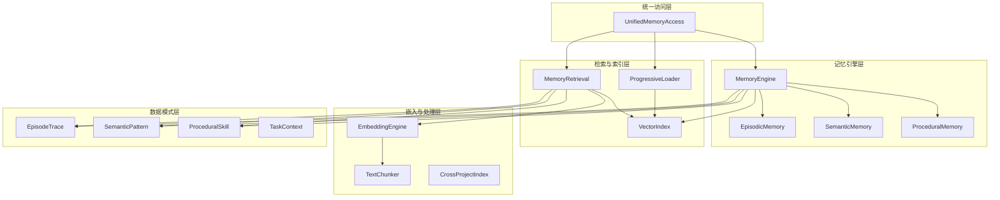

# Memory System 模块文档

## 概述

Memory System 是一个多类型、多层次的记忆管理系统，专为智能代理和自动化任务执行设计。它实现了情景记忆、语义记忆和程序记忆的统一管理，提供任务感知的检索、渐进式内容加载和跨项目知识索引功能。

### 设计理念

该模块基于认知科学原理，模拟人类记忆的三个核心类型：
- **情景记忆 (Episodic Memory)**: 记录具体的交互轨迹和任务执行过程
- **语义记忆 (Semantic Memory)**: 存储抽象化的模式和知识
- **程序记忆 (Procedural Memory)**: 保存可复用的技能和操作流程

这种分层设计使系统能够在不同抽象层次上管理知识，同时保持高效的检索和利用。

### 主要特性

- **任务感知检索**: 根据任务类型自动调整检索权重，提升性能 17%（基于 MemEvolve 研究）
- **渐进式内容加载**: 通过三层披露机制最小化 token 使用
- **多提供商嵌入支持**: 支持本地（sentence-transformers）、OpenAI 和 Cohere 嵌入
- **跨项目索引**: 自动发现和索引多个项目的记忆存储
- **向量化搜索**: 基于余弦相似度的高效语义搜索
- **命名空间隔离**: 支持项目级别的记忆隔离和继承

## 架构概览

Memory System 采用模块化架构，由以下核心组件组成：



### 组件关系说明

1. **统一访问层**: `UnifiedMemoryAccess` 作为所有组件的单一入口点，简化了记忆系统的使用
2. **记忆引擎层**: `MemoryEngine` 协调三个记忆类型的操作，提供生命周期管理
3. **检索与索引层**: 处理向量化搜索、渐进式加载和任务感知检索
4. **嵌入与处理层**: 管理文本嵌入、分块和跨项目索引
5. **数据模式层**: 定义所有记忆类型的数据结构和验证规则

## 核心功能模块

### 1. 记忆引擎 (Memory Engine)

记忆引擎是 Memory System 的核心协调器，负责管理所有记忆操作。它提供统一的接口来访问情景、语义和程序记忆。

**主要功能**:
- 初始化和维护记忆系统结构
- 存储和检索各种类型的记忆
- 管理记忆索引和时间线
- 清理旧的未引用记忆

详细信息请参考 [Memory Engine 子模块文档](Memory Engine.md)。

### 2. 统一访问层 (Unified Memory Access)

`UnifiedMemoryAccess` 提供了一个简化的接口，隐藏了记忆系统的复杂性，使其他组件能够轻松访问记忆功能。

**主要功能**:
- 获取与任务相关的上下文
- 记录交互和结果
- 生成基于上下文的建议
- 管理 token 预算

详细信息请参考 [Unified Access 子模块文档](Unified Access.md)。

### 3. 嵌入系统 (Embedding System)

嵌入系统负责生成文本的向量表示，支持多种提供商和分块策略。

**主要功能**:
- 多提供商嵌入生成（本地、OpenAI、Cohere）
- 文本分块策略（固定大小、句子、语义）
- 嵌入质量评分
- 缓存机制提升性能

详细信息请参考 [Embeddings 子模块文档](Embeddings.md)。

### 4. 检索系统 (Retrieval System)

检索系统提供任务感知的记忆检索，支持多种搜索策略和命名空间隔离。

**主要功能**:
- 任务类型自动检测
- 多策略检索（基于权重）
- 向量化和关键词搜索
- 跨命名空间检索
- Token 预算优化

详细信息请参考 [Retrieval 子模块文档](Retrieval.md)。

### 5. 渐进式加载器 (Progressive Loader)

渐进式加载器实现了三层披露算法，最小化 token 使用同时最大化相关性。

**加载层次**:
1. **索引层**: 加载主题摘要（约 100 tokens）
2. **时间线层**: 加载相关主题的近期上下文（约 500 tokens）
3. **完整层**: 仅在需要时加载完整记忆内容

详细信息请参考 [Progressive Loader 子模块文档](Progressive Loader.md)。

### 6. 向量索引 (Vector Index)

向量索引提供高效的相似度搜索功能，使用纯 numpy 实现，无需额外依赖。

**主要功能**:
- 向量添加、更新和删除
- 余弦相似度搜索
- 元数据过滤
- 磁盘持久化

详细信息请参考 [Vector Index 子模块文档](Vector Index.md)。

### 7. 跨项目索引 (Cross Project Index)

跨项目索引自动发现和索引多个项目的记忆存储，构建统一的跨项目知识索引。

**主要功能**:
- 自动发现包含 `.loki/memory/` 的项目
- 构建包含记忆统计的统一索引
- 支持自定义搜索目录

详细信息请参考 [Cross Project Index 子模块文档](Cross Project Index.md)。

## 数据模式

Memory System 使用定义明确的数据类来确保数据一致性和验证。

### 核心数据类型

1. **EpisodeTrace**: 表示完整的任务执行记录
2. **SemanticPattern**: 抽象化的知识模式
3. **ProceduralSkill**: 可复用的操作技能
4. **TaskContext**: 任务执行的上下文信息

详细信息请参考 [Schemas 子模块文档](Schemas.md)。

## 使用指南

### 基本使用

```python
from memory.unified_access import UnifiedMemoryAccess

# 初始化记忆系统
memory = UnifiedMemoryAccess(base_path=".loki/memory")
memory.initialize()

# 获取相关上下文
context = memory.get_relevant_context(
    task_type="implementation",
    query="构建 REST API",
    token_budget=4000
)

# 记录交互
memory.record_interaction(
    source="cli",
    action={"action": "read_file", "target": "api.py"}
)

# 获取建议
suggestions = memory.get_suggestions("实现身份验证")
```

### 配置选项

Memory System 支持多种配置方式：

1. **环境变量**:
   - `LOKI_EMBEDDING_PROVIDER`: 嵌入提供商 (local, openai, cohere)
   - `LOKI_EMBEDDING_MODEL`: 嵌入模型名称
   - `OPENAI_API_KEY`: OpenAI API 密钥
   - `COHERE_API_KEY`: Cohere API 密钥

2. **配置文件**:
   - `.loki/config/embeddings.json`: 嵌入系统配置

详细配置说明请参考各子模块文档。

## 与其他模块的集成

Memory System 设计为与系统的其他模块无缝集成：

- **API Server & Services**: 通过 `api.services.learning-collector.LearningCollector` 收集学习数据，详细信息请参考 [API Server & Services 模块文档](API Server & Services.md)
- **Dashboard Backend**: 提供记忆数据给仪表板展示，详细信息请参考 [Dashboard Backend 模块文档](Dashboard Backend.md)
- **Dashboard UI Components**: 通过 `LokiMemoryBrowser` 组件可视化记忆内容，详细信息请参考 [Dashboard UI Components 模块文档](Dashboard UI Components.md)
- **Swarm Multi-Agent**: 为多代理系统提供共享记忆，详细信息请参考 [Swarm Multi-Agent 模块文档](Swarm Multi-Agent.md)
- **Python SDK / TypeScript SDK**: 提供 SDK 访问接口，详细信息请参考 [Python SDK 模块文档](Python SDK.md) 和 [TypeScript SDK 模块文档](TypeScript SDK.md)

## 性能考虑

- **嵌入缓存**: 系统会缓存嵌入结果以避免重复计算
- **渐进式加载**: 仅在需要时加载完整记忆内容，显著减少 token 使用
- **向量化搜索**: 使用 numpy 实现高效的相似度计算
- **索引重建**: 支持增量更新和完全重建

## 限制与注意事项

- 本地嵌入需要 `sentence-transformers` 库（可选，有 TF-IDF 降级方案）
- 向量化搜索需要 `numpy` 库
- 大记忆集可能需要较多内存存储嵌入向量
- 跨项目索引仅扫描配置目录的直接子目录（深度=1）

## 未来扩展方向

- 支持更多嵌入提供商
- 实现记忆合并和摘要功能
- 添加记忆重要性衰减机制
- 支持分布式记忆存储
- 增强跨项目知识迁移能力
