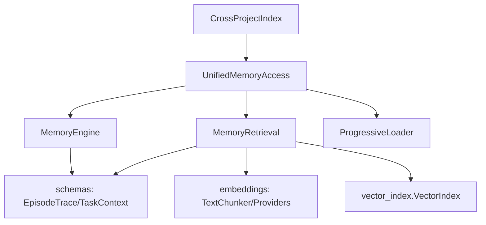

# Memory System

Memory System 可以把它想成「给智能体配的一套长期工作记忆中枢」：它不只是把历史日志存下来，而是把经历（episodic）、规律（semantic）和可复用做法（procedural）分开管理，并在需要时按任务类型、token 预算和上下文粒度动态取回。没有这层，代理每次都像“失忆重开”；有了这层，系统会越来越像“做过、总结过、还能复用”。

## 这个模块解决了什么问题（Why）

在代理系统里，常见痛点不是“信息太少”，而是“信息太多但拿不到对的那部分”：

- **只有原始轨迹，没有抽象知识**：日志很多，但难复用。
- **只有规则库，没有执行细节**：知道“应该怎么做”，但不知道过去在哪里踩过坑。
- **检索成本过高**：每次把全部记忆喂给模型，token 开销不可控。
- **项目隔离与共享冲突**：单项目知识很好用，但跨项目复用困难。

Memory System 的设计动机是：
1. 用三类记忆结构化沉淀知识；
2. 用任务感知检索提高命中率；
3. 用渐进式加载控制 token；
4. 用统一访问层把复杂性收敛给调用方。

---

## 心智模型（How it thinks）

可以把系统想成一个“三层图书馆 + 一个馆长”：

- `EpisodeTrace` / episodic：**监控录像**（发生了什么）
- `SemanticPattern`：**经验手册**（从多次经历抽象出的规律）
- `ProceduralSkill`：**SOP 流程卡**（下次怎么做）
- `UnifiedMemoryAccess`：**馆长前台**（你只说需求，内部去协调检索与预算）

而检索时不是“盲搜”，而是按任务类型（exploration / implementation / debugging / review / refactoring）动态加权。也就是说，同样的 query，在调试任务中会更偏 episodic + anti-pattern，在实现任务中会更偏 semantic + skills。

---

## 架构总览

### 架构叙事（数据与控制流）

**主链路：获取任务上下文**
1. 调用方进入 `UnifiedMemoryAccess.get_relevant_context(...)`。
2. 它组装 context，并调用 `MemoryRetrieval` 的分集合检索（episodic / semantic / skills）。
3. `MemoryRetrieval` 根据任务信号选择策略权重（`TASK_STRATEGIES`），并在“向量检索可用”与“关键词回退”之间切换。
4. 返回结果后，`UnifiedMemoryAccess` 逐项估算 token（`estimate_memory_tokens`）并做预算裁剪，最终组装 `MemoryContext`。

**写链路：记录一次执行经验**
1. `UnifiedMemoryAccess.record_episode(...)` 把 action dict 转成 `ActionEntry`。
2. 用 `EpisodeTrace.create(...)` 生成标准化 episode。
3. 通过 `MemoryEngine.store_episode(...)` 落盘到 `episodic/YYYY-MM-DD/task-<id>.json`。
4. `MemoryEngine` 同步更新 timeline（`_update_timeline_with_episode`），并在配置了 embedding 时可触发排队（当前 `_queue_for_embedding` 仍是占位实现）。

**三层加载链路：在预算内扩展上下文**
- `ProgressiveLoader.load_relevant_context(...)` 先读 IndexLayer，再读 TimelineLayer，最后仅对高相关 topic 拉 full memory。
- 这是一种“先目录、再摘要、后全文”的披露策略，避免一上来把完整记忆灌满上下文窗口。

---

## 关键设计决策与取舍（Tradeoffs）

### 1) 三类记忆并存，而不是单一文档库
- **选择**：episodic/semantic/procedural 分离。
- **收益**：检索与排序可以任务化；数据契约更清晰。
- **代价**：写入路径和索引维护更复杂（多文件、多格式）。

### 2) 检索层优先“可退化可运行”
- **选择**：`MemoryRetrieval` 同时支持 embedding+vector 与 keyword fallback。
- **收益**：依赖缺失或向量索引未构建时，系统仍可工作。
- **代价**：两套召回路径的行为一致性需要额外关注（评分尺度不完全一致）。

### 3) 渐进式加载优先 token 经济性
- **选择**：`ProgressiveLoader` 采用 1/2/3 层按需展开。
- **收益**：上下文成本可控，尤其对长会话与大记忆库更稳定。
- **代价**：启发式 `sufficient_context(...)` 可能误判“信息已足够”，导致召回不深。

### 4) Embedding provider 走“容错链”
- **选择**：`EmbeddingEngine` 支持 local/openai/cohere，并有 fallback。
- **收益**：线上可靠性高，依赖故障时可降级。
- **代价**：跨 provider 维度与质量差异带来排序漂移风险。

### 5) 存储层选择文件系统优先
- **选择**：核心实现围绕 JSON/Markdown + 目录结构。
- **收益**：可审计、可迁移、易调试。
- **代价**：并发写、超大规模检索、事务一致性不如数据库天然。

---

## 子模块导读（含链接）

### 1. 数据基础与契约
- 文档：[`memory_foundation_and_schemas.md`](memory_foundation_and_schemas.md)
- 覆盖：`memory.schemas.EpisodeTrace`, `memory.schemas.TaskContext`
- 重点：序列化字段形态、UTC 时间处理（`_to_utc_isoformat` / `_parse_utc_datetime`）与 `validate()` 约束。这部分是所有 IO、检索、展示的一致性底座。

### 2. 记忆引擎与包装器
- 文档：[`memory_engine_and_wrappers.md`](memory_engine_and_wrappers.md)
- 覆盖：`memory.engine.EpisodicMemory`, `memory.engine.SemanticMemory`, `memory.engine.ProceduralMemory`
- 重点：`MemoryEngine` 如何统一生命周期、索引、timeline 与三类记忆 API；wrapper 如何给上层提供窄接口，降低误用面。

### 3. 检索与渐进加载
- 文档：[`retrieval_and_progressive_loading.md`](retrieval_and_progressive_loading.md)
- 覆盖：`memory.retrieval.VectorIndex`（Protocol）, `memory.retrieval.MemoryStorageProtocol`, `memory.layers.loader.ProgressiveLoader`
- 重点：任务感知检索、协议解耦、预算优化与 progressive disclosure 的协作关系。

### 4. 嵌入与向量基础设施
- 文档：[`embedding_and_vector_infra.md`](embedding_and_vector_infra.md)
- 覆盖：`memory.embeddings.TextChunker`, `memory.embeddings.ChunkingStrategy`, `memory.embeddings.EmbeddingProvider`, `memory.vector_index.VectorIndex`
- 重点：分块策略、provider 容错、缓存命中、向量索引持久化与搜索复杂度。

### 5. 统一访问与跨项目索引
- 文档：[`unified_access_and_cross_project.md`](unified_access_and_cross_project.md)
- 覆盖：`memory.unified_access.UnifiedMemoryAccess`, `memory.cross_project.CrossProjectIndex`
- 重点：统一门面如何把“检索 + 预算 + 记录”一站式封装；跨项目索引如何发现 `.loki/memory` 并聚合统计。

---

## 跨模块依赖与系统耦合点

Memory System 在系统中的角色是“**知识中台 + 运行期检索服务**”，与以下模块形成明显耦合：

- 与 [API Server & Services](API Server & Services.md)：API 类型里有 `api.types.memory.*` 请求/响应契约（如 `RetrieveRequest`, `ConsolidateRequest`, `MemorySummary`），是 Memory 能力的服务化入口。
- 与 [Dashboard UI Components](Dashboard UI Components.md)：`LokiMemoryBrowser` / `LokiLearningDashboard` / `LokiPromptOptimizer` 消费记忆与学习数据，形成可视化反馈回路。
- 与 [Dashboard Backend](Dashboard Backend.md)：后端提供任务、运行、项目上下文，间接影响记忆记录与检索语境。
- 与 [State Management](State Management.md)：都依赖本地持久化和状态演进语义，尤其是会话期间的增量记录。
- 与 [Observability](Observability.md)：Memory 命中率、token 节省、fallback 次数属于关键运行指标。

> 注意：本模块大量依赖“数据格式契约稳定”。上游一旦改变 `context` 字段结构（例如 `goal/phase/files_involved`），检索质量会先退化，再表现为功能异常。

---

## 新贡献者最容易踩的坑（Watch-outs）

1. **时间格式混用**
   - `Z` / `+00:00` / naive datetime 都可能出现。
   - 任何新增序列化逻辑都应复用 schemas 的时间工具函数。

2. **task type 双份逻辑**
   - `engine.py` 和 `retrieval.py` 都有任务类型检测/策略常量。
   - 修改策略时请同步评估两处，避免行为分叉。

3. **VectorIndex 的维度契约**
   - `memory.vector_index.VectorIndex.add()` 会严格校验维度。
   - provider/model 切换后若维度变更，旧索引可能不可直接复用。

4. **ProgressiveLoader 的“足够上下文”是启发式**
   - `sufficient_context(...)` 不是语义证明，只是经验规则。
   - 对高风险任务，建议提高 layer3 触发概率或直接走 full retrieval。

5. **engine 中部分能力仍是占位**
   - `_vector_search` 与 `_queue_for_embedding` 目前是 placeholder/降级路径。
   - 扩展时应先定义明确异步队列与索引刷新策略，再接入生产链路。

6. **CrossProjectIndex 只做深度=1 扫描**
   - `discover_projects()` 只遍历 search_dir 的直接子目录。
   - 多层 monorepo 结构下可能漏检，需要显式扩展策略。

---

## 给高级工程师的落地建议

- 先从 `UnifiedMemoryAccess` 走一遍读写主路径，再下钻 `MemoryRetrieval` 的评分与预算逻辑。
- 做检索质量优化时，优先关注：task type 识别准确度、关键词/向量混合策略、importance/recency 权重。
- 做性能优化时，优先关注：embedding cache 命中率、vector index 构建时机、progressive loading 命中层级分布。

如果你只记住一句话：**Memory System 不是存储模块，而是“在 token 与相关性之间做实时决策的记忆编排器”。**
