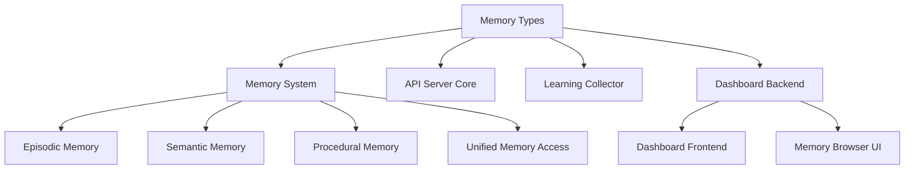

# Memory Types 模块文档

## 概述

Memory Types 模块是 Loki Mode 系统中内存系统的核心类型定义库，提供了完整的内存操作相关的数据结构和类型安全保障。该模块定义了内存检索、模式查询、时间线管理、学习建议等核心功能的数据结构，确保了内存系统各组件之间的数据交互一致性和可靠性。

该模块的设计目标是：
- 提供强类型支持，减少内存操作中的运行时错误
- 统一内存系统的数据结构定义，便于系统维护和扩展
- 为内存系统的客户端和服务端提供共同的类型契约
- 支持类型安全的内存查询、检索和管理操作

## 核心组件

### 查询参数类型

#### EpisodesQueryParams 接口

`EpisodesQueryParams` 定义了查询记忆片段（episodes）时的参数：

```typescript
interface EpisodesQueryParams {
  since?: string; // ISO date string
  limit?: number;
}
```

**字段说明：**
- `since`: 可选，ISO 格式的日期字符串，用于筛选指定时间之后的记忆片段
- `limit`: 可选，限制返回结果的数量

**使用场景：**
- 获取最近一段时间的操作记录
- 分页查询大量记忆片段
- 增量同步记忆数据

#### PatternsQueryParams 接口

`PatternsQueryParams` 定义了查询模式时的参数：

```typescript
interface PatternsQueryParams {
  category?: string;
  minConfidence?: number;
}
```

**字段说明：**
- `category`: 可选，模式分类，用于筛选特定类别的模式
- `minConfidence`: 可选，最小置信度，用于筛选置信度高于指定值的模式

**使用场景：**
- 按类别筛选学习到的模式
- 只获取高置信度的模式建议
- 针对特定领域的模式分析

### 请求类型

#### ConsolidateRequest 接口

`ConsolidateRequest` 定义了内存整合操作的请求参数：

```typescript
interface ConsolidateRequest {
  sinceHours?: number;
}
```

**字段说明：**
- `sinceHours`: 可选，指定整合过去多少小时内的记忆

**使用场景：**
- 定期整合最近的记忆，优化内存使用
- 针对特定时间段的记忆进行深度分析
- 在系统负载较低时执行记忆整合任务

#### RetrieveRequest 接口

`RetrieveRequest` 定义了内存检索操作的请求参数：

```typescript
interface RetrieveRequest {
  query: string;
  taskType?: string;
  topK?: number;
}
```

**字段说明：**
- `query`: 检索查询字符串，描述要查找的内容
- `taskType`: 可选，任务类型，用于针对性检索特定类型任务相关的记忆
- `topK`: 可选，返回最相关的前K个结果

**使用场景：**
- 基于自然语言查询相关记忆
- 针对特定任务类型检索相关经验
- 获取与当前上下文最相关的记忆片段

#### SuggestionsRequest 接口

`SuggestionsRequest` 定义了获取建议的请求参数：

```typescript
interface SuggestionsRequest {
  context: string;
  taskType?: string;
  limit?: number;
}
```

**字段说明：**
- `context`: 上下文信息，描述当前的场景或问题
- `taskType`: 可选，任务类型，用于获取特定类型任务的建议
- `limit`: 可选，限制返回建议的数量

**使用场景：**
- 根据当前上下文获取操作建议
- 为特定类型的任务获取最佳实践建议
- 在决策点获取多个可选方案

#### LearningSuggestionsRequest 接口

`LearningSuggestionsRequest` 定义了获取学习建议的请求参数：

```typescript
interface LearningSuggestionsRequest {
  context?: string;
  taskType?: string;
  types?: LearningSuggestionType[];
  limit?: number;
  minConfidence?: number;
}
```

**字段说明：**
- `context`: 可选，上下文信息
- `taskType`: 可选，任务类型
- `types`: 可选，学习建议类型数组，用于指定需要哪些类型的建议
- `limit`: 可选，限制返回建议的数量
- `minConfidence`: 可选，最小置信度阈值

**使用场景：**
- 获取多样化的学习建议（模式、反模式、技能等）
- 针对特定任务类型的学习建议
- 只获取高置信度的学习建议

### 数据层类型

#### IndexLayer 接口

`IndexLayer` 表示内存系统的索引层信息：

```typescript
interface IndexLayer {
  version: string;
  lastUpdated: string;
  topics: TopicEntry[];
  totalMemories: number;
  totalTokensAvailable: number;
}
```

**字段说明：**
- `version`: 索引层的版本号
- `lastUpdated`: 最后更新时间，ISO 格式字符串
- `topics`: 主题条目数组，包含索引的主题信息
- `totalMemories`: 总记忆数量
- `totalTokensAvailable`: 可用的总令牌数

**使用场景：**
- 监控内存系统的索引状态
- 了解内存系统的总体规模
- 版本管理和增量更新

#### TimelineLayer 接口

`TimelineLayer` 表示内存系统的时间线层信息：

```typescript
interface TimelineLayer {
  version: string;
  lastUpdated: string;
  recentActions: TimelineAction[];
  keyDecisions: string[];
  activeContext: {
    currentFocus: string | null;
    blockedBy: string[];
    nextUp: string[];
  };
}
```

**字段说明：**
- `version`: 时间线层的版本号
- `lastUpdated`: 最后更新时间，ISO 格式字符串
- `recentActions`: 最近的操作数组
- `keyDecisions`: 关键决策数组
- `activeContext`: 活跃上下文信息
  - `currentFocus`: 当前焦点，可为 null
  - `blockedBy`: 阻碍因素数组
  - `nextUp`: 接下来要处理的事项数组

**使用场景：**
- 跟踪项目的进展和决策历史
- 了解当前的工作焦点和阻碍
- 规划下一步的行动

#### MemorySummary 接口

`MemorySummary` 提供了内存系统的概要信息：

```typescript
interface MemorySummary {
  episodic: {
    count: number;
    latestDate: string | null;
  };
  semantic: {
    patterns: number;
    antiPatterns: number;
  };
  procedural: {
    skills: number;
  };
  tokenEconomics: TokenMetrics | null;
}
```

**字段说明：**
- `episodic`: 情景记忆概要
  - `count`: 情景记忆数量
  - `latestDate`: 最新记忆的日期，可为 null
- `semantic`: 语义记忆概要
  - `patterns`: 模式数量
  - `antiPatterns`: 反模式数量
- `procedural`: 过程记忆概要
  - `skills`: 技能数量
- `tokenEconomics`: 令牌经济学指标，可为 null

**使用场景：**
- 快速了解内存系统的整体状态
- 监控各类记忆的增长趋势
- 评估系统的学习进度和知识积累

## 架构关系

Memory Types 模块在内存系统架构中处于核心位置，为多个关键模块提供类型支持：



**关系说明：**
- Memory System 使用这些类型定义内存操作接口
- API Server Core 通过这些类型暴露内存管理 API
- Learning Collector 使用这些类型记录和分析学习数据
- Dashboard Backend 利用这些类型提供内存状态的可视化
- 各种记忆类型（情景、语义、过程）都基于这些核心类型构建

## 与其他模块的交互

### 与 Memory System 的交互

Memory Types 为 [Memory System](Memory System.md) 提供了核心的数据结构定义，包括：

- 查询参数类型，用于标准化内存查询接口
- 内存层表示，用于结构化地组织和访问内存数据
- 摘要信息类型，用于高效地获取内存系统状态

这种设计使得 Memory System 可以提供一致、类型安全的接口，同时保持内部实现的灵活性。

### 与 API Server 的交互

Memory Types 与 [API Types](API Types.md) 模块紧密协作，共同构成了系统的 API 层类型系统：

- Memory Types 专注于内存操作相关的类型定义
- API Types 提供通用的 API 请求响应类型
- 两者结合使用，确保了内存操作 API 的类型安全

### 与 Dashboard 的交互

Dashboard Backend 和 Frontend 使用 Memory Types 来：

- 展示内存系统的状态和统计信息
- 提供内存浏览和查询界面
- 可视化学习进度和模式发现

## 使用示例

### 基本查询操作

```typescript
import { 
  EpisodesQueryParams, 
  PatternsQueryParams,
  RetrieveRequest,
  SuggestionsRequest 
} from 'api/types/memory';

// 查询最近的记忆片段
const episodesQuery: EpisodesQueryParams = {
  since: new Date(Date.now() - 7 * 24 * 60 * 60 * 1000).toISOString(), // 最近7天
  limit: 50
};

// 查询高置信度的模式
const patternsQuery: PatternsQueryParams = {
  category: 'development',
  minConfidence: 0.8
};

// 检索相关记忆
const retrieveRequest: RetrieveRequest = {
  query: 'How to implement user authentication?',
  taskType: 'development',
  topK: 5
};

// 获取操作建议
const suggestionsRequest: SuggestionsRequest = {
  context: 'Implementing a new REST API endpoint',
  taskType: 'development',
  limit: 3
};
```

### 内存整合和学习

```typescript
import { 
  ConsolidateRequest, 
  LearningSuggestionsRequest,
  MemorySummary 
} from 'api/types/memory';

// 整合最近24小时的记忆
const consolidateRequest: ConsolidateRequest = {
  sinceHours: 24
};

// 获取多样化的学习建议
const learningSuggestionsRequest: LearningSuggestionsRequest = {
  context: 'Working on database optimization',
  taskType: 'optimization',
  types: ['pattern', 'skill', 'improvement'],
  limit: 5,
  minConfidence: 0.7
};

// 分析内存摘要
const analyzeMemorySummary = (summary: MemorySummary) => {
  console.log(`Episodic memories: ${summary.episodic.count}`);
  console.log(`Patterns learned: ${summary.semantic.patterns}`);
  console.log(`Anti-patterns identified: ${summary.semantic.antiPatterns}`);
  console.log(`Skills acquired: ${summary.procedural.skills}`);
  
  if (summary.episodic.latestDate) {
    console.log(`Latest memory: ${summary.episodic.latestDate}`);
  }
  
  if (summary.tokenEconomics) {
    console.log(`Token metrics available`);
  }
};
```

### 时间线和索引管理

```typescript
import { TimelineLayer, IndexLayer } from 'api/types/memory';

// 分析时间线状态
const analyzeTimeline = (timeline: TimelineLayer) => {
  console.log(`Timeline version: ${timeline.version}`);
  console.log(`Last updated: ${timeline.lastUpdated}`);
  
  if (timeline.activeContext.currentFocus) {
    console.log(`Current focus: ${timeline.activeContext.currentFocus}`);
  }
  
  if (timeline.activeContext.blockedBy.length > 0) {
    console.log(`Blocked by: ${timeline.activeContext.blockedBy.join(', ')}`);
  }
  
  if (timeline.activeContext.nextUp.length > 0) {
    console.log(`Next up: ${timeline.activeContext.nextUp.join(', ')}`);
  }
  
  console.log(`Recent actions: ${timeline.recentActions.length}`);
  console.log(`Key decisions: ${timeline.keyDecisions.length}`);
};

// 分析索引状态
const analyzeIndex = (index: IndexLayer) => {
  console.log(`Index version: ${index.version}`);
  console.log(`Last updated: ${index.lastUpdated}`);
  console.log(`Total memories: ${index.totalMemories}`);
  console.log(`Total tokens available: ${index.totalTokensAvailable}`);
  console.log(`Topics: ${index.topics.length}`);
  
  // 可以进一步分析主题分布等
};
```

## 注意事项与最佳实践

### 内存查询效率

1. **合理使用 limit 参数**：始终为查询操作设置合理的 limit 值，避免返回过多结果导致性能问题。

2. **时间范围筛选**：对于情景记忆查询，尽可能使用 since 参数限制时间范围，减少需要处理的数据量。

3. **置信度筛选**：对于模式查询，使用适当的 minConfidence 值可以过滤掉低质量的结果，提高相关性。

### 内存整合策略

1. **定期整合**：建议定期执行记忆整合操作，但要避免在系统高峰期执行。

2. **增量整合**：对于大型系统，可以考虑使用增量整合策略，先整合近期的记忆，再逐步处理 older 的记忆。

3. **监控资源使用**：记忆整合可能消耗较多资源，应监控系统资源使用情况，必要时调整整合策略。

### 类型安全

1. **始终使用类型注解**：在使用这些类型时，确保变量有正确的类型注解。

2. **验证输入参数**：在接收外部输入时，验证参数的有效性和类型正确性。

3. **处理可选字段**：注意处理可选字段可能为 undefined 或 null 的情况。

### 时间处理

1. **ISO 8601 格式**：所有时间字段都使用 ISO 8601 格式字符串，在处理时应使用适当的日期库进行解析和格式化。

2. **时区一致性**：确保在整个系统中使用一致的时区处理，建议使用 UTC 时间。

## 扩展指南

### 添加新的查询参数类型

如需添加新的查询参数类型，按照以下步骤操作：

1. 定义新的接口：

```typescript
export interface NewQueryParams {
  // 添加必要的字段
  field1: string;
  field2?: number;
}
```

2. 更新相关文档，说明新类型的用途和字段含义。

3. 在使用查询的代码中添加对新类型的支持。

### 扩展内存摘要信息

如需扩展 MemorySummary，添加新的记忆类型或统计信息：

1. 更新 MemorySummary 接口：

```typescript
export interface MemorySummary {
  // 现有字段...
  newMemoryType: {
    metric1: number;
    metric2: string | null;
  };
}
```

2. 更新生成内存摘要的代码，添加新类型的统计逻辑。

3. 更新相关文档和使用示例。

## 相关模块

- [Memory System](Memory System.md) - 内存系统的核心实现
- [API Types](API Types.md) - 通用 API 类型定义
- [API Server Core](API Server Core.md) - API 服务器核心功能
- [Learning Collector](Learning Collector.md) - 学习数据收集器
- [Dashboard Backend](Dashboard Backend.md) - 仪表板后端服务
