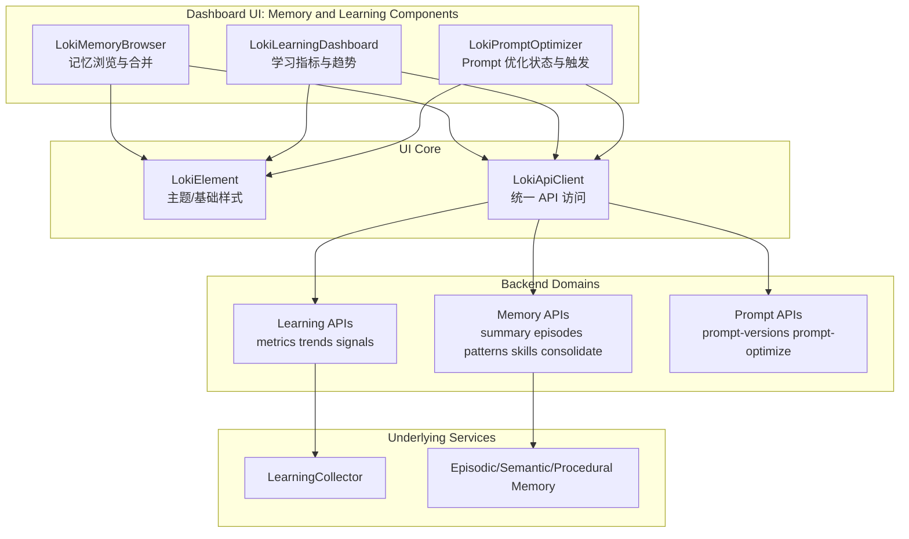
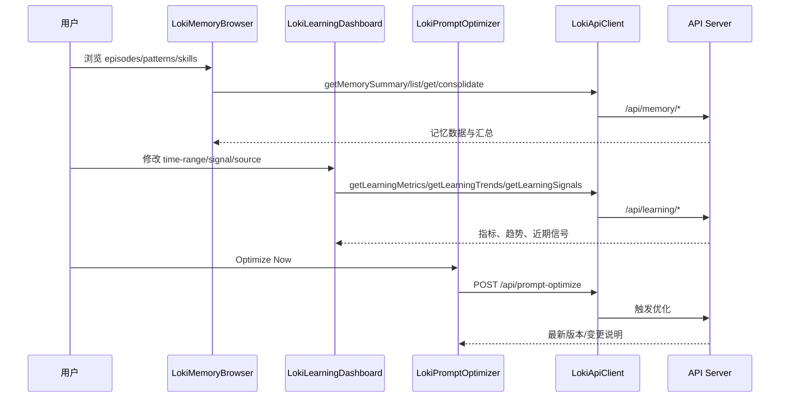

# Memory and Learning Components 模块文档

## 1. 模块定位与设计动机

`Memory and Learning Components` 是 Dashboard UI Components 中面向“记忆可视化 + 学习洞察 + 提示词优化执行”这一闭环的前端模块。它由三个 Web Components 组成：`LokiMemoryBrowser`、`LokiLearningDashboard`、`LokiPromptOptimizer`。三者分别覆盖**记忆内容层**、**学习信号层**与**策略落地层**，共同回答运维和开发最关心的问题：系统记住了什么、学到了什么、以及这些学习是否真的转化为更好的 Prompt 行为。

该模块存在的核心价值，不是单纯展示数据，而是把多个后端域（Memory System、API Learning Services、Prompt Optimization）映射到统一的可操作 UI 体验。相比“每个后端接口单独调试”的方式，这种聚合式组件化设计显著降低了认知成本，也让团队可以在不改动后端引擎的前提下快速演进可视化与交互。

从系统架构视角，它位于 `Dashboard UI Components -> Memory and Learning Components`，上接 Dashboard 页面和前端 wrappers，下接 `LokiApiClient`，再经 API Server 访问 Memory System 与 Learning Collector 相关能力（如 `api.services.learning-collector.LearningCollector`、`api.types.memory.*` 契约，以及 `memory.engine.EpisodicMemory / SemanticMemory / ProceduralMemory`）。

---

## 2. 架构总览



这张图说明了模块的三个关键分层：第一层是组件交互层，第二层是通用 UI 基础设施（主题与 API 客户端），第三层是后端能力域。组件本身不实现记忆/学习算法，而是承担“领域状态可视化 + 交互触发器”的角色，这让前后端边界清晰，适合多团队并行开发。

---

## 3. 组件协作与数据流



在实际运行中，三个组件通常并列出现：`LokiMemoryBrowser` 提供“事实层”记忆内容，`LokiLearningDashboard` 提供“统计层”学习信号，`LokiPromptOptimizer` 提供“执行层”优化动作。运维排障时可以按这个顺序定位：先看记忆是否存在，再看学习是否形成模式，最后看 Prompt 是否落地更新。

---

## 4. 子模块说明（高层）

### 4.1 `LokiMemoryBrowser`

`LokiMemoryBrowser`（`<loki-memory-browser>`）是记忆系统的主浏览器组件，采用 tab + detail 面板模型展示 summary、episodes、patterns、skills，并提供手动 `Consolidate Memory` 入口。它强调“可探索性与可访问性”：支持键盘导航、ARIA 语义、选择事件派发，以及从列表到详情的焦点管理。

它直接依赖 memory 相关 API，并与 `api.types.memory.MemorySummary`、`ConsolidateRequest`、`EpisodesQueryParams`、`PatternsQueryParams` 等契约对应。后端语义上，它映射到 `EpisodicMemory / SemanticMemory / ProceduralMemory` 三类核心对象。

详细实现、方法级行为与边界条件见：
- [memory_browser.md](memory_browser.md)

### 4.2 `LokiLearningDashboard`

`LokiLearningDashboard`（`<loki-learning-dashboard>`）聚焦学习信号可观测性，支持时间范围、信号类型、来源三维过滤，并并行拉取 metrics/trends/signals，最终组合为摘要卡、趋势图、Top 列表与近期信号流。它通过 `filter-change` 和 `metric-select` 事件向外暴露可编排能力，适合父容器做联动分析或埋点。

该组件与 `LearningCollector` 的上游信号采集链路强相关：后端收集 `user_preference`、`error_pattern`、`success_pattern`、`tool_efficiency`、`context_relevance` 等信号后，聚合结果会在该组件中被可视化。

详细实现、数据结构推断与限制见：
- [learning_dashboard.md](learning_dashboard.md)

### 4.3 `LokiPromptOptimizer`

`LokiPromptOptimizer`（`<loki-prompt-optimizer>`）是学习闭环的执行端视图，展示当前 prompt 版本、上次优化时间、失败样本分析规模和变更 rationale，并提供手动优化按钮。组件采用 60 秒轮询机制读取 `/api/prompt-versions`，并通过 `/api/prompt-optimize?dry_run=false` 触发真实优化流程。

它的设计重点是“低耦合运维可控”：即使没有复杂实时通道，也能通过轻量轮询让团队持续看到优化进展。

详细实现、轮询流程、错误处理与已知风险见：
- [prompt_optimizer.md](prompt_optimizer.md)

---

## 5. 与其他模块的边界与引用

为避免重复，本文件不展开以下模块内部细节，请按需查看：

- 主题与基类机制： [Core Theme.md](Core%20Theme.md), [Unified Styles.md](Unified%20Styles.md)
- API 客户端与传输细节： [API 客户端.md](API%20客户端.md)
- Memory 引擎与索引体系： [Memory System.md](Memory%20System.md), [Memory Engine.md](Memory%20Engine.md)
- API 类型契约（包含 `api.types.memory.*`）： [api_type_contracts.md](api_type_contracts.md)
- Learning 采集服务： [Learning Collector.md](Learning%20Collector.md)
- Dashboard UI 全局上下文： [Dashboard UI Components.md](Dashboard%20UI%20Components.md)

---

## 6. 使用与集成建议

在页面中并排集成这三个组件是最常见模式：

```html
<loki-memory-browser api-url="http://localhost:57374" tab="summary"></loki-memory-browser>
<loki-learning-dashboard api-url="http://localhost:57374" time-range="7d"></loki-learning-dashboard>
<loki-prompt-optimizer api-url="http://localhost:57374"></loki-prompt-optimizer>
```

建议统一传入同一个 `api-url`，并由父容器集中监听关键事件（如 `episode-select`、`filter-change`、`metric-select`）进行日志、联动或路由跳转。若你的宿主是 wrapper/webview，也应确保 `window.location.origin` 回退策略符合部署路径。

---

## 7. 运行风险、边界情况与维护提示

该模块整体稳健，但在生产维护中建议重点关注以下问题：

1. **局部失败静默降级**：多个子组件都倾向“失败回退为空数据”，用户看到的可能是空态而非明确错误。
2. **重复请求风险**：筛选属性变化与内部状态更新可能在特定场景触发重复加载。
3. **轮询时效性限制**：Prompt 优化信息是 60 秒粒度，不适合强实时监控诉求。
4. **大列表性能**：组件普遍采用 `innerHTML` 全量重绘，极端数据量下需关注重绘与事件重绑成本。
5. **类型兼容依赖后端字段稳定**：部分详情渲染是鸭子类型分支，后端字段变化会影响展示。

维护时可采用“接口可用性 -> 数据契约 -> 组件渲染分支 -> 交互事件”四步排查法。

---

## 9. 子模块文档索引（维护入口）

以下三个子模块文档为本模块的详细实现说明，已与本主文档形成双向引用，建议按“记忆浏览 -> 学习分析 -> 提示优化执行”顺序阅读：

为便于按职责维护，本模块拆分文档如下，建议与本文件配合阅读：

- [memory_browser.md](memory_browser.md)：记忆浏览组件，覆盖 summary/episodes/patterns/skills 展示、详情面板、键盘可访问性与 consolidation 触发。
- [learning_dashboard.md](learning_dashboard.md)：学习指标看板，覆盖过滤器、并行拉取、趋势图渲染、聚合列表与信号流交互。
- [prompt_optimizer.md](prompt_optimizer.md)：提示词优化组件，覆盖轮询机制、手动优化触发、变更展开与错误退化路径。
