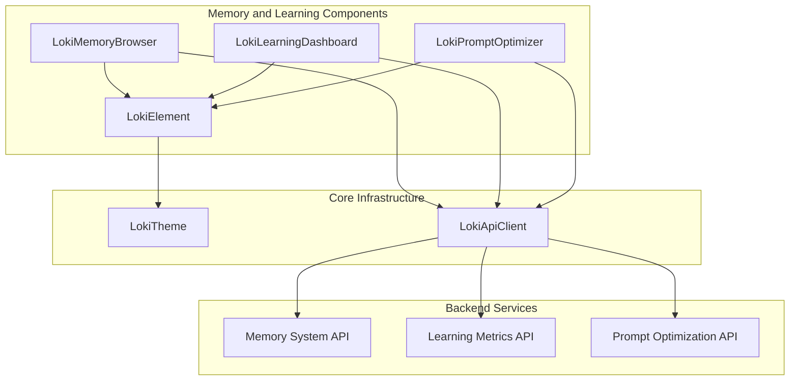

# Memory and Learning Components 模块文档

## 1. 模块概述

Memory and Learning Components模块是Dashboard UI Components系统中的核心组件集合，专门用于可视化和管理Loki Mode的记忆系统与学习功能。该模块提供了三个主要的Web组件，允许用户浏览记忆内容、监控学习指标和优化提示词，为AI系统的记忆和学习能力提供直观的用户界面。

### 1.1 设计理念

该模块的设计遵循以下核心理念：
- **模块化组件设计**：每个组件专注于特定功能，便于独立使用和组合
- **实时数据更新**：通过API轮询和事件驱动机制确保数据实时性
- **可访问性优先**：全面支持键盘导航和ARIA属性，确保无障碍访问
- **主题一致性**：与Loki设计系统深度集成，支持明暗主题切换

### 1.2 主要功能

该模块提供以下核心功能：
- 多类型记忆内容浏览（片段、模式、技能）
- 学习指标可视化与分析
- 提示词优化状态监控与手动触发
- 记忆合并与管理操作
- 详细信息面板与交互式数据展示

## 2. 架构概览

Memory and Learning Components模块采用独立组件架构，每个组件通过API客户端与后端服务交互，同时共享核心的主题系统和工具函数。



### 2.1 组件关系说明

1. **基础层**：所有组件都继承自`LokiElement`，提供统一的主题支持和基础功能
2. **API层**：通过共享的`LokiApiClient`与后端服务通信
3. **组件层**：三个独立组件分别负责不同功能领域，彼此之间无直接依赖
4. **服务层**：后端提供记忆系统、学习指标和提示词优化的API接口

## 3. 核心组件详解

Memory and Learning Components模块包含三个核心组件，每个组件都有详细的独立文档。以下是这些组件的简要概述，更多详细信息请参考各自的文档。

### 3.1 LokiMemoryBrowser

`LokiMemoryBrowser`是一个标签页式浏览器组件，用于浏览Loki Mode记忆系统的三个主要层次：情景记忆、语义记忆和程序记忆。

#### 主要功能
- 记忆系统摘要概览
- 情景记忆（Episodes）浏览与详情查看
- 模式记忆（Patterns）浏览与详情查看
- 技能记忆（Skills）浏览与详情查看
- 记忆合并操作
- Token经济学统计

#### 关键属性
- `api-url`: API基础URL（默认：window.location.origin）
- `theme`: 主题设置（'light'或'dark'，默认：自动检测）
- `tab`: 初始活动标签页（'summary'|'episodes'|'patterns'|'skills'）

#### 事件
- `episode-select`: 当点击情景记忆项时触发
- `pattern-select`: 当点击模式记忆项时触发
- `skill-select`: 当点击技能记忆项时触发

**详细信息请参考**: [LokiMemoryBrowser 组件文档](LokiMemoryBrowser.md)

### 3.2 LokiLearningDashboard

`LokiLearningDashboard`组件可视化跨工具学习系统的学习指标，展示信号摘要、趋势图表、模式/偏好/工具效率列表以及最近的信号活动。

#### 主要功能
- 学习信号摘要统计
- 信号量趋势图表
- 用户偏好、错误模式、成功模式和工具效率的排序列表
- 最近信号活动流
- 多维度过滤（时间范围、信号类型、来源）

#### 关键属性
- `api-url`: API基础URL（默认：window.location.origin）
- `theme`: 主题设置（'light'或'dark'，默认：自动检测）
- `time-range`: 时间范围过滤器（'1h'|'24h'|'7d'|'30d'，默认：'7d'）
- `signal-type`: 信号类型过滤器（默认：'all'）
- `source`: 信号来源过滤器（默认：'all'）

#### 事件
- `metric-select`: 当点击指标列表项时触发
- `filter-change`: 当任何过滤器下拉值变化时触发

**详细信息请参考**: [LokiLearningDashboard 组件文档](LokiLearningDashboard.md)

### 3.3 LokiPromptOptimizer

`LokiPromptOptimizer`组件显示提示词优化状态，包括当前版本、上次优化时间、分析的失败次数以及带有理由的更改。

#### 主要功能
- 提示词版本信息显示
- 优化历史记录
- 更改详情与理由展示
- 手动触发优化操作
- 自动轮询更新（每60秒）

#### 关键属性
- `api-url`: API基础URL（默认：window.location.origin）
- `theme`: 主题设置（'light'或'dark'，默认：自动检测）

**详细信息请参考**: [LokiPromptOptimizer 组件文档](LokiPromptOptimizer.md)

## 4. 技术实现细节

### 4.1 组件生命周期

所有组件都遵循标准的Web Components生命周期：

1. **constructor()**: 初始化组件状态和默认值
2. **connectedCallback()**: 组件添加到DOM时调用，设置API连接和初始数据加载
3. **attributeChangedCallback()**: 监听属性变化并响应
4. **disconnectedCallback()**: 组件从DOM移除时调用，清理资源（如定时器）

### 4.2 数据管理策略

- **状态隔离**: 每个组件维护自己的内部状态，不与其他组件共享
- **错误处理**: 全面的错误捕获和用户友好的错误显示
- **加载状态**: 明确的加载指示，提升用户体验
- **数据缓存**: 组件级别的数据缓存，减少不必要的API调用

### 4.3 可访问性实现

- **键盘导航**: 全面支持Tab键导航、方向键和Enter/Space键操作
- **ARIA属性**: 适当的role、aria-label、aria-selected等属性
- **焦点管理**: 合理的焦点处理和焦点恢复机制
- **语义化HTML**: 使用合适的HTML元素构建界面结构

## 5. 使用指南

### 5.1 基本使用

所有组件都可以作为自定义元素直接在HTML中使用：

```html
<!DOCTYPE html>
<html>
<head>
  <title>Memory and Learning Components Demo</title>
  <!-- 引入组件库 -->
  <script type="module" src="dashboard-ui/components/loki-memory-browser.js"></script>
  <script type="module" src="dashboard-ui/components/loki-learning-dashboard.js"></script>
  <script type="module" src="dashboard-ui/components/loki-prompt-optimizer.js"></script>
</head>
<body>
  <!-- 使用记忆浏览器 -->
  <loki-memory-browser api-url="http://localhost:57374"></loki-memory-browser>
  
  <!-- 使用学习仪表盘 -->
  <loki-learning-dashboard api-url="http://localhost:57374" time-range="24h"></loki-learning-dashboard>
  
  <!-- 使用提示词优化器 -->
  <loki-prompt-optimizer api-url="http://localhost:57374"></loki-prompt-optimizer>
</body>
</html>
```

### 5.2 事件监听

组件触发的自定义事件可以通过标准的addEventListener方法监听：

```javascript
const memoryBrowser = document.querySelector('loki-memory-browser');
memoryBrowser.addEventListener('episode-select', (event) => {
  console.log('Selected episode:', event.detail);
  // 处理选中的情景记忆
});

const learningDashboard = document.querySelector('loki-learning-dashboard');
learningDashboard.addEventListener('filter-change', (event) => {
  console.log('Filters changed:', event.detail);
  // 响应过滤器变化
});
```

### 5.3 配置与自定义

#### 主题配置

组件支持通过`theme`属性设置主题，也可以通过CSS变量自定义主题：

```css
:root {
  --loki-bg-card: #ffffff;
  --loki-bg-secondary: #f5f5f5;
  --loki-accent: #3b82f6;
  /* 更多主题变量... */
}
```

#### API客户端配置

组件内部使用共享的API客户端，可以通过`api-url`属性配置基础URL：

```html
<loki-memory-browser api-url="https://api.example.com"></loki-memory-browser>
```

## 6. 注意事项与限制

### 6.1 浏览器兼容性

- 组件基于Web Components标准构建，需要现代浏览器支持
- 推荐使用Chrome 67+, Firefox 63+, Safari 10.1+, Edge 79+
- 不支持IE11及更早版本

### 6.2 API依赖

- 组件需要后端提供相应的API接口才能正常工作
- API端点不可用时会显示错误状态，但不会导致页面崩溃
- 网络请求失败时有适当的错误处理和用户提示

### 6.3 性能考虑

- 大量数据加载时可能会有延迟，组件提供了加载状态指示
- 提示词优化器每60秒轮询一次API，在大量使用时可能产生网络流量
- 建议在生产环境中实现适当的缓存策略

### 6.4 安全注意事项

- 组件不会存储或传输敏感信息，但会显示从API获取的数据
- 确保API连接使用HTTPS
- 组件对用户输入进行了HTML转义，防止XSS攻击

## 7. 相关模块

- [Dashboard UI Components](Dashboard UI Components.md) - 了解更多UI组件和核心主题系统
- [Memory System](Memory System.md) - 了解后端记忆系统的实现细节
- [Dashboard Frontend](Dashboard Frontend.md) - 了解前端集成和API客户端

## 8. 总结

Memory and Learning Components模块为Loki Mode的记忆和学习功能提供了强大而直观的用户界面。通过三个专注的组件，用户可以轻松浏览记忆内容、监控学习进度和管理提示词优化。模块的设计注重可访问性、可扩展性和用户体验，是整个Dashboard UI Components系统中不可或缺的一部分。
