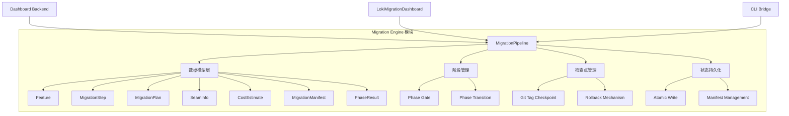
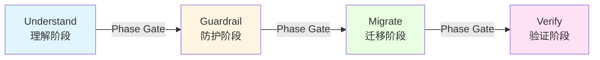
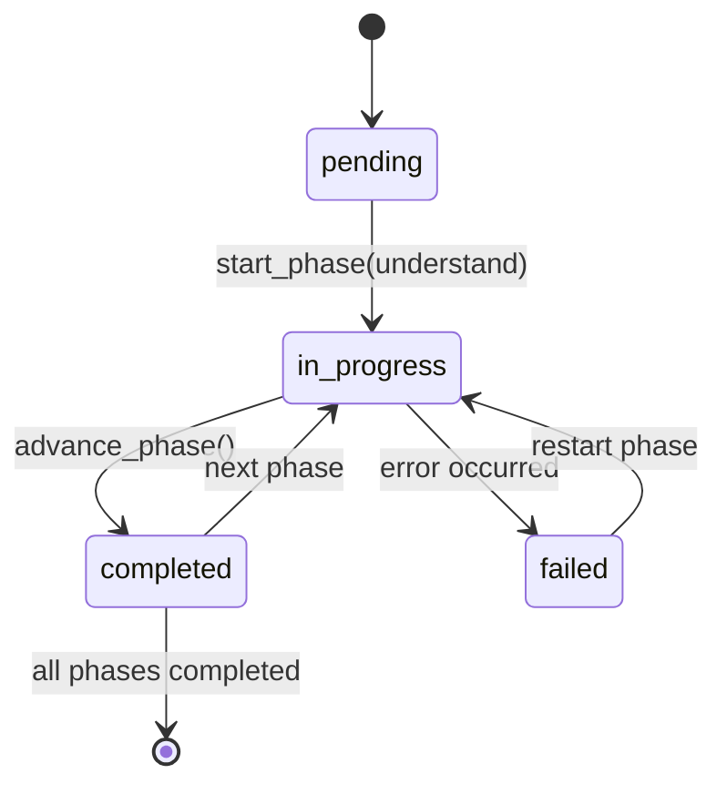

# Migration Engine 模块文档

## 概述

Migration Engine 是 Loki Mode 企业代码转换功能的核心后端实现，提供了安全、增量的代码库迁移能力。该模块通过多阶段管道设计，确保代码库迁移过程的可追溯性和可控性，支持检查点创建和回滚机制，为大型代码库重构和技术栈升级提供可靠保障。

## 核心功能

- **多阶段迁移管道**：实现 understand → guardrail → migrate → verify 的四阶段迁移流程
- **迁移计划管理**：生成、保存和执行详细的迁移步骤计划
- **特性跟踪与验证**：管理代码库特性列表及其验证状态
- **检查点与回滚**：基于 Git 标签实现迁移检查点，支持快速回滚
- **成本估算**：提供迁移过程的 Token 成本估算
- **状态持久化**：所有迁移状态安全地存储在文件系统中
- **线程安全操作**：确保在并发环境下的数据一致性

## 架构设计

### 模块关系图



Migration Engine 模块作为 Dashboard Backend 的子模块，为前端的 LokiMigrationDashboard 组件提供后端支持，同时也可以通过 CLI Bridge 被命令行工具直接调用。

## 核心组件详解

### 数据模型层

#### Feature

用于跟踪代码库中各个特性及其验证状态的数据模型。

```python
@dataclass
class Feature:
    """Individual feature tracked during migration."""
    id: str
    category: str = ""
    description: str = ""
    verification_steps: list[str] = field(default_factory=list)
    passes: bool = False
    characterization_test: str = ""
    risk: str = "low"
    notes: str = ""
```

**主要字段说明**：
- `id`：特性的唯一标识符
- `category`：特性所属的分类
- `verification_steps`：验证该特性所需的步骤列表
- `passes`：标识特性是否通过了验证
- `characterization_test`：特性测试代码
- `risk`：迁移该特性的风险级别（low/medium/high）

#### MigrationStep

表示迁移计划中的单个步骤。

```python
@dataclass
class MigrationStep:
    """Single step in a migration plan."""
    id: str
    description: str = ""
    type: str = ""  # e.g. "refactor", "rewrite", "config", "test"
    files: list[str] = field(default_factory=list)
    tests_required: list[str] = field(default_factory=list)
    estimated_tokens: int = 0
    risk: str = "low"
    rollback_point: bool = False
    depends_on: list[str] = field(default_factory=list)
    assigned_agent: str = ""
    status: str = "pending"  # pending | in_progress | completed | failed
```

**主要字段说明**：
- `type`：步骤类型，如 "refactor"、"rewrite"、"config"、"test"
- `files`：此步骤涉及的文件列表
- `estimated_tokens`：此步骤预计消耗的 Token 数量
- `rollback_point`：标识此步骤是否为回滚点
- `depends_on`：此步骤依赖的其他步骤 ID 列表
- `status`：步骤状态，包括 pending、in_progress、completed、failed

#### MigrationPlan

完整的迁移计划，包含策略和步骤。

```python
@dataclass
class MigrationPlan:
    """Full migration plan with strategy and steps."""
    version: int = 1
    strategy: str = "incremental"
    constraints: list[str] = field(default_factory=list)
    steps: list[MigrationStep] = field(default_factory=list)
    rollback_strategy: str = "checkpoint"
    exit_criteria: dict[str, Any] = field(default_factory=dict)
```

**主要字段说明**：
- `strategy`：迁移策略，默认为 "incremental"
- `constraints`：迁移过程中的约束条件列表
- `steps`：迁移步骤列表
- `rollback_strategy`：回滚策略，默认为 "checkpoint"
- `exit_criteria`：迁移完成的退出条件

#### SeamInfo

表示代码库中检测到的接口/边界点。

```python
@dataclass
class SeamInfo:
    """Detected seam (boundary/interface) in the codebase."""
    id: str
    description: str = ""
    type: str = ""  # e.g. "api", "module", "database", "config"
    location: str = ""
    name: str = ""
    priority: str = "medium"
    files: list[str] = field(default_factory=list)
    dependencies: list[str] = field(default_factory=list)
    complexity: str = ""
    confidence: float = 0.0
    suggested_interface: str = ""
```

**主要字段说明**：
- `type`：接口类型，如 "api"、"module"、"database"、"config"
- `priority`：处理优先级，如 "high"、"medium"、"low"
- `confidence`：检测置信度，范围 0.0 到 1.0
- `suggested_interface`：建议的接口定义

#### CostEstimate

迁移过程的 Token 成本估算。

```python
@dataclass
class CostEstimate:
    """Token cost estimation for migration."""
    total_tokens: int = 0
    estimated_cost_usd: float = 0.0
    by_phase: dict[str, int] = field(default_factory=dict)
```

**主要字段说明**：
- `total_tokens`：预计总 Token 消耗量
- `estimated_cost_usd`：预计的美元成本
- `by_phase`：按阶段细分的 Token 消耗估算

#### MigrationManifest

跟踪整体迁移状态的清单文件。

```python
@dataclass
class MigrationManifest:
    """Tracks overall migration state."""
    id: str = ""
    created_at: str = ""
    source_info: dict[str, Any] = field(default_factory=dict)
    target_info: dict[str, Any] = field(default_factory=dict)
    phases: dict[str, dict[str, Any]] = field(default_factory=dict)
    feature_list_path: str = ""
    migration_plan_path: str = ""
    checkpoints: list[str] = field(default_factory=list)
    status: str = "pending"
    progress_pct: int = 0
    updated_at: str = ""
    source_path: str = ""
```

#### PhaseResult

迁移阶段执行结果。

```python
@dataclass
class PhaseResult:
    """Result of executing a migration phase."""
    phase: str
    status: str  # pending | in_progress | completed | failed
    artifacts: list[str] = field(default_factory=list)
    started_at: str = ""
    completed_at: str = ""
    error: str = ""
```

### MigrationPipeline 类

MigrationPipeline 是 Migration Engine 的核心类，负责管理代码库迁移的整个生命周期。

```python
class MigrationPipeline:
    """Manages the lifecycle of a codebase migration.

    All state is persisted under ~/.loki/migrations/<migration_id>/.
    Thread-safe for concurrent manifest reads and writes.
    """
```

#### 初始化

```python
def __init__(
    self,
    codebase_path: str,
    target: str,
    options: Optional[dict[str, Any]] = None,
) -> None:
```

**参数说明**：
- `codebase_path`：要迁移的代码库路径
- `target`：迁移目标（如新语言、框架或版本）
- `options`：可选的迁移选项配置

#### 主要方法

##### 创建和加载迁移

```python
@classmethod
def load(cls, migration_id: str) -> 'MigrationPipeline':
    """Load an existing migration by ID."""
```

```python
def create_manifest(self) -> MigrationManifest:
    """Create the initial manifest.json for this migration."""
```

##### 阶段管理

```python
def get_phase_status(self, phase: str) -> str:
    """Return the status of a given phase from the manifest."""
```

```python
def start_phase(self, phase: str) -> None:
    """Start a phase (transition to in_progress)."""
```

```python
def check_phase_gate(self, from_phase: str, to_phase: str) -> tuple[bool, str]:
    """Validate whether transition from from_phase to to_phase is allowed."""
```

```python
def advance_phase(self, phase: str) -> PhaseResult:
    """Mark the current phase as complete and start the next one."""
```

##### 数据 CRUD 操作

```python
def load_features(self) -> list[Feature]:
    """Load features from features.json."""
```

```python
def save_features(self, features: list[Feature]) -> None:
    """Save features to features.json atomically."""
```

```python
def load_plan(self) -> MigrationPlan:
    """Load migration plan from migration-plan.json."""
```

```python
def save_plan(self, plan: MigrationPlan) -> None:
    """Save migration plan to migration-plan.json atomically."""
```

```python
def load_seams(self) -> list[SeamInfo]:
    """Load seams from seams.json."""
```

```python
def save_seams(self, seams: list[SeamInfo]) -> None:
    """Save seams to seams.json atomically."""
```

##### 检查点管理

```python
def create_checkpoint(self, step_id: str) -> str:
    """Create a git tag checkpoint for a migration step."""
```

```python
def rollback_to_checkpoint(self, step_id: str) -> None:
    """Reset the codebase to the checkpoint tag for a given step."""
```

##### 进度和摘要

```python
def get_progress(self) -> dict[str, Any]:
    """Return a progress summary of the migration."""
```

```python
def generate_plan_summary(self) -> str:
    """Generate a human-readable plan summary for --show-plan."""
```

## 迁移流程

### 四阶段迁移管道

Migration Engine 实现了一个四阶段的迁移管道，每个阶段都有明确的入口条件和出口条件。



#### Understand 阶段

此阶段的主要目标是理解代码库结构，识别代码库的特性、接口和依赖关系。

**入口条件**：无（迁移起始点）

**主要任务**：
- 分析代码库结构
- 识别代码特性
- 检测代码接口和边界
- 生成初始文档

**出口条件**（Phase Gate）：
- docs/ 目录下有生成的文档
- 存在 seams.json 文件

#### Guardrail 阶段

此阶段的主要目标是建立迁移的安全保障措施，包括特性测试和风险评估。

**入口条件**：通过 Understand → Guardrail 阶段门

**主要任务**：
- 为每个特性创建特性测试
- 验证特性测试在原始代码库上通过
- 评估迁移风险
- 准备迁移计划

**出口条件**（Phase Gate）：
- 存在 features.json 文件
- 所有特性的 passes 字段为 True
- 无失败的特性测试

#### Migrate 阶段

此阶段是实际执行代码转换的阶段。

**入口条件**：通过 Guardrail → Migrate 阶段门

**主要任务**：
- 执行迁移计划中的每个步骤
- 在关键步骤创建检查点
- 逐步转换代码库
- 监控迁移进度

**出口条件**（Phase Gate）：
- 存在 migration-plan.json 文件
- 所有迁移步骤状态为 completed

#### Verify 阶段

此阶段确保迁移后的代码库功能正确，符合预期。

**入口条件**：通过 Migrate → Verify 阶段门

**主要任务**：
- 运行所有特性测试
- 验证代码库功能
- 执行集成测试
- 生成迁移报告

**出口条件**：无（迁移完成点）

### 迁移状态流转



## 工作原理

### 目录结构

每个迁移实例都有独立的目录结构，位于 `~/.loki/migrations/<migration_id>/`：

```
~/.loki/migrations/
└── mig_20260223_143052_myproject/
    ├── manifest.json          # 迁移清单文件
    ├── features.json          # 特性列表
    ├── migration-plan.json    # 迁移计划
    ├── seams.json             # 接口信息
    ├── docs/                  # 文档目录
    └── checkpoints/           # 检查点元数据
        └── step1.json
```

### 线程安全机制

MigrationPipeline 使用 `threading.Lock` 来确保所有对 manifest.json 的读写操作都是线程安全的。关键操作（如保存和加载 manifest）都在锁的保护下执行，防止并发写入导致的数据损坏。

```python
def load_manifest(self) -> MigrationManifest:
    """Load manifest.json from disk."""
    with self._lock:
        return self._load_manifest_unlocked()

def save_manifest(self, manifest: MigrationManifest) -> None:
    """Persist manifest to disk atomically."""
    with self._lock:
        self._save_manifest_unlocked(manifest)
```

### 原子文件写入

为了确保数据的完整性，Migration Engine 使用原子写入机制。所有对 JSON 文件的写入操作都通过 `_atomic_write` 函数执行，该函数使用临时文件然后重命名的模式，避免写入过程中断导致的文件损坏。

```python
def _atomic_write(path: Path, content: str) -> None:
    """Write content to file atomically using temp-file-then-rename."""
    # 创建临时文件
    # 写入内容
    # 刷新到磁盘
    # 原子重命名
```

### Git 检查点机制

Migration Engine 使用 Git 标签作为检查点机制。当创建检查点时，会在当前代码库创建一个格式为 `loki-migrate/<step_id>/pre` 的 Git 标签，并将其记录在 manifest.json 中。

```python
def create_checkpoint(self, step_id: str) -> str:
    """Create a git tag checkpoint for a migration step."""
    tag_name = f"loki-migrate/{step_id}/pre"
    # 创建 Git 标签
    # 更新 manifest
    # 写入检查点元数据
```

## 使用指南

### 创建新迁移

```python
from dashboard.migration_engine import MigrationPipeline

# 创建新的迁移管道
pipeline = MigrationPipeline(
    codebase_path="/path/to/your/codebase",
    target="python3.10",  # 或任何迁移目标
    options={"source_type": "python"}
)

# 创建初始清单
manifest = pipeline.create_manifest()
```

### 加载现有迁移

```python
from dashboard.migration_engine import MigrationPipeline

# 通过迁移 ID 加载
pipeline = MigrationPipeline.load("mig_20260223_143052_myproject")
```

### 使用阶段管理

```python
# 开始理解阶段
pipeline.start_phase("understand")

# ... 执行理解阶段的任务 ...

# 检查是否可以进入下一阶段
allowed, reason = pipeline.check_phase_gate("understand", "guardrail")
if allowed:
    # 推进到下一阶段
    phase_result = pipeline.advance_phase("understand")
else:
    print(f"无法推进阶段: {reason}")
```

### 管理特性

```python
from dashboard.migration_engine import Feature

# 创建特性
feature = Feature(
    id="auth-flow",
    category="security",
    description="用户认证流程",
    verification_steps=["运行认证测试", "验证令牌生成"],
    passes=True,
    risk="medium"
)

# 保存特性
features = [feature]
pipeline.save_features(features)

# 加载特性
loaded_features = pipeline.load_features()
```

### 管理迁移计划

```python
from dashboard.migration_engine import MigrationPlan, MigrationStep

# 创建迁移步骤
step1 = MigrationStep(
    id="update-deps",
    description="更新依赖包版本",
    type="config",
    files=["requirements.txt"],
    estimated_tokens=100,
    risk="low",
    rollback_point=True
)

step2 = MigrationStep(
    id="refactor-auth",
    description="重构认证模块",
    type="refactor",
    files=["auth.py", "tokens.py"],
    depends_on=["update-deps"],
    estimated_tokens=5000,
    risk="medium"
)

# 创建迁移计划
plan = MigrationPlan(
    version=1,
    strategy="incremental",
    steps=[step1, step2],
    constraints=["不修改公共API", "保持向后兼容性"]
)

# 保存计划
pipeline.save_plan(plan)

# 加载计划
loaded_plan = pipeline.load_plan()
```

### 创建检查点和回滚

```python
# 创建检查点
tag_name = pipeline.create_checkpoint("refactor-auth")
print(f"创建检查点: {tag_name}")

# 如果需要回滚
pipeline.rollback_to_checkpoint("refactor-auth")
```

### 获取迁移进度

```python
progress = pipeline.get_progress()
print(f"迁移状态: {progress['status']}")
print(f"当前阶段: {progress['current_phase']}")
print(f"完成步骤: {progress['steps']['completed']}/{progress['steps']['total']}")
print(f"通过特性: {progress['features']['passing']}/{progress['features']['total']}")
```

### 生成计划摘要

```python
summary = pipeline.generate_plan_summary()
print(summary)
```

### 列出所有迁移

```python
from dashboard.migration_engine import list_migrations

migrations = list_migrations()
for migration in migrations:
    print(f"{migration['id']}: {migration['source']} → {migration['target']} ({migration['status']})")
```

### 使用单例模式

```python
from dashboard.migration_engine import get_migration_pipeline, reset_migration_pipeline

# 首次调用需要提供路径和目标
pipeline = get_migration_pipeline(
    codebase_path="/path/to/your/codebase",
    target="python3.10"
)

# 后续调用可以直接获取
same_pipeline = get_migration_pipeline()

# 重置单例（用于测试或新迁移会话）
reset_migration_pipeline()
```

## 集成与扩展

### 与 Dashboard 的集成

Migration Engine 模块作为 Dashboard Backend 的一部分，为前端的 `LokiMigrationDashboard` 组件提供后端支持。集成点主要通过 API 端点暴露以下功能：

- 迁移列表和状态
- 迁移创建和加载
- 阶段推进和状态检查
- 迁移计划查看和编辑
- 特性管理
- 进度监控

### 与 CLI 的集成

Migration Engine 也可以通过 `api.services.cli-bridge.CLIBridge` 被命令行工具直接调用，提供 `loki migrate` 系列命令。

### 扩展点

Migration Engine 设计了几个主要的扩展点：

1. **自定义阶段**：可以通过修改 `PHASE_ORDER` 常量添加或删除迁移阶段
2. **自定义阶段门**：可以在 `_check_phase_gate_unlocked` 方法中添加新的阶段门条件
3. **自定义数据模型**：可以扩展现有的数据模型类以添加额外字段
4. **自定义检查点策略**：可以修改 `create_checkpoint` 方法实现不同的检查点机制

## 注意事项和限制

### 前置条件

1. 代码库必须是 Git 仓库（用于检查点功能）
2. 必须有写入 `~/.loki/` 目录的权限
3. Git 必须在系统路径中可用

### 已知限制

1. **检查点限制**：检查点功能依赖于 Git，非 Git 仓库无法使用此功能
2. **目录名称限制**：代码库目录名称经过清理以确保迁移 ID 有效，但某些特殊字符仍可能导致问题
3. **并发限制**：虽然对 manifest 的访问是线程安全的，但对实际代码库文件的并发修改可能导致冲突
4. **存储空间**：每个迁移都可能占用大量磁盘空间，特别是对于大型代码库

### 错误处理

Migration Engine 使用标准的 Python 异常机制处理错误。主要异常类型包括：

- `ValueError`：无效参数
- `FileNotFoundError`：找不到必要文件
- `RuntimeError`：执行失败，如阶段门失败或 Git 操作失败
- `json.JSONDecodeError`：JSON 文件解析错误

### 最佳实践

1. **定期创建检查点**：在高风险操作前创建检查点
2. **验证阶段门**：在推进阶段前，先使用 `check_phase_gate` 验证条件
3. **监控进度**：定期调用 `get_progress` 监控迁移状态
4. **备份数据**：在开始大规模迁移前，先备份代码库和迁移数据
5. **测试迁移**：先在代码库的副本上测试迁移计划

## 相关模块

- [Dashboard Backend](Dashboard Backend.md)：Migration Engine 所属的父模块
- [Data Models](Data Models.md)：包含与迁移状态相关的数据模型
- [LokiMigrationDashboard](LokiMigrationDashboard.md)：使用 Migration Engine 的前端组件
- [CLI Bridge](CLI Bridge.md)：提供命令行接口访问 Migration Engine

## 总结

Migration Engine 模块提供了一个结构化、安全的代码库迁移框架，通过多阶段管道、检查点机制和详细的状态跟踪，大幅降低了大型代码库重构和技术栈升级的风险。其线程安全设计和原子操作确保了数据完整性，而灵活的 API 则使其可以轻松集成到各种前端和命令行工具中。
