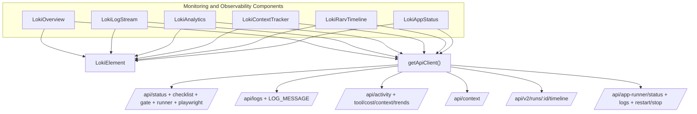

# Monitoring and Observability Components

如果把整个 Loki 系统比作一辆正在高速行驶、同时自动修复自己的赛车，这个模块就是驾驶舱里的“六联仪表”：它不负责让车跑起来（那是执行引擎的职责），而是负责让你**知道车现在跑得怎么样、哪里要爆、哪里已经爆了**，并且在部分场景下直接给你“急停/重启”按钮。

对新加入的高级工程师来说，最重要的认知是：该模块不是单一图表组件集合，而是一个“前端观测编排层”——把后端多个异构接口（状态、日志、上下文、成本、RARV阶段）汇总为可操作的运行态视图。

---

## 1. 为什么这个模块存在（问题空间）

在多代理/自治执行系统里，最难的问题往往不是“功能能不能跑”，而是：

- 会话卡住时，你不知道卡在 `Reason/Act/Reflect/Verify` 哪一段；
- 成本突增时，你不知道是上下文窗口膨胀、工具调用异常，还是某个 provider 模型失衡；
- 出现故障时，你要在日志、状态、任务、runner 控制之间来回切换，排障路径很长。

这个模块存在的根本目的：

1. **缩短故障定位路径**（Overview → 下钻到 AppStatus / LogStream / RARV）；
2. **把“资源信号”变成“可解释信号”**（ContextTracker + Analytics）；
3. **在 UI 层做弱耦合聚合**，避免后端必须先实现“一个超级观测 API”。

这也是为什么你会在代码中看到多个组件各自轮询、各自容错，而不是强制共享一个统一数据总线：它优先保证“任何一块可用就先显示”，而不是“全量一致后才展示”。

---

## 2. 心智模型：一个“观测塔台”，六个岗位

可以把本模块想象成机场塔台：

- `LokiOverview`：值班总屏（是否可飞、是否拥堵、是否被 gate 阻断）
- `LokiLogStream`：ATC 实时通话记录（逐条事件）
- `LokiAppStatus`：跑道与发动机状态 + 控制台（可 Restart/Stop）
- `LokiContextTracker`：燃料与载重表（context/token/cost）
- `LokiAnalytics`：历史运营分析（热力、工具效率、provider 对比）
- `LokiRarvTimeline`：一次飞行的阶段耗时剖面（RARV）

所有岗位都继承 `LokiElement`（统一主题、Shadow DOM、基础交互能力），并通过 `getApiClient()` 接入同一个 API 客户端实例。

---

## 3. 架构总览与数据流

### 3.1 关键端到端路径（按代码真实调用）

**路径 A：总览信号刷新（`LokiOverview`）**

1. `connectedCallback()` 中 `_setupApi()` 注册 `ApiEvents.STATUS_UPDATE / CONNECTED / DISCONNECTED`；
2. `_loadStatus()` 用 `Promise.allSettled` 并发拉取 `getStatus()`、`getChecklistSummary()`、`getAppRunnerStatus()`、`getPlaywrightResults()`、`getCouncilGate()`；
3. 状态成功时 `_updateFromStatus()` 合并到 `_data`，失败则降级为 `offline`；
4. 同时保留 5 秒轮询兜底。

> 设计意图：事件驱动保证“快”，轮询保证“稳”。

**路径 B：日志实时流（`LokiLogStream`）**

1. `_setupApi()` 监听 `ApiEvents.LOG_MESSAGE`，收到消息直接 `_addLog()`；
2. `_startLogPolling()` 根据 `log-file` 分支：
   - 有 `log-file`：`_pollLogFile()` 每秒抓文件并增量解析；
   - 无 `log-file`：`_pollApiLogs()` 每 2 秒拉 `getLogs(200)`；
3. `_addLog()` 后触发 `log-received` 事件、裁剪 `_maxLines`、按过滤器重绘。

> 设计意图：三路输入（事件 / API / 文件）提高部署兼容性。

**路径 C：上下文成本观测（`LokiContextTracker`）**

1. 每 5 秒 `_loadContext()` 请求 `/api/context`；
2. 数据进入 `_data` 后在 `gauge / timeline / breakdown` 三个 tab 转换；
3. timeline 会把 `compactions` 作为分隔标记呈现。

> 设计意图：同一份原始数据提供“当前风险 + 演进轨迹 + 结构归因”三种读法。

**路径 D：分析聚合（`LokiAnalytics`）**

1. `_loadData()` 用 `Promise.allSettled` 并行请求 `_fetchActivity()`、`getToolEfficiency(50)`、`getCost()`、`getContext()`、`getLearningTrends({timeRange})`；
2. 对异构返回做前端归一（例如 trends 兼容数组或 `dataPoints`）；
3. 前端计算热力图、工具排行、迭代速度、provider 对比。

> 设计意图：后端接口保持职责单一，聚合解释放在 UI 层。

---

## 4. 非显而易见的设计选择与权衡

### 4.1 `Promise.allSettled` 而不是 `Promise.all`

在 `LokiOverview`、`LokiAnalytics` 中都选了 `allSettled`。这是典型的**可用性优先**：某个接口挂了，不阻断整屏展示。

- 优点：观测面板“部分可用”；
- 代价：数据时间点可能不完全一致（弱一致性）。

### 4.2 事件 + 轮询双通道

`LokiOverview` 和 `LokiLogStream` 都是“推 + 拉”并存。

- 事件流快，但依赖连接稳定；
- 轮询慢一些，但恢复性好。

这是**性能 vs 韧性**里偏韧性的选择，适合运维场景。

### 4.3 可见性感知暂停

`LokiAnalytics`、`LokiAppStatus`、`LokiContextTracker`、`LokiRarvTimeline` 都在 `document.hidden` 时停轮询。

- 优点：节流、降噪；
- 代价：切回页面时会有一次“追平延迟”。

### 4.4 前端计算而非后端预聚合

热力图、provider 分类（`classifyProvider`）等在前端做。

- 优点：迭代快、可视逻辑可独立演进；
- 代价：规则（例如模型名到 provider 的映射）需要前端维护，可能与后端语义漂移。

### 4.5 使用 `_api._get`（`LokiRarvTimeline`）

`LokiRarvTimeline` 直接调用 `_api._get('/api/v2/runs/${runId}/timeline')`，说明该端点尚未被提升为稳定公共方法。

- 优点：先用起来，交付快；
- 风险：依赖客户端“私有接口”命名约定，后续重构易破。

---

## 5. 子模块导航（已拆分文档）

- [analytics_and_cross_provider_insights.md](analytics_and_cross_provider_insights.md) —— `LokiAnalytics`
- [runtime_log_streaming_and_terminal_view.md](runtime_log_streaming_and_terminal_view.md) —— `LokiLogStream`
- [app_runner_health_and_control.md](app_runner_health_and_control.md) —— `LokiAppStatus`
- [context_window_and_token_observability.md](context_window_and_token_observability.md) —— `LokiContextTracker`
- [rarv_phase_timeline_observability.md](rarv_phase_timeline_observability.md) —— `LokiRarvTimeline`
- [session_overview_and_gate_signals.md](session_overview_and_gate_signals.md) —— `LokiOverview`

---

## 6. 与其他模块的耦合关系（跨模块依赖）

- 与 **[Core Theme](Core Theme.md)**、**[Unified Styles](Unified Styles.md)**：通过 `LokiElement` 共享主题令牌与基础样式。
- 与 **[Dashboard Backend](Dashboard Backend.md)** / **[api_surface_and_transport](api_surface_and_transport.md)**：消费状态、日志、runner、timeline 等 API。
- 与 **[API Server & Services](API Server & Services.md)**：前端展示的数据最终来自服务层状态与事件流。
- 与 **[Observability](Observability.md)**：该模块是观测信号在 UI 的消费与解释层，而非指标采集层。
- 与 **[Dashboard Frontend](Dashboard Frontend.md)**：在前端应用中被包装、编排并与其他业务视图协同。

---

## 7. 新贡献者最该注意的坑

1. **轮询生命周期必须成对管理**：`connectedCallback` 启动，`disconnectedCallback` 必停，否则内存和请求泄漏。
2. **不要假设后端响应形状恒定**：已有代码大量做了 `||` 和多字段回退，新增逻辑要保持这种容错风格。
3. **日志量控制很关键**：`LokiLogStream` 依赖 `_maxLines` 裁剪，改大默认值前先评估 DOM 与内存。
4. **避免在 render 中无界绑定事件**：当前组件每次 render 都会重新绑定，需要保持“重绘即重绑”习惯并控制节点数量。
5. **注意 XSS 防护一致性**：组件里普遍有 `_escapeHtml/_esc`，新增文本输出必须走转义。
6. **跨组件状态不做强一致承诺**：Overview 显示 “running” 但 AppStatus 刚切到 “stale” 在短窗口内是可能的；这是架构上接受的现实。

---

## 8. 一句话总结

`Monitoring and Observability Components` 的本质是：**把“系统正在发生什么”变成“人可以快速决策什么”**。它以松耦合、部分可用、实时优先为核心取舍，服务的是排障效率和运行可解释性，而不是追求一个绝对一致的单点真相面板。
