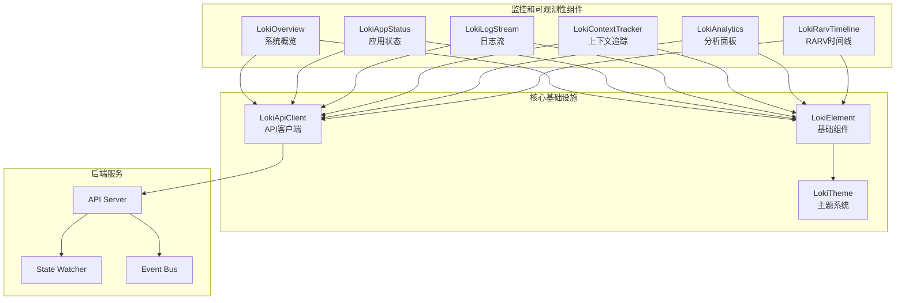

# 监控和可观测性组件模块

## 概述

监控和可观测性组件模块是 Dashboard UI Components 系统的核心子模块，提供了一套完整的实时监控、日志分析和系统状态可视化工具。该模块专为多代理协作系统设计，帮助开发人员和运维人员实时监控系统运行状态、分析日志数据、追踪上下文窗口使用情况，并可视化展示 RARV（Reasoning、Acting、Reflecting、Verifying）执行周期。

### 设计理念

该模块遵循以下设计原则：

1. **实时性优先**：所有组件都支持实时数据更新，通过轮询和事件监听机制确保数据最新
2. **纯 CSS 可视化**：避免依赖复杂的图表库，使用纯 CSS 实现各种数据可视化效果
3. **可见性感知**：组件会自动检测页面可见性，在页面不可见时暂停更新以节省资源
4. **模块化设计**：每个组件都是独立的 Web Component，可以单独使用或组合使用
5. **主题支持**：完整支持浅色和深色主题，并可与系统主题自动同步

## 架构

监控和可观测性组件模块采用分层架构，各组件既相互独立又协同工作：



### 组件层次结构

1. **基础层**：所有组件继承自 `LokiElement`，提供统一的主题管理和基础功能
2. **数据层**：通过 `LokiApiClient` 与后端 API 通信，支持事件监听和轮询
3. **组件层**：各个独立的监控组件，负责特定功能的可视化
4. **集成层**：组件可组合使用，提供完整的监控体验

## 核心功能

### 1. 系统概览 (LokiOverview)

LokiOverview 组件提供系统状态的高级概览，以响应式卡片网格形式展示关键指标。详细信息请参考 [LokiOverview 组件文档](LokiOverview.md)。

主要功能：
- 会话状态和当前阶段
- 迭代次数和运行中的代理数量
- 待处理任务和系统运行时间
- PRD 进度和验证状态
- 应用运行器状态和委员会门控状态

该组件每 5 秒轮询 `/api/status` 端点，并监听 `ApiEvents.STATUS_UPDATE` 事件以获取即时更新。

### 2. 应用状态监控 (LokiAppStatus)

LokiAppStatus 组件专门监控应用运行器的状态。详细信息请参考 [LokiAppStatus 组件文档](LokiAppStatus.md)。

主要功能：
- 实时状态指示器（启动中、运行中、崩溃等）
- 检测到的方法、端口和访问 URL
- 重启次数和运行时间统计
- 应用日志查看器
- 重启和停止控制按钮

该组件每 3 秒轮询 `/api/app-runner/status` 端点，并具有页面可见性感知能力。

### 3. 实时日志流 (LokiLogStream)

LokiLogStream 组件提供终端风格的实时日志查看器。详细信息请参考 [LokiLogStream 组件文档](LokiLogStream.md)。

主要功能：
- 多种日志来源（API 轮询、文件轮询、WebSocket 事件）
- 日志级别过滤（info、success、warning、error、step、agent、debug）
- 文本搜索和过滤
- 自动滚动和手动滚动锁定
- 日志下载功能
- 可配置的日志行数限制

该组件支持结构化日志格式解析，并提供美观的终端模拟器界面。

### 4. 上下文追踪器 (LokiContextTracker)

LokiContextTracker 组件监控上下文窗口使用情况。详细信息请参考 [LokiContextTracker 组件文档](LokiContextTracker.md)。

主要功能：
- 圆形仪表盘显示当前上下文使用率
- 按迭代次数排列的时间线视图
- 令牌类型分解视图（输入、输出、缓存读取、缓存创建）
- 压缩事件标记
- 总令牌数和成本估算

该组件每 5 秒轮询 `/api/context` 端点，并使用纯 CSS 实现数据可视化。

### 5. 分析面板 (LokiAnalytics)

LokiAnalytics 组件提供跨提供商的分析功能。详细信息请参考 [LokiAnalytics 组件文档](LokiAnalytics.md)。

主要功能：
- 活动热力图（类似 GitHub 贡献图）
- 工具使用排行和频率统计
- 迭代速度指标和趋势图
- 提供商比较（成本、令牌使用、迭代次数）
- 可配置的时间范围筛选

该组件使用客户端数据聚合，不依赖第三方图表库，完全通过纯 CSS 实现可视化。

### 6. RARV 时间线 (LokiRarvTimeline)

LokiRarvTimeline 组件可视化 RARV 执行周期。详细信息请参考 [LokiRarvTimeline 组件文档](LokiRarvTimeline.md)。

主要功能：
- 水平时间线显示各阶段持续时间
- 当前阶段高亮和脉冲动画
- 图例显示各阶段颜色和时间
- 可配置的运行 ID 属性

该组件每 5 秒轮询 `/api/v2/runs/{runId}/timeline` 端点。

## 组件关系

各组件之间通过以下方式协同工作：

1. **共享基础设施**：所有组件使用相同的 `LokiElement` 基类和 `LokiApiClient`
2. **事件总线**：通过 `ApiEvents` 系统共享状态更新事件
3. **数据互补**：不同组件展示同一数据源的不同方面
4. **组合使用**：可以在同一页面上部署多个组件，提供完整监控视图

## 使用指南

### 基本使用

所有组件都是标准的 Web Component，可以像使用普通 HTML 元素一样使用：

```html
<!-- 系统概览 -->
<loki-overview api-url="http://localhost:57374"></loki-overview>

<!-- 日志流 -->
<loki-log-stream api-url="http://localhost:57374" max-lines="1000" auto-scroll></loki-log-stream>

<!-- 上下文追踪器 -->
<loki-context-tracker api-url="http://localhost:57374"></loki-context-tracker>
```

### 配置选项

各组件支持的主要属性：

| 组件 | 属性 | 描述 | 默认值 |
|------|------|------|--------|
| 所有组件 | `api-url` | API 基础 URL | `window.location.origin` |
| 所有组件 | `theme` | 主题设置（light/dark） | 自动检测 |
| LokiOverview | - | 无额外属性 | - |
| LokiAppStatus | - | 无额外属性 | - |
| LokiLogStream | `max-lines` | 最大保留日志行数 | 500 |
| LokiLogStream | `auto-scroll` | 是否自动滚动 | false |
| LokiLogStream | `log-file` | 日志文件路径 | - |
| LokiContextTracker | - | 无额外属性 | - |
| LokiAnalytics | - | 无额外属性 | - |
| LokiRarvTimeline | `run-id` | 要显示的运行 ID | - |

### 主题定制

所有组件都支持主题定制，通过 CSS 变量实现：

```css
:root {
  --loki-accent: #553DE9;
  --loki-success: #22c55e;
  --loki-warning: #f59e0b;
  --loki-error: #ef4444;
  --loki-text-primary: #201515;
  --loki-text-secondary: #52525b;
  --loki-text-muted: #939084;
  --loki-bg-primary: #ffffff;
  --loki-bg-secondary: #f4f4f5;
  --loki-bg-tertiary: #e4e4e7;
  --loki-border: #e4e4e7;
}
```

## 与其他模块的关系

监控和可观测性组件模块与以下模块紧密协作：

1. **[Dashboard UI Components](Dashboard UI Components.md)**：本模块是其核心子模块
2. **[Dashboard Frontend](Dashboard Frontend.md)**：提供 Web Component 包装器和 API 客户端
3. **[Dashboard Backend](Dashboard Backend.md)**：提供 REST API 和 WebSocket 事件源
4. **[Observability](Observability.md)**：后端可观测性系统的前端展示

## 注意事项

### 性能考虑

1. **轮询频率**：默认轮询频率在 2-5 秒之间，可根据需要调整
2. **可见性感知**：组件会在页面不可见时暂停轮询，减少资源消耗
3. **数据限制**：日志组件有最大行数限制，避免内存过度使用

### 错误处理

1. **API 失败**：组件会优雅处理 API 失败，显示适当的离线状态
2. **数据格式**：对后端返回的数据有容错处理，避免格式错误导致组件崩溃
3. **连接恢复**：组件会自动尝试重新连接，无需手动刷新

### 浏览器兼容性

- 支持所有现代浏览器（Chrome、Firefox、Safari、Edge）
- 需要支持 Web Components、Shadow DOM 和 Custom Elements
- 不建议在 Internet Explorer 中使用

## 扩展开发

### 创建新的监控组件

要创建新的监控组件，只需继承 `LokiElement` 并实现相应功能：

```javascript
import { LokiElement } from '../core/loki-theme.js';
import { getApiClient } from '../core/loki-api-client.js';

export class MyCustomMonitor extends LokiElement {
  static get observedAttributes() {
    return ['api-url', 'theme'];
  }

  constructor() {
    super();
    this._api = null;
    this._data = null;
  }

  connectedCallback() {
    super.connectedCallback();
    this._setupApi();
    this._loadData();
    this._startPolling();
  }

  // 实现具体功能...

  render() {
    // 渲染组件...
  }
}

customElements.define('my-custom-monitor', MyCustomMonitor);
```

## 总结

监控和可观测性组件模块提供了一套完整、轻量级、高度可定制的监控工具，专为多代理协作系统设计。通过纯 CSS 可视化、实时数据更新和模块化设计，该模块既可以单独使用，也可以作为完整监控解决方案的一部分，帮助开发人员和运维人员更好地理解和管理系统运行状态。
