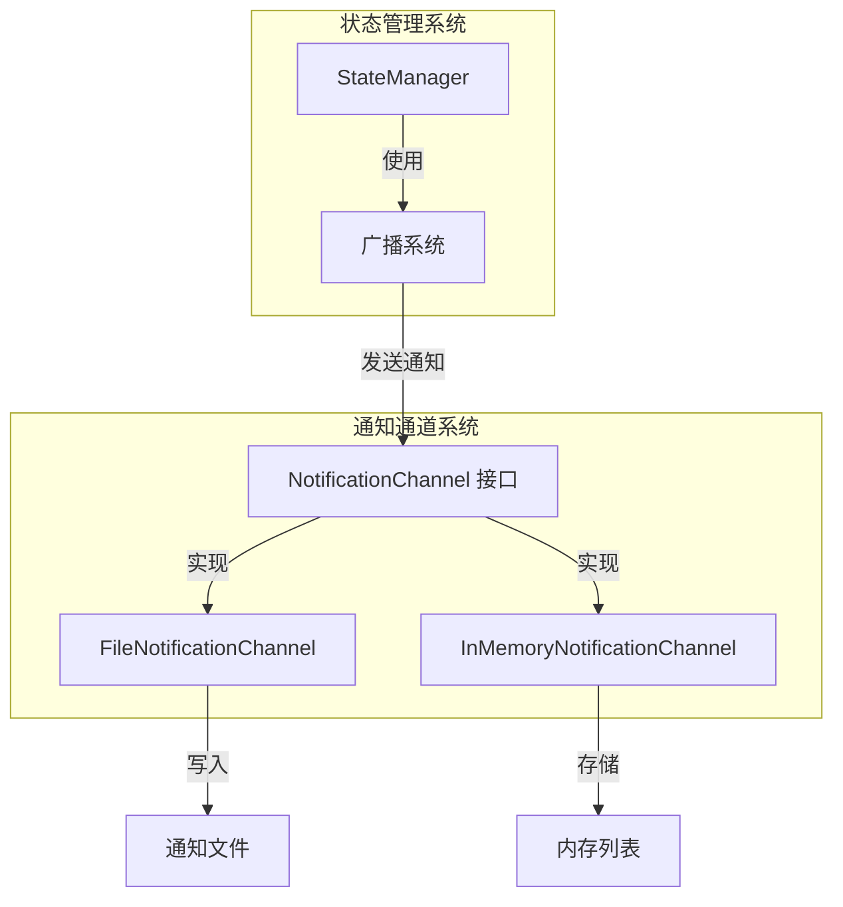

# Notification Channels 模块文档

## 1. 简介

Notification Channels 是 State Management 模块的一个子系统，负责将状态变更事件分发到不同的目的地。它提供了一种可扩展的机制，允许系统组件通过多种方式接收状态变更通知，而不仅限于内部回调函数。

## 2. 架构概述

Notification Channels 系统采用简单的接口-实现模式，核心是 `NotificationChannel` 接口，它定义了通知通道的基本契约。



## 3. 核心组件

### 3.1 NotificationChannel 接口

`NotificationChannel` 是所有通知通道的抽象基类/接口，定义了两个核心方法：

```typescript
// TypeScript 实现
export interface NotificationChannel {
  notify(change: StateChange): void;
  close(): void;
}
```

```python
# Python 实现
class NotificationChannel:
    """Abstract base for notification channels."""

    def notify(self, change: StateChange) -> None:
        """Send notification for a state change."""
        raise NotImplementedError

    def close(self) -> None:
        """Close the notification channel."""
        pass
```

**方法说明**：
- `notify(change)`: 发送状态变更通知，接收一个 `StateChange` 对象
- `close()`: 关闭通知通道，释放资源

### 3.2 FileNotificationChannel

`FileNotificationChannel` 将状态变更通知写入文件，适合命令行工具和外部脚本监控。

**特点**：
- 以 JSONL (JSON Lines) 格式写入，每行一个 JSON 对象
- 自动创建父目录
- 使用文件锁确保并发安全
- 写入错误不会影响状态管理操作

**通知格式**：
```json
{
  "timestamp": "2023-05-15T10:30:00.000Z",
  "file_path": "state/orchestrator.json",
  "change_type": "update",
  "source": "orchestrator",
  "diff": {
    "added": {},
    "removed": {},
    "changed": {
      "currentPhase": {
        "old": "planning",
        "new": "executing"
      }
    }
  }
}
```

**使用示例**：

```python
# Python 示例
from state.manager import StateManager, FileNotificationChannel, ManagedFile
from pathlib import Path

manager = StateManager()

# 创建通知通道
notifications_path = Path(".loki/events/state-changes.jsonl")
channel = FileNotificationChannel(notifications_path)

# 添加到状态管理器
remove_channel = manager.add_notification_channel(channel)

# 现在状态变更会被写入文件
manager.update_state(ManagedFile.ORCHESTRATOR, {"currentPhase": "testing"})

# 之后可以移除通道
remove_channel()
```

```typescript
// TypeScript 示例
import { getStateManager, FileNotificationChannel, ManagedFile } from './state/manager';

const manager = getStateManager();

// 创建并添加通知通道
const channel = new FileNotificationChannel('.loki/events/state-changes.jsonl');
const disposable = manager.addNotificationChannel(channel);

// 触发状态变更
manager.setState(ManagedFile.AUTONOMY, { status: 'active' });

// 移除通道
disposable.dispose();
```

### 3.3 InMemoryNotificationChannel

`InMemoryNotificationChannel` 将通知保存在内存列表中，主要用于测试和嵌入场景。

**特点**：
- 通知保存在内存中，可随时检索
- 自动限制保存的通知数量（默认 1000 条）
- 线程安全（Python 实现）
- 提供通知检索和清空方法

**特有方法**：
- `get_notifications()` / `getNotifications()`: 获取所有保存的通知
- `clear()`: 清空所有保存的通知

**使用示例**：

```python
# Python 示例 - 主要用于测试
from state.manager import StateManager, InMemoryNotificationChannel, ManagedFile
import unittest

class TestStateManager(unittest.TestCase):
    def setUp(self):
        self.manager = StateManager(enable_watch=False)
        self.notification_channel = InMemoryNotificationChannel()
        self.manager.add_notification_channel(self.notification_channel)
    
    def test_state_change_notification(self):
        # 触发状态变更
        self.manager.set_state(ManagedFile.ORCHESTRATOR, {"phase": "test"})
        
        # 检查通知
        notifications = self.notification_channel.get_notifications()
        self.assertEqual(len(notifications), 1)
        self.assertEqual(notifications[0]["file_path"], ManagedFile.ORCHESTRATOR.value)
        self.assertEqual(notifications[0]["change_type"], "create")
```

```typescript
// TypeScript 示例
import { getStateManager, InMemoryNotificationChannel, ManagedFile } from './state/manager';

// 创建内存通知通道
const channel = new InMemoryNotificationChannel(500); // 限制保存 500 条通知
const manager = getStateManager();
manager.addNotificationChannel(channel);

// 执行一些操作
manager.setState(ManagedFile.ORCHESTRATOR, { test: 'value1' });
manager.setState(ManagedFile.ORCHESTRATOR, { test: 'value2' });

// 获取通知进行检查
const notifications = channel.getNotifications();
console.log(`Received ${notifications.length} notifications`);
notifications.forEach(n => {
  console.log(`Changed: ${n.filePath}, type: ${n.changeType}`);
});

// 清空通知
channel.clear();
```

## 4. 扩展通知通道

系统设计允许通过实现 `NotificationChannel` 接口轻松创建自定义通知通道。

### 创建自定义通知通道

以下是创建 WebSocket 通知通道的示例：

```python
# Python 示例 - 自定义 WebSocket 通知通道
import json
from typing import Any
from state.manager import NotificationChannel, StateChange

class WebSocketNotificationChannel(NotificationChannel):
    """WebSocket-based notification channel for real-time updates."""
    
    def __init__(self, websocket):
        self.websocket = websocket
        self.connected = True
    
    def notify(self, change: StateChange) -> None:
        """Send notification via WebSocket."""
        if not self.connected:
            return
            
        try:
            notification = {
                "type": "state_change",
                "data": change.to_dict()
            }
            self.websocket.send(json.dumps(notification))
        except Exception:
            self.connected = False
    
    def close(self) -> None:
        """Close the WebSocket connection."""
        try:
            self.websocket.close()
        except Exception:
            pass
        self.connected = False
```

```typescript
// TypeScript 示例 - 自定义 WebSocket 通知通道
import { NotificationChannel, StateChange } from './state/manager';

export class WebSocketNotificationChannel implements NotificationChannel {
  private ws: WebSocket;
  private connected: boolean;

  constructor(url: string) {
    this.ws = new WebSocket(url);
    this.connected = false;
    
    this.ws.onopen = () => {
      this.connected = true;
    };
    
    this.ws.onclose = () => {
      this.connected = false;
    };
  }

  notify(change: StateChange): void {
    if (!this.connected) return;
    
    try {
      const notification = {
        type: 'state_change',
        data: change
      };
      this.ws.send(JSON.stringify(notification));
    } catch {
      this.connected = false;
    }
  }

  close(): void {
    try {
      this.ws.close();
    } catch {
      // 忽略关闭错误
    }
    this.connected = false;
  }
}
```

## 5. 与 StateManager 集成

通知通道通过 StateManager 的 `add_notification_channel` (Python) 或 `addNotificationChannel` (TypeScript) 方法添加到系统中。

```python
# Python 示例
from state.manager import StateManager, FileNotificationChannel, InMemoryNotificationChannel

manager = StateManager()

# 添加多个通知通道
file_channel = FileNotificationChannel("state-changes.log")
memory_channel = InMemoryNotificationChannel()

remove_file_channel = manager.add_notification_channel(file_channel)
remove_memory_channel = manager.add_notification_channel(memory_channel)

# 做一些操作...

# 单独移除某个通道
remove_file_channel()

# 或者通过 manager.stop() 一次性关闭所有通道
manager.stop()
```

## 6. 使用场景

### 6.1 命令行工具监控

使用 `FileNotificationChannel` 可以让命令行工具轻松监控状态变更：

```bash
# 使用 tail -f 实时监控状态变更
tail -f .loki/events/state-changes.jsonl | jq '.file_path + " - " + .change_type'
```

### 6.2 测试验证

`InMemoryNotificationChannel` 非常适合用于单元测试和集成测试，验证状态变更是否被正确触发：

```typescript
// TypeScript 测试示例
import { expect } from 'chai';
import { getStateManager, InMemoryNotificationChannel, ManagedFile, resetStateManager } from './state/manager';

describe('StateManager notifications', () => {
  beforeEach(() => {
    resetStateManager();
  });

  it('should emit notifications for state changes', () => {
    const channel = new InMemoryNotificationChannel();
    const manager = getStateManager();
    manager.addNotificationChannel(channel);

    // 触发状态变更
    manager.setState(ManagedFile.ORCHESTRATOR, { test: 'value' });

    // 验证通知
    const notifications = channel.getNotifications();
    expect(notifications.length).to.equal(1);
    expect(notifications[0].filePath).to.equal(ManagedFile.ORCHESTRATOR);
    expect(notifications[0].changeType).to.equal('create');
  });
});
```

### 6.3 实时 UI 更新

通过自定义 WebSocket 通知通道，可以实现前端 UI 的实时更新：

```typescript
// 前端集成示例
import { WebSocketNotificationChannel } from './custom-channels';
import { getStateManager } from './state/manager';

// 在应用启动时设置
const setupRealtimeUpdates = () => {
  const wsUrl = `ws://${window.location.host}/api/state-updates`;
  const channel = new WebSocketNotificationChannel(wsUrl);
  const manager = getStateManager();
  manager.addNotificationChannel(channel);
  
  // 在组件卸载或应用关闭时记得清理
  return () => {
    channel.close();
  };
};
```

## 7. 注意事项

1. **错误处理**：通知通道的错误不应影响状态管理操作，所有通知发送错误都应被静默处理
2. **性能考虑**：添加多个通知通道可能会影响状态变更操作的性能，特别是 I/O 密集型通道
3. **线程安全**：在多线程环境中使用时，确保自定义通知通道是线程安全的
4. **资源清理**：始终记得在不再需要时关闭通知通道，特别是长期运行的应用程序
5. **通知顺序**：通知通常按照状态变更的顺序发送，但不提供严格的顺序保证
