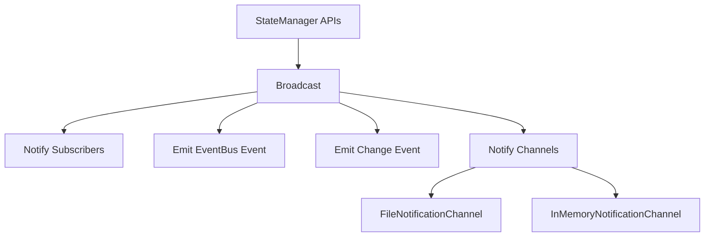
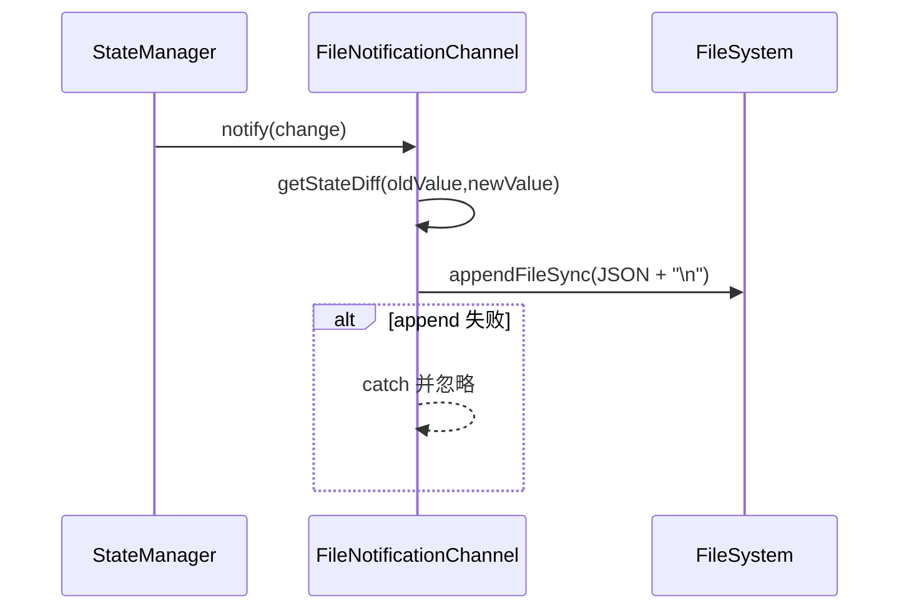
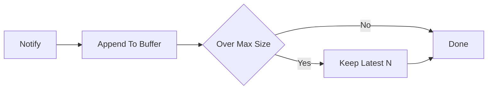

# Notification Channels 模块文档

## 1. 模块简介与设计动机

`notification_channels` 是 `State Management` 子系统中的“状态变更外发层”，其核心目标是把 `StateManager` 内部已经产生的 `StateChange` 事件，以统一协议转发到不同介质。这个模块存在的意义并不是替代 `subscribe` 回调，而是把“订阅逻辑”和“投递介质”解耦：同一个状态变更可以同时写入文件、保存在内存、或者被未来的自定义通道（如 WebSocket、Kafka、Slack）消费。

从实现上看，它基于极简接口 `NotificationChannel`，并提供两个内置实现：`FileNotificationChannel` 和 `InMemoryNotificationChannel`。这种设计让调用方在不改 `StateManager` 内核代码的情况下扩展新的输出目标，也使测试、CLI 监控、离线审计等需求可以复用同一套事件语义。

如果你需要先理解整个状态管理生命周期（缓存、watcher、版本历史、冲突解决），建议先阅读 [State Management](State Management.md)；本文聚焦“通知通道”本身及其在状态广播链路中的行为。

---

## 2. 在系统中的位置

`NotificationChannel` 不是独立运行模块，而是挂载在 `StateManager.broadcast(change)` 的最后一个阶段。一次状态变更会先通知内部订阅者、再发事件总线、再触发 `EventEmitter("change")`，最后才会调用每个通知通道的 `notify`。因此它在链路上属于“附加输出层”。



上图说明了一个关键事实：通知通道本身不参与状态一致性决策，不会修改状态，也不会阻断主流程（通道异常会被捕获并吞掉）。这使它非常适合作为“观察者”与“导出器”。

---

## 3. 核心契约：`NotificationChannel`

`NotificationChannel` 接口定义如下：

```typescript
export interface NotificationChannel {
  notify(change: StateChange): void;
  close(): void;
}
```

`notify(change)` 负责接收一条状态变更；`close()` 负责释放资源。接口没有返回值约束，也没有异步 Promise 约束，这意味着当前实现是同步调用语义。`StateManager` 在调用每个通道时会做 `try/catch`，因此通道抛错不会影响其他通道和状态写入流程。

`change` 的结构来源于 `StateChange`：

```typescript
interface StateChange {
  filePath: string;
  oldValue: Record<string, unknown> | null;
  newValue: Record<string, unknown>;
  timestamp: string;
  changeType: "create" | "update" | "delete";
  source: string;
}
```

---

## 4. `FileNotificationChannel` 深度解析

### 4.1 作用与适用场景

`FileNotificationChannel` 将每次变更追加到一个日志文件中（JSONL，每行一条 JSON），非常适合 CLI tail、离线分析、脚本集成和轻量审计场景。它的设计重点是“简单、可落盘、尽量不影响主流程”。

### 4.2 内部工作机制

构造函数会检查目标文件目录是否存在，不存在则递归创建。`notify` 时会组装一个精简通知对象并执行 `fs.appendFileSync(...)`。写入失败时直接吞错，不向上抛出。



### 4.3 写入数据格式

注意字段是 camelCase，不是 snake_case：

```json
{
  "timestamp": "2026-01-01T10:00:00.000Z",
  "filePath": "state/orchestrator.json",
  "changeType": "update",
  "source": "orchestrator",
  "diff": {
    "added": {},
    "removed": {},
    "changed": {
      "currentPhase": { "old": "plan", "new": "execute" }
    }
  }
}
```

### 4.4 参数、返回值与副作用

`constructor(notificationFile: string)` 接收通知文件路径。其主要副作用是目录创建。`notify(change)` 无返回值，副作用是同步追加文件 I/O；`close()` 当前无实际操作。

### 4.5 关键限制

它没有额外锁机制，依赖文件系统 append 行为；并且是同步 I/O，在高频写入时会阻塞调用线程。若你需要高吞吐，建议自定义异步缓冲通道。

---

## 5. `InMemoryNotificationChannel` 深度解析

### 5.1 作用与适用场景

`InMemoryNotificationChannel` 主要用于测试、调试和短生命周期进程。它把通知对象保存在数组中，便于断言和排查。

### 5.2 内部结构与行为

它维护 `notifications` 数组和 `maxSize` 上限。每次 `notify` 会推入一条完整通知（包括 `oldValue/newValue/diff`），超过上限后通过切片保留尾部最新 N 条。



### 5.3 参数、返回值与副作用

`constructor(maxSize = 1000)` 用于限制内存占用；`notify(change)` 更新内部数组；`getNotifications()` 返回数组副本；`clear()` 和 `close()` 都会清空内存数据。

### 5.4 关键限制

这是进程内存态数据，进程退出即丢失；并且上限裁剪使用 `slice`，在超高频场景有额外拷贝成本。它适合测试，不适合长期审计存储。

---

## 6. diff 语义（两种通道都依赖）

两种内置通道都调用 `getStateDiff(oldValue, newValue)`。该函数是“顶层 key 级别”比较：

- `added`: 新对象有、旧对象没有的 key。
- `removed`: 旧对象有、新对象没有的 key。
- `changed`: 同 key 下 `JSON.stringify(old) !== JSON.stringify(new)` 的项。

这意味着它不是 JSON Patch，也不是字段路径级深度变更集。嵌套对象变化会以整个顶层字段“changed”体现。

---

## 7. 与其他模块的关系

通知通道与多个模块存在协作边界：它消费来自 `StateManager` 的状态事件，但不负责状态来源本身。比如 `api.services.state-notifications.StateNotificationsManager` 关注服务层通知编排，而这里是底层状态文件变更输出；二者可叠加使用但职责不同。事件总线语义可参考 [Event Bus](Event Bus.md)，状态核心机制可参考 [State Management](State Management.md)。

如果前端使用 `dashboard-ui.components.loki-notification-center.LokiNotificationCenter`，通常不会直接读取本模块对象，而是通过后端 API/WebSocket 转换后展示。也就是说，本模块更偏运行时基础设施，而非 UI 直连组件。

---

## 8. 使用方式与配置示例

### 8.1 基础挂载

```typescript
import {
  getStateManager,
  FileNotificationChannel,
  InMemoryNotificationChannel,
  ManagedFile
} from "./state/manager";

const manager = getStateManager({ enableWatch: true, enableEvents: true });

const fileChannel = new FileNotificationChannel(".loki/events/state-changes.jsonl");
const memChannel = new InMemoryNotificationChannel(200);

const d1 = manager.addNotificationChannel(fileChannel);
const d2 = manager.addNotificationChannel(memChannel);

manager.setState(ManagedFile.ORCHESTRATOR, { currentPhase: "planning" }, "orchestrator");

console.log(memChannel.getNotifications().length);

// 按需解绑
// d1.dispose(); d2.dispose();
```

### 8.2 面向测试的断言

```typescript
const channel = new InMemoryNotificationChannel();
const manager = getStateManager({ enableWatch: false, enableEvents: false });
manager.addNotificationChannel(channel);

manager.setState(ManagedFile.AUTONOMY, { status: "active" }, "test");

const [n] = channel.getNotifications();
expect(n.changeType).toBe("create");
expect(n.filePath).toBe(ManagedFile.AUTONOMY);
expect(n.diff.added.status).toBe("active");
```

### 8.3 CLI 观察文件通道

```bash
tail -f .loki/events/state-changes.jsonl | jq '.filePath + " -> " + .changeType'
```

---

## 9. 扩展通道建议

实现自定义通道时，建议遵循当前模块约定：`notify` 快速返回、内部容错、`close` 幂等。下面是最小实现骨架：

```typescript
import { NotificationChannel, StateChange } from "./state/manager";

export class WebhookNotificationChannel implements NotificationChannel {
  constructor(private endpoint: string) {}

  notify(change: StateChange): void {
    try {
      // 可改为异步队列，避免阻塞 StateManager
      void fetch(this.endpoint, {
        method: "POST",
        headers: { "content-type": "application/json" },
        body: JSON.stringify(change)
      });
    } catch {
      // 保持失败隔离
    }
  }

  close(): void {
    // 清理连接、timer、队列等
  }
}
```

---

## 10. 边界条件、错误处理与运维注意事项

第一，通知通道是“尽力而为（best effort）”语义。无论文件写入失败还是自定义通道异常，都不会回滚 `setState` 结果，所以不要把关键业务确认建立在通道回调成功之上。

第二，投递是同步串行执行。通道越多、每个 `notify` 越慢，`StateManager` 主路径延迟越高。若你的状态更新频繁，建议使用轻量通道或异步缓冲策略。

第三，`FileNotificationChannel` 使用追加写入，适合日志消费，但不自带轮转与压缩。线上需结合 logrotate 或外部清理策略。

第四，`InMemoryNotificationChannel` 的 `maxSize` 只限制条数，不限制单条大小；若 `newValue` 很大，内存压力依然明显。

第五，`getStateDiff` 的比较依赖 `JSON.stringify`，对对象键顺序敏感（在某些构造方式下可能表现为“看起来相同却判定 changed”）。如果你要做强一致审计，建议在上游先做规范化。

---

## 11. 小结

`notification_channels` 模块以非常小的接口提供了状态变更的可插拔输出能力，是 `StateManager` 可观测性与可集成性的关键拼图。`FileNotificationChannel` 偏持久化与外部脚本消费，`InMemoryNotificationChannel` 偏测试与调试。理解它们的同步、容错、best-effort 语义后，就可以安全地把状态变更桥接到更复杂的通知基础设施中。
