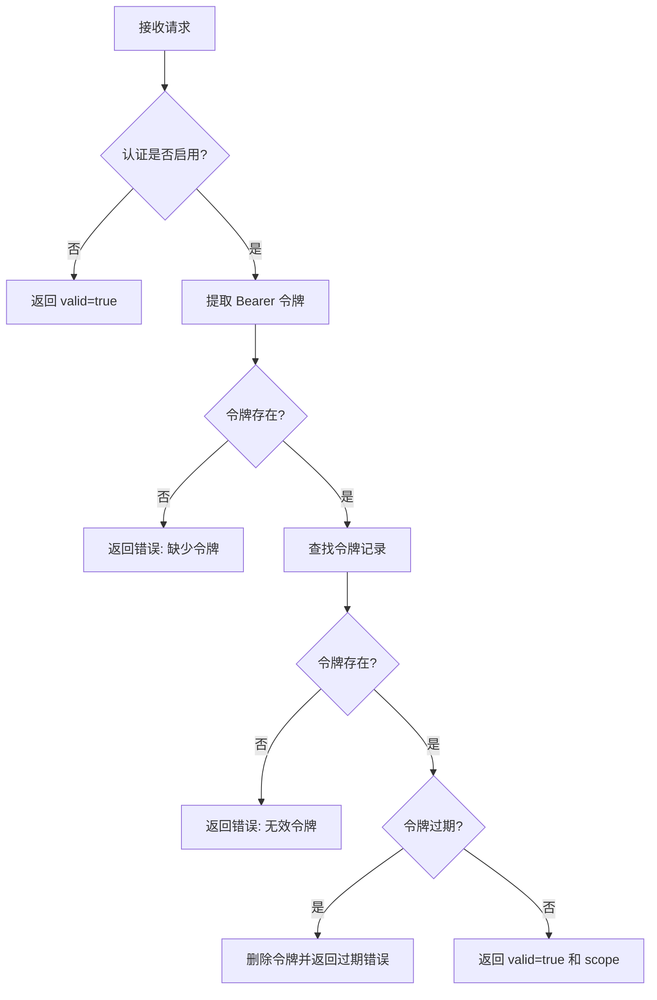

# OAuthValidator 模块文档

## 概述

OAuthValidator 模块是 MCP（Model Context Protocol）协议套件中的身份验证组件，提供 OAuth 2.1 + PKCE（Proof Key for Code Exchange）标准的认证实现。该模块主要用于保护 MCP 服务器的工具调用端点，确保只有经过授权的客户端才能访问受保护的资源。

### 设计理念

OAuthValidator 的设计遵循以下原则：

1. **向后兼容**：当未配置身份验证时，自动禁用认证功能，保持系统的无障碍访问
2. **灵活配置**：支持通过配置文件、环境变量或编程方式进行配置
3. **标准合规**：严格遵循 OAuth 2.1 和 PKCE 规范，确保安全性
4. **多场景支持**：适用于测试、开发和生产环境的不同需求

## 核心组件详解

### OAuthValidator 类

`OAuthValidator` 是该模块的核心类，负责处理所有与身份验证相关的操作。

#### 构造函数

```javascript
constructor(options)
```

**参数说明：**
- `options` (可选): 配置选项对象
  - `configPath` (可选): 自定义配置文件路径

**功能描述：**
初始化 OAuthValidator 实例，设置内部数据结构，并根据提供的选项加载配置。如果未提供配置路径，则尝试从环境变量或默认位置加载配置。

#### 属性

##### enabled

```javascript
get enabled()
```

**功能描述：**
返回当前认证功能是否启用的布尔值。当存在有效的认证配置时返回 `true`，否则返回 `false`。

#### 公共方法

##### validate

```javascript
validate(request)
```

**参数说明：**
- `request`: 请求对象，应包含 `params._meta.authorization` 属性或相应的授权头

**返回值：**
- 对象 `{ valid, error, scope }`
  - `valid`: 布尔值，表示请求是否有效
  - `error`: 字符串，当验证失败时包含错误信息
  - `scope`: 字符串，令牌的权限范围

**功能描述：**
验证请求的授权令牌。首先检查认证是否启用，然后从请求参数或头中提取 Bearer 令牌，最后验证令牌的有效性和权限范围。

**使用场景：**
在处理 MCP 工具调用前，验证调用者的身份和权限。

##### validateToken

```javascript
validateToken(token)
```

**参数说明：**
- `token`: 字符串类型的 Bearer 令牌

**返回值：**
- 对象 `{ valid, error, scope }`，结构同 `validate` 方法

**功能描述：**
直接验证 Bearer 令牌的有效性，检查令牌是否存在、是否过期，并返回相应的验证结果和权限范围。

##### validateHeader

```javascript
validateHeader(authorizationHeader)
```

**参数说明：**
- `authorizationHeader`: HTTP Authorization 头的值，格式应为 "Bearer {token}"

**返回值：**
- 对象 `{ valid, error, scope }`，结构同 `validate` 方法

**功能描述：**
专门用于验证 HTTP 请求的 Authorization 头，主要在 SSE（Server-Sent Events）传输场景中使用。

**使用场景：**
验证 SSE 连接的授权头，确保只有授权客户端能接收实时事件流。

##### issueToken

```javascript
issueToken(scope, ttlMs)
```

**参数说明：**
- `scope` (可选): 令牌的权限范围，默认为 '*'
- `ttlMs` (可选): 令牌的有效期（毫秒），默认为 null（永不过期）

**返回值：**
- 对象 `{ token, expiresAt }`
  - `token`: 生成的随机令牌字符串
  - `expiresAt`: 令牌过期时间的时间戳，null 表示永不过期

**功能描述：**
生成一个新的 Bearer 令牌，用于测试或编程使用。在生产环境中，令牌应来自外部 OAuth 提供商。

**安全注意：**
此方法主要用于开发和测试场景，生产环境应使用标准的 OAuth 流程获取令牌。

##### revokeToken

```javascript
revokeToken(token)
```

**参数说明：**
- `token`: 要撤销的令牌字符串

**返回值：**
- 布尔值，表示令牌是否成功撤销

**功能描述：**
从令牌存储中删除指定的令牌，使其立即失效。

##### validatePKCE

```javascript
validatePKCE(codeVerifier, codeChallenge)
```

**参数说明：**
- `codeVerifier`: PKCE 代码验证器
- `codeChallenge`: PKCE 代码挑战

**返回值：**
- 布尔值，表示验证是否成功

**功能描述：**
验证 PKCE 代码验证器和代码挑战是否匹配，使用 SHA-256 哈希算法和 base64url 编码。根据 OAuth 2.1 规范，仅支持 S256 方法。

**技术细节：**
计算过程为：`SHA256(codeVerifier) → base64url 编码 → 与 codeChallenge 比较`

##### registerClient

```javascript
registerClient(clientId, clientConfig)
```

**参数说明：**
- `clientId`: 客户端标识符
- `clientConfig`: 客户端配置对象，包含 secret、redirectUri 和 scopes 等属性

**功能描述：**
注册一个 OAuth 客户端，用于测试或配置目的。注册客户端后会自动启用认证功能。

#### 私有方法

##### _loadConfig

```javascript
_loadConfig(configPath)
```

**参数说明：**
- `configPath`: 配置文件的路径

**功能描述：**
从指定路径加载 JSON 配置文件，并应用配置。如果文件不存在或读取失败，认证功能将保持禁用状态。

##### _loadConfigFromEnv

```javascript
_loadConfigFromEnv()
```

**功能描述：**
从环境变量或默认配置文件位置加载配置。优先检查项目根目录下的 `.loki/mcp-auth.json` 文件，然后检查 `MCP_AUTH_TOKEN` 环境变量。

##### _applyConfig

```javascript
_applyConfig(config)
```

**参数说明：**
- `config`: 配置对象

**功能描述：**
应用解析后的配置，包括注册客户端和设置预定义令牌。

## 配置方式

OAuthValidator 支持多种配置方式，按优先级从高到低排列：

### 1. 编程配置

```javascript
const { OAuthValidator } = require('./src/protocols/auth/oauth');

// 创建实例并注册客户端
const validator = new OAuthValidator();
validator.registerClient('client1', {
  secret: 'client-secret',
  redirectUri: 'https://example.com/callback',
  scopes: ['read', 'write']
});

// 发行测试令牌
const { token } = validator.issueToken('read', 3600000); // 1小时有效期
```

### 2. 配置文件

创建 `.loki/mcp-auth.json` 文件：

```json
{
  "enabled": true,
  "clients": [
    {
      "id": "web-app",
      "secret": "secure-client-secret",
      "redirectUri": "https://yourapp.com/callback",
      "scopes": ["read", "write", "execute"]
    }
  ],
  "tokens": [
    {
      "value": "predefined-token-123",
      "scope": "read",
      "expiresAt": "2024-12-31T23:59:59Z"
    }
  ]
}
```

### 3. 环境变量

```bash
# 设置单个令牌
export MCP_AUTH_TOKEN="your-secure-token-here"
export MCP_AUTH_SCOPE="read,write"

# 或者使用配置文件
# 自动查找项目根目录下的 .loki/mcp-auth.json
```

## 架构与工作流程

### 组件架构

OAuthValidator 模块在 MCP 协议套件中的位置：

```
MCP Protocol Suite
├── CircuitBreaker
├── MCPClientManager
├── MCPClient
├── Transport (SSE/Stdio)
└── Auth
    └── OAuthValidator ← 本模块
```

### 验证流程图

下面是 OAuthValidator 的核心验证流程：



### 与其他组件的交互

OAuthValidator 主要与以下组件交互：

1. **MCP Client**：验证来自客户端的工具调用请求
2. **SSE Transport**：验证 SSE 连接的授权头
3. **MCPClientManager**：在客户端管理中集成认证逻辑

详细的交互说明请参考 [MCPClient](MCPClient.md) 和 [SSETransport](SSETransport.md) 的文档。

## 使用示例

### 基本身份验证

```javascript
const { OAuthValidator } = require('./src/protocols/auth/oauth');

// 创建验证器（自动从环境或配置文件加载配置）
const validator = new OAuthValidator();

// 验证请求
const request = {
  params: {
    _meta: {
      authorization: 'Bearer your-token-here'
    }
  }
};

const result = validator.validate(request);
if (result.valid) {
  console.log('访问已授权，权限范围:', result.scope);
  // 处理请求...
} else {
  console.error('验证失败:', result.error);
  // 返回 401 未授权...
}
```

### 测试环境配置

```javascript
const { OAuthValidator } = require('./src/protocols/auth/oauth');

// 创建验证器
const validator = new OAuthValidator();

// 注册测试客户端
validator.registerClient('test-client', {
  secret: 'test-secret',
  redirectUri: 'http://localhost:3000/callback',
  scopes: ['*']
});

// 发行测试令牌（1小时有效期）
const { token, expiresAt } = validator.issueToken('*', 3600000);
console.log('测试令牌:', token);
console.log('过期时间:', new Date(expiresAt).toISOString());

// 验证令牌
const validation = validator.validateToken(token);
console.log('验证结果:', validation);
```

### PKCE 验证示例

```javascript
const { OAuthValidator } = require('./src/protocols/auth/oauth');
const crypto = require('crypto');

// 生成 code_verifier 和 code_challenge（客户端操作）
function generatePKCEPair() {
  const codeVerifier = crypto.randomBytes(32).toString('hex');
  const codeChallenge = crypto
    .createHash('sha256')
    .update(codeVerifier)
    .digest('base64url');
  return { codeVerifier, codeChallenge };
}

// 使用验证器
const validator = new OAuthValidator();
const { codeVerifier, codeChallenge } = generatePKCEPair();

// 在授权流程中使用
// 1. 客户端发送 code_challenge 获取授权码
// 2. 客户端使用 code_verifier 和授权码交换令牌
// 3. 服务器验证 code_verifier

const isValid = validator.validatePKCE(codeVerifier, codeChallenge);
console.log('PKCE 验证结果:', isValid); // true
```

## 安全考虑与最佳实践

### 安全建议

1. **生产环境**：
   - 不要使用 `issueToken` 方法，应集成外部 OAuth 2.1 提供商
   - 确保配置文件权限设置正确（仅管理员可读取）
   - 使用 HTTPS 传输所有包含令牌的请求
   - 设置合理的令牌过期时间

2. **令牌管理**：
   - 定期轮换长期令牌
   - 实现令牌撤销机制
   - 记录令牌使用情况以便审计

3. **PKCE 实施**：
   - 始终使用 S256 方法（OAuthValidator 仅支持此方法）
   - 为每个授权请求生成新的 code_verifier

### 已知限制

1. 当前实现主要是内存存储，重启后所有动态发行的令牌会丢失
2. 不支持刷新令牌机制
3. 客户端认证仅限于基本的客户端 ID/密钥模式
4. 没有内置的令牌加密或签名验证

### 错误处理

OAuthValidator 通过返回包含 `error` 字段的对象来处理错误情况：

```javascript
const result = validator.validate(request);
if (!result.valid) {
  switch (result.error) {
    case 'Missing or invalid authorization token':
      // 处理缺少令牌的情况
      break;
    case 'Invalid token':
      // 处理无效令牌
      break;
    case 'Token expired':
      // 处理过期令牌，可能引导重新认证
      break;
    default:
      // 处理其他错误
  }
}
```

## 扩展与集成

### 自定义存储后端

当前实现使用内存 Map 存储令牌和客户端。对于生产环境，可能需要实现持久化存储：

```javascript
class PersistentOAuthValidator extends OAuthValidator {
  constructor(options) {
    super(options);
    this.db = options.database; // 假设这是一个数据库连接
  }

  // 重写方法以使用数据库
  validateToken(token) {
    // 从数据库查询令牌
    // ...
  }

  issueToken(scope, ttlMs) {
    const result = super.issueToken(scope, ttlMs);
    // 保存到数据库
    // ...
    return result;
  }
}
```

### 与外部 OAuth 提供商集成

```javascript
class ExternalOAuthValidator extends OAuthValidator {
  constructor(options) {
    super(options);
    this.providerUrl = options.providerUrl;
  }

  async validateToken(token) {
    if (!this._enabled) {
      return { valid: true, scope: '*' };
    }

    // 调用外部 OAuth 提供商的 introspection 端点
    try {
      const response = await fetch(`${this.providerUrl}/introspect`, {
        method: 'POST',
        headers: { 'Content-Type': 'application/x-www-form-urlencoded' },
        body: `token=${token}`
      });
      
      const introspection = await response.json();
      if (introspection.active) {
        return { valid: true, scope: introspection.scope || '*' };
      }
      return { valid: false, error: 'Token not active' };
    } catch (error) {
      return { valid: false, error: 'Token validation failed' };
    }
  }
}
```

## 相关模块

- [MCPClient](MCPClient.md) - MCP 客户端实现，可与 OAuthValidator 集成
- [SSETransport](SSETransport.md) - SSE 传输层，使用 validateHeader 方法
- [MCPClientManager](MCPClientManager.md) - 客户端管理器，可能使用 OAuthValidator 进行访问控制
