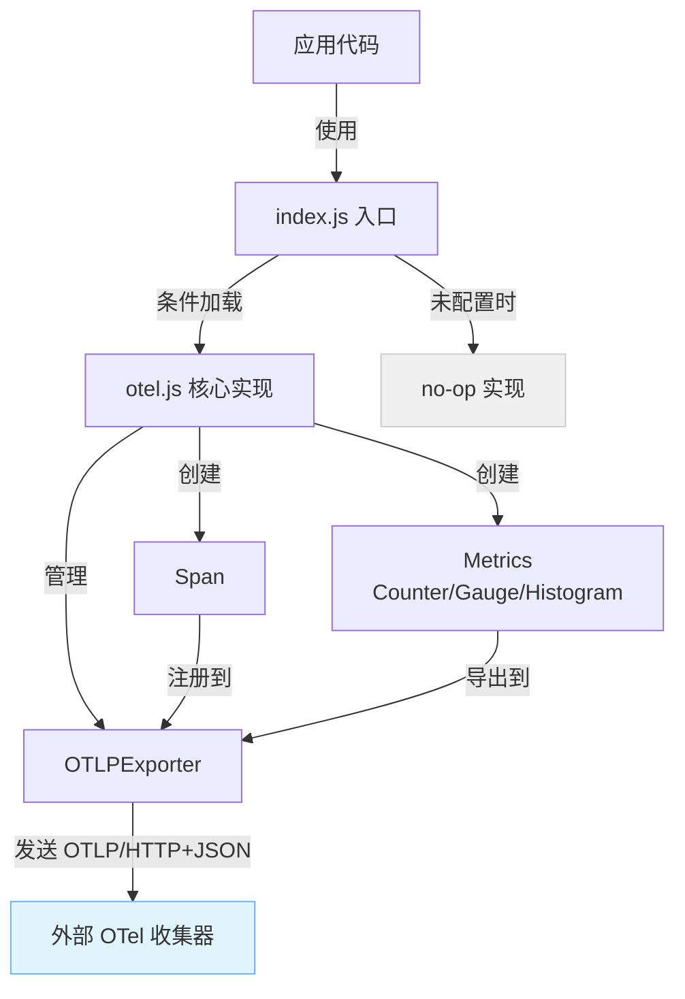
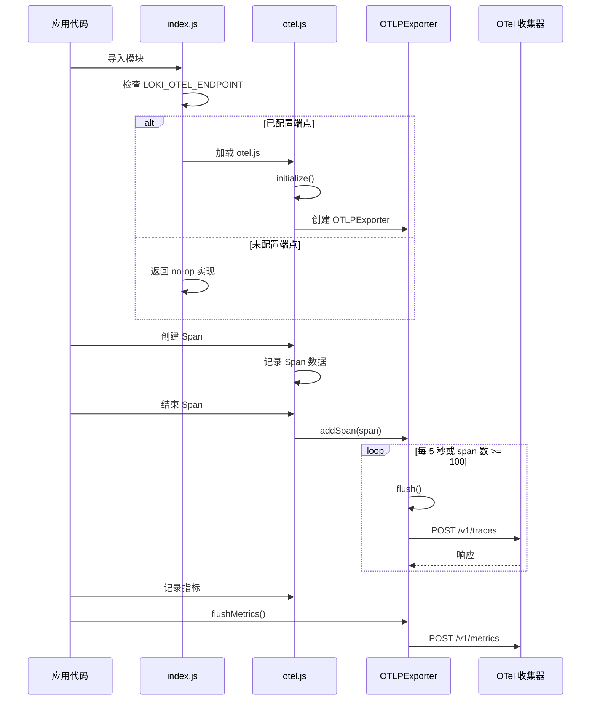

# Observability 模块文档

## 1. 模块概述

Observability 模块提供了一套轻量级的 OpenTelemetry (OTel) 实现，用于系统的可观测性数据收集与导出。该模块采用懒加载设计，仅在配置了 OTel 端点时才会激活，避免了不必要的性能开销。它支持分布式跟踪（Tracing）和指标（Metrics）收集，并通过 OTLP/HTTP+JSON 协议将数据导出到外部收集器。

### 设计理念

- **零开销默认模式**：在未配置 OTel 端点时，模块通过 index.js 提供无操作（no-op）实现，对应用性能无影响。
- **轻量级实现**：不依赖完整的 OpenTelemetry SDK，而是使用 Node.js 内置模块实现核心功能，减少依赖复杂度。
- **企业友好**：支持标准 OTLP 协议，便于与企业现有的可观测性基础设施集成。

## 2. 核心组件详解

### 2.1 Span（分布式跟踪单元）

Span 类代表分布式跟踪中的一个操作单元，支持创建嵌套Span、设置属性、状态管理，并能导出为 OTLP 格式。

#### 主要功能

- **上下文传播**：通过 `traceparent()` 方法生成 W3C Trace Context 标准的头部，实现跨服务的跟踪上下文传递。
- **属性与状态**：支持设置自定义属性和操作状态（成功/错误）。
- **自动注册**：结束时自动注册到活跃的导出器。

#### 核心方法

| 方法名 | 描述 | 参数 | 返回值 |
|--------|------|------|--------|
| `constructor(name, traceId?, parentSpanId?, attributes?)` | 创建新 Span | name: 操作名称<br>traceId?: 父跟踪ID<br>parentSpanId?: 父SpanID<br>attributes?: 初始属性对象 | Span实例 |
| `setAttribute(key, value)` | 设置属性 | key: 属性键<br>value: 属性值 | this（链式调用） |
| `setStatus(code, message?)` | 设置状态 | code: 状态码（0=UNSET, 1=OK, 2=ERROR）<br>message?: 状态消息 | this（链式调用） |
| `end()` | 结束 Span | 无 | 无 |
| `traceparent()` | 获取 W3C traceparent 头部 | 无 | 字符串（格式：`00-{traceId}-{spanId}-01`） |
| `toOTLP()` | 序列化为 OTLP 格式 | 无 | OTLP Span 对象 |

#### 使用示例

```javascript
const { Span, SpanStatusCode } = require('./src/observability/otel');

// 创建根 Span
const rootSpan = new Span('user-authentication');
rootSpan.setAttribute('user.id', '12345');
rootSpan.setAttribute('auth.method', 'oauth2');

// 执行操作...
try {
  // 认证成功
  rootSpan.setStatus(SpanStatusCode.OK);
} catch (error) {
  // 认证失败
  rootSpan.setStatus(SpanStatusCode.ERROR, error.message);
} finally {
  rootSpan.end();
}

// 创建子 Span
const childSpan = new Span('database-query', rootSpan.traceId, rootSpan.spanId);
childSpan.setAttribute('db.statement', 'SELECT * FROM users WHERE id = ?');
childSpan.end();
```

### 2.2 Gauge（指标仪表）

Gauge 类用于表示可上下波动的指标值，如当前内存使用量、活跃连接数等。

#### 主要功能

- **标签支持**：允许通过标签创建多维度指标。
- **基数限制**：自动限制标签组合数量，防止内存过度增长。
- **FIFO 淘汰**：当标签组合超过限制时，淘汰最早的标签组合。

#### 核心方法

| 方法名 | 描述 | 参数 | 返回值 |
|--------|------|------|--------|
| `constructor(name, description?, unit?)` | 创建 Gauge | name: 指标名称<br>description?: 描述<br>unit?: 单位 | Gauge实例 |
| `set(value, labels?)` | 设置值 | value: 数值<br>labels?: 标签对象 | 无 |
| `get(labels?)` | 获取值 | labels?: 标签对象 | 数值 |
| `toOTLP()` | 序列化为 OTLP 格式 | 无 | OTLP Gauge 对象 |

#### 使用示例

```javascript
const { Gauge } = require('./src/observability/otel');

// 创建内存使用量指标
const memoryUsage = new Gauge('memory_usage_bytes', '当前内存使用量', 'bytes');

// 设置无标签值
memoryUsage.set(process.memoryUsage().heapUsed);

// 设置带标签值
memoryUsage.set(1024 * 1024 * 50, { service: 'api-server', environment: 'production' });
memoryUsage.set(1024 * 1024 * 30, { service: 'worker', environment: 'production' });

// 获取值
console.log(memoryUsage.get()); // 无标签值
console.log(memoryUsage.get({ service: 'api-server', environment: 'production' })); // 带标签值
```

### 2.3 Histogram（指标直方图）

Histogram 类用于统计数值分布，如请求延迟、响应时间等，支持自定义边界桶。

#### 主要功能

- **自定义边界**：允许设置自定义的桶边界。
- **样本限制**：限制每个标签组合的样本数量，防止内存溢出。
- **自动重置**：导出后自动清空样本数组，避免无限增长。

#### 核心方法

| 方法名 | 描述 | 参数 | 返回值 |
|--------|------|------|--------|
| `constructor(name, description?, unit?, boundaries?)` | 创建 Histogram | name: 指标名称<br>description?: 描述<br>unit?: 单位<br>boundaries?: 桶边界数组 | Histogram实例 |
| `record(value, labels?)` | 记录值 | value: 数值<br>labels?: 标签对象 | 无 |
| `get(labels?)` | 获取样本数组 | labels?: 标签对象 | 数值数组 |
| `toOTLP()` | 序列化为 OTLP 格式 | 无 | OTLP Histogram 对象 |

#### 默认桶边界

如果未指定边界，将使用以下默认值（单位：秒）：
`[0.005, 0.01, 0.025, 0.05, 0.1, 0.25, 0.5, 1, 2.5, 5, 10]`

#### 使用示例

```javascript
const { Histogram } = require('./src/observability/otel');

// 创建请求延迟指标（使用默认边界）
const requestLatency = new Histogram('request_latency_seconds', 'HTTP请求延迟', 's');

// 记录请求延迟
requestLatency.record(0.05, { endpoint: '/api/users', method: 'GET', status: '200' });
requestLatency.record(0.12, { endpoint: '/api/users', method: 'GET', status: '200' });
requestLatency.record(2.1, { endpoint: '/api/heavy', method: 'POST', status: '200' });

// 创建自定义边界的 Histogram
const customLatency = new Histogram(
  'custom_latency',
  '自定义延迟指标',
  'ms',
  [10, 50, 100, 500, 1000, 5000] // 单位：毫秒
);
```

### 2.4 OTLPExporter（数据导出器）

OTLPExporter 类负责将收集到的跟踪和指标数据通过 OTLP/HTTP+JSON 协议导出到外部端点。

#### 主要功能

- **定期刷新**：默认每 5 秒自动刷新一次数据。
- **批量导出**：当 pending spans 达到 100 个时自动刷新。
- **安全验证**：仅允许 http 和 https 协议，防止 SSRF 攻击。
- **错误处理**：提供自定义错误处理机制，且确保可观测性错误不会影响主应用。

#### 核心方法

| 方法名 | 描述 | 参数 | 返回值 |
|--------|------|------|--------|
| `constructor(endpoint)` | 创建导出器 | endpoint: OTLP 端点 URL | OTLPExporter实例 |
| `setErrorHandler(handler)` | 设置错误处理函数 | handler: 错误处理函数 | 无 |
| `addSpan(span)` | 添加 Span | span: Span 实例 | 无 |
| `flush()` | 刷新跟踪数据 | 无 | 导出的 payload 对象 |
| `flushMetrics(metricsList)` | 刷新指标数据 | metricsList: 指标数组 | 导出的 payload 对象 |
| `shutdown()` | 关闭导出器 | 无 | 无 |

#### 使用示例

```javascript
const { OTLPExporter, Span } = require('./src/observability/otel');

// 创建导出器
const exporter = new OTLPExporter('https://otel-collector.example.com:4318');

// 设置自定义错误处理
exporter.setErrorHandler((err) => {
  console.error('OTLP 导出失败:', err);
  // 可以在这里添加重试逻辑或发送告警
});

// 添加 Span
const span = new Span('test-operation');
span.end();
exporter.addSpan(span);

// 手动刷新
exporter.flush();

// 刷新指标
const metrics = [
  new Gauge('test_gauge'),
  new Histogram('test_histogram')
];
exporter.flushMetrics(metrics);

// 关闭导出器
exporter.shutdown();
```

## 3. 模块架构与工作流

### 3.1 模块架构图



### 3.2 初始化与数据流程



## 4. 配置与使用

### 4.1 环境变量配置

| 环境变量 | 描述 | 必填 | 默认值 |
|----------|------|------|--------|
| `LOKI_OTEL_ENDPOINT` | OTLP 收集器端点 URL | 是（激活时） | 无 |
| `LOKI_SERVICE_NAME` | 服务名称，用于标识数据源 | 否 | `loki-mode` |

### 4.2 基本使用

#### 1. 配置环境变量

```bash
# 在启动应用前设置
export LOKI_OTEL_ENDPOINT=https://otel-collector.example.com:4318
export LOKI_SERVICE_NAME=my-application
```

#### 2. 使用模块（推荐方式）

```javascript
// 使用 index.js 入口，它会自动处理条件加载
const observability = require('./src/observability');

// 创建 tracer
const tracer = observability.tracerProvider.getTracer('my-tracer');

// 创建 span
const span = tracer.startSpan('my-operation', {
  attributes: {
    'operation.type': 'test',
    'user.id': '123'
  }
});

// 执行操作...
span.end();

// 创建 meter
const meter = observability.meterProvider.getMeter('my-meter');

// 创建指标
const counter = meter.createCounter('requests_total', '总请求数', '1');
const gauge = meter.createGauge('active_connections', '活跃连接数', '1');
const histogram = meter.createHistogram('request_duration', '请求持续时间', 's');

// 使用指标
counter.add(1, { endpoint: '/api', method: 'GET' });
gauge.set(10, { service: 'api' });
histogram.record(0.123, { endpoint: '/api' });

// 手动刷新指标（如果需要）
const exporter = observability.getExporter();
if (exporter) {
  exporter.flushMetrics([counter, gauge, histogram]);
}
```

### 4.3 直接使用核心组件（高级）

```javascript
// 直接导入 otel.js（仅在确保已配置环境变量时使用）
const { 
  initialize, 
  tracerProvider, 
  meterProvider, 
  getExporter,
  shutdown 
} = require('./src/observability/otel');

// 手动初始化
try {
  initialize();
} catch (error) {
  console.error('初始化失败:', error);
}

// 使用 tracer 和 meter...

// 关闭
shutdown();
```

## 5. 最佳实践与注意事项

### 5.1 最佳实践

1. **使用 index.js 入口**：总是通过 index.js 导入模块，以获得条件加载的好处。
2. **合理设置标签**：避免使用高基数标签（如用户ID、请求ID等），防止内存过度增长。
3. **及时结束 Span**：确保所有 Span 都被正确结束，避免内存泄漏。
4. **错误处理**：设置自定义错误处理函数，以便及时发现导出问题。
5. **优雅关闭**：在应用关闭时调用 `shutdown()`，确保所有 pending 数据都被导出。

### 5.2 注意事项与限制

1. **基数限制**：
   - 每个指标最多支持 1000 个不同的标签组合。
   - Counter 和 Histogram 达到限制后会拒绝新标签组合。
   - Gauge 达到限制后会淘汰最早的标签组合。

2. **样本限制**：
   - 每个 Histogram 标签组合最多存储 10000 个样本。
   - 超过限制的样本会被静默丢弃。

3. **性能考虑**：
   - 虽然模块设计轻量，但大量的 Span 和指标记录仍会有性能开销。
   - 在生产环境中，应根据实际需求调整采样策略（当前版本未实现采样）。

4. **安全限制**：
   - OTLP 端点仅支持 http 和 https 协议，其他协议会被拒绝。
   - 错误处理函数中的异常会被静默捕获，防止影响主应用。

5. **时间戳精度**：
   - 使用 Node.js 的 `hrtime` 实现纳秒级精度，但实际精度受操作系统限制。

## 6. 与其他模块的关系

Observability 模块是一个基础服务模块，可为系统中的其他模块提供可观测性支持：

- **API Server & Services**：可用于跟踪 API 请求处理流程，记录请求延迟、错误率等指标。
- **Swarm Multi-Agent**：可用于跟踪多代理协作过程，记录代理间通信延迟、任务分配情况等。
- **Memory System**：可用于监控内存系统的性能，如查询延迟、索引更新频率等。
- **Dashboard Backend**：可通过该模块暴露的指标数据，在 Dashboard 中展示系统运行状态。

## 7. 故障排查

### 7.1 常见问题

1. **模块未初始化**：
   - 检查 `LOKI_OTEL_ENDPOINT` 环境变量是否正确设置。
   - 确保使用 index.js 入口，而不是直接导入 otel.js。

2. **数据未导出**：
   - 检查网络连接是否正常。
   - 检查 OTel 收集器是否正常运行。
   - 查看错误日志（默认输出到 stderr）。
   - 确认所有 Span 都已调用 `end()` 方法。

3. **内存增长过快**：
   - 检查是否使用了高基数标签。
   - 确认 Histogram 样本是否正常导出和重置。
   - 检查是否有未结束的 Span。

4. **标签组合被拒绝**：
   - 减少标签基数，避免使用唯一值作为标签。
   - 考虑重新设计标签策略。

### 7.2 调试技巧

```javascript
// 启用调试（通过设置自定义错误处理）
const { getExporter } = require('./src/observability');
const exporter = getExporter();

if (exporter) {
  exporter.setErrorHandler((err) => {
    console.error('OTLP 导出错误:', err);
    console.error('错误堆栈:', err.stack);
  });
  
  // 手动触发刷新并检查 payload
  const payload = exporter.flush();
  console.log('导出的 payload:', JSON.stringify(payload, null, 2));
}
```

## 8. 扩展与开发

### 8.1 添加新的指标类型

要添加新的指标类型，需要：

1. 在 otel.js 中创建新的类，实现 `toOTLP()` 方法。
2. 在 meterProvider 中添加创建该指标的方法。
3. 确保新指标类遵循与现有指标相同的设计模式（标签支持、基数限制等）。

### 8.2 自定义导出器

虽然当前模块仅支持 OTLP/HTTP+JSON，但可以通过以下方式扩展：

1. 创建新的导出器类，实现与 OTLPExporter 类似的接口。
2. 修改初始化代码，支持根据配置选择不同的导出器。
3. 确保新导出器也遵循“不影响主应用”的原则。

## 9. 总结

Observability 模块提供了一个轻量级、零开销默认模式的可观测性解决方案，支持分布式跟踪和指标收集。它的设计注重企业集成能力和性能影响，通过标准 OTLP 协议与现有可观测性基础设施集成，同时在未配置时提供完全无操作的实现，确保不影响应用性能。

该模块的核心价值在于：
- 提供了基本的可观测性功能，无需引入 heavy 的 OpenTelemetry SDK。
- 条件加载设计确保了零 overhead 的默认体验。
- 标准协议支持，便于与企业现有系统集成。
