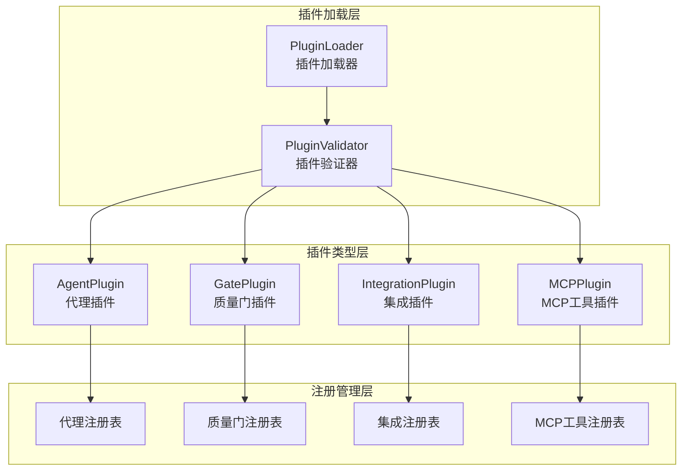

# Plugin System 模块文档

## 概述

Plugin System 模块是一个灵活的插件架构，为系统提供了可扩展性和自定义能力。该模块允许用户通过注册自定义插件来扩展系统的功能，包括自定义代理、质量门、集成和 MCP 工具等。插件系统采用了模块化设计，使得不同类型的插件可以独立开发、测试和部署，同时保持与核心系统的无缝集成。

## 架构设计

Plugin System 模块采用了分层架构设计，主要包含以下核心组件：



### 核心组件说明

1. **PluginLoader**: 负责从文件系统中发现、加载和解析插件配置文件，支持 YAML 和 JSON 格式。
2. **PluginValidator**: 验证插件配置的合法性和完整性（代码中引用但未提供）。
3. **AgentPlugin**: 管理自定义代理插件的注册、注销和查询。
4. **GatePlugin**: 管理自定义质量门插件的注册、执行和查询。
5. **IntegrationPlugin**: 管理自定义集成插件的注册、事件处理和查询。
6. **MCPPlugin**: 管理自定义 MCP 工具插件的注册、执行和查询。

## 功能特性

### 1. 插件类型支持

Plugin System 模块支持四种主要类型的插件：

- **AgentPlugin**: 允许用户注册自定义代理类型，扩展系统的代理能力。自定义代理可以拥有自己的提示模板、触发条件和能力描述，但不能覆盖系统内置的代理类型。
- **GatePlugin**: 提供自定义质量门功能，允许用户在软件开发生命周期的不同阶段插入自定义检查逻辑。质量门可以是阻塞性的或非阻塞性的，并支持配置超时时间和严重性级别。
- **IntegrationPlugin**: 支持与外部系统的集成，通过 webhook 机制将系统事件推送到外部服务。集成插件支持自定义事件订阅、负载模板和请求头配置。
- **MCPPlugin**: 允许用户注册自定义 MCP (Model Context Protocol) 工具，扩展系统的工具能力。MCP 工具支持参数化命令执行，并提供与 MCP 协议兼容的工具定义。

### 2. 插件加载机制

PluginLoader 组件提供了完整的插件加载功能：

- 自动发现指定目录中的插件配置文件
- 支持 YAML 和 JSON 格式的插件配置
- 内置简单的 YAML 解析器，避免外部依赖
- 提供插件文件变更监听功能，支持热重载
- 详细的加载结果反馈，包括成功加载的插件和加载失败的原因

### 3. 插件注册表

每种类型的插件都有自己的内存注册表，用于存储和管理已注册的插件：

- 提供插件的注册、注销和查询功能
- 防止重复注册和内置插件覆盖
- 支持按条件查询插件（如按阶段查询质量门、按事件类型查询集成）
- 提供测试用的清空方法

## 子模块文档

为了更详细地了解各个子模块的功能和使用方法，请参考以下文档：

- [AgentPlugin 子模块文档](AgentPlugin.md) - 详细介绍了自定义代理插件的注册、管理和使用方法
- [GatePlugin 子模块文档](GatePlugin.md) - 深入讲解了质量门插件的实现机制、执行流程和配置选项
- [IntegrationPlugin 子模块文档](IntegrationPlugin.md) - 全面说明了集成插件的事件处理机制、模板渲染和webhook配置
- [MCPPlugin 子模块文档](MCPPlugin.md) - 详细阐述了MCP工具插件的参数替换、安全执行和协议兼容性
- [PluginLoader 子模块文档](PluginLoader.md) - 完整介绍了插件加载器的文件发现、解析验证和热重载机制

## 使用指南

### 基本使用流程

1. **准备插件配置文件**: 在插件目录（默认为 `.loki/plugins`）中创建 YAML 或 JSON 格式的插件配置文件。
2. **加载插件**: 使用 PluginLoader 加载和验证插件配置。
3. **注册插件**: 将验证通过的插件配置注册到相应的插件管理器中。
4. **使用插件**: 通过相应的插件管理器使用已注册的插件功能。

### 插件配置示例

以下是各种类型插件的基本配置示例：

#### AgentPlugin 配置示例
```yaml
type: agent
name: my-custom-agent
category: analysis
description: A custom analysis agent
prompt_template: |
  You are a custom analysis agent.
  Please analyze the following code:
  {{code}}
trigger: analyze
quality_gate: true
capabilities:
  - code_analysis
  - bug_detection
```

#### GatePlugin 配置示例
```yaml
type: quality_gate
name: my-custom-lint
description: Custom linting check
phase: pre-commit
command: npm run lint
timeout_ms: 30000
blocking: true
severity: high
```

#### IntegrationPlugin 配置示例
```yaml
type: integration
name: my-slack-notifier
description: Send notifications to Slack
webhook_url: https://hooks.slack.com/services/xxx/yyy/zzz
events:
  - task.completed
  - task.failed
payload_template: |
  {
    "text": "Task {{event.task_id}} {{event.type}}: {{event.message}}"
  }
headers:
  X-Custom-Header: MyValue
timeout_ms: 5000
retry_count: 3
```

#### MCPPlugin 配置示例
```yaml
type: mcp_tool
name: my-custom-tool
description: A custom MCP tool
command: my-tool --input {{params.input}} --output {{params.output}}
parameters:
  - name: input
    type: string
    description: Input file path
    required: true
  - name: output
    type: string
    description: Output file path
    default: output.txt
timeout_ms: 30000
working_directory: project
```

## 注意事项和限制

1. **内置代理保护**: AgentPlugin 不允许覆盖系统内置的代理类型，尝试注册与内置代理同名的插件将失败。
2. **插件名称唯一性**: 所有类型的插件都要求名称唯一，重复注册相同名称的插件将失败。
3. **命令执行安全**: GatePlugin 和 MCPPlugin 执行外部命令时应注意安全性，避免命令注入攻击。MCPPlugin 提供了参数值的安全转义功能。
4. **内存注册表**: 所有插件注册表都是内存存储的，系统重启后需要重新加载和注册插件。
5. **YAML 解析限制**: PluginLoader 内置的 YAML 解析器只支持基本的 YAML 功能，对于复杂的 YAML 特性可能需要使用完整的 YAML 解析库。
6. **错误处理**: 插件执行过程中的错误应妥善处理，避免影响系统的正常运行。特别是集成插件的事件处理采用了 fire-and-forget 模式，不会阻塞主流程。

## 与其他模块的关系

Plugin System 模块与系统中的其他多个模块有密切关系：

- **Swarm Multi-Agent**: AgentPlugin 注册的自定义代理可以被 Swarm Multi-Agent 模块使用。
- **Policy Engine**: GatePlugin 提供的质量门可以被 Policy Engine 模块集成到策略评估流程中。
- **MCP Protocol**: MCPPlugin 注册的工具可以通过 MCP Protocol 模块暴露给外部系统。
- **Integrations**: IntegrationPlugin 提供了与 Integrations 模块类似的功能，但更侧重于自定义集成的支持。

更多关于这些模块的信息，请参考相应的模块文档。
