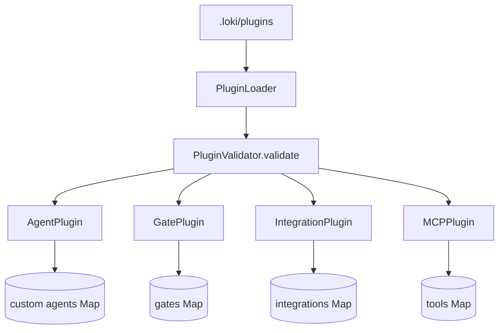
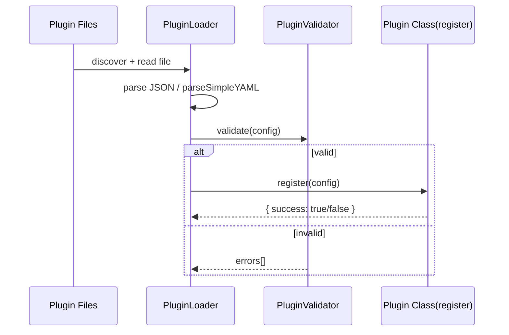
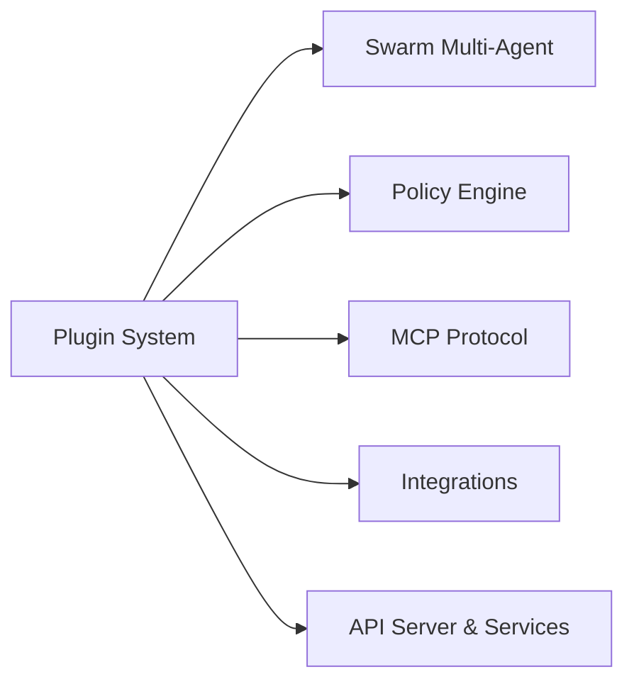

# Plugin System

Plugin System 可以把它想象成系统里的“扩展插座层”：核心系统提供稳定电压（基础能力），而插件模块提供统一插孔，让团队在**不改核心代码**的前提下插入自定义 Agent、质量门、Webhook 集成和 MCP 工具。它存在的根本原因是：业务变化速度远快于核心版本发布速度，插件化是把“变动面”从主干代码剥离出来。

---

## 1. 这个模块解决了什么问题（先讲问题空间）

如果没有插件系统，新增一个能力通常要走这条路径：改核心代码 → 改发布流程 → 回归测试全系统 → 上线。对于以下高频需求，这个成本过高：

- 团队想加一个新的 Agent 角色（`type: "agent"`）
- 在流水线里插入新的质量检查（`type: "quality_gate"`）
- 把运行时事件推送到企业内部平台（`type: "integration"`）
- 把已有 CLI 包装成 MCP tool（`type: "mcp_tool"`）

Plugin System 的回答是：
1. 用 `PluginLoader` 从配置文件发现并校验插件；
2. 按类型交给对应运行时组件（`AgentPlugin` / `GatePlugin` / `IntegrationPlugin` / `MCPPlugin`）；
3. 由这些组件在内存注册表里管理生命周期，并提供执行/查询能力。

这是一种**配置驱动扩展**，而不是“编译期扩展”。

---

## 2. 心智模型：把它当成“机场塔台 + 四类跑道”

想象 `PluginLoader` 是塔台：负责检查飞行计划（配置是否可解析、可校验），只允许合格计划起飞。  
四个插件类是四条跑道：

- `AgentPlugin`：给自定义 Agent 入场（但不允许占用内置航班号）
- `GatePlugin`：执行质量门命令
- `IntegrationPlugin`：把事件投递到外部 webhook
- `MCPPlugin`：把参数化命令包装成 MCP 工具

关键点：塔台不替跑道执行任务，跑道也不负责检查计划合法性。职责分层非常刻意。

---

## 3. 架构总览（基于提供代码）

### 叙述式 walkthrough

- `PluginLoader.discover()` 只扫描插件目录下 `.yaml/.yml/.json` 文件。  
- `PluginLoader._parseFile()` 对 JSON 走 `JSON.parse`，对 YAML 走内置 `parseSimpleYAML`。  
- `PluginLoader.loadAll()/loadOne()` 调 `this.validator.validate(config)`，把结果分成 `loaded` 与 `failed`。  
- 通过校验的配置再进入具体插件类的 `register()`。每类插件都维护一个模块级 `Map` 作为进程内注册表。  
- 执行类能力由具体插件负责：`GatePlugin.execute()`、`IntegrationPlugin.handleEvent()`、`MCPPlugin.execute()`。

> 说明：在提供代码里，没有一个“中央总调度器”把 `loadAll` 与四类 `register` 串成固定流程；这部分通常由上层 runtime/服务层完成。

---

## 4. 关键数据流（端到端）

## 流程 A：插件加载与注册

这条链路把“输入不确定性”挡在入口层：格式错、字段错、类型错会在加载阶段暴露，而不是到执行阶段爆炸。

## 流程 B：质量门执行（`GatePlugin.execute`）

1. 读取 `command` 与 `timeout_ms`（默认 30000）。  
2. 用 `execFile('/bin/sh', ['-c', command], { cwd, timeout, maxBuffer, env })` 执行。  
3. 汇总 `stdout/stderr`，返回 `{ passed, output, duration_ms }`。  
4. 错误一般走 resolve（`passed: false`），而不是 reject。

这意味着调用方必须检查 `passed`，不能只靠 `try/catch`。

## 流程 C：事件外发（`IntegrationPlugin.handleEvent`）

1. `renderTemplate()` 将 `{{event.xxx}}` 替换成事件值。  
2. 根据 `webhook_url` 协议选择 `https.request` 或 `http.request`。  
3. POST payload，超时/错误返回 `{ sent: false, error }`。  
4. 收到响应即 `{ sent: true, status }`（不按 status code 自动判失败）。

## 流程 D：MCP tool 执行（`MCPPlugin.execute`）

1. 将 `{{params.key}}` 替换成 `_sanitizeValue(value)` 后的 shell-safe 字符串。  
2. `/bin/sh -c` 执行并返回 `{ success, output, duration_ms }`。  
3. `getMCPDefinition(name)` 可把已注册工具映射成 MCP 所需 `inputSchema`。

---

## 5. 关键设计决策与权衡

## 决策 1：全静态类 + 模块级 `Map`

**选择**：`AgentPlugin/GatePlugin/IntegrationPlugin/MCPPlugin` 都是静态方法，状态存模块内 `Map`。  
**收益**：接入简单、调用成本低、测试容易（有 `_clearAll()`）。  
**代价**：仅进程内状态；多实例部署没有天然一致性；重启丢失注册数据。

## 决策 2：`PluginLoader` 使用同步 I/O

**选择**：`readFileSync/readdirSync/statSync`。  
**收益**：实现直观，启动时批量加载更容易保证顺序和确定性。  
**代价**：不适合高频热路径；如果在请求路径频繁调用会阻塞事件循环。

## 决策 3：内置简化 YAML 解析器（`parseSimpleYAML`）

**选择**：不引入 `js-yaml`，只支持常用子集。  
**收益**：依赖少、攻击面小、可控。  
**代价**：不是完整 YAML 语义，复杂 YAML 可能被误解析或不支持。

## 决策 4：命令执行走 shell（`/bin/sh -c`）

**选择**：`GatePlugin` 与 `MCPPlugin` 都走 shell。  
**收益**：极高兼容性，几乎任何现有 CLI/脚本都能接。  
**代价**：安全风险升高（命令注入、环境差异）；需要严控配置来源。

## 决策 5：结果对象优先，而非异常优先

**选择**：执行失败通常返回 `{ success/passed/sent: false, ... }`。  
**收益**：批处理场景更稳，单个插件失败不必打断整批。  
**代价**：调用方若忘记检查布尔字段，容易误判成功。

---

## 6. 子模块总结（含跳转）

- [agent_plugin.md](agent_plugin.md)  
  聚焦自定义 Agent 注册。核心约束是不能覆盖 `BUILTIN_AGENT_NAMES`，体现“可扩展但不破坏内核”的边界。

- [gate_plugin.md](gate_plugin.md)  
  负责质量门插件注册与命令执行，支持按 `phase` 检索（`getByPhase`）。适合把现有检查脚本纳入统一门禁入口。

- [integration_plugin.md](integration_plugin.md)  
  负责事件订阅与 webhook 投递。`renderTemplate` 支持 `{{event.xxx}}` 路径渲染，是最核心的数据映射能力。

- [mcp_plugin.md](mcp_plugin.md)  
  负责 MCP 工具插件注册、参数安全替换执行、以及 `getMCPDefinition` 的协议映射。

- [plugin_loader.md](plugin_loader.md)  
  负责文件发现、解析、校验、监听；是插件系统入口。

---

## 7. 与其他模块的依赖关系（基于模块树与可见代码）

- 与 [Swarm Multi-Agent](Swarm Multi-Agent.md)：`AgentPlugin` 注册出的 custom agent 定义通常由上游编排层消费。  
- 与 [Policy Engine](Policy Engine.md)：`GatePlugin` 的执行结果可作为策略/审批输入。  
- 与 [MCP Protocol](MCP Protocol.md)：`MCPPlugin.getMCPDefinition()` 产出的 schema 可用于协议层工具暴露。  
- 与 [Integrations](Integrations.md)：`IntegrationPlugin` 是通用 webhook 机制；`Integrations` 模块则是特定平台深度适配。  
- 与 [API Server & Services](API Server & Services.md)：运行时事件（如 EventBus）可作为 integration 插件的上游事件源。

> 注：上述跨模块“具体调用点”在当前提供代码中未直接展开，文档按职责关系描述，而非声称存在某个固定函数调用链。

---

## 8. 新贡献者最该注意的坑

1. **注册表是内存态，不持久化**  
   重启即丢。务必保证启动阶段有“重新加载 + 重新注册”流程。

2. **`retry_count` 在 `IntegrationPlugin` 中当前只存储不执行**  
   不要误以为 webhook 自动重试已生效。

3. **`GatePlugin` 超时与 maxBuffer 溢出共用一类错误文案**  
   看到 timeout 文案时，根因可能是输出过大。

4. **`MCPPlugin` 会替换 `{{params.key}}`，未提供的占位符会原样保留**  
   这可能导致命令语义异常，需要上层先做参数完整性校验。

5. **`PluginLoader.parseSimpleYAML` 是“够用版”**  
   复杂 YAML（深层对象、锚点等）不要依赖；尽量使用简单结构或 JSON。

6. **返回对象不是异常**  
   执行路径失败通常 `resolve(false)`；调用方必须显式检查 `success/passed/sent`。

7. **shell 执行安全边界在配置治理，不在运行时魔法**  
   即使 `MCPPlugin._sanitizeValue` 做了参数转义，`command` 本身依然是高权限入口。

---

## 9. 给新成员的实操建议

- 先从 [plugin_loader.md](plugin_loader.md) 看入口，再看四个插件类型实现。  
- 本地调试时优先验证 `loadAll().failed`，不要直接查执行失败日志。  
- 写新插件类型时，先想清楚它属于“注册类能力”还是“执行类能力”，保持现有分层风格。  
- 若要上生产，先补齐：配置来源权限控制、审计、超时策略、输出大小控制、失败告警。
