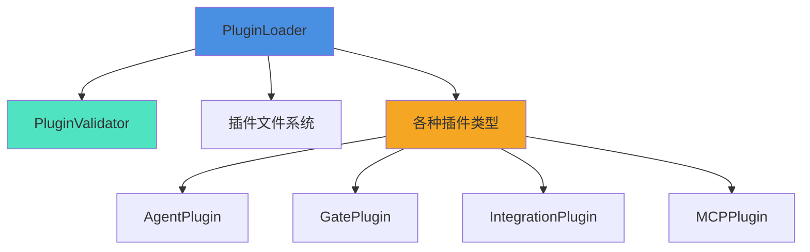

# PluginLoader 模块文档

## 概述

PluginLoader 模块是系统插件架构的核心组件，负责发现、解析、验证和加载各种类型的插件。该模块设计用于从指定目录自动加载插件配置文件，并提供实时监控插件变更的功能。

### 核心功能

- **插件发现**：自动扫描并发现指定目录中的插件配置文件
- **配置解析**：支持 YAML 和 JSON 格式的插件配置文件解析
- **配置验证**：通过 PluginValidator 确保插件配置的正确性和安全性
- **变更监控**：实时监控插件目录的文件变更
- **无依赖设计**：内置简化版 YAML 解析器，避免外部依赖

## 架构与组件关系

PluginLoader 模块与系统中的其他插件相关组件紧密协作。下图展示了 PluginLoader 在插件系统中的位置和关系：



### 核心组件

#### PluginLoader 类

PluginLoader 是整个模块的主类，提供所有插件管理的核心功能。

**构造函数：**
```javascript
constructor(pluginsDir, schemasDir)
```

**参数：**
- `pluginsDir` (string, 可选): 插件目录路径，默认为 `.loki/plugins`
- `schemasDir` (string, 可选): 验证模式目录路径

**主要属性：**
- `pluginsDir`: 插件目录路径
- `validator`: PluginValidator 实例
- `_watchers`: 文件监视器数组

### 依赖关系

PluginLoader 依赖于 PluginValidator 进行插件配置验证，后者定义在 [PluginValidator.md](PluginValidator.md) 中有详细说明。

## 核心功能详解

### 1. 插件发现

**方法：**`discover()`

该方法扫描插件目录，发现所有有效的插件配置文件。

**返回值：**
- `string[]`: 插件文件路径数组，按字母顺序排序

**实现逻辑：**
1. 检查插件目录是否存在
2. 验证路径是否为目录
3. 扫描目录中的所有文件
4. 筛选出 .yaml、.yml 和 .json 文件
5. 返回排序后的文件路径数组

### 2. 插件配置解析

**方法：**`_parseFile(filePath)`

该方法解析单个插件配置文件，支持 YAML 和 JSON 格式。

**参数：**
- `filePath` (string): 插件文件路径

**返回值：**
- `object|null`: 解析后的配置对象，解析失败返回 null

**支持的格式：**
- JSON 格式：使用标准 JSON.parse
- YAML 格式：使用内置的简化 YAML 解析器

### 3. 插件加载

#### 批量加载：`loadAll()`

加载插件目录中的所有插件。

**返回值：**
```javascript
{
  loaded: Array<{path: string, config: object}>,
  failed: Array<{path: string, errors: string[]}>
}
```

**加载过程：**
1. 发现所有插件文件
2. 逐个解析文件
3. 验证配置
4. 分类返回成功和失败的插件

#### 单个加载：`loadOne(filePath)`

加载单个插件文件。

**参数：**
- `filePath` (string): 插件文件路径

**返回值：**
```javascript
{
  config: object|null,
  errors: string[]
}
```

### 4. 文件监控

#### 启动监控：`watchForChanges(callback)`

监控插件目录的文件变更。

**参数：**
- `callback` (function): 变更回调函数，接收 (eventType, filePath)

**返回值：**
- `function`: 清理函数，调用停止监控

**监控的事件类型：**
- 'rename': 文件重命名或删除
- 'change': 文件内容变更

#### 停止监控：`stopWatching()`

停止所有文件监控器。

## YAML 解析器

PluginLoader 内置了一个简化的 YAML 解析器，避免了对外部 js-yaml 库的依赖。

### parseSimpleYAML(content)

解析 YAML 内容为 JavaScript 对象。

**支持的 YAML 特性：**

1. 键值对
2. 数组（- item 格式）
3. 多行字符串（| 或 >）
4. 布尔值
5. 数字
6. 注释（# 开头）
7. 引号字符串

### parseYAMLValue(raw)

解析单个 YAML 值。

**支持的值类型：**
- null/空字符串
- 布尔值 true/false
- 引号字符串
- 整数和浮点数
- 字符串

## 使用示例

### 基本使用：

```javascript
const { PluginLoader } = require('./src/plugins/loader');

// 创建 PluginLoader 实例
const loader = new PluginLoader('./plugins', './schemas');

// 加载所有插件
const result = loader.loadAll();
console.log('成功加载的插件:', result.loaded);
console.log('加载失败的插件:', result.failed);

// 监控插件变更
const cleanup = loader.watchForChanges((eventType, filePath) => {
  console.log(`插件文件变更: ${eventType} - ${filePath}`);
  // 重新加载插件
});

// 停止监控
// cleanup();
```

### 单个插件加载：

```javascript
const { PluginLoader } = require('./src/plugins/loader');

const loader = new PluginLoader('./plugins');
const result = loader.loadOne('./plugins/my-plugin.yaml');

if (result.config) {
  console.log('插件配置:', result.config);
} else {
  console.log('加载错误:', result.errors);
}
```

## 配置与扩展

### 插件文件格式要求：

插件配置文件必须满足以下条件：
- 文件扩展名：.yaml, .yml 或 .json
- 必须包含 type 和 name 字段
- type 必须是有效的插件类型
- 配置必须通过 PluginValidator 验证

### 支持的插件类型：

系统支持的插件类型包括：
- agent: 智能体插件
- gate: 门控插件
- integration: 集成插件
- mcp: MCP 协议插件

详细的插件类型说明请参考对应模块文档。

## 注意事项与限制

### 已知限制

1. **YAML 解析限制**：内置的 YAML 解析器是简化版本，不支持所有 YAML 特性：
   - 不支持复杂的嵌套结构
   - 不支持 YAML 引用和别名
   - 不支持标签和标签处理
   - 不支持复杂的多行字符串格式

2. **文件监控限制**：
   - 依赖 Node.js 的 fs.watch API，不同平台行为可能有差异
   - 某些文件系统事件可能被合并或重复触发

3. **插件配置限制**：
   - 插件名称不能与内置 Agent 名称冲突

### 错误处理

PluginLoader 在以下情况下会返回错误：

1. **文件解析错误**：
   - 文件格式不正确
   - 文件读取失败

2. **验证错误**：
   - 缺少必需字段
   - 字段类型不正确
   - 安全检查失败

3. **安全限制**：
   - 命令字段包含潜在的 shell 注入字符
   - webhook_url 不使用 HTTPS 或 localhost
   - 模板变量使用不当

### 最佳实践

1. **插件文件组织**：
   - 为每个插件使用单独的配置文件
   - 使用有意义的插件名称
   - 保持插件配置简洁明了

2. **安全考虑**：
   - 避免在插件配置中包含敏感信息
   - 验证所有外部输入
   - 使用 HTTPS 进行 webhook 通信

3. **监控与调试**：
   - 监控插件加载结果，及时处理加载失败的插件
   - 使用文件监控功能实现插件热更新
   - 记录插件加载和变更日志

## 相关模块

- [PluginValidator](PluginValidator.md) - 插件验证器
- [AgentPlugin](AgentPlugin.md) - 智能体插件
- [GatePlugin](GatePlugin.md) - 门控插件
- [IntegrationPlugin](IntegrationPlugin.md) - 集成插件
- [MCPPlugin](MCPPlugin.md) - MCP 协议插件
