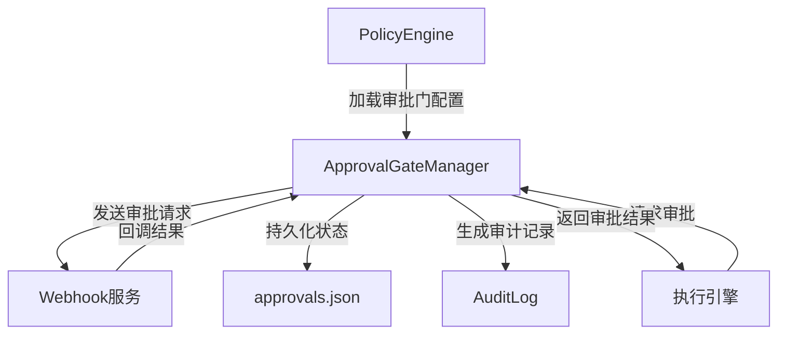

# Policy Engine - Approval Gate 模块文档

## 概述

Policy Engine - Approval Gate 模块是一个强大的审批管理系统，允许在指定阶段暂停执行流程，等待人工或自动审批。该模块提供可配置的审批断点、Webhook 回调、自动批准超时机制以及完整的审计跟踪功能，是构建安全、可控的自动化工作流的关键组件。

### 核心特性

- **可配置的阶段审批断点**：在任意指定阶段设置审批门控
- **异步 Webhook 回调**：支持通过 HTTP/HTTPS 接口发送审批请求
- **智能超时处理**：默认 30 分钟超时，支持配置超时后自动批准或拒绝
- **状态持久化**：审批状态保存在 `.loki/state/approvals.json`
- **完整审计跟踪**：记录所有审批决策的详细信息
- **SSRF 防护**：内置安全机制防止服务端请求伪造攻击

## 架构与组件关系

ApprovalGateManager 是 Policy Engine 生态系统的重要组成部分，与其他模块紧密协作。



### 模块集成

ApprovalGateManager 通常与 [Policy Engine - Core Engine](Policy Engine - Core Engine.md) 配合使用，由 PolicyEngine 加载策略配置并创建 ApprovalGateManager 实例。同时，它也可以独立使用。

## 核心组件详解

### ApprovalGateManager 类

`ApprovalGateManager` 是整个审批门系统的核心类，负责管理审批请求的生命周期、状态持久化和 Webhook 通信。

#### 构造函数

```javascript
constructor(projectDir, gates)
```

**参数说明：**
- `projectDir` (string): 项目根目录，包含 `.loki/` 文件夹
- `gates` (Array): 审批门定义数组，来自策略配置

**示例：**
```javascript
const { ApprovalGateManager } = require('./src/policies/approval');

const gates = [
  {
    name: '生产部署审批',
    phase: 'deploy',
    webhook: 'https://example.com/approval-webhook',
    timeout_minutes: 60,
    auto_approve_on_timeout: false
  }
];

const approvalManager = new ApprovalGateManager('/path/to/project', gates);
```

#### 主要方法

##### requestApproval

```javascript
requestApproval(phase, context)
```

请求阶段审批的核心方法，返回 Promise，在审批完成、拒绝或超时时解析。

**参数：**
- `phase` (string): 阶段名称，如 "deploy"、"test"
- `context` (object): 审批请求的上下文数据

**返回值：**
- `Promise<{approved: boolean, reason: string, method: string}>`

**工作流程：**
1. 查找对应阶段的审批门配置
2. 如果无配置，自动批准
3. 创建审批请求记录并持久化
4. 发送 Webhook（如配置）
5. 设置超时定时器
6. 返回 Promise 等待外部解决

**示例：**
```javascript
approvalManager.requestApproval('deploy', {
  task_id: 'task-123',
  description: '生产环境部署',
  changes: ['新增API端点', '数据库迁移']
})
.then(result => {
  if (result.approved) {
    console.log('审批通过:', result.reason);
    // 继续执行部署流程
  } else {
    console.log('审批被拒绝:', result.reason);
    // 终止或回滚流程
  }
});
```

##### resolveApproval

```javascript
resolveApproval(requestId, approved, reason)
```

外部解决待处理审批请求的方法，用于通过 Webhook 回调或管理界面人工审批。

**参数：**
- `requestId` (string): 审批请求 ID
- `approved` (boolean): 是否批准
- `reason` (string, 可选): 决策原因

**返回值：**
- `boolean`: 请求是否找到并成功解决

**示例：**
```javascript
// 通过 Webhook 回调处理审批
app.post('/approval-callback', (req, res) => {
  const { request_id, approved, reason } = req.body;
  const success = approvalManager.resolveApproval(request_id, approved, reason);
  
  if (success) {
    res.json({ status: 'ok' });
  } else {
    res.status(404).json({ error: 'Request not found' });
  }
});
```

##### findGate 和 hasGate

```javascript
findGate(phase)
hasGate(phase)
```

查找和检查阶段是否有审批门配置的辅助方法。

**参数：**
- `phase` (string): 阶段名称

**返回值：**
- `findGate`: 返回门配置对象或 null
- `hasGate`: 返回 boolean

##### getAuditTrail 和 getPendingRequests

```javascript
getAuditTrail()
getPendingRequests()
```

获取审计跟踪和待处理请求的方法。

**返回值：**
- `getAuditTrail`: 完整审计记录数组
- `getPendingRequests`: 所有状态为 'pending' 的请求数组

##### destroy

```javascript
destroy()
```

清理所有待处理定时器和资源的方法，应在应用关闭时调用。

## 审批门配置

审批门通过策略配置文件（`.loki/policies.json` 或 `.loki/policies.yaml`）定义。

### 配置结构

```json
{
  "policies": {
    "approval_gates": [
      {
        "name": "审批门名称",
        "phase": "阶段标识符",
        "webhook": "https://example.com/webhook",
        "timeout_minutes": 30,
        "auto_approve_on_timeout": false
      }
    ]
  }
}
```

### 配置字段说明

| 字段 | 类型 | 必填 | 默认值 | 说明 |
|------|------|------|--------|------|
| `name` | string | 是 | - | 审批门的人类可读名称 |
| `phase` | string | 是 | - | 触发此审批门的阶段标识符 |
| `webhook` | string | 否 | null | 审批请求的 Webhook URL |
| `timeout_minutes` | number | 否 | 30 | 审批超时时间（分钟） |
| `auto_approve_on_timeout` | boolean | 否 | false | 超时后是否自动批准 |

### 配置示例

#### 基本配置

```json
{
  "policies": {
    "approval_gates": [
      {
        "name": "生产环境部署审批",
        "phase": "deploy_production",
        "webhook": "https://your-team.com/approval",
        "timeout_minutes": 60,
        "auto_approve_on_timeout": false
      }
    ]
  }
}
```

#### 多阶段审批

```json
{
  "policies": {
    "approval_gates": [
      {
        "name": "代码合并审批",
        "phase": "merge_code",
        "webhook": "https://your-team.com/code-approval",
        "timeout_minutes": 1440,
        "auto_approve_on_timeout": false
      },
      {
        "name": "测试环境部署",
        "phase": "deploy_staging",
        "timeout_minutes": 5,
        "auto_approve_on_timeout": true
      },
      {
        "name": "生产环境部署",
        "phase": "deploy_production",
        "webhook": "https://your-team.com/prod-approval",
        "timeout_minutes": 60,
        "auto_approve_on_timeout": false
      }
    ]
  }
}
```

## Webhook 集成

### Webhook 请求格式

当配置了 Webhook 时，ApprovalGateManager 会发送 POST 请求到指定 URL，格式如下：

```json
{
  "type": "approval_request",
  "id": "apr-abc123def456",
  "phase": "deploy",
  "gate": "生产环境部署审批",
  "context": {
    "task_id": "task-123",
    "description": "部署新版本"
  },
  "createdAt": "2023-10-05T14:48:00.000Z"
}
```

### Webhook 回调格式

外部系统处理完审批后，应调用 `resolveApproval` 方法，或者通过自定义端点处理回调。建议的回调格式：

```json
{
  "request_id": "apr-abc123def456",
  "approved": true,
  "reason": "代码审查通过，批准部署"
}
```

### Webhook 安全

ApprovalGateManager 内置了 SSRF（服务端请求伪造）防护机制：

1. 仅允许 HTTP 和 HTTPS 协议
2. 禁止内部/私有地址：
   - localhost / 127.0.0.1 / ::1
   - RFC1918 私有地址范围（10.x.x.x, 192.168.x.x, 172.16-31.x.x）
   - 链路本地地址（169.254.x.x）
   - IPv6 私有/环回地址

## 状态持久化

### 状态文件结构

审批状态保存在 `.loki/state/approvals.json`，结构如下：

```json
{
  "requests": [
    {
      "id": "apr-abc123def456",
      "phase": "deploy",
      "gate": "生产环境部署审批",
      "status": "approved",
      "context": {...},
      "createdAt": "2023-10-05T14:48:00.000Z",
      "resolvedAt": "2023-10-05T15:30:00.000Z",
      "method": "manual",
      "reason": "批准部署"
    }
  ],
  "audit": [
    {
      "id": "apr-abc123def456",
      "phase": "deploy",
      "gate": "生产环境部署审批",
      "status": "approved",
      "method": "manual",
      "reason": "批准部署",
      "createdAt": "2023-10-05T14:48:00.000Z",
      "resolvedAt": "2023-10-05T15:30:00.000Z"
    }
  ]
}
```

### 状态管理

- **加载**：构造函数会自动加载现有状态文件
- **保存**：每次状态变更（创建请求、解决请求）都会自动保存
- **损坏处理**：如果状态文件损坏，会自动重置为空状态

### 审计跟踪限制

为防止状态文件无限增长，审计记录最多保留 10,000 条（`MAX_AUDIT_ENTRIES`），超过时会自动删除最早的记录。

## 完整使用示例

### 集成到工作流

```javascript
const { ApprovalGateManager } = require('./src/policies/approval');
const { PolicyEngine } = require('./src/policies/engine');

// 初始化 PolicyEngine 并加载策略
const policyEngine = new PolicyEngine('/path/to/project', { watch: true });

// 创建 ApprovalGateManager
const approvalGates = policyEngine.getApprovalGates();
const approvalManager = new ApprovalGateManager('/path/to/project', approvalGates);

// 工作流函数
async function runDeploymentWorkflow() {
  try {
    console.log('1. 准备部署...');
    await prepareDeployment();
    
    console.log('2. 请求审批...');
    const approvalResult = await approvalManager.requestApproval('deploy', {
      task_id: 'deploy-2023-10-05',
      environment: 'production',
      version: 'v2.1.0',
      changes: ['新增API端点', '性能优化']
    });
    
    if (!approvalResult.approved) {
      console.log('部署被拒绝:', approvalResult.reason);
      return;
    }
    
    console.log('3. 执行部署...');
    await executeDeployment();
    
    console.log('4. 部署完成！');
  } catch (error) {
    console.error('工作流失败:', error);
  } finally {
    // 清理资源
    approvalManager.destroy();
    policyEngine.destroy();
  }
}

// 启动工作流
runDeploymentWorkflow();
```

### 创建审批管理接口

```javascript
const express = require('express');
const { ApprovalGateManager } = require('./src/policies/approval');

const app = express();
app.use(express.json());

// 初始化审批管理器
const approvalManager = new ApprovalGateManager('/path/to/project', [
  // 审批门配置
]);

// 获取待处理审批
app.get('/approvals/pending', (req, res) => {
  const pending = approvalManager.getPendingRequests();
  res.json(pending);
});

// 获取审计跟踪
app.get('/approvals/audit', (req, res) => {
  const audit = approvalManager.getAuditTrail();
  res.json(audit);
});

// 审批/拒绝请求
app.post('/approvals/resolve', (req, res) => {
  const { request_id, approved, reason } = req.body;
  
  if (!request_id || typeof approved !== 'boolean') {
    return res.status(400).json({ error: '缺少必要参数' });
  }
  
  const success = approvalManager.resolveApproval(request_id, approved, reason);
  
  if (success) {
    res.json({ status: 'ok' });
  } else {
    res.status(404).json({ error: '请求未找到或已处理' });
  }
});

// 启动服务器
app.listen(3000, () => {
  console.log('审批管理服务运行在端口 3000');
});

// 优雅关闭
process.on('SIGTERM', () => {
  approvalManager.destroy();
  process.exit(0);
});
```

## 错误处理与边缘情况

### 常见错误场景

1. **Webhook 发送失败**
   - Webhook 发送是"发后即忘"（fire-and-forget）模式
   - 失败时会静默忽略，不会影响审批流程本身
   - 超时机制会作为后备方案

2. **状态文件损坏**
   - 加载时检测到 JSON 解析错误会自动重置为空状态
   - 不会抛出异常，保证系统继续运行

3. **重复解决请求**
   - 第二次调用 `resolveApproval` 会返回 false
   - 第一个解决操作的结果保持不变

4. **程序重启后待处理请求**
   - 状态持久化到磁盘，但定时器不持久化
   - 程序重启后，之前的待处理请求需要手动重新设置超时或解决

### 限制与注意事项

1. **内存中的定时器**：超时定时器仅存在于内存中，程序重启后丢失
2. **审计记录限制**：最多 10,000 条审计记录，超出会删除旧记录
3. **Webhook 安全**：内部地址被阻止，无法向 localhost 或私有网络发送 Webhook
4. **并发处理**：多个审批请求可以并行处理，但每个请求的状态变更是原子的
5. **单例模式**：建议每个项目目录只创建一个 ApprovalGateManager 实例，避免状态冲突

## 性能考虑

- **状态保存**：每次状态变更都会写入磁盘，高频操作时可能考虑批量保存
- **Webhook 超时**：Webhook 请求设置了 5 秒超时，避免阻塞
- **内存管理**：长期运行时，注意调用 `destroy()` 清理定时器，避免内存泄漏

## 与其他模块的关系

- **Policy Engine - Core Engine**：提供审批门配置的加载和验证（详见 [Policy Engine - Core Engine.md](Policy Engine - Core Engine.md)）
- **Audit**：ApprovalGateManager 有自己的审计功能，也可与外部审计系统集成（详见 [Audit.md](Audit.md)）
- **Policy Engine - Cost Control**：可与成本控制模块配合，在预算超支时触发审批（详见 [Policy Engine - Cost Control.md](Policy Engine - Cost Control.md)）

## 总结

Policy Engine - Approval Gate 模块提供了一个灵活、安全且易于集成的审批管理系统。通过合理配置审批门，可以在自动化工作流中建立必要的人工检查点，既保证了效率又确保了安全性。其内置的 Webhook 支持、超时处理和审计功能使其成为构建企业级自动化系统的理想选择。
