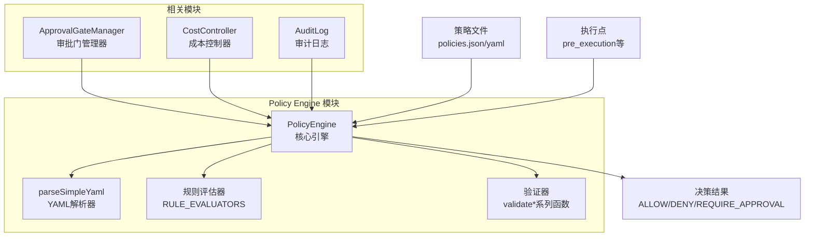
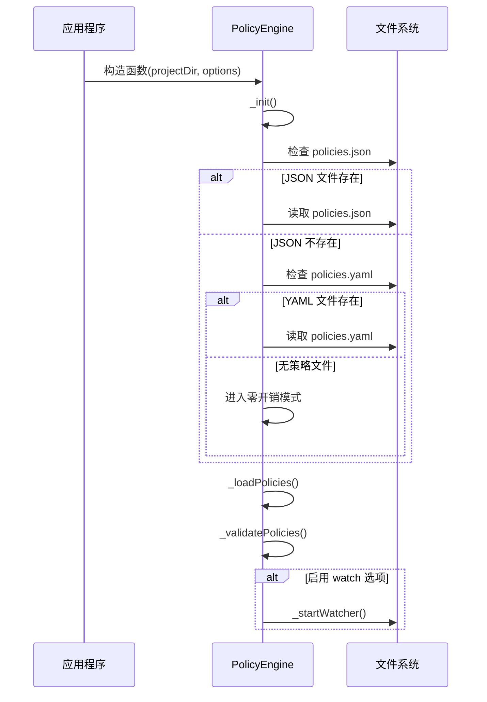
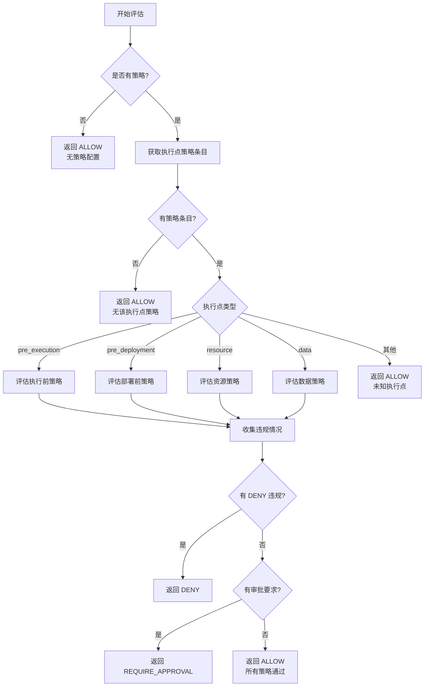

# Policy Engine - Core Engine

## 概述

Policy Engine 是 Loki Mode 系统中的核心策略评估引擎，负责在关键执行点对系统行为进行安全和合规性检查。该模块采用同步评估机制，设计目标是在10毫秒内完成单次策略评估，确保不会对系统性能造成显著影响。

Policy Engine 的核心价值在于：
- 在执行前、部署前、资源使用和数据处理等关键节点提供强制合规检查
- 支持灵活的策略定义，可通过 JSON 或 YAML 格式配置
- 提供零开销模式：在未配置策略文件时，系统会立即返回 ALLOW 决策
- 自动监控策略文件变更并实时重新加载

## 架构与组件关系

### 系统架构

Policy Engine 在整个系统中处于策略执行的核心位置，与其他关键模块紧密协作：



### 核心组件说明

Policy Engine 包含以下核心组件：

1. **PolicyEngine 类**：引擎的主入口点，负责策略加载、评估和管理
2. **parseSimpleYaml 函数**：轻量级 YAML 解析器，专门用于解析策略文件
3. **规则评估系统**：包括 `evaluateRule`、`scanContent` 等评估函数
4. **验证器集**：`validatePreExecution`、`validatePreDeployment` 等策略验证函数

## 核心功能详解

### 策略加载与管理

Policy Engine 支持从项目的 `.loki/` 目录中加载策略文件，优先使用 `policies.json`，如果不存在则回退到 `policies.yaml`。

#### 初始化流程



#### 策略文件监控

当使用 `watch: true` 选项初始化时，Policy Engine 会通过 `fs.watchFile` 监控策略文件的变更，默认每秒检查一次。当检测到文件变更时，会自动重新加载策略并更新缓存。

### 策略评估机制

Policy Engine 在以下五个关键执行点进行策略评估：

1. **pre_execution**：代理执行操作前
2. **pre_deployment**：部署前
3. **resource**：资源使用约束
4. **data**：数据安全检查
5. **approval_gates**：审批门定义

#### 评估流程



### 执行点评估详解

#### 1. pre_execution 执行前评估

此执行点在代理执行任何操作前触发，用于检查操作是否符合预定义的规则集合。

**工作原理：**
- 遍历所有 `pre_execution` 策略条目
- 对每个条目调用 `evaluateRule(entry.rule, context)` 评估规则
- 规则评估结果为 `false` 时触发违规

**策略配置示例：**
```yaml
policies:
  pre_execution:
    - name: 禁止危险操作
      rule: "dangerous_operation"
      action: deny
    - name: 需要审核的更改
      rule: "needs_review"
      action: require_approval
```

#### 2. pre_deployment 部署前评估

此执行点在部署前触发，用于确保所有必要的质量门都已通过。

**工作原理：**
- 检查 `context.passed_gates` 中是否包含所有必需的门
- 任何缺失的门都会导致违规

**策略配置示例：**
```yaml
policies:
  pre_deployment:
    - name: 质量门禁检查
      gates:
        - unit_tests_passed
        - security_scan_passed
      action: deny
```

#### 3. resource 资源评估

此执行点用于控制资源使用，包括供应商限制和令牌预算。

**工作原理：**
- 检查 `context.provider` 是否在允许的供应商列表中
- 检查 `context.tokens_consumed` 是否超过 `max_tokens` 限制

**策略配置示例：**
```yaml
policies:
  resource:
    - name: 供应商限制
      providers:
        - openai
        - anthropic
      action: deny
    - name: 令牌预算
      max_tokens: 100000
      on_exceed: require_approval
```

#### 4. data 数据评估

此执行点用于扫描和检测敏感数据，如密钥、PII 等。

**工作原理：**
- 使用 `scanContent(context.content, entry.type)` 扫描内容
- 根据 `entry.type` 指定的类型进行检测
- 检测到任何内容都会触发违规

**策略配置示例：**
```yaml
policies:
  data:
    - name: 密钥检测
      type: secrets
      action: deny
    - name: PII 检测
      type: pii
      action: require_approval
```

## API 参考

### PolicyEngine 类

#### 构造函数

```javascript
new PolicyEngine(projectDir, options)
```

**参数：**
- `projectDir` (string): 项目根目录，包含 `.loki/` 文件夹
- `options` (object, 可选): 配置选项
  - `watch` (boolean): 是否监控策略文件变更，默认为 `false`

**返回值：** PolicyEngine 实例

#### 公共方法

##### evaluate(enforcementPoint, context)

评估指定执行点的策略。

**参数：**
- `enforcementPoint` (string): 执行点类型，可选值：`pre_execution`、`pre_deployment`、`resource`、`data`
- `context` (object): 评估上下文数据

**返回值：**
```javascript
{
  allowed: boolean,           // 是否允许执行
  decision: string,           // 决策结果：Decision.ALLOW/DENY/REQUIRE_APPROVAL
  reason: string,             // 决策原因说明
  requiresApproval: boolean,  // 是否需要审批
  violations: Array           // 违规详情数组
}
```

##### getApprovalGates()

获取加载的策略中定义的审批门列表。

**返回值：** Array - 审批门定义数组

##### getResourcePolicies()

获取资源策略，用于成本控制集成。

**返回值：** Array - 资源策略数组

##### hasPolicies()

检查是否加载了任何策略。

**返回值：** boolean - 是否有策略加载

##### getValidationErrors()

获取上次加载时的验证错误。

**返回值：** Array - 验证错误数组

##### destroy()

停止监控策略文件。

**返回值：** 无

##### reload()

强制从磁盘重新加载策略。

**返回值：** 无

### parseSimpleYaml 函数

```javascript
parseSimpleYaml(text)
```

轻量级 YAML 解析器，专门用于解析策略文件。

**参数：**
- `text` (string): YAML 文本内容

**返回值：** object - 解析后的 JavaScript 对象

**支持的 YAML 特性：**
- 标量值（字符串、数字、布尔值、null）
- 数组（内联和 `- item` 格式）
- 嵌套对象（通过缩进）
- 注释

**不支持的 YAML 特性：**
- 多行字符串
- 锚点/别名
- 复杂类型

## 使用指南

### 基本使用

```javascript
const { PolicyEngine } = require('./src/policies/engine');

// 初始化策略引擎
const policyEngine = new PolicyEngine('/path/to/project', { watch: true });

// 评估执行前策略
const result = policyEngine.evaluate('pre_execution', {
  action: 'write_file',
  path: '/etc/passwd'
});

if (!result.allowed) {
  console.log('操作被拒绝:', result.reason);
  if (result.requiresApproval) {
    // 处理审批流程
  }
} else {
  // 继续执行操作
}

// 使用完毕后清理
policyEngine.destroy();
```

### 策略文件配置

#### 完整策略文件示例（YAML）

```yaml
policies:
  pre_execution:
    - name: 禁止修改系统文件
      rule: "modify_system_files"
      action: deny
    - name: 敏感操作需要审批
      rule: "sensitive_operation"
      action: require_approval
  
  pre_deployment:
    - name: 必须通过所有质量门禁
      gates:
        - unit_tests
        - integration_tests
        - security_scan
      action: deny
  
  resource:
    - name: 只允许使用指定的模型供应商
      providers:
        - openai
        - anthropic
      action: deny
    - name: 令牌预算控制
      max_tokens: 500000
      on_exceed: require_approval
  
  data:
    - name: 防止密钥泄露
      type: secrets
      action: deny
    - name: PII 数据检测
      type: pii
      action: require_approval
  
  approval_gates:
    - name: 安全审核
      id: security_review
      approvers:
        - security-team
```

### 与其他模块集成

#### 与 ApprovalGateManager 集成

```javascript
const { PolicyEngine } = require('./src/policies/engine');
const { ApprovalGateManager } = require('./src/policies/approval');

const policyEngine = new PolicyEngine('/path/to/project');
const approvalManager = new ApprovalGateManager(policyEngine.getApprovalGates());

// 在需要审批时
const result = policyEngine.evaluate('pre_execution', context);
if (result.requiresApproval) {
  const approvalRequest = approvalManager.createRequest(result.violations);
  // 处理审批流程
}
```

#### 与 CostController 集成

```javascript
const { PolicyEngine } = require('./src/policies/engine');
const { CostController } = require('./src/policies/cost');

const policyEngine = new PolicyEngine('/path/to/project');
const costController = new CostController(policyEngine.getResourcePolicies());

// 在使用资源前检查
const resourceResult = policyEngine.evaluate('resource', {
  provider: 'openai',
  tokens_consumed: costController.getCurrentUsage()
});
```

## 性能考虑

Policy Engine 设计为高性能同步评估引擎，具有以下性能特性：

1. **评估性能目标**：< 10ms 单次评估
2. **I/O 操作**：仅在初始化和重新加载时发生，评估过程无 I/O
3. **零开销模式**：无策略文件时，所有评估立即返回 ALLOW
4. **内存使用**：策略文件内容缓存在内存中

### 性能优化建议

1. **策略条目数量**：建议每个执行点的策略条目不超过 100 条
2. **规则复杂度**：复杂规则评估可能影响性能，可考虑拆分或简化
3. **监控间隔**：生产环境中可适当增加文件监控间隔（默认 1 秒）
4. **资源策略**：大量资源策略可能影响评估速度，建议定期清理过期策略

## 错误处理与边缘情况

### 策略文件加载错误

当策略文件无法加载或解析时：
- 引擎会记录验证错误到 `_validationErrors`
- `_policies` 会被设置为 `null`，进入零开销模式
- 所有评估调用会返回 ALLOW，但 `getValidationErrors()` 会显示错误

### 无效的执行点

当传递未知的执行点时：
- 评估返回 ALLOW
- 原因说明为 "Unknown enforcement point: [point]"

### 上下文数据缺失

当评估所需的上下文数据缺失时：
- 对于大多数评估，会视为通过（不触发违规）
- `data` 评估在缺少 `context.content` 时会跳过
- 建议提供完整的上下文数据以确保正确评估

### 并发访问

PolicyEngine 实例设计为线程安全吗？
- 策略加载和重新加载使用同步 I/O，会阻塞事件循环
- 评估过程是纯同步的，没有竞态条件
- 在高并发环境中，建议为每个线程/进程创建独立实例

## 限制与已知问题

1. **YAML 解析限制**：`parseSimpleYaml` 只支持 YAML 规范的子集，不支持高级特性
2. **同步 I/O**：策略加载使用同步文件操作，可能在大型项目中影响启动时间
3. **规则扩展**：自定义规则需要修改代码，目前不支持动态加载规则评估器
4. **内存使用**：大型策略文件会完全加载到内存中
5. **Windows 兼容性**：文件监控在 Windows 上可能有延迟或不一致行为

## 扩展与自定义

### 添加自定义规则评估器

要添加新的规则评估器，需要修改 `./types.js` 中的 `RULE_EVALUATORS` 对象：

```javascript
// 在 types.js 中
RULE_EVALUATORS['custom_rule'] = function(context) {
  // 自定义评估逻辑
  // 返回 true = 通过，false = 失败，null = 未知规则
  return context.someCondition === true;
};
```

然后在策略文件中使用：

```yaml
policies:
  pre_execution:
    - name: 自定义规则检查
      rule: "custom_rule"
      action: deny
```

### 封装 PolicyEngine

可以创建自定义封装来满足特定需求：

```javascript
class CustomPolicyEngine extends PolicyEngine {
  constructor(projectDir) {
    super(projectDir, { watch: true });
    this.customMetrics = [];
  }
  
  evaluateWithMetrics(enforcementPoint, context) {
    const start = Date.now();
    const result = this.evaluate(enforcementPoint, context);
    const duration = Date.now() - start;
    
    this.customMetrics.push({
      enforcementPoint,
      duration,
      decision: result.decision
    });
    
    return result;
  }
}
```

## 相关模块

- [Policy Engine - Approval Gate](Policy Engine - Approval Gate.md)：审批门管理模块
- [Policy Engine - Cost Control](Policy Engine - Cost Control.md)：成本控制模块
- [Audit](Audit.md)：审计日志模块
- [Dashboard Backend](Dashboard Backend.md)：策略配置的 UI 后端

## 总结

Policy Engine 是 Loki Mode 系统中的策略执行核心，提供了灵活、高性能的策略评估机制。通过在关键执行点进行合规检查，确保系统操作符合安全和业务规则。其设计注重性能和易用性，支持自动重载和零开销模式，适合在生产环境中使用。
