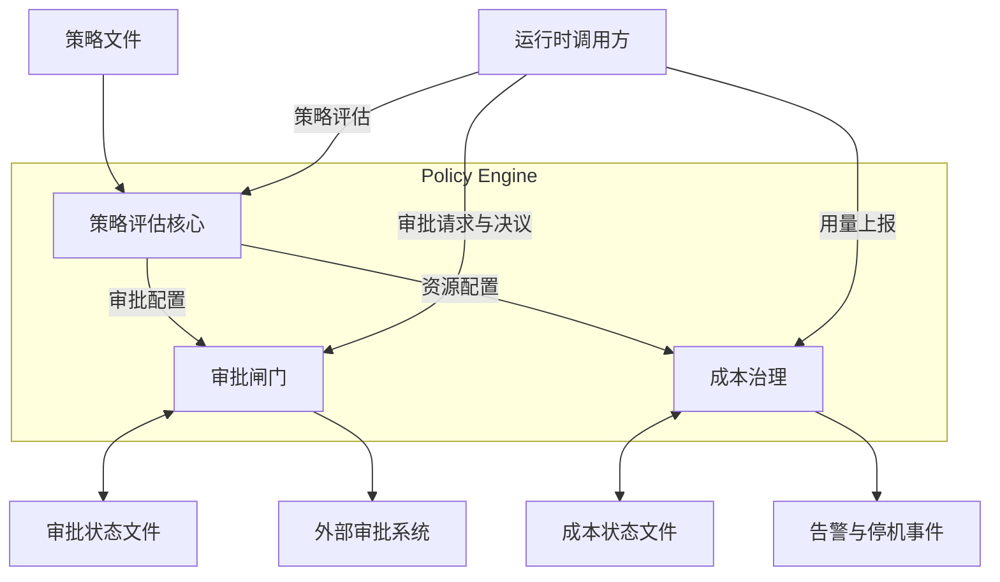
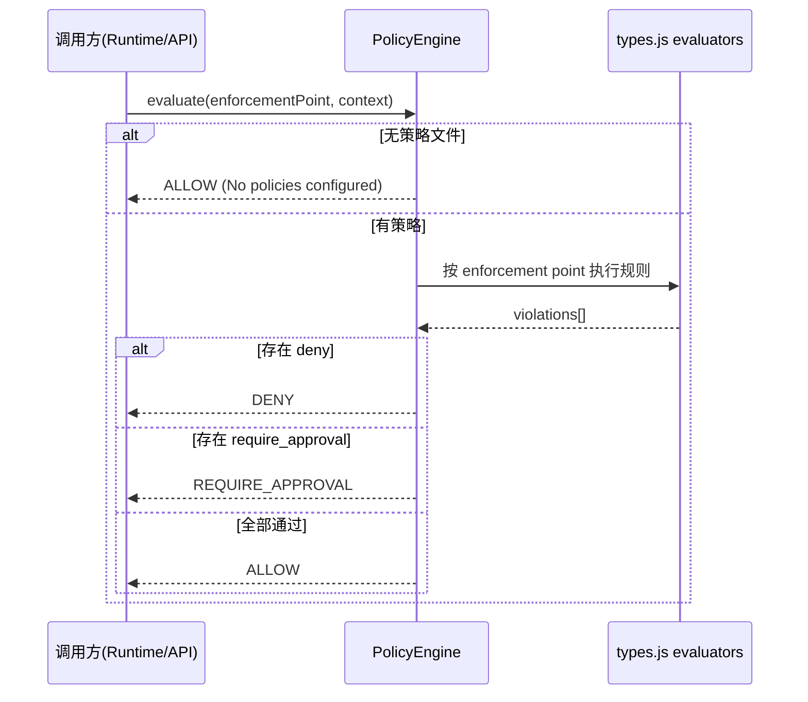
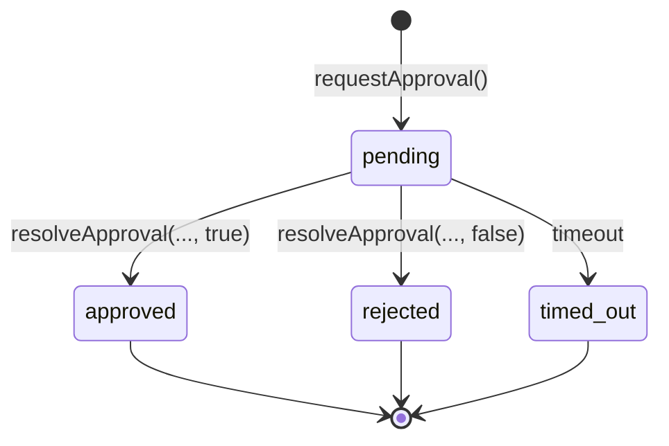
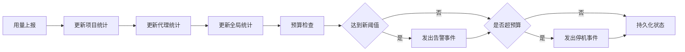

# Policy Engine 模块文档

## 1. 模块简介：它解决什么问题，为什么存在

`Policy Engine` 是 Loki Mode 中负责“治理决策”的核心模块，用于在关键执行点对行为进行准入控制。它把“策略定义（Policy-as-Code）”和“业务执行逻辑”分离，使系统在执行动作前可以统一做合规、安全、预算与人工审批判断，而不是把这些判断分散在各服务中。

该模块存在的直接原因是：自动化系统在规模化后会遇到三类高风险问题。第一类是**安全和合规风险**，例如越权文件访问、敏感信息输出、未经质量门的部署。第二类是**成本失控风险**，例如 token 使用快速超过预算。第三类是**治理可追溯性不足**，例如高风险操作没有审批记录、事后无法审计。Policy Engine 将这三类风险统一收敛到一个可配置、可验证、可审计的执行面。

在设计上，该模块强调“评估快路径同步、状态慢路径持久化”：策略评估本身尽量保持纯内存同步计算（目标 <10ms），而审批状态、成本状态等信息以本地状态文件落盘，保证可靠性与可恢复性。即使策略文件不存在，系统也会进入零开销的默认放行模式，避免对未启用治理策略的项目引入无谓负担。

---

## 2. 架构总览

Policy Engine 由三个核心组件构成：

- `src.policies.engine.PolicyEngine`：策略加载、校验、同步评估核心
- `src.policies.approval.ApprovalGateManager`：审批闸门与异步人工决策流程
- `src.policies.cost.CostController`：token 预算治理、阈值告警与超限停机事件



这个架构体现了明显的职责分层：`PolicyEngine` 负责“判断规则”，`ApprovalGateManager` 负责“等待和记录人为决策”，`CostController` 负责“运行中资源闭环治理”。它们既可独立使用，也可组合成完整治理管道。

---

## 3. 执行流程与交互关系

### 3.1 策略评估主流程



`evaluate()` 的决策优先级是 **DENY > REQUIRE_APPROVAL > ALLOW**。这意味着只要有一个 `deny` 违规项，审批需求不会覆盖拒绝结论，属于典型的保守（fail-closed）治理策略。

### 3.2 审批生命周期



审批请求在 `pending` 期间可通过外部系统人工处理，也可以走超时分支。默认超时行为是拒绝（更保守），可通过 `auto_approve_on_timeout: true` 改为超时自动批准。

### 3.3 成本治理流程



成本控制是连续过程而非单点评估：每次 usage 上报都会更新账本并即时判定阈值与超限状态。

---

## 4. 子模块说明（详细文档索引）

### 4.1 policy_evaluation_engine

`PolicyEngine` 负责策略文件发现（JSON 优先，YAML 回退）、策略校验、enforcement point 同步评估、热加载监听（可选）。它支持四类执行点：`pre_execution`、`pre_deployment`、`resource`、`data`，并通过统一结果结构对调用方屏蔽底层差异。

详细机制（包括 YAML 子集解析、规则验证器、未知规则行为、决策优先级）见：
**[policy_evaluation_engine.md](policy_evaluation_engine.md)**。

### 4.2 approval_gate_workflow

`ApprovalGateManager` 为关键 phase 提供“暂停-决策-恢复”能力。它会生成审批请求 ID、持久化请求状态、可选发起 webhook 通知，并在外部回调或超时后完成状态转换和审计记录。模块内置基础 SSRF 防护（拦截私网/loopback webhook 目标）。

详细机制（包括请求状态机、超时策略、审计裁剪、Webhook 失败语义）见：
**[approval_gate_workflow.md](approval_gate_workflow.md)**。

### 4.3 cost_governance_controller

`CostController` 继承 `EventEmitter`，围绕 token 预算提供实时治理能力。它按项目与代理维度累计 usage，在阈值首次达成时发出 `alert`，预算超限且策略为 `shutdown` 时发出一次性 `shutdown` 事件，并持久化历史记录用于审计和看板展示。

详细机制（包括预算提取规则、事件去重键、报告接口、副作用）见：
**[cost_governance_controller.md](cost_governance_controller.md)**。

---

## 5. 配置与使用指引

### 5.1 最小可用初始化

```js
const { PolicyEngine } = require('./src/policies/engine');
const { ApprovalGateManager } = require('./src/policies/approval');
const { CostController } = require('./src/policies/cost');

const projectDir = process.cwd();
const engine = new PolicyEngine(projectDir, { watch: true });

const approvals = new ApprovalGateManager(projectDir, engine.getApprovalGates());
const costs = new CostController(projectDir, engine.getResourcePolicies());

costs.on('alert', (e) => console.log('[COST ALERT]', e));
costs.on('shutdown', (e) => console.log('[COST SHUTDOWN]', e));
```

### 5.2 策略文件示例（JSON）

```json
{
  "policies": {
    "pre_execution": [
      {
        "name": "Restrict file access",
        "rule": "file_path must start with project_dir",
        "action": "deny"
      },
      {
        "name": "Agent concurrency cap",
        "rule": "active_agents <= 10",
        "action": "deny"
      }
    ],
    "pre_deployment": [
      {
        "name": "Release quality gates",
        "gates": ["tests_passed", "security_review"],
        "action": "require_approval"
      }
    ],
    "resource": [
      {
        "name": "Project token budget",
        "max_tokens": 100000,
        "alerts": [50, 80, 100],
        "on_exceed": "shutdown",
        "providers": ["openai", "anthropic"]
      }
    ],
    "data": [
      {
        "name": "PII scanning",
        "type": "pii_scanning",
        "action": "deny"
      },
      {
        "name": "Secret detection",
        "type": "secret_detection",
        "action": "deny"
      }
    ],
    "approval_gates": [
      {
        "name": "Prod deploy approval",
        "phase": "deploy",
        "webhook": "https://approval.example.com/hook",
        "timeout_minutes": 30,
        "auto_approve_on_timeout": false
      }
    ]
  }
}
```

### 5.3 跨模块依赖与集成边界

Policy Engine 本身是“判定与治理内核”，真正的执行动作由其他模块完成。可以把它理解为机场安检：它决定能不能过闸，但不负责开飞机。

- **运行时入口（调用方）**：来自 [API Server & Services](API Server & Services.md) 或运行时服务。它们在关键 enforcement point 调用 `PolicyEngine.evaluate()`，并根据结果决定继续、拒绝或进入审批。
- **治理控制面**：来自 [Dashboard Backend](Dashboard Backend.md) 的管理 API（如策略更新、策略评估请求类型）承接运维与管理员操作，再驱动 Policy Engine 配置变更与审批决议流程。
- **审计汇聚**：Policy Engine 产出的审批审计与成本历史，通常会被 [Audit](Audit.md) 模块统一归档，形成跨模块可追溯链路。
- **可观测性**：评估耗时、告警次数、shutdown 次数等指标建议接入 [Observability](Observability.md)，否则策略是否“在生效”会变成黑盒。
- **前端治理视图**：治理与成本状态最终会在 [Dashboard UI Components](Dashboard UI Components.md) 对应组件中被消费展示（例如成本和审批相关视图），但 UI 不直接决定策略结果。

> 隐含契约：上游模块必须正确消费 `DENY` / `REQUIRE_APPROVAL` / `ALLOW` 三态结果，尤其不能把 `REQUIRE_APPROVAL` 当作可直接执行。


---

## 6. 关键行为、边界条件与限制

### 6.1 关键行为

- 无策略文件时，`PolicyEngine.evaluate()` 总是返回 `ALLOW`。
- 未识别 `pre_execution.rule` 默认“通过”（返回 `null`，不拦截），但会在校验错误列表中给 warning。
- 审批 webhook 为 fire-and-forget：请求失败不会抛错阻塞主流程。
- 成本 `shutdown` 是事件信号，不会自动杀进程；真正停机动作由调用方实现。

### 6.2 边界与错误条件

- 策略/状态文件损坏时，模块会回退为空状态或记录加载错误继续运行。
- `ApprovalGateManager` 的 pending 计时器是内存态，进程重启后不会自动恢复旧 pending 的超时计时。
- `CostController` 预算配置提取使用“第一个含 `max_tokens` 的 resource 项”，多预算项不会全部生效。
- YAML 解析器是内建简化实现，不支持复杂 YAML 特性（如 anchors、完整多行语义）。

### 6.3 安全注意事项

- webhook 仅允许 `http/https` 且拦截常见内网地址，但这是轻量主机名级防护，不是完整 SSRF 防线。
- 建议在部署层增加 egress 网络策略、DNS 解析校验与 allowlist。
- 审批与预算状态文件位于 `.loki/state/`，需要文件权限保护与备份策略。

---

## 7. 扩展建议

如果你要扩展 Policy Engine，优先考虑以下路径：

1. 在 `types.js` 增加新的 `RULE_EVALUATORS` 规则匹配器，扩展 `pre_execution` 语义。
2. 增加数据扫描模式或可插拔扫描器，强化 `data` 策略域。
3. 在调用方实现审批回调 API，把 `resolveApproval()` 纳入统一控制平面。
4. 在运行时消费 `alert/shutdown` 事件，接入限流、降级、熔断或人工接管流程。

总体而言，Policy Engine 的核心价值不在“替代业务逻辑”，而在于提供一条统一、可审计、可配置、可演进的治理底座。
