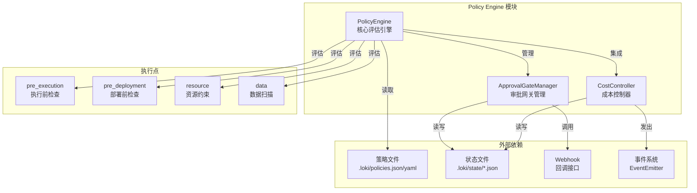
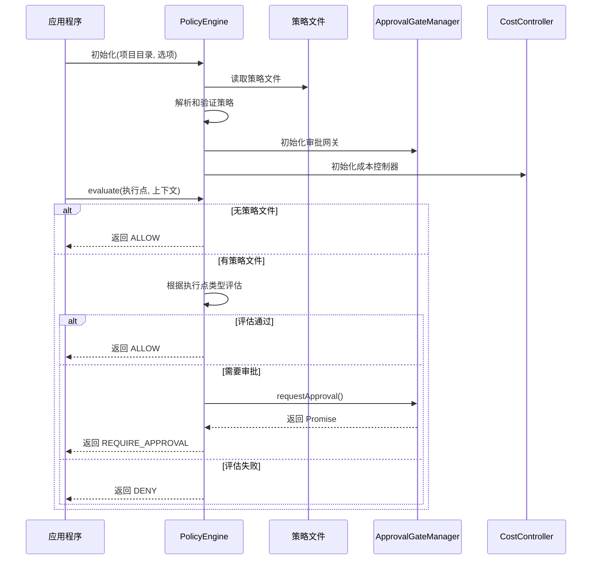
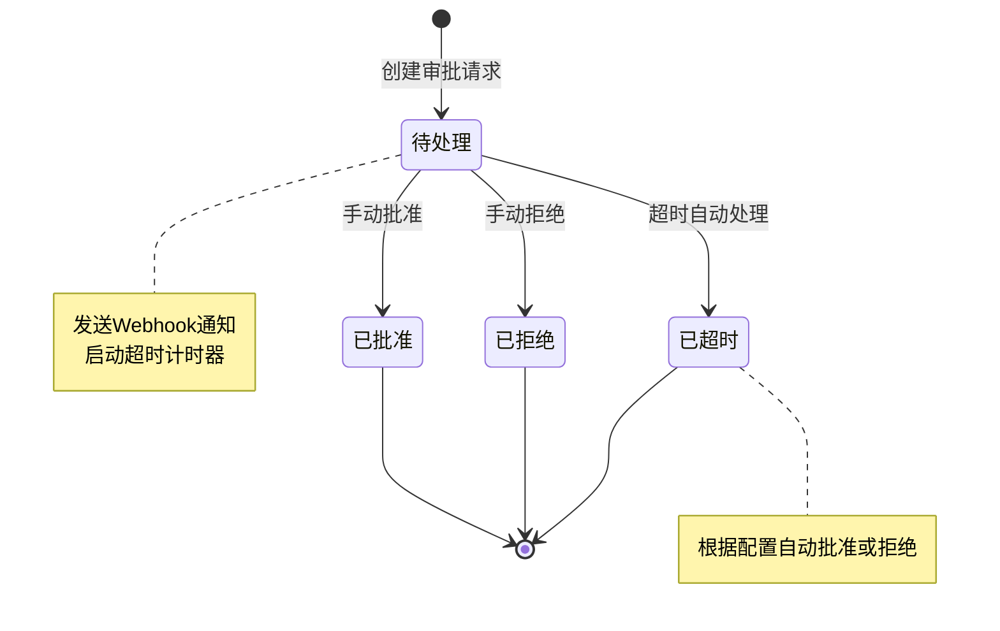
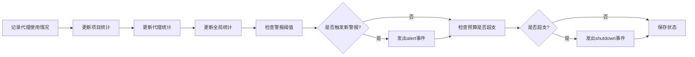

# Policy Engine 模块文档

## 1. 模块概述

Policy Engine 是 Loki Mode 系统中的核心策略执行引擎，负责在各个执行点对系统行为进行策略评估和控制。该模块提供了一套完整的策略管理、执行和审计机制，确保系统操作符合组织的安全、成本和合规性要求。

Policy Engine 存在的主要目的是解决以下问题：
- 提供可配置的执行控制点，在关键操作前进行策略检查
- 实现灵活的审批流程，允许人工干预关键决策
- 提供成本控制机制，防止资源过度消耗
- 确保数据安全，扫描和保护敏感信息
- 提供完整的审计追踪，满足合规性要求

该模块设计为轻量级、高性能的系统，策略评估目标在10ms内完成，且在评估过程中不进行I/O操作，确保不会成为系统性能瓶颈。

## 2. 架构设计

Policy Engine 采用模块化设计，由三个核心组件组成，每个组件负责特定的功能领域，同时协同工作提供完整的策略管理能力。



### 2.1 核心组件说明

#### PolicyEngine（核心评估引擎）
PolicyEngine 是整个模块的核心协调组件，负责策略文件的加载、解析和评估。它支持从 JSON 或 YAML 格式的策略文件中读取配置，并在各个执行点进行同步策略评估。该组件设计为高性能系统，仅在初始化和重新加载时进行文件I/O操作，评估过程完全在内存中进行。

#### ApprovalGateManager（审批网关管理）
ApprovalGateManager 负责管理可配置的审批断点，在指定阶段暂停执行并等待人工审批。它支持Webhook回调、自动超时审批、审批状态持久化和完整的审计追踪功能。该组件确保关键操作能够经过必要的人工审核流程，同时提供灵活的超时处理机制。

#### CostController（成本控制器）
CostController 提供项目级别的代币预算跟踪功能，支持可配置的警报阈值。它能够跟踪每个代理的成本消耗，在预算超支时发出警报甚至触发关闭事件。所有成本数据都会持久化到状态文件中，便于后续分析和审计。

## 3. 子模块功能

### 3.1 核心评估引擎

核心评估引擎（PolicyEngine）是整个策略系统的大脑，负责加载、解析和评估策略。它支持四种主要的执行点：pre_execution（执行前）、pre_deployment（部署前）、resource（资源约束）和data（数据扫描）。

该引擎具有以下特性：
- 支持 JSON 和 YAML 两种策略文件格式
- 内置简单的 YAML 解析器，无需外部依赖
- 策略文件监控功能，自动检测并加载变更
- 完整的策略验证机制，提供详细的错误信息
- 高性能同步评估，目标延迟 < 10ms

当没有策略文件存在时，所有评估都会返回 ALLOW，且零开销，确保系统在未配置策略时能够正常运行。

详细信息请参考 [Policy Engine - Core Engine.md](Policy Engine - Core Engine.md)。

### 3.2 审批网关系统

审批网关系统（ApprovalGateManager）提供了灵活的人工审批机制，允许在关键操作点设置断点。该系统支持按阶段配置审批规则，每个规则可以设置不同的超时时间和Webhook回调地址。

主要功能包括：
- 按阶段名称配置可审批断点
- Webhook回调支持异步审批
- 可配置的自动审批超时（默认30分钟）
- 审批状态持久化到 `.loki/state/approvals.json`
- 完整的审批决策审计追踪
- SSRF保护，确保Webhook安全

审批系统采用"发射后不管"的Webhook模式，POST请求发送后异步处理响应，不阻塞主流程。

详细信息请参考 [Policy Engine - Approval Gate.md](Policy Engine - Approval Gate.md)。

### 3.3 成本控制系统

成本控制系统（CostController）专注于资源消耗的监控和管理，提供项目级别的代币预算跟踪功能。该系统可以设置多个警报阈值，在资源消耗达到不同级别时发出相应的警报。

核心功能包括：
- 项目级代币预算跟踪
- 可配置的警报阈值（默认：50%、80%、100%）
- 代理级成本跟踪（模型类型、代币消耗、执行时长）
- 紧急停止功能：预算超支时发出关闭事件
- 成本数据持久化到 `.loki/state/costs.json`
- 历史事件记录和报告生成

成本控制器继承自 EventEmitter，可以发出 alert 和 shutdown 事件，便于与系统其他部分集成。

详细信息请参考 [Policy Engine - Cost Control.md](Policy Engine - Cost Control.md)。

## 4. 工作流程

### 4.1 策略评估流程



### 4.2 审批流程



### 4.3 成本监控流程



## 5. 集成与依赖

Policy Engine 模块与系统其他部分有多个集成点：

### 5.1 与 API Server & Services 的集成
Policy Engine 可以通过 API 服务器暴露其功能，允许外部系统进行策略评估和管理。特别是 `api.services.state-watcher.StateWatcher` 可以用来监控策略文件的变化，与 PolicyEngine 的内置监控功能互补。

### 5.2 与 Dashboard Backend 的集成
Dashboard Backend 可以通过 Policy Engine 提供的接口展示策略执行状态、审批请求和成本信息。特别是 `dashboard.models.Run` 和 `dashboard.models.Task` 可以与策略评估结果关联，提供完整的执行上下文。

### 5.3 与 Audit 模块的集成
虽然 Policy Engine 内部有自己的审计机制，但它可以与 [Audit](Audit.md) 模块集成，提供更全面的审计能力。ApprovalGateManager 的审计 trail 可以发送到 Audit 模块进行集中存储和分析。

### 5.4 与 Observability 模块的集成
CostController 发出的事件可以与 [Observability](Observability.md) 模块集成，使用 `src.observability.otel.Gauge` 和 `src.observability.otel.Histogram` 等组件监控成本指标和策略评估性能。

## 6. 使用指南

### 6.1 基本使用

```javascript
const { PolicyEngine } = require('./src/policies/engine');
const { ApprovalGateManager } = require('./src/policies/approval');
const { CostController } = require('./src/policies/cost');

// 初始化 PolicyEngine
const engine = new PolicyEngine('/path/to/project', { watch: true });

// 评估策略
const result = engine.evaluate('pre_execution', {
  agent_id: 'agent-123',
  action: 'execute_code',
  context: { /* 更多上下文 */ }
});

if (result.allowed) {
  console.log('操作允许执行');
} else if (result.requiresApproval) {
  console.log('需要审批:', result.reason);
  // 处理审批流程
} else {
  console.log('操作被拒绝:', result.reason);
}
```

### 6.2 策略文件格式

Policy Engine 支持 JSON 和 YAML 两种格式的策略文件，以下是一个完整的示例：

```yaml
policies:
  pre_execution:
    - name: "限制生产环境操作"
      rule: "environment == production"
      action: "require_approval"
  
  pre_deployment:
    - name: "需要质量门通过"
      gates: ["unit_tests", "security_scan"]
      action: "deny"
  
  resource:
    - name: "代币预算"
      max_tokens: 100000
      alerts: [50, 80, 100]
      on_exceed: "shutdown"
  
  data:
    - name: "扫描敏感数据"
      type: "pii"
      action: "deny"
  
  approval_gates:
    - name: "生产部署审批"
      phase: "deploy"
      webhook: "https://example.com/approval"
      timeout_minutes: 60
      auto_approve_on_timeout: false
```

### 6.3 配置和扩展

Policy Engine 设计为高度可配置和可扩展的系统。主要配置点包括：

- 策略文件位置：默认为 `.loki/policies.json` 或 `.loki/policies.yaml`
- 状态文件位置：默认为 `.loki/state/` 目录
- 审批超时：默认 30 分钟，可按网关配置
- 警报阈值：成本警报的百分比阈值
- Webhook URL：审批回调的地址

扩展 Policy Engine 的主要方式包括：
- 自定义规则评估器（通过 `RULE_EVALUATORS` 扩展）
- 自定义数据扫描器（通过 `scanContent` 扩展）
- 监听 CostController 的事件进行自定义处理
- 实现自定义的审批解决机制

## 7. 注意事项和限制

### 7.1 性能考虑
- 策略评估设计为同步操作，应避免在策略中执行复杂计算
- 大量策略规则可能影响评估性能，建议定期审查和优化策略
- 状态文件大小有内置限制（MAX_AUDIT_ENTRIES 和 MAX_STATE_ENTRIES），防止无限增长

### 7.2 安全考虑
- Webhook URL 有 SSRF 保护，不允许指向内部/私有地址
- 审批请求ID使用加密安全的随机数生成
- 策略文件应妥善保护，防止未授权修改

### 7.3 错误处理
- 策略文件解析错误会被记录，但系统会继续运行（使用之前的策略或默认行为）
- Webhook 发送失败是"沉默"的，不会影响主流程
- 状态文件损坏时，系统会自动重置为空状态

### 7.4 已知限制
- YAML 解析器只支持子集功能，不支持多行字符串、锚点/别名等复杂特性
- 成本控制的关闭事件只是发出通知，实际关闭逻辑需要调用方实现
- 审批系统没有内置的用户界面，需要通过 API 或 Webhook 实现自定义界面

## 8. 总结

Policy Engine 模块为 Loki Mode 系统提供了强大而灵活的策略管理能力。通过其核心组件的协同工作，它能够在确保系统安全性、合规性和成本控制的同时，保持高性能和易用性。

该模块的设计强调可配置性、可扩展性和可靠性，使其能够适应各种不同的使用场景和组织需求。无论是简单的单项目使用还是复杂的多租户环境，Policy Engine 都能提供合适的策略管理解决方案。

通过与系统其他模块的集成，Policy Engine 成为整个 Loki Mode 生态系统中不可或缺的一部分，为自动化操作提供必要的治理和控制机制。
