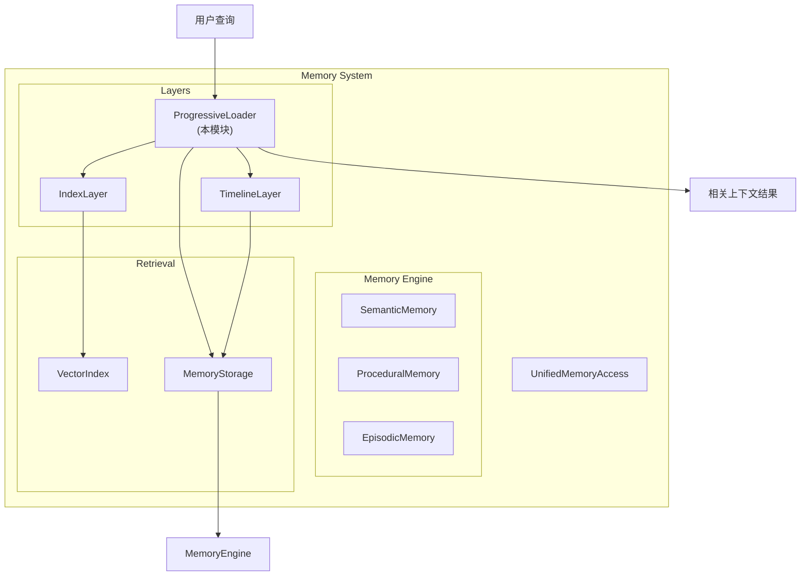
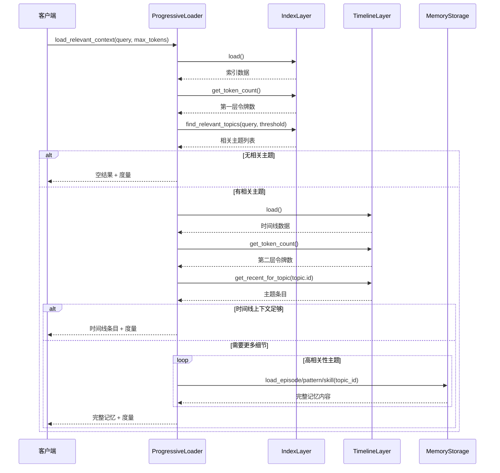

# Progressive Loader 模块文档

## 目录
1. [模块概述](#模块概述)
2. [核心组件详解](#核心组件详解)
3. [架构与工作流](#架构与工作流)
4. [使用指南](#使用指南)
5. [配置与扩展](#配置与扩展)
6. [边缘情况与限制](#边缘情况与限制)
7. [参考资料](#参考资料)

---

## 模块概述

### 目的与设计理念

Progressive Loader 模块是 Memory System 的核心组件之一，实现了渐进式内存加载算法，通过分层披露（progressive disclosure）策略优化上下文窗口使用。该模块的设计初衷是解决在大型记忆系统中常见的矛盾：既需要提供足够相关的上下文信息，又要避免消耗过多的令牌（tokens），从而保持系统的响应性能和成本效率。

该模块采用三层加载架构，从概括到详细逐步增加信息深度，仅在确有必要时才加载完整记忆内容。这种设计不仅显著减少了令牌消耗，还通过相关性筛选确保了只加载最相关的信息，提高了系统的整体效率。

### 主要功能

- **三层渐进式加载**：从索引层到时间线层再到完整记忆层的逐步披露
- **令牌使用优化**：通过相关性筛选和分层加载最小化令牌消耗
- **动态上下文评估**：智能判断当前上下文是否足够回答查询
- **详细的令牌度量**：跟踪各层令牌使用情况并计算节省百分比
- **灵活的预算控制**：支持自定义最大令牌预算限制

---

## 核心组件详解

### TokenMetrics

#### 功能描述
`TokenMetrics` 是一个数据类，用于跟踪渐进式披露各层的令牌使用情况。它不仅记录各层的令牌消耗，还能计算与加载所有记忆相比的估计节省百分比。

#### 核心属性
- `layer1_tokens`：索引层使用的令牌数
- `layer2_tokens`：时间线层使用的令牌数
- `layer3_tokens`：完整记忆层使用的令牌数
- `total_tokens`：所有层的令牌总和
- `estimated_savings_percent`：与加载所有记忆相比的估计节省百分比

#### 核心方法

##### `calculate_savings(total_available: int) -> None`
计算估计节省百分比。

**参数**：
- `total_available`：如果加载所有记忆的总令牌数

**功能说明**：
该方法根据当前已使用的令牌数和可用的总令牌数计算节省百分比。计算公式为：`((total_available - used) / total_available) * 100`。结果会四舍五入到小数点后一位，并确保不为负数。

---

### ProgressiveLoader

#### 功能描述
`ProgressiveLoader` 是该模块的核心类，实现了三层渐进式内存加载机制。它通过优化上下文窗口使用，仅加载回答查询所需的最小记忆内容量。

#### 核心常量
- `DEFAULT_MAX_TOKENS = 2000`：默认最大令牌数
- `RELEVANCE_THRESHOLD = 0.5`：相关性阈值，用于筛选相关主题
- `HIGH_RELEVANCE_THRESHOLD = 0.8`：高相关性阈值，用于确定是否加载完整记忆

#### 核心方法

##### `__init__(base_path: str, index_layer: IndexLayer, timeline_layer: TimelineLayer)`
初始化渐进式加载器。

**参数**：
- `base_path`：内存存储的基础目录
- `index_layer`：用于主题查找的 IndexLayer 实例
- `timeline_layer`：用于时间线上下文的 TimelineLayer 实例

**功能说明**：
构造函数设置基本路径和层引用，初始化令牌度量，并将存储实例设置为延迟加载（lazy loaded）。

---

##### `load_relevant_context(query: str, max_tokens: int = DEFAULT_MAX_TOKENS) -> Tuple[List[Dict[str, Any]], TokenMetrics]`
使用渐进式披露加载相关上下文。

**参数**：
- `query`：要查找相关上下文的查询
- `max_tokens`：所有层使用的最大令牌数，默认为 2000

**返回值**：
返回一个元组，包含：
- 相关记忆列表
- 令牌使用度量

**功能说明**：
这是该类的核心方法，实现了完整的三层加载流程：

1. **第一层（索引层）**：加载索引以查找相关主题，计算令牌使用情况
2. **相关性筛选**：使用索引层查找与查询相关的主题
3. **第二层（时间线层）**：如果找到相关主题，加载这些主题的时间线上下文
4. **上下文充足性检查**：判断时间线上下文是否足够回答查询
5. **第三层（完整记忆层）**：如果需要更多细节且预算允许，加载高相关性主题的完整记忆

该方法会在每个步骤后检查剩余令牌预算，确保不会超出限制。

---

##### `sufficient_context(memories: Any, query: str) -> bool`
确定当前记忆是否提供了足够的上下文。

**参数**：
- `memories`：记忆列表或时间线上下文字典
- `query`：原始查询

**返回值**：
如果上下文足够返回 `True`，如果需要更多细节返回 `False`

**功能说明**：
该方法使用启发式规则决定是否需要更多细节：
- 如果没有记忆，上下文不足
- 如果有 3 个或更多相关条目，可能足够
- 检查查询是否包含细节寻求关键词（如 "exactly"、"specifically"、"details" 等）
- 默认情况下，如果有任何上下文，先尝试使用

---

##### `_load_full_memory(topic_id: str, storage: Optional[Any] = None) -> Optional[Dict[str, Any]]`
加载主题的完整记忆内容。

**参数**：
- `topic_id`：要加载的主题 ID
- `storage`：可选的 MemoryStorage 实例

**返回值**：
完整记忆字典或 None

**功能说明**：
该方法尝试按顺序加载不同类型的记忆：
1. 首先尝试加载为插曲（episode）
2. 如果失败，尝试加载为模式（pattern）
3. 如果还失败，尝试加载为技能（skill）

如果所有尝试都失败，则返回 None。

---

##### `track_token_usage(layer: int, tokens: int) -> None`
跟踪特定层的令牌使用情况。

**参数**：
- `layer`：层编号（1、2 或 3）
- `tokens`：使用的令牌数

**功能说明**：
更新指定层的令牌计数，并重新计算总令牌数。

---

##### `get_layer_summary() -> Dict[str, Any]`
获取当前层使用情况的摘要。

**返回值**：
包含层数、计数和百分比的字典

**功能说明**：
返回一个结构化的摘要，包含各层的令牌使用情况、百分比和描述，以及总令牌数和估计节省百分比。

---

## 架构与工作流

### 系统架构

Progressive Loader 模块在 Memory System 中扮演着关键角色，它与其他组件紧密协作，提供高效的内存检索服务。



### 三层加载流程

Progressive Loader 的核心是其三层加载架构，下图展示了详细的加载流程：



### 数据流向

1. **查询输入**：用户查询进入系统，触发渐进式加载过程
2. **索引层查询**：首先加载索引层，识别相关主题
3. **相关性筛选**：根据相关性阈值筛选出相关主题
4. **时间线加载**：为相关主题加载时间线上下文
5. **上下文评估**：判断当前上下文是否足够
6. **完整记忆加载**：如需要，加载高相关性主题的完整记忆
7. **结果返回**：返回相关上下文和令牌使用度量

---

## 使用指南

### 基本使用

以下是使用 Progressive Loader 的基本步骤：

```python
from memory.layers.loader import ProgressiveLoader
from memory.layers.index_layer import IndexLayer
from memory.layers.timeline_layer import TimelineLayer

# 初始化依赖层
index_layer = IndexLayer(base_path="./memory/index")
timeline_layer = TimelineLayer(base_path="./memory/timeline")

# 创建 ProgressiveLoader 实例
loader = ProgressiveLoader(
    base_path="./memory",
    index_layer=index_layer,
    timeline_layer=timeline_layer
)

# 加载相关上下文
query = "如何修复数据库连接错误？"
memories, metrics = loader.load_relevant_context(
    query=query,
    max_tokens=3000
)

# 使用结果
for memory in memories:
    print(f"ID: {memory['id']}, Type: {memory['type']}")
    print(f"Content: {memory['content']}")

# 查看令牌使用情况
print(f"总令牌使用: {metrics.total_tokens}")
print(f"估计节省: {metrics.estimated_savings_percent}%")
```

### 获取层使用摘要

```python
# 获取详细的层使用摘要
summary = loader.get_layer_summary()

print("层使用摘要:")
for layer, info in summary.items():
    if layer in ["layer1", "layer2", "layer3"]:
        print(f"{info['description']}:")
        print(f"  令牌: {info['tokens']}")
        print(f"  百分比: {info['percent']}%")

print(f"总节省: {summary['estimated_savings_percent']}%")
```

### 手动跟踪令牌使用

```python
# 重置度量
loader.reset_metrics()

# 手动跟踪各层令牌使用
loader.track_token_usage(layer=1, tokens=150)
loader.track_token_usage(layer=2, tokens=600)
loader.track_token_usage(layer=3, tokens=1200)

# 获取当前度量
metrics = loader.get_token_metrics()
print(f"第一层: {metrics.layer1_tokens}")
print(f"第二层: {metrics.layer2_tokens}")
print(f"第三层: {metrics.layer3_tokens}")
print(f"总计: {metrics.total_tokens}")
```

---

## 配置与扩展

### 配置选项

Progressive Loader 提供了几个可配置的参数，可以在初始化后通过修改类属性进行调整：

```python
# 调整默认最大令牌数
ProgressiveLoader.DEFAULT_MAX_TOKENS = 3000

# 调整相关性阈值
ProgressiveLoader.RELEVANCE_THRESHOLD = 0.6

# 调整高相关性阈值
ProgressiveLoader.HIGH_RELEVANCE_THRESHOLD = 0.85
```

### 扩展 ProgressiveLoader

可以通过继承 `ProgressiveLoader` 类来扩展其功能：

```python
from memory.layers.loader import ProgressiveLoader

class CustomProgressiveLoader(ProgressiveLoader):
    def __init__(self, base_path, index_layer, timeline_layer, custom_param):
        super().__init__(base_path, index_layer, timeline_layer)
        self.custom_param = custom_param
    
    def sufficient_context(self, memories, query):
        # 自定义上下文充足性判断逻辑
        # 例如，可以使用更复杂的 NLP 技术
        result = super().sufficient_context(memories, query)
        # 添加自定义逻辑
        return result
    
    def custom_ranking_method(self, memories, query):
        # 添加自定义记忆排序方法
        # 可以实现更复杂的排序算法
        pass
```

### 自定义上下文充足性判断

覆盖 `sufficient_context` 方法是扩展 Progressive Loader 最常见的方式之一：

```python
class MLBasedProgressiveLoader(ProgressiveLoader):
    def __init__(self, base_path, index_layer, timeline_layer, ml_model):
        super().__init__(base_path, index_layer, timeline_layer)
        self.ml_model = ml_model
    
    def sufficient_context(self, memories, query):
        # 使用机器学习模型判断上下文是否充足
        if not memories:
            return False
        
        # 准备特征
        features = self._prepare_features(memories, query)
        
        # 使用模型预测
        prediction = self.ml_model.predict(features)
        
        return prediction > 0.5  # 自定义阈值
```

---

## 边缘情况与限制

### 边缘情况

1. **无相关主题**：当查询与任何主题都不相关时，系统会返回空结果，但仍会计算第一层的令牌使用。

2. **令牌预算不足**：如果令牌预算仅够加载第一层，系统会在加载完索引后立即返回，即使有相关主题也不会继续加载。

3. **存储不可用**：当 MemoryStorage 导入失败或不可用时，第三层加载将无法执行，但前两层仍可正常工作。

4. **高相关性主题过多**：当有多个高相关性主题但令牌预算有限时，系统会按相关性排序并逐个加载，直到预算耗尽。

5. **细节寻求查询**：当查询包含特定关键词（如 "exactly"、"details" 等）时，即使时间线上下文可能已足够，系统也会尝试加载完整记忆。

### 限制

1. **依赖外部层**：Progressive Loader 依赖于 IndexLayer 和 TimelineLayer 的实现，如果这些层的接口发生变化，可能需要相应调整。

2. **启发式判断**：上下文充足性判断基于启发式规则，可能不适用于所有场景，对于复杂查询可能需要自定义实现。

3. **存储延迟加载**：MemoryStorage 采用延迟加载模式，首次使用第三层时可能会有额外的初始化开销。

4. **固定三层架构**：当前实现固定为三层架构，不支持动态增加或减少层数，如需更细粒度的控制需要扩展实现。

5. **令牌估算**： estimated_savings_percent 依赖于 index 中提供的 total_tokens_available，如果该值不准确，节省百分比也会有偏差。

### 性能考虑

- 对于频繁查询，考虑缓存第一层和第二层的结果
- 当处理大量高相关性主题时，可能需要实现分批加载机制
- 令牌计算可能会有轻微的性能开销，对于性能敏感场景可以考虑优化

---

## 参考资料

### 相关模块

- [Memory Engine](Memory Engine.md)：Progressive Loader 加载的记忆内容来源
- [Unified Memory Access](Unified Memory Access.md)：提供统一的内存访问接口
- [Vector Index](Vector Index.md)：用于相关性计算的向量索引
- [Retrieval](Retrieval.md)：记忆检索相关组件

### 数据类型参考

- [IndexLayer](Index Layer.md)：索引层实现
- [TimelineLayer](Timeline Layer.md)：时间线层实现
- [MemoryStorage](Memory Storage.md)：记忆存储实现

### 进一步阅读

- 了解更多关于 Memory System 整体架构的信息，请参考 [Memory System](Memory System.md) 文档
- 关于令牌优化策略的深入讨论，可以参考相关的研究论文和技术博客
