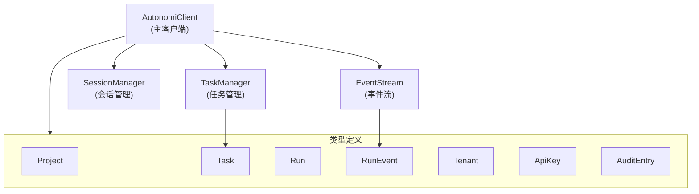

# Python SDK - 管理器类

## 概述

Python SDK - 管理器类模块是 Autonomi 控制平台的核心 Python 客户端库，提供了与 API 服务器交互的同步接口。该模块设计为零外部依赖，仅使用 Python 标准库，确保了高度的兼容性和易于集成。

本模块的主要目的是为开发者提供简洁、直观的接口，用于管理项目、任务、运行、租户等资源，并提供事件流和会话管理功能。通过封装底层的 HTTP 请求和响应处理，开发者可以专注于业务逻辑而不必处理网络通信细节。

## 核心组件架构



该模块采用了清晰的分层架构，其中 `AutonomiClient` 作为核心入口点，提供了主要的 API 交互功能。其他管理器类（`EventStream`、`SessionManager`、`TaskManager`）则专注于特定领域的功能，通过组合方式与 `AutonomiClient` 协作。

## AutonomiClient - 主客户端

`AutonomiClient` 是整个 SDK 的核心类，负责处理与 Autonomi 控制平面 API 的所有通信。它提供了同步的 HTTP 请求机制，并内置了错误处理和认证支持。

### 初始化与配置

```python
from loki_mode_sdk.client import AutonomiClient

# 基本初始化
client = AutonomiClient(
    base_url="http://localhost:57374",  # API 服务器地址
    token="loki_xxx",  # 认证令牌
    timeout=30  # 请求超时时间（秒）
)
```

**参数说明：**
- `base_url`：API 服务器的基础 URL，默认为 `http://localhost:57374`
- `token`：用于身份验证的令牌，可选参数
- `timeout`：HTTP 请求的超时时间，默认为 30 秒

### 错误处理

`AutonomiClient` 定义了一套完整的异常类体系，用于处理不同类型的 API 错误：

```python
from loki_mode_sdk.client import (
    AutonomiError,
    AuthenticationError,
    ForbiddenError,
    NotFoundError
)

try:
    project = client.get_project("invalid-id")
except NotFoundError as e:
    print(f"资源未找到: {e}")
except AuthenticationError as e:
    print(f"认证失败: {e}")
except ForbiddenError as e:
    print(f"权限不足: {e}")
except AutonomiError as e:
    print(f"API 错误: {e}, 状态码: {e.status_code}")
```

### 核心功能方法

#### 状态检查

```python
# 获取 API 服务器状态
status = client.get_status()
print(f"服务器状态: {status}")
```

#### 项目管理

```python
# 列出所有项目
projects = client.list_projects()
for project in projects:
    print(f"项目: {project.name} (ID: {project.id})")

# 获取单个项目
project = client.get_project("project-id")

# 创建新项目
new_project = client.create_project(
    name="我的新项目",
    description="项目描述"
)
```

#### 租户管理

```python
# 列出所有租户
tenants = client.list_tenants()

# 创建新租户
new_tenant = client.create_tenant(
    name="我的租户",
    description="租户描述"
)
```

#### 运行管理

```python
# 列出运行，可按项目和状态过滤
runs = client.list_runs(
    project_id="project-id",
    status="running"
)

# 获取单个运行
run = client.get_run("run-id")

# 取消运行
cancelled_run = client.cancel_run("run-id")

# 重放运行
replayed_run = client.replay_run("run-id")

# 获取运行的事件时间线
timeline = client.get_run_timeline("run-id")
for event in timeline:
    print(f"事件: {event.type} at {event.timestamp}")
```

#### API 密钥管理

```python
# 列出所有 API 密钥（令牌会被脱敏）
api_keys = client.list_api_keys()

# 创建新 API 密钥
new_key = client.create_api_key(
    name="我的 API 密钥",
    role="viewer"  # 可选: "viewer" 或其他角色
)
print(f"新密钥令牌: {new_key['token']}")

# 轮换 API 密钥
rotated_key = client.rotate_api_key(
    identifier="key-id",
    grace_period_hours=24  # 旧密钥的有效期
)
```

#### 审计日志查询

```python
# 查询审计日志
audit_logs = client.query_audit(
    start_date="2023-01-01T00:00:00Z",
    end_date="2023-12-31T23:59:59Z",
    action="create",
    limit=100
)

for entry in audit_logs:
    print(f"审计条目: {entry.action} by {entry.actor}")
```

## EventStream - 事件流

`EventStream` 类提供了轮询运行事件的功能，使开发者能够实时获取运行过程中发生的事件。

### 基本用法

```python
from loki_mode_sdk.client import AutonomiClient
from loki_mode_sdk.events import EventStream

client = AutonomiClient(token="loki_xxx")
event_stream = EventStream(client)

# 轮询新事件
events = event_stream.poll_events(
    run_id="run-id",
    since="2023-01-01T00:00:00Z"  # 可选，仅获取此时间之后的事件
)

for event in events:
    print(f"事件类型: {event.type}, 内容: {event.data}")
```

### 实现实时事件监听

```python
import time

def listen_to_events(run_id, poll_interval=5):
    last_timestamp = None
    while True:
        events = event_stream.poll_events(
            run_id=run_id,
            since=last_timestamp
        )
        
        for event in events:
            print(f"收到事件: {event.type}")
            # 更新最后时间戳
            if last_timestamp is None or event.timestamp > last_timestamp:
                last_timestamp = event.timestamp
        
        time.sleep(poll_interval)

# 开始监听
listen_to_events("run-id")
```

## SessionManager - 会话管理

`SessionManager` 类负责管理项目的会话生命周期，提供列出和获取会话的功能。

### 基本用法

```python
from loki_mode_sdk.client import AutonomiClient
from loki_mode_sdk.sessions import SessionManager

client = AutonomiClient(token="loki_xxx")
session_manager = SessionManager(client)

# 列出项目的所有会话
sessions = session_manager.list_sessions("project-id")
for session in sessions:
    print(f"会话: {session.get('id')}, 状态: {session.get('status')}")

# 获取单个会话
session = session_manager.get_session("session-id")
print(f"会话详情: {session}")
```

## TaskManager - 任务管理

`TaskManager` 类专注于任务操作，提供了创建、列出、获取和更新任务的功能。

### 基本用法

```python
from loki_mode_sdk.client import AutonomiClient
from loki_mode_sdk.tasks import TaskManager

client = AutonomiClient(token="loki_xxx")
task_manager = TaskManager(client)

# 列出任务，可按项目和状态过滤
tasks = task_manager.list_tasks(
    project_id="project-id",
    status="open"
)

for task in tasks:
    print(f"任务: {task.title}, 优先级: {task.priority}")

# 获取单个任务
task = task_manager.get_task("task-id")

# 创建新任务
new_task = task_manager.create_task(
    project_id="project-id",
    title="实现新功能",
    description="详细描述任务需求",
    priority="high"  # 可选: "low", "medium", "high"
)

# 更新任务
updated_task = task_manager.update_task(
    task_id="task-id",
    status="in_progress",
    priority="high"
)
```

## 综合使用示例

下面是一个综合使用各个管理器类的完整示例，展示了如何从创建项目到监控任务执行的完整流程：

```python
from loki_mode_sdk.client import AutonomiClient
from loki_mode_sdk.events import EventStream
from loki_mode_sdk.sessions import SessionManager
from loki_mode_sdk.tasks import TaskManager
import time

# 初始化客户端
client = AutonomiClient(
    base_url="http://localhost:57374",
    token="loki_xxx"
)

# 初始化各个管理器
event_stream = EventStream(client)
session_manager = SessionManager(client)
task_manager = TaskManager(client)

try:
    # 1. 创建项目
    print("创建新项目...")
    project = client.create_project(
        name="自动化工作流项目",
        description="用于演示 SDK 功能的示例项目"
    )
    print(f"项目创建成功: {project.id}")
    
    # 2. 创建任务
    print("创建新任务...")
    task = task_manager.create_task(
        project_id=project.id,
        title="实现用户认证功能",
        description="实现基于 JWT 的用户认证系统",
        priority="high"
    )
    print(f"任务创建成功: {task.id}")
    
    # 3. 列出项目会话
    print("等待会话创建...")
    time.sleep(5)  # 等待系统处理
    
    sessions = session_manager.list_sessions(project.id)
    if sessions:
        session = sessions[0]
        print(f"找到会话: {session.get('id')}")
        
        # 4. 监控运行和事件
        print("监控运行状态...")
        runs = client.list_runs(project_id=project.id)
        if runs:
            run = runs[0]
            print(f"找到运行: {run.id}")
            
            # 监听事件
            last_event_time = None
            while run.status in ["pending", "running"]:
                events = event_stream.poll_events(
                    run_id=run.id,
                    since=last_event_time
                )
                
                for event in events:
                    print(f"收到事件: {event.type}")
                    if last_event_time is None or event.timestamp > last_event_time:
                        last_event_time = event.timestamp
                
                # 更新运行状态
                run = client.get_run(run.id)
                print(f"当前运行状态: {run.status}")
                
                time.sleep(5)
            
            # 获取完整时间线
            print("获取完整事件时间线...")
            timeline = client.get_run_timeline(run.id)
            print(f"共 {len(timeline)} 个事件")
            
            # 更新任务状态
            if run.status == "completed":
                print("任务完成，更新任务状态...")
                task_manager.update_task(
                    task_id=task.id,
                    status="completed"
                )
            else:
                print(f"运行结束，状态: {run.status}")
    
except Exception as e:
    print(f"发生错误: {e}")
```

## 最佳实践与注意事项

### 错误处理

始终对 API 调用进行错误处理，特别是在生产环境中：

```python
from loki_mode_sdk.client import AutonomiClient, AutonomiError, NotFoundError

client = AutonomiClient(token="loki_xxx")

try:
    project = client.get_project("some-id")
except NotFoundError:
    print("项目不存在，创建新项目...")
    project = client.create_project(name="新项目")
except AutonomiError as e:
    print(f"API 错误: {e}")
    # 可以根据 status_code 进行更细粒度的处理
    if e.status_code == 429:
        print("请求过于频繁，请稍后再试")
except Exception as e:
    print(f"未知错误: {e}")
```

### 资源管理

- 对于长时间运行的监控任务，实现适当的退避策略，避免对服务器造成过大压力
- 合理使用 `since` 参数来减少事件轮询的数据传输量
- 注意 API 密钥的安全存储，避免将其硬编码在代码中

### 性能考虑

- 当需要处理大量资源时，考虑使用分页和过滤参数减少单次请求的数据量
- 对于事件监听，根据实际需求调整轮询间隔，平衡实时性和性能
- 批量操作时，优先考虑使用支持批量的 API 方法（如果有）

## 相关模块

- [Python SDK - 类型定义](Python SDK - 类型定义.md)：了解 SDK 中使用的各种数据类型
- [Dashboard Backend](Dashboard Backend.md)：了解 API 服务端的实现细节
- [API Server & Services](API Server & Services.md)：了解底层 API 服务的架构

## 总结

Python SDK - 管理器类模块提供了一套完整的工具，用于与 Autonomi 控制平台交互。通过 `AutonomiClient`、`EventStream`、`SessionManager` 和 `TaskManager` 等类，开发者可以轻松地管理项目、任务、运行和其他资源，同时监控事件流和会话状态。

该模块的设计注重简洁性和易用性，同时保持了足够的灵活性，能够满足各种使用场景的需求。零外部依赖的特性使其易于集成到任何 Python 项目中，而清晰的 API 设计则降低了学习曲线。
