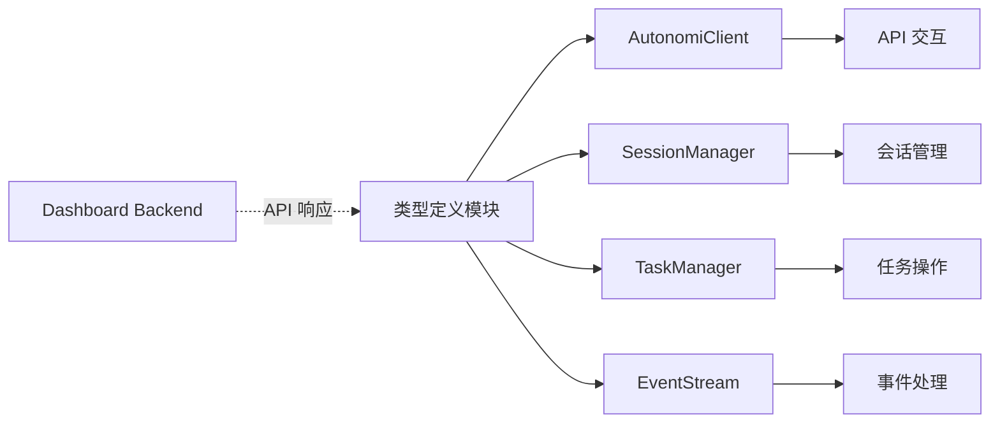

# Python SDK - 类型定义

## 模块概述

Python SDK - 类型定义模块是 Autonomi SDK 的核心基础设施，提供了一套标准化的数据类型定义，用于表示控制平面中的各种实体。这些类型定义确保了 SDK 与后端系统之间的数据交换具有一致性和类型安全性，是整个 SDK 架构的基础层。

该模块的设计目的在于：
- 提供统一的实体表示方式，消除不同模块间的数据结构差异
- 确保数据在序列化和反序列化过程中的完整性
- 为开发者提供直观的对象模型，简化 API 交互
- 支持类型提示，提高代码的可读性和可维护性

所有类型都使用 Python 的 `dataclass` 装饰器实现，这提供了简洁的语法和内置的功能，如自动生成的 `__init__`、`__repr__` 和 `__eq__` 方法。

## 架构设计

类型定义模块采用扁平的层次结构，所有核心类型都定义在同一个文件中，便于访问和维护。这些类型之间存在自然的关联关系，反映了控制平面中的实体层次结构。

```mermaid
classDiagram
    class Project {
        +str id
        +str name
        +Optional[str] description
        +str status
        +Optional[str] tenant_id
        +Optional[str] created_at
        +Optional[str] updated_at
        +from_dict(data) Project
    }
    
    class Task {
        +str id
        +str project_id
        +str title
        +Optional[str] description
        +str status
        +str priority
        +Optional[str] assigned_agent_id
        +Optional[str] created_at
        +from_dict(data) Task
    }
    
    class Run {
        +str id
        +str project_id
        +str status
        +Optional[str] trigger
        +Optional[Dict[str, Any]] config
        +Optional[str] started_at
        +Optional[str] ended_at
        +from_dict(data) Run
    }
    
    class RunEvent {
        +str id
        +str run_id
        +str event_type
        +Optional[str] phase
        +Optional[Dict[str, Any]] details
        +Optional[str] timestamp
        +from_dict(data) RunEvent
    }
    
    class Tenant {
        +str id
        +str name
        +Optional[str] slug
        +Optional[str] description
        +Optional[str] created_at
        +from_dict(data) Tenant
    }
    
    class ApiKey {
        +str id
        +str name
        +Optional[List[str]] scopes
        +str role
        +Optional[str] created_at
        +Optional[str] expires_at
        +Optional[str] last_used
        +from_dict(data) ApiKey
    }
    
    class AuditEntry {
        +str timestamp
        +str action
        +str resource_type
        +str resource_id
        +Optional[str] user_id
        +bool success
        +from_dict(data) AuditEntry
    }
    
    Tenant "1" --> "*" Project : 拥有
    Project "1" --> "*" Task : 包含
    Project "1" --> "*" Run : 执行
    Run "1" --> "*" RunEvent : 产生
```



### 实体关系说明

1. **Tenant (租户)** 是系统中的顶级实体，代表一个组织或团队，可以拥有多个 Project。
2. **Project (项目)** 是工作的组织单元，包含多个 Task 和 Run，属于一个 Tenant。
3. **Task (任务)** 代表需要完成的具体工作项，属于一个 Project，可以被分配给代理。
4. **Run (运行)** 代表一次执行过程，通常是任务的自动化执行，属于一个 Project。
5. **RunEvent (运行事件)** 记录 Run 过程中的具体事件，提供执行的详细历史。
6. **ApiKey (API 密钥)** 用于身份验证和授权，控制对 API 的访问权限。
7. **AuditEntry (审计条目)** 记录系统中的关键操作，用于安全审计和合规性追踪。

## 核心类型详解

### Project

`Project` 类表示控制平面中的一个项目，是组织工作的基本单元。

```python
@dataclass
class Project:
    """Represents a project in the control plane."""

    id: str
    name: str
    description: Optional[str] = None
    status: str = "active"
    tenant_id: Optional[str] = None
    created_at: Optional[str] = None
    updated_at: Optional[str] = None
```

#### 字段说明

| 字段 | 类型 | 默认值 | 说明 |
|------|------|--------|------|
| `id` | `str` | 必填 | 项目的唯一标识符 |
| `name` | `str` | 必填 | 项目的名称 |
| `description` | `Optional[str]` | `None` | 项目的可选描述 |
| `status` | `str` | `"active"` | 项目的状态，默认为 "active" |
| `tenant_id` | `Optional[str]` | `None` | 项目所属租户的 ID |
| `created_at` | `Optional[str]` | `None` | 项目创建时间的时间戳 |
| `updated_at` | `Optional[str]` | `None` | 项目最后更新时间的时间戳 |

#### 类方法 - from_dict

```python
@classmethod
def from_dict(cls, data: Dict[str, Any]) -> Project:
    return cls(
        id=data["id"],
        name=data["name"],
        description=data.get("description"),
        status=data.get("status", "active"),
        tenant_id=data.get("tenant_id"),
        created_at=data.get("created_at"),
        updated_at=data.get("updated_at"),
    )
```

`from_dict` 方法允许从字典数据创建 Project 实例，常用于 API 响应解析。该方法对必填字段（`id` 和 `name`）进行直接访问，确保它们存在；对可选字段使用 `data.get()` 方法并提供适当的默认值。

#### 使用示例

```python
# 创建一个新的 Project 实例
project = Project(
    id="proj_123",
    name="My AI Project",
    description="A project to explore AI capabilities",
    status="active",
    tenant_id="tenant_456"
)

# 从 API 响应字典创建 Project 实例
api_response = {
    "id": "proj_789",
    "name": "Data Processing Pipeline",
    "status": "active",
    "created_at": "2023-05-15T08:30:00Z"
}
project = Project.from_dict(api_response)
```

### Task

`Task` 类表示项目中的一个任务，是需要完成的具体工作项。

```python
@dataclass
class Task:
    """Represents a task within a project."""

    id: str
    project_id: str
    title: str
    description: Optional[str] = None
    status: str = "pending"
    priority: str = "medium"
    assigned_agent_id: Optional[str] = None
    created_at: Optional[str] = None
```

#### 字段说明

| 字段 | 类型 | 默认值 | 说明 |
|------|------|--------|------|
| `id` | `str` | 必填 | 任务的唯一标识符 |
| `project_id` | `str` | 必填 | 任务所属项目的 ID |
| `title` | `str` | 必填 | 任务的标题 |
| `description` | `Optional[str]` | `None` | 任务的可选描述 |
| `status` | `str` | `"pending"` | 任务的状态，默认为 "pending" |
| `priority` | `str` | `"medium"` | 任务的优先级，默认为 "medium" |
| `assigned_agent_id` | `Optional[str]` | `None` | 分配给此任务的代理 ID |
| `created_at` | `Optional[str]` | `None` | 任务创建时间的时间戳 |

#### 类方法 - from_dict

```python
@classmethod
def from_dict(cls, data: Dict[str, Any]) -> Task:
    return cls(
        id=data["id"],
        project_id=data.get("project_id", ""),
        title=data.get("title", ""),
        description=data.get("description"),
        status=data.get("status", "pending"),
        priority=data.get("priority", "medium"),
        assigned_agent_id=data.get("assigned_agent_id"),
        created_at=data.get("created_at"),
    )
```

`from_dict` 方法从字典创建 Task 实例。注意 `project_id` 和 `title` 虽然在类定义中是必填字段，但在 `from_dict` 方法中提供了空字符串作为默认值，这增加了处理不完整 API 响应时的灵活性。

#### 使用示例

```python
# 创建一个新的 Task 实例
task = Task(
    id="task_123",
    project_id="proj_456",
    title="Implement authentication",
    description="Add OAuth2 authentication to the API",
    status="in_progress",
    priority="high",
    assigned_agent_id="agent_789"
)

# 更新任务状态
task.status = "completed"

# 从 API 响应字典创建 Task 实例
api_response = {
    "id": "task_456",
    "project_id": "proj_123",
    "title": "Review code changes",
    "status": "pending",
    "priority": "medium"
}
task = Task.from_dict(api_response)
```

### Run

`Run` 类表示一次执行运行，通常是任务的自动化执行过程。

```python
@dataclass
class Run:
    """Represents an execution run."""

    id: str
    project_id: str
    status: str = "pending"
    trigger: Optional[str] = None
    config: Optional[Dict[str, Any]] = field(default_factory=dict)
    started_at: Optional[str] = None
    ended_at: Optional[str] = None
```

#### 字段说明

| 字段 | 类型 | 默认值 | 说明 |
|------|------|--------|------|
| `id` | `str` | 必填 | 运行的唯一标识符 |
| `project_id` | `str` | 必填 | 运行所属项目的 ID |
| `status` | `str` | `"pending"` | 运行的状态，默认为 "pending" |
| `trigger` | `Optional[str]` | `None` | 触发运行的原因或事件 |
| `config` | `Optional[Dict[str, Any]]` | `空字典` | 运行的配置参数 |
| `started_at` | `Optional[str]` | `None` | 运行开始时间的时间戳 |
| `ended_at` | `Optional[str]` | `None` | 运行结束时间的时间戳 |

#### 类方法 - from_dict

```python
@classmethod
def from_dict(cls, data: Dict[str, Any]) -> Run:
    return cls(
        id=data["id"],
        project_id=data.get("project_id", ""),
        status=data.get("status", "pending"),
        trigger=data.get("trigger"),
        config=data.get("config", {}),
        started_at=data.get("started_at"),
        ended_at=data.get("ended_at"),
    )
```

`from_dict` 方法从字典创建 Run 实例。注意 `config` 字段使用了 `field(default_factory=dict)` 来确保每个实例都有自己的字典，而不是共享同一个字典对象。

#### 使用示例

```python
# 创建一个新的 Run 实例
run = Run(
    id="run_123",
    project_id="proj_456",
    status="running",
    trigger="manual",
    config={"timeout": 300, "retries": 3},
    started_at="2023-05-15T10:30:00Z"
)

# 标记运行为完成
run.status = "completed"
run.ended_at = "2023-05-15T10:45:00Z"

# 从 API 响应字典创建 Run 实例
api_response = {
    "id": "run_789",
    "project_id": "proj_456",
    "status": "failed",
    "trigger": "schedule",
    "started_at": "2023-05-14T02:00:00Z",
    "ended_at": "2023-05-14T02:15:00Z"
}
run = Run.from_dict(api_response)
```

### RunEvent

`RunEvent` 类表示运行过程中的一个事件，记录执行的详细信息。

```python
@dataclass
class RunEvent:
    """Represents an event within a run."""

    id: str
    run_id: str
    event_type: str
    phase: Optional[str] = None
    details: Optional[Dict[str, Any]] = field(default_factory=dict)
    timestamp: Optional[str] = None
```

#### 字段说明

| 字段 | 类型 | 默认值 | 说明 |
|------|------|--------|------|
| `id` | `str` | 必填 | 事件的唯一标识符 |
| `run_id` | `str` | 必填 | 事件所属运行的 ID |
| `event_type` | `str` | 必填 | 事件的类型 |
| `phase` | `Optional[str]` | `None` | 运行中事件发生的阶段 |
| `details` | `Optional[Dict[str, Any]]` | `空字典` | 事件的详细信息 |
| `timestamp` | `Optional[str]` | `None` | 事件发生的时间戳 |

#### 类方法 - from_dict

```python
@classmethod
def from_dict(cls, data: Dict[str, Any]) -> RunEvent:
    return cls(
        id=data["id"],
        run_id=data.get("run_id", ""),
        event_type=data.get("event_type", ""),
        phase=data.get("phase"),
        details=data.get("details", {}),
        timestamp=data.get("timestamp"),
    )
```

`from_dict` 方法从字典创建 RunEvent 实例。注意 `run_id` 和 `event_type` 虽然在类定义中是必填字段，但在 `from_dict` 方法中提供了空字符串作为默认值。

#### 使用示例

```python
# 创建一个新的 RunEvent 实例
event = RunEvent(
    id="evt_123",
    run_id="run_456",
    event_type="log",
    phase="initialization",
    details={"message": "Starting data processing", "level": "info"},
    timestamp="2023-05-15T10:30:05Z"
)

# 从 API 响应字典创建 RunEvent 实例
api_response = {
    "id": "evt_789",
    "run_id": "run_456",
    "event_type": "error",
    "phase": "processing",
    "details": {"message": "Connection timeout", "code": 504},
    "timestamp": "2023-05-15T10:31:00Z"
}
event = RunEvent.from_dict(api_response)
```

### Tenant

`Tenant` 类表示一个租户（组织），是系统中的顶级实体。

```python
@dataclass
class Tenant:
    """Represents a tenant (organization)."""

    id: str
    name: str
    slug: Optional[str] = None
    description: Optional[str] = None
    created_at: Optional[str] = None
```

#### 字段说明

| 字段 | 类型 | 默认值 | 说明 |
|------|------|--------|------|
| `id` | `str` | 必填 | 租户的唯一标识符 |
| `name` | `str` | 必填 | 租户的名称 |
| `slug` | `Optional[str]` | `None` | 租户的 URL 友好标识符 |
| `description` | `Optional[str]` | `None` | 租户的可选描述 |
| `created_at` | `Optional[str]` | `None` | 租户创建时间的时间戳 |

#### 类方法 - from_dict

```python
@classmethod
def from_dict(cls, data: Dict[str, Any]) -> Tenant:
    return cls(
        id=data["id"],
        name=data["name"],
        slug=data.get("slug"),
        description=data.get("description"),
        created_at=data.get("created_at"),
    )
```

`from_dict` 方法从字典创建 Tenant 实例。只有 `id` 和 `name` 是必填字段，其他字段都是可选的。

#### 使用示例

```python
# 创建一个新的 Tenant 实例
tenant = Tenant(
    id="tenant_123",
    name="Acme Corporation",
    slug="acme-corp",
    description="Leading technology company"
)

# 从 API 响应字典创建 Tenant 实例
api_response = {
    "id": "tenant_456",
    "name": "Beta Solutions",
    "created_at": "2023-01-15T09:00:00Z"
}
tenant = Tenant.from_dict(api_response)
```

### ApiKey

`ApiKey` 类表示一个 API 密钥，用于身份验证和授权。

```python
@dataclass
class ApiKey:
    """Represents an API key."""

    id: str
    name: str
    scopes: Optional[List[str]] = field(default_factory=list)
    role: str = "viewer"
    created_at: Optional[str] = None
    expires_at: Optional[str] = None
    last_used: Optional[str] = None
```

#### 字段说明

| 字段 | 类型 | 默认值 | 说明 |
|------|------|--------|------|
| `id` | `str` | 必填 | API 密钥的唯一标识符 |
| `name` | `str` | 必填 | API 密钥的名称 |
| `scopes` | `Optional[List[str]]` | `空列表` | API 密钥的权限范围列表 |
| `role` | `str` | `"viewer"` | API 密钥的角色，默认为 "viewer" |
| `created_at` | `Optional[str]` | `None` | API 密钥创建时间的时间戳 |
| `expires_at` | `Optional[str]` | `None` | API 密钥过期时间的时间戳 |
| `last_used` | `Optional[str]` | `None` | API 密钥最后使用时间的时间戳 |

#### 类方法 - from_dict

```python
@classmethod
def from_dict(cls, data: Dict[str, Any]) -> ApiKey:
    return cls(
        id=data["id"],
        name=data["name"],
        scopes=data.get("scopes", []),
        role=data.get("role", "viewer"),
        created_at=data.get("created_at"),
        expires_at=data.get("expires_at"),
        last_used=data.get("last_used"),
    )
```

`from_dict` 方法从字典创建 ApiKey 实例。注意 `scopes` 字段使用了 `field(default_factory=list)` 来确保每个实例都有自己的列表，而不是共享同一个列表对象。

#### 使用示例

```python
# 创建一个新的 ApiKey 实例
api_key = ApiKey(
    id="key_123",
    name="Production Access",
    scopes=["projects:read", "tasks:write", "runs:execute"],
    role="admin",
    created_at="2023-05-01T00:00:00Z",
    expires_at="2024-05-01T00:00:00Z"
)

# 从 API 响应字典创建 ApiKey 实例
api_response = {
    "id": "key_456",
    "name": "Read-only Access",
    "scopes": ["projects:read", "tasks:read"],
    "role": "viewer",
    "created_at": "2023-05-10T00:00:00Z",
    "last_used": "2023-05-15T10:30:00Z"
}
api_key = ApiKey.from_dict(api_response)
```

### AuditEntry

`AuditEntry` 类表示一个审计日志条目，记录系统中的关键操作。

```python
@dataclass
class AuditEntry:
    """Represents an audit log entry."""

    timestamp: str
    action: str
    resource_type: str
    resource_id: str
    user_id: Optional[str] = None
    success: bool = True
```

#### 字段说明

| 字段 | 类型 | 默认值 | 说明 |
|------|------|--------|------|
| `timestamp` | `str` | 必填 | 操作发生的时间戳 |
| `action` | `str` | 必填 | 执行的操作类型 |
| `resource_type` | `str` | 必填 | 受影响资源的类型 |
| `resource_id` | `str` | 必填 | 受影响资源的 ID |
| `user_id` | `Optional[str]` | `None` | 执行操作的用户 ID |
| `success` | `bool` | `True` | 操作是否成功，默认为 True |

#### 类方法 - from_dict

```python
@classmethod
def from_dict(cls, data: Dict[str, Any]) -> AuditEntry:
    return cls(
        timestamp=data["timestamp"],
        action=data["action"],
        resource_type=data.get("resource_type", ""),
        resource_id=data.get("resource_id", ""),
        user_id=data.get("user_id"),
        success=data.get("success", True),
    )
```

`from_dict` 方法从字典创建 AuditEntry 实例。注意 `resource_type` 和 `resource_id` 虽然在类定义中是必填字段，但在 `from_dict` 方法中提供了空字符串作为默认值。

#### 使用示例

```python
# 创建一个新的 AuditEntry 实例
audit_entry = AuditEntry(
    timestamp="2023-05-15T10:30:00Z",
    action="create",
    resource_type="project",
    resource_id="proj_123",
    user_id="user_456",
    success=True
)

# 从 API 响应字典创建 AuditEntry 实例
api_response = {
    "timestamp": "2023-05-15T11:00:00Z",
    "action": "delete",
    "resource_type": "task",
    "resource_id": "task_789",
    "user_id": "user_456",
    "success": False
}
audit_entry = AuditEntry.from_dict(api_response)
```

## 模块关系与依赖

类型定义模块是 Python SDK 的基础组件，被其他 SDK 模块广泛使用。它的设计目标是简洁、独立，不依赖于 SDK 中的其他模块，只使用 Python 标准库。



### 与其他模块的交互

1. **Python SDK - 管理器类**：管理器类模块（如 [Python SDK - 管理器类](Python SDK - 管理器类.md)）是类型定义模块的主要消费者。这些管理器使用类型定义来表示从 API 返回的数据，并将其作为参数传递给 API 方法。

2. **API 层**：当 SDK 与后端 API 交互时，API 响应会被转换为类型定义的实例，然后返回给调用者。同样，当发送请求时，类型定义实例可能会被序列化为 JSON 格式。

3. **Dashboard Backend**：虽然不直接依赖，但类型定义模块中的类型与 Dashboard Backend 模块中的模型（如 `dashboard.models.Project`、`dashboard.models.Task` 等）在概念上是对应的，确保了整个系统的数据一致性。

## 使用指南

### 基本使用模式

类型定义模块的主要使用场景是接收和处理来自 API 的数据，以及在应用程序中表示这些实体。

#### 1. 从 API 响应创建实例

最常见的使用模式是使用 `from_dict` 类方法从 API 响应字典创建类型实例：

```python
import requests
from sdk.python.loki_mode_sdk.types import Project

# 假设这是一个 API 调用
response = requests.get("https://api.example.com/projects/proj_123")
project_data = response.json()

# 从字典创建 Project 实例
project = Project.from_dict(project_data)

# 现在可以像访问对象属性一样访问数据
print(f"Project Name: {project.name}")
print(f"Project Status: {project.status}")
```

#### 2. 创建新实例发送到 API

虽然类型定义主要用于表示从 API 接收的数据，但也可以创建新实例并将其转换为字典以发送到 API：

```python
from sdk.python.loki_mode_sdk.types import Task
import requests
import json

# 创建一个新的 Task 实例
new_task = Task(
    id="",  # ID 通常由服务器生成
    project_id="proj_123",
    title="New Task",
    description="Task description",
    status="pending",
    priority="medium"
)

# 将实例转换为字典
task_dict = {
    "project_id": new_task.project_id,
    "title": new_task.title,
    "description": new_task.description,
    "status": new_task.status,
    "priority": new_task.priority
}

# 发送到 API
response = requests.post(
    "https://api.example.com/tasks",
    data=json.dumps(task_dict),
    headers={"Content-Type": "application/json"}
)
```

#### 3. 处理实体集合

当 API 返回实体列表时，可以使用列表推导式将所有字典转换为类型实例：

```python
from sdk.python.loki_mode_sdk.types import Task
import requests

# 假设这是一个 API 调用，返回项目中的所有任务
response = requests.get("https://api.example.com/projects/proj_123/tasks")
tasks_data = response.json()

# 将所有任务字典转换为 Task 实例
tasks = [Task.from_dict(task_data) for task_data in tasks_data]

# 现在可以处理 Task 实例列表
for task in tasks:
    print(f"Task: {task.title} ({task.status})")
```

### 高级用法

#### 1. 类型提示和静态类型检查

由于所有类型都使用了类型提示，因此可以与静态类型检查工具（如 mypy）一起使用，提高代码质量：

```python
from typing import List
from sdk.python.loki_mode_sdk.types import Project, Task

def get_pending_tasks_for_project(project: Project) -> List[Task]:
    """获取项目中所有待处理的任务"""
    # 实现细节...
    pass
```

#### 2. 继承和扩展

虽然设计上是简单的数据容器，但如果需要，也可以继承这些类型来添加自定义行为：

```python
from sdk.python.loki_mode_sdk.types import Task

class ExtendedTask(Task):
    """扩展的 Task 类，添加了自定义方法"""
    
    def is_overdue(self) -> bool:
        """检查任务是否逾期"""
        # 实现细节...
        pass
    
    def mark_as_complete(self) -> None:
        """将任务标记为完成"""
        self.status = "completed"
```

## 注意事项与最佳实践

### 注意事项

1. **字段缺失处理**：虽然 `from_dict` 方法对大多数可选字段提供了默认值，但必填字段（如 `id`）如果缺失会引发 `KeyError`。在处理可能不完整的数据时，应考虑添加错误处理。

2. **时间戳格式**：所有时间戳字段都表示为字符串，而不是 `datetime` 对象。这是为了保持简单性和灵活性，但在进行日期计算时需要自行转换。

3. **字典默认值**：`config` 和 `details` 字段使用 `field(default_factory=dict)`，而 `scopes` 字段使用 `field(default_factory=list)`。这确保了每个实例都有自己的容器，避免了共享可变对象的常见陷阱。

4. **类型不变性**：这些类型设计为简单的数据容器，没有提供验证逻辑。在创建实例时，应确保提供的数据是有效的。

### 最佳实践

1. **使用 from_dict 方法**：始终使用 `from_dict` 方法从 API 响应创建实例，而不是直接使用构造函数，这样可以确保数据的正确转换和默认值的设置。

2. **类型注解**：在代码中使用这些类型进行类型注解，提高代码的可读性和可维护性，并启用静态类型检查。

3. **数据验证**：在关键操作前，对类型实例的数据进行验证，确保其符合预期的格式和约束。

4. **封装 API 交互**：将 API 交互和类型转换封装在管理器类中（如 [Python SDK - 管理器类](Python SDK - 管理器类.md) 中所述），避免在业务逻辑中直接处理 API 响应。

5. **处理可选字段**：在访问可能为 `None` 的字段时，使用适当的空值检查或提供默认值。

```python
# 推荐的做法
if project.description:
    print(project.description)
else:
    print("No description available")

# 或者使用单行表达式
description = project.description or "No description available"
```

## 总结

Python SDK - 类型定义模块提供了一套完整的数据类型定义，是 SDK 与后端系统交互的基础。这些类型使用 Python 的 `dataclass` 实现，提供了简洁的语法和良好的类型提示支持。

该模块的核心价值在于：
- 统一的数据表示方式，确保整个系统的数据一致性
- 简单易用的 API，便于开发者理解和使用
- 良好的类型支持，提高代码质量和开发体验
- 与其他 SDK 模块的无缝集成，构建完整的 SDK 生态系统

通过合理使用这些类型定义，开发者可以更加高效地构建与 Autonomi 平台交互的应用程序，同时保持代码的清晰性和可维护性。
