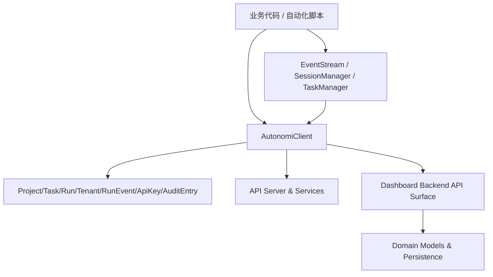
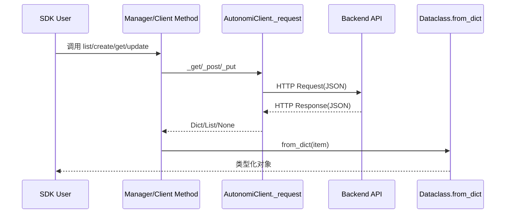

# Python SDK

## 1. 模块简介

Python SDK（`sdk/python/loki_mode_sdk`）是 Autonomi 平台的官方 Python 接入层，目标是让开发者以最小依赖、最少样板代码访问控制平面能力。它将后端的 REST API（主要来自 [API Server & Services](API Server & Services.md) 与 [Dashboard Backend](Dashboard Backend.md)）封装成同步、可类型提示的 Python 接口，使调用方可以直接围绕“项目、任务、运行、租户、审计”等业务对象编写逻辑，而不是围绕 URL、Header、JSON 细节编写胶水代码。

这个模块存在的核心价值有三点。第一，**标准化通信与错误处理**：统一 URL 拼接、认证头注入、JSON 编解码和 HTTP 异常映射。第二，**统一数据契约**：通过 dataclass 将响应对象化，降低“字典字段散落在业务代码里”的维护成本。第三，**零外部依赖**：仅使用 Python 标准库，适用于受限环境（CI、运维脚本、内网工具、最小镜像容器）。

从系统角色看，Python SDK 是“平台能力的消费端入口”，与 [TypeScript SDK](TypeScript SDK.md) 形成双语言互补：前者偏后端自动化、脚本和服务集成，后者偏前端/Node 生态。

---

## 2. 架构总览



Python SDK 采用“三层结构”：

- **传输与入口层**：`AutonomiClient`，负责请求执行、认证、错误处理、响应解析。
- **资源管理层**：`EventStream`、`SessionManager`、`TaskManager`，按业务域组织调用语义。
- **类型契约层**：`types.py` 中 dataclass，负责 JSON 到对象的映射。

这种分层让模块职责边界清晰：如果网络行为变化，优先修改客户端；如果业务动作变化，修改管理器；如果响应字段变化，修改类型契约。

---

## 3. 核心数据流



上图体现了 SDK 的关键承诺：调用者最终拿到的是类型对象或稳定结构，而不是杂乱的原始响应。同时，HTTP 错误会被统一映射为 SDK 异常，便于业务层集中处理。

---

## 4. 子模块说明（高层）

### 4.1 core_client_transport

该子模块以 `AutonomiClient` 为核心，是 Python SDK 的统一入口与传输编排层。它负责 HTTP 请求执行（GET/POST/PUT/DELETE）、认证头注入（Bearer Token）、查询参数过滤、JSON 编解码，以及 401/403/404 的异常语义化映射。模块采用标准库 `urllib`，因此具备“零第三方依赖”的可移植优势，适合运行在受限环境、运维脚本和轻量容器中。

你可以把它理解为 SDK 的“协议适配器”：上层管理器与调用代码无需关心 URL 拼接和错误 body 解析逻辑，只需要调用面向资源的方法并处理统一异常。

详见：[core_client_transport.md](core_client_transport.md)

### 4.2 resource_managers

该子模块聚合 `TaskManager`、`SessionManager` 与 `EventStream` 三类资源管理能力。它将“底层 HTTP 调用”提升为“业务动作调用”，例如创建/更新任务、列出项目会话、查询会话详情，以及按 `run_id` 轮询增量事件。`TaskManager` 和 `EventStream` 输出类型化对象（`Task` / `RunEvent`），而 `SessionManager` 当前以字典返回为主，体现了“强类型与兼容性并存”的设计取舍。

如果你要新增资源域（如 RunManager/TenantManager），这里提供了最直接的扩展模板：管理器仅做参数规整与响应归一化，传输仍由 `AutonomiClient` 统一处理。

详见：[resource_managers.md](resource_managers.md)

### 4.3 type_contracts

该子模块定义 SDK 的核心数据契约：`Project`、`Task`、`Run`、`RunEvent`、`Tenant`、`ApiKey`、`AuditEntry`。每个类型通过 `from_dict` 承担反序列化职责，并通过默认值策略处理后端可选字段，减少调用方对原始 JSON 字段细节的耦合。

它不是严格校验层，而是轻量映射层：在前向兼容和调用便利性上表现优秀，但关键业务路径仍建议在上层补充显式校验。

详见：[type_contracts.md](type_contracts.md)

---

## 5. 主要能力与使用入口

Python SDK 当前覆盖以下典型能力：

- 平台状态检查（health/status）
- 项目与租户管理
- 任务生命周期操作
- 运行查询、取消、重放、时间线
- API Key 列表/创建/轮换
- 审计日志查询
- 基于 run 的事件轮询

最小示例：

```python
from loki_mode_sdk.client import AutonomiClient
from loki_mode_sdk.tasks import TaskManager

client = AutonomiClient(
    base_url="http://localhost:57374",
    token="loki_xxx",
    timeout=30,
)

tm = TaskManager(client)
items = tm.list_tasks(project_id="proj_1", status="pending")
for t in items:
    print(t.id, t.title, t.status)
```

---

## 6. 配置与运行建议

SDK 的核心运行参数很少：`base_url`、`token`、`timeout`。建议在生产环境通过环境变量注入，并在应用层统一构造客户端实例，避免每次操作重复创建对象。

在长轮询或批处理场景中，建议你在业务层增加：

- 重试与退避（如指数退避）
- 超时分级（读写操作不同 timeout）
- 请求级日志（便于排障）
- 事件游标持久化（用于重启后续拉）

SDK 保持轻量，不内置这些策略，是有意的“可组合”设计。

---

## 7. 错误处理、边界条件与限制

你在集成时应特别关注以下点：

1. **异常分层有限**：仅对 401/403/404 提供专用异常，其它状态码归并为 `AutonomiError`。如果你要做精细化策略（例如 409 重试、429 限流），需在业务层根据 `status_code` 细分。
2. **同步模型**：SDK 当前为同步接口；高并发服务中应配合线程池或封装异步适配层。
3. **部分接口返回原始字典**：如会话相关返回 `Dict`，意味着字段可能随服务端演进变化，你需要做健壮的 `.get()` 读取。
4. **契约宽松映射**：某些 `from_dict` 对缺失字段采用默认值而非抛错，能提升容错但可能掩盖数据质量问题，建议在关键流程增加显式校验。
5. **事件流为轮询**：`EventStream` 非推送模型；若轮询间隔过短会增加后端压力，过长则实时性降低。
6. **网络异常包装范围**：底层主要对 HTTPError 做 SDK 异常映射，连接失败、DNS/TLS 类异常可能以 `urllib` 原生异常向上冒泡。

---

## 8. 与其他模块的关系

- 与 [API Server & Services](API Server & Services.md)：Python SDK 消费其 API 与运行态能力，尤其是任务/会话/运行相关接口。
- 与 [Dashboard Backend](Dashboard Backend.md)：Python SDK 的主要资源语义（tenant/project/task/run/audit/api key）直接来自该模块 API 面。
- 与 [api_surface_and_transport](api_surface_and_transport.md)：SDK 中绝大多数调用最终映射到 Dashboard 的 HTTP API Surface。
- 与 [domain_models_and_persistence](domain_models_and_persistence.md)：SDK 返回对象是后端领域模型的外部视图。
- 与 [TypeScript SDK](TypeScript SDK.md)：两者共享同一业务域模型，保证多语言接入的一致性。

如果你要扩展 Python SDK，建议先对照上述模块确认后端契约，再在 `AutonomiClient -> Manager -> Types` 三层中选择正确落点实现。

---

## 9. 文档导航

- 核心客户端与传输层：**[core_client_transport.md](core_client_transport.md)**
- 资源管理器（任务/会话/事件轮询）：**[resource_managers.md](resource_managers.md)**
- 类型契约（Project/Task/Run/Tenant 等）：**[type_contracts.md](type_contracts.md)**

如需系统级背景，请联读：
- **[API Server & Services.md](API Server & Services.md)**
- **[Dashboard Backend.md](Dashboard Backend.md)**
- **[api_surface_and_transport.md](api_surface_and_transport.md)**
- **[domain_models_and_persistence.md](domain_models_and_persistence.md)**
- **[TypeScript SDK.md](TypeScript SDK.md)**