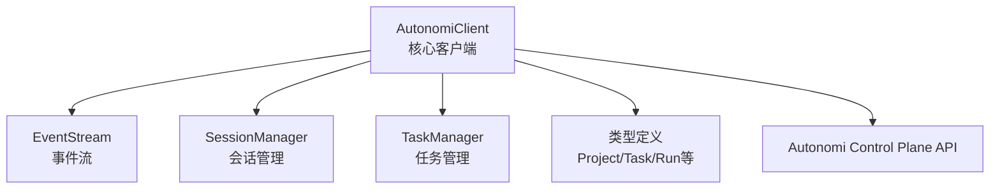

# Python SDK 文档

## 概述

Python SDK 是 Autonomi Control Plane API 的官方 Python 客户端，提供了与控制平面交互的简洁、高效的接口。该 SDK 采用纯 Python 标准库实现，零外部依赖，确保了最大的兼容性和易用性。它允许开发者通过编程方式管理项目、任务、运行、租户、API 密钥等资源，并能够实时跟踪运行事件和审计日志。

### 设计理念

Python SDK 的设计遵循以下原则：
- **简洁性**：提供直观的 API，降低学习曲线
- **可靠性**：完善的错误处理和类型安全
- **无依赖**：仅使用 Python 标准库，避免依赖冲突
- **同步优先**：提供同步接口，同时为异步使用留下扩展空间

## 架构概述

Python SDK 采用模块化设计，由核心客户端、管理器类和类型定义组成。以下是 SDK 的整体架构：



### 核心组件说明

1. **AutonomiClient**：作为 SDK 的核心入口点，负责所有 HTTP 请求的发送和响应处理。它提供了直接访问资源的方法，同时也作为其他管理器类的基础。

2. **EventStream**：专门处理运行事件的轮询和获取，允许开发者实时跟踪执行进度。

3. **SessionManager**：管理项目会话的生命周期，提供会话列表和详情查询功能。

4. **TaskManager**：专注于任务的创建、更新和查询操作。

5. **类型定义**：使用数据类（dataclass）定义了所有资源类型，提供类型安全和便捷的数据访问方式。

## 核心功能模块

### 客户端与认证

AutonomiClient 是 SDK 的核心，提供了完整的 API 访问能力。它支持基于令牌的认证，自动处理 HTTP 请求的构建、发送和响应解析，并提供了完善的错误处理机制。

### 项目管理

项目管理功能允许开发者列出、获取和创建项目。每个项目都可以包含多个任务和运行，是组织工作的基本单元。

### 任务管理

任务管理模块提供了任务的完整生命周期管理，包括创建、更新、查询和状态跟踪。任务可以分配给代理，并具有优先级和状态属性。

### 运行管理

运行管理功能允许查看和管理执行运行。开发者可以列出运行、获取详情、取消运行、重放运行，以及获取运行的事件时间线。

### 租户管理

租户管理功能适用于多租户环境，允许创建和管理租户（组织）。

### API 密钥管理

API 密钥管理模块提供了密钥的创建、列出和轮换功能，支持设置权限角色和 grace period。

### 审计日志

审计日志功能允许查询系统的审计记录，支持按时间范围、动作类型等条件过滤。

### 事件流

事件流模块提供了运行事件的轮询功能，允许开发者实时获取运行的最新事件。

## 快速开始

### 安装与配置

由于 Python SDK 仅使用标准库，无需额外安装。只需将 `loki_mode_sdk` 包导入到您的项目中即可。

### 基本使用示例

```python
from loki_mode_sdk.client import AutonomiClient

# 初始化客户端
client = AutonomiClient(
    base_url="http://localhost:57374",
    token="loki_your_token_here"
)

# 获取服务器状态
status = client.get_status()
print(f"服务器状态: {status}")

# 列出所有项目
projects = client.list_projects()
for project in projects:
    print(f"项目: {project.name} (ID: {project.id})")

# 创建新项目
new_project = client.create_project(
    name="我的新项目",
    description="这是一个示例项目"
)
print(f"创建的项目 ID: {new_project.id}")
```

## 子模块文档

- [类型定义](Python SDK - 类型定义.md)：详细介绍 SDK 中使用的所有数据类型
- [管理器类](Python SDK - 管理器类.md)：深入了解 TaskManager、SessionManager 和 EventStream 的使用方法

## 与其他模块的关系

Python SDK 是与 Autonomi 系统交互的主要接口之一。它与以下模块紧密相关：

- **API Server & Services**：SDK 直接与 API 服务器通信，使用其提供的 RESTful 接口
- **Dashboard Backend**：SDK 可以访问 Dashboard Backend 提供的许多相同功能
- **TypeScript SDK**：提供了与 Python SDK 类似功能的 TypeScript 实现

更多关于这些模块的信息，请参考它们的文档：
- [API Server & Services](API Server & Services.md)
- [Dashboard Backend](Dashboard Backend.md)
- [TypeScript SDK](TypeScript SDK.md)
