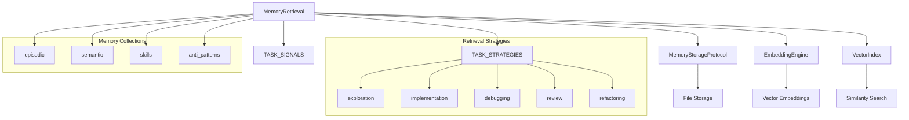
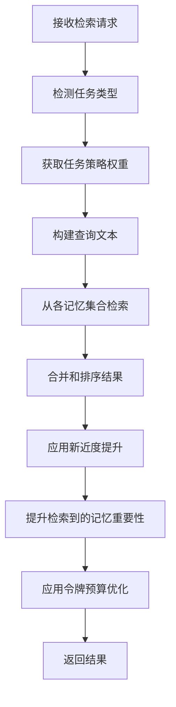

# Retrieval 模块文档

## 1. 模块概述

Retrieval 模块是 Loki Mode 记忆系统的核心组件，提供任务感知的记忆检索功能。该模块基于 arXiv 2512.18746 (MemEvolve) 的研究成果，通过任务感知的自适应策略，相比静态权重方法提升了 17% 的检索性能。

### 设计理念

模块的核心设计思想是根据当前任务类型动态调整不同记忆集合的权重，从而提供更相关的记忆检索结果。系统支持多种检索策略，包括向量相似度搜索、关键词搜索、时间范围检索等，并提供命名空间隔离和继承机制，实现跨项目的记忆共享和隔离。

### 主要功能

- **任务感知检索**：根据任务类型自动调整记忆集合权重
- **多模态检索**：支持向量相似度搜索和关键词搜索
- **命名空间管理**：支持项目级别的记忆隔离和跨命名空间检索
- **渐进式披露**：根据令牌预算智能选择记忆详细程度
- **向量索引管理**：支持构建、保存和加载向量索引

## 2. 架构设计

### 2.1 核心组件关系图



### 2.2 组件说明

#### MemoryRetrieval 类

这是模块的核心类，提供统一的记忆检索接口。它协调存储、嵌入引擎和向量索引，实现任务感知的检索功能。

#### MemoryStorageProtocol 协议

定义了记忆存储后端的接口，包括读取 JSON 文件、列出文件、计算重要性等功能。

#### EmbeddingEngine 协议

定义了嵌入引擎的接口，用于生成文本的向量表示。

#### VectorIndex 协议

定义了向量索引后端的接口，支持添加、搜索、删除嵌入，以及保存和加载索引。

#### TASK_STRATEGIES

定义了不同任务类型的权重配置，每个策略指定了 episodic、semantic、skills 和 anti_patterns 四个记忆集合的权重。

#### TASK_SIGNALS

定义了任务类型检测的信号，包括关键词、动作和阶段，用于自动检测当前任务类型。

## 3. 核心功能详解

### 3.1 任务类型检测

系统通过分析上下文信息自动检测当前任务类型。检测过程基于三个维度的信号：

1. **关键词匹配**：在目标描述中查找特定关键词
2. **动作类型匹配**：识别当前执行的操作类型
3. **阶段匹配**：根据当前开发阶段判断任务类型

#### 实现细节

```python
def detect_task_type(self, context: Dict[str, Any]) -> str:
    """
    检测任务类型，使用关键词信号和结构模式。
    
    分析上下文中的目标、动作类型和阶段字段，确定最可能的任务类型。
    """
    goal = context.get("goal", "").lower()
    action = context.get("action_type", "").lower()
    phase = context.get("phase", "").lower()
    
    scores: Dict[str, int] = {}
    
    for task_type, signals in TASK_SIGNALS.items():
        score = 0
        
        # 关键词匹配（权重：2）
        for keyword in signals["keywords"]:
            if keyword in goal:
                score += 2
        
        # 动作匹配（权重：3）
        for action_signal in signals["actions"]:
            if action_signal in action:
                score += 3
        
        # 阶段匹配（权重：4 - 最强信号）
        for phase_signal in signals["phases"]:
            if phase_signal in phase:
                score += 4
        
        scores[task_type] = score
    
    # 返回得分最高的类型，默认返回 implementation
    best_type = max(scores, key=lambda k: scores[k])
    if scores[best_type] == 0:
        return "implementation"
    
    return best_type
```

### 3.2 任务感知检索

任务感知检索是模块的核心功能，它根据检测到的任务类型，应用相应的权重策略，从不同的记忆集合中检索相关记忆。

#### 检索策略

| 任务类型 | episodic权重 | semantic权重 | skills权重 | anti_patterns权重 |
|---------|-------------|-------------|-----------|------------------|
| exploration | 0.6 | 0.3 | 0.1 | 0.0 |
| implementation | 0.15 | 0.5 | 0.35 | 0.0 |
| debugging | 0.4 | 0.2 | 0.0 | 0.4 |
| review | 0.3 | 0.5 | 0.0 | 0.2 |
| refactoring | 0.25 | 0.45 | 0.3 | 0.0 |

#### 检索流程



### 3.3 命名空间管理

模块支持命名空间级别的记忆隔离和共享，提供以下功能：

1. **命名空间作用域检索**：仅在当前命名空间内检索
2. **跨命名空间搜索**：包含父命名空间和全局命名空间
3. **命名空间继承**：子命名空间可以访问父命名空间的记忆

#### 跨命名空间检索

```python
def retrieve_cross_namespace(
    self,
    context: Dict[str, Any],
    namespaces: List[str],
    top_k: int = 5,
    token_budget: Optional[int] = None,
) -> List[Dict[str, Any]]:
    """
    从多个命名空间检索记忆。
    
    在指定的命名空间中搜索，合并结果并按相关性排序。
    适用于寻找跨项目适用的模式。
    """
    all_results: List[Dict[str, Any]] = []
    
    for ns in namespaces:
        # 为该命名空间创建检索实例
        ns_retrieval = self.with_namespace(ns)
        
        # 从该命名空间检索
        ns_results = ns_retrieval.retrieve_task_aware(
            context=context,
            top_k=top_k,
            token_budget=None,  # 合并后应用预算
        )
        
        # 标注命名空间
        for result in ns_results:
            result["_namespace"] = ns
            # 对非当前命名空间的结果稍微降低权重
            if ns != self._namespace:
                current_score = result.get("_weighted_score", 0.5)
                result["_weighted_score"] = current_score * 0.9
        
        all_results.extend(ns_results)
    
    # 按加权分数排序
    all_results.sort(
        key=lambda x: x.get("_weighted_score", 0),
        reverse=True,
    )
    
    # 应用令牌预算（如果指定）
    if token_budget is not None and token_budget > 0:
        all_results = optimize_context(all_results, token_budget)
    
    return all_results[:top_k * len(namespaces)]
```

### 3.4 渐进式披露

为了优化令牌使用效率，模块支持渐进式披露功能，根据令牌预算智能选择记忆的详细程度：

1. **层 1**：仅主题索引（最少令牌）
2. **层 2**：添加相关主题的摘要
3. **层 3**：为最高优先级项展开完整详细信息

#### 渐进式检索流程

```python
def _progressive_retrieve(
    self,
    context: Dict[str, Any],
    token_budget: int,
    task_type: str,
) -> Dict[str, Any]:
    """
    实现渐进式披露检索。
    
    层 1：仅主题索引（最小成本）
    层 2：为相关主题添加摘要
    层 3：为最高优先级项展开完整详细信息
    """
    weights = TASK_STRATEGIES.get(task_type, TASK_STRATEGIES["implementation"])
    query = self._build_query_from_context(context)
    
    # 跟踪预算使用情况
    budget_remaining = token_budget
    selected_memories: List[Dict[str, Any]] = []
    
    # 层 1：加载主题索引（最小成本）
    layer1_budget = int(token_budget * 0.2)  # 为索引保留 20%
    index_data = self.storage.read_json("index.json") or {}
    topics = index_data.get("topics", [])
    
    # 按与查询的相关性过滤主题
    relevant_topics = self._filter_relevant_topics(topics, query, weights)
    
    # 估计层 1 的令牌数
    layer1_tokens = sum(estimate_memory_tokens(t) for t in relevant_topics[:10])
    if layer1_tokens <= layer1_budget:
        for topic in relevant_topics[:10]:
            topic["_layer"] = 1
            selected_memories.append(topic)
        budget_remaining -= layer1_tokens
    
    # 层 2：为顶级主题展开摘要
    layer2_budget = int(token_budget * 0.4)  # 为摘要保留 40%
    if budget_remaining > layer2_budget * 0.5:
        summaries = self._get_topic_summaries(relevant_topics[:5], query, weights)
        layer2_tokens = sum(estimate_memory_tokens(s) for s in summaries)
        
        if layer2_tokens <= budget_remaining:
            for summary in summaries:
                summary["_layer"] = 2
                selected_memories.append(summary)
            budget_remaining -= layer2_tokens
    
    # 层 3：为最高优先级项提供完整详细信息
    if budget_remaining > 100:  # 至少剩余 100 个令牌
        full_details = self.retrieve_task_aware(context, top_k=10)
        for detail in full_details:
            detail["_layer"] = 3
        
        # 优化以适应剩余预算
        optimized = optimize_context(full_details, budget_remaining)
        selected_memories.extend(optimized)
    
    # 计算最终指标
    total_available = self._estimate_total_available_tokens()
    metrics = get_context_efficiency(selected_memories, token_budget, total_available)
    metrics["layers_used"] = list(set(m.get("_layer", 2) for m in selected_memories))
    
    return {
        "memories": selected_memories,
        "metrics": metrics,
        "task_type": task_type,
    }
```

## 4. API 参考

### 4.1 MemoryRetrieval 类

#### 初始化

```python
def __init__(
    self,
    storage: MemoryStorageProtocol,
    embedding_engine: Optional[EmbeddingEngine] = None,
    vector_indices: Optional[Dict[str, VectorIndex]] = None,
    base_path: str = ".loki/memory",
    namespace: Optional[str] = None,
):
    """
    初始化记忆检索系统。
    
    参数:
        storage: 用于读取记忆文件的 MemoryStorage 实例
        embedding_engine: 用于相似性搜索的可选嵌入引擎
        vector_indices: 可选的向量索引字典（episodic, semantic, skills）
        base_path: 记忆存储目录的基础路径
        namespace: 用于作用域检索的可选命名空间
    """
```

#### 主要方法

##### 任务感知检索

```python
def retrieve_task_aware(
    self,
    context: Dict[str, Any],
    top_k: int = 5,
    token_budget: Optional[int] = None,
) -> List[Dict[str, Any]]:
    """
    使用任务类型感知权重检索记忆。
    
    从上下文中检测任务类型，并对每个记忆集合应用适当的权重。
    
    参数:
        context: 包含查询上下文的字典（goal, task_type, phase 等）
        top_k: 要返回的最大结果数
        token_budget: 可选的返回记忆的最大令牌预算。
                     如果指定，结果将使用重要性/新近度/相关性评分进行优化，以适应此预算。
    
    返回:
        带有源字段的记忆项列表，指示来源
    """
```

##### 跨命名空间检索

```python
def retrieve_cross_namespace(
    self,
    context: Dict[str, Any],
    namespaces: List[str],
    top_k: int = 5,
    token_budget: Optional[int] = None,
) -> List[Dict[str, Any]]:
    """
    从多个命名空间检索记忆。
    
    在指定的命名空间中搜索，合并结果并按相关性排序。
    适用于寻找跨项目适用的模式。
    
    参数:
        context: 查询上下文（goal, task_type, phase 等）
        namespaces: 要搜索的命名空间列表
        top_k: 每个命名空间的最大结果数（然后合并）
        token_budget: 可选的总结果令牌预算
    
    返回:
        合并和排序的记忆列表，带有命名空间标注
    """
```

##### 继承检索

```python
def retrieve_with_inheritance(
    self,
    context: Dict[str, Any],
    top_k: int = 5,
    include_global: bool = True,
    token_budget: Optional[int] = None,
) -> List[Dict[str, Any]]:
    """
    按照命名空间继承链检索记忆。
    
    首先搜索当前命名空间，然后是父命名空间，最后是全局命名空间。
    来自更具体命名空间的结果优先。
    
    参数:
        context: 查询上下文（goal, task_type, phase 等）
        top_k: 要返回的最大结果数
        include_global: 是否包含全局命名空间
        token_budget: 可选的结果令牌预算
    
    返回:
        继承链的合并结果
    """
```

##### 预算优化检索

```python
def retrieve_with_budget(
    self,
    context: Dict[str, Any],
    token_budget: int,
    progressive: bool = True,
) -> Dict[str, Any]:
    """
    检索针对特定令牌预算优化的记忆。
    
    使用渐进式披露：从层 1（主题索引）开始，
    如果预算允许，扩展到层 2（摘要），最后
    为最高优先级项扩展到层 3（完整详细信息）。
    
    参数:
        context: 查询上下文（goal, phase, action_type 等）
        token_budget: 用于上下文的最大令牌数
        progressive: 如果为 True，使用渐进式披露层。
                    如果为 False，检索所有可用数据并裁剪。
    
    返回:
        包含以下内容的字典：
            - memories: 选定的记忆列表
            - metrics: 令牌使用和效率指标
            - task_type: 检测到的任务类型
    """
```

##### 向量索引管理

```python
def build_indices(self) -> None:
    """
    从存储构建所有向量索引。
    
    读取所有记忆并创建用于相似性搜索的向量嵌入。
    需要配置 embedding_engine。
    """

def save_indices(self) -> None:
    """
    将所有向量索引保存到磁盘。
    """

def load_indices(self) -> None:
    """
    从磁盘加载所有向量索引。
    """
```

### 4.2 协议定义

#### MemoryStorageProtocol

```python
class MemoryStorageProtocol(Protocol):
    """记忆存储后端的协议。"""

    def read_json(self, filepath: str) -> Optional[Dict[str, Any]]:
        """读取 JSON 文件并返回内容。"""
        ...

    def list_files(self, subpath: str, pattern: str = "*.json") -> List[Path]:
        """列出子目录中匹配模式的文件。"""
        ...

    def calculate_importance(
        self, memory: Dict[str, Any], task_type: Optional[str] = None
    ) -> float:
        """计算记忆的重要性分数。"""
        ...

    def boost_on_retrieval(
        self, memory: Dict[str, Any], boost: float = 0.1
    ) -> Dict[str, Any]:
        """在检索记忆时提升重要性。"""
        ...
```

#### EmbeddingEngine

```python
class EmbeddingEngine(Protocol):
    """嵌入引擎的协议。"""

    def embed(self, text: str) -> Any:
        """生成文本的嵌入。如果可用，返回 numpy 数组。"""
        ...

    def embed_batch(self, texts: List[str]) -> List[Any]:
        """生成多个文本的嵌入。"""
        ...
```

#### VectorIndex

```python
class VectorIndex(Protocol):
    """向量索引后端的协议。"""

    def add(self, id: str, embedding: Any, metadata: Dict[str, Any]) -> None:
        """向索引添加嵌入。"""
        ...

    def search(
        self,
        query: Any,
        top_k: int = 5,
        filters: Optional[Dict[str, Any]] = None,
    ) -> List[Tuple[str, float, Dict[str, Any]]]:
        """搜索相似的嵌入。返回 (id, score, metadata) 元组。"""
        ...

    def remove(self, id: str) -> bool:
        """从索引中删除嵌入。"""
        ...

    def save(self, path: str) -> None:
        """将索引保存到磁盘。"""
        ...

    def load(self, path: str) -> None:
        """从磁盘加载索引。"""
        ...
```

## 5. 使用示例

### 5.1 基本使用

```python
from memory.retrieval import MemoryRetrieval
from memory.storage import MemoryStorage  # 假设有一个存储实现
from memory.embeddings import EmbeddingEngine  # 假设有一个嵌入引擎实现
from memory.vector_index import VectorIndex  # 假设有一个向量索引实现

# 初始化组件
storage = MemoryStorage(base_path=".loki/memory")
embedding_engine = EmbeddingEngine()
vector_indices = {
    "episodic": VectorIndex(),
    "semantic": VectorIndex(),
    "skills": VectorIndex(),
    "anti_patterns": VectorIndex(),
}

# 创建检索实例
retrieval = MemoryRetrieval(
    storage=storage,
    embedding_engine=embedding_engine,
    vector_indices=vector_indices,
    namespace="my-project"
)

# 构建向量索引
retrieval.build_indices()
retrieval.save_indices()

# 任务感知检索
context = {
    "goal": "Implement user authentication feature",
    "phase": "development",
    "action_type": "write_file"
}

results = retrieval.retrieve_task_aware(context, top_k=5)
for result in results:
    print(f"Source: {result['_source']}, Score: {result['_weighted_score']}")
    print(f"Content: {result.get('goal', result.get('pattern', result.get('name', '')))}")
    print("---")
```

### 5.2 预算优化检索

```python
# 使用令牌预算进行渐进式检索
result = retrieval.retrieve_with_budget(
    context={
        "goal": "Fix login bug in authentication module",
        "phase": "debugging",
        "action_type": "run_test"
    },
    token_budget=2000,
    progressive=True
)

print(f"Detected task type: {result['task_type']}")
print(f"Token efficiency: {result['metrics']['efficiency']}")
print(f"Layers used: {result['metrics']['layers_used']}")

for memory in result['memories']:
    print(f"Layer: {memory['_layer']}, Source: {memory['_source']}")
```

### 5.3 跨命名空间检索

```python
# 从多个命名空间检索
results = retrieval.retrieve_cross_namespace(
    context={
        "goal": "Refactor database access layer",
        "phase": "refactoring",
        "action_type": "rename"
    },
    namespaces=["my-project", "previous-project", "global"],
    top_k=3,
    token_budget=1500
)

for result in results:
    print(f"Namespace: {result['_namespace']}, Source: {result['_source']}")
    print(f"Score: {result['_weighted_score']}")
```

### 5.4 时间范围检索

```python
from datetime import datetime, timedelta, timezone

# 检索最近 7 天的记忆
since = datetime.now(timezone.utc) - timedelta(days=7)
results = retrieval.retrieve_by_temporal(since=since)

for result in results:
    print(f"Source: {result['_source']}")
    timestamp = result.get('timestamp') or result.get('last_used')
    print(f"Timestamp: {timestamp}")
```

## 6. 扩展和定制

### 6.1 自定义任务策略

可以通过修改 `TASK_STRATEGIES` 字典来添加或修改任务策略：

```python
from memory.retrieval import TASK_STRATEGIES

# 添加自定义任务策略
TASK_STRATEGIES["testing"] = {
    "episodic": 0.3,
    "semantic": 0.2,
    "skills": 0.1,
    "anti_patterns": 0.4,
}

# 同时添加任务信号
from memory.retrieval import TASK_SIGNALS

TASK_SIGNALS["testing"] = {
    "keywords": [
        "test", "testing", "unittest", "integration test",
        "test case", "assert", "coverage"
    ],
    "actions": ["run_test", "write_test", "check_coverage"],
    "phases": ["testing", "qa", "test automation"],
}
```

### 6.2 自定义存储后端

通过实现 `MemoryStorageProtocol` 协议，可以创建自定义存储后端：

```python
from memory.retrieval import MemoryStorageProtocol
from pathlib import Path
from typing import Any, Dict, List, Optional

class DatabaseMemoryStorage(MemoryStorageProtocol):
    """基于数据库的记忆存储后端"""
    
    def __init__(self, db_connection):
        self.db = db_connection
    
    def read_json(self, filepath: str) -> Optional[Dict[str, Any]]:
        # 从数据库读取 JSON 数据
        result = self.db.query("SELECT data FROM memories WHERE path = ?", filepath)
        if result:
            return result[0]["data"]
        return None
    
    def list_files(self, subpath: str, pattern: str = "*.json") -> List[Path]:
        # 从数据库列出匹配的文件
        results = self.db.query(
            "SELECT path FROM memories WHERE path LIKE ?", 
            f"{subpath}/{pattern}"
        )
        return [Path(r["path"]) for r in results]
    
    def calculate_importance(
        self, memory: Dict[str, Any], task_type: Optional[str] = None
    ) -> float:
        # 自定义重要性计算逻辑
        base_importance = memory.get("importance", 0.5)
        if task_type == "debugging" and memory.get("_source") == "anti_patterns":
            return min(1.0, base_importance * 1.5)
        return base_importance
    
    def boost_on_retrieval(
        self, memory: Dict[str, Any], boost: float = 0.1
    ) -> Dict[str, Any]:
        # 自定义检索时的重要性提升逻辑
        memory["importance"] = min(1.0, memory.get("importance", 0.5) + boost)
        memory["last_retrieved"] = datetime.now(timezone.utc).isoformat()
        # 更新数据库
        self.db.execute(
            "UPDATE memories SET data = ? WHERE id = ?",
            memory, memory.get("id")
        )
        return memory
```

### 6.3 自定义向量索引

通过实现 `VectorIndex` 协议，可以创建自定义向量索引后端：

```python
from memory.retrieval import VectorIndex
from typing import Any, Dict, List, Optional, Tuple

class MilvusVectorIndex(VectorIndex):
    """基于 Milvus 的向量索引后端"""
    
    def __init__(self, collection_name, milvus_client):
        self.collection_name = collection_name
        self.client = milvus_client
        self._ensure_collection()
    
    def _ensure_collection(self):
        # 确保集合存在
        if self.collection_name not in self.client.list_collections():
            # 创建集合逻辑
            pass
    
    def add(self, id: str, embedding: Any, metadata: Dict[str, Any]) -> None:
        # 添加向量到索引
        self.client.insert(
            self.collection_name,
            [{"id": id, "vector": embedding, "metadata": metadata}]
        )
    
    def search(
        self,
        query: Any,
        top_k: int = 5,
        filters: Optional[Dict[str, Any]] = None,
    ) -> List[Tuple[str, float, Dict[str, Any]]]:
        # 搜索相似向量
        search_params = {"metric_type": "L2", "params": {"nprobe": 10}}
        results = self.client.search(
            self.collection_name,
            [query],
            output_fields=["id", "metadata"],
            param=search_params,
            limit=top_k
        )
        
        # 格式化结果
        formatted = []
        for hit in results[0]:
            formatted.append((
                hit.entity.get("id"),
                1.0 / (1.0 + hit.distance),  # 转换距离为相似度分数
                hit.entity.get("metadata")
            ))
        return formatted
    
    def remove(self, id: str) -> bool:
        # 从索引中删除向量
        self.client.delete(self.collection_name, f"id == '{id}'")
        return True
    
    def save(self, path: str) -> None:
        # Milvus 自动持久化，这里可以创建快照
        self.client.create_snapshot(self.collection_name, path)
    
    def load(self, path: str) -> None:
        # 从快照加载
        self.client.restore_snapshot(path, self.collection_name)
```

## 7. 注意事项和限制

### 7.1 性能考虑

1. **向量索引构建**：构建向量索引可能需要大量时间和计算资源，特别是对于大型记忆集合。建议在非高峰时段构建索引。

2. **内存使用**：向量索引可能占用大量内存，特别是当使用高维嵌入时。考虑使用内存映射或分片技术来处理大型索引。

3. **检索延迟**：向量相似度搜索通常比关键词搜索慢。对于性能关键的应用，可以考虑：
   - 使用近似最近邻算法
   - 预计算热门查询的结果
   - 实现结果缓存

### 7.2 边界情况

1. **无可用嵌入**：当没有配置嵌入引擎时，系统会回退到关键词搜索。确保关键词搜索功能能够满足基本需求。

2. **任务类型检测失败**：当无法确定任务类型时，系统默认使用 "implementation" 策略。可以考虑添加自定义的默认策略。

3. **命名空间不存在**：当指定的命名空间不存在时，系统可能会返回空结果。确保在使用前验证命名空间的存在性。

4. **令牌预算过小**：当令牌预算过小时，渐进式检索可能只能返回层 1 的结果。确保设置合理的令牌预算。

### 7.3 错误处理

1. **嵌入生成失败**：处理嵌入生成过程中可能出现的错误，如网络问题、API 限制等。

2. **索引损坏**：实现索引的备份和恢复机制，以处理索引损坏的情况。

3. **存储访问错误**：优雅地处理存储访问错误，如文件权限问题、磁盘空间不足等。

### 7.4 兼容性

1. **NumPy 依赖**：向量操作需要 NumPy，但它是可选的。确保在没有 NumPy 的情况下，系统能够正常回退到关键词搜索。

2. **Python 版本**：确保代码与支持的 Python 版本兼容，特别是使用类型注解和协议时。

## 8. 相关模块

- [Memory Engine](Memory_Engine.md)：提供记忆的核心存储和管理功能
- [Embeddings](Embeddings.md)：处理文本嵌入的生成和管理
- [Vector Index](Vector_Index.md)：实现向量索引的具体功能
- [Unified Access](Unified_Access.md)：提供统一的记忆访问接口

## 9. 参考文献

- arXiv 2512.18746 (MemEvolve)：任务感知记忆检索的研究基础
- references/memory-system.md：完整的记忆系统文档
