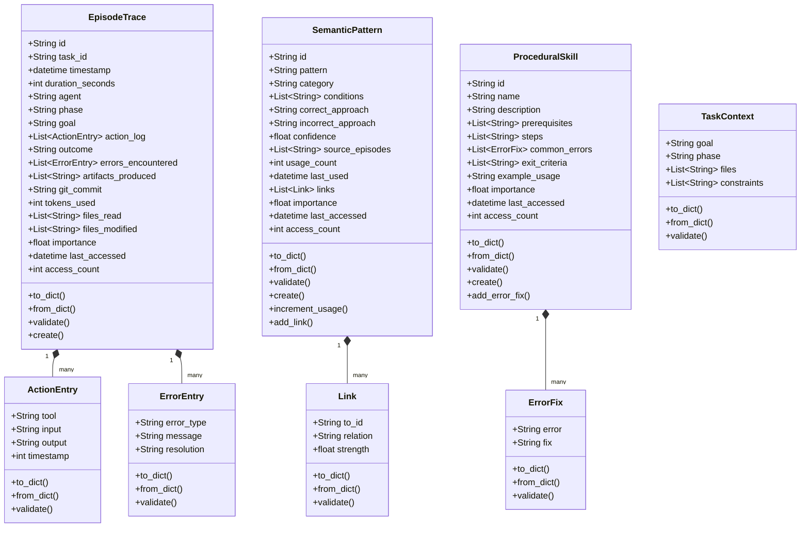
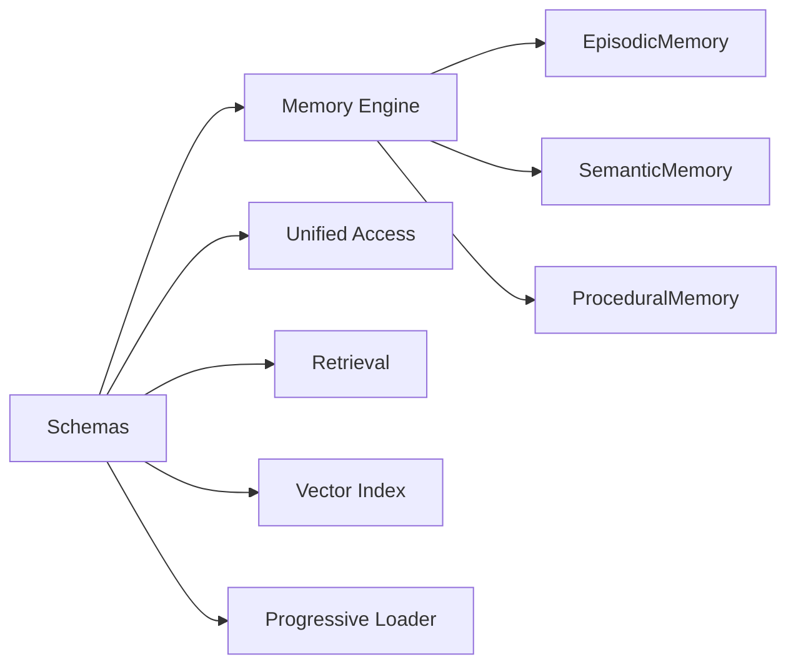

# Schemas 模块文档

## 目录
1. [模块概述](#模块概述)
2. [核心组件](#核心组件)
3. [支持类型](#支持类型)
4. [主内存类型](#主内存类型)
5. [使用示例](#使用示例)
6. [数据序列化与反序列化](#数据序列化与反序列化)
7. [验证机制](#验证机制)
8. [与其他模块的关系](#与其他模块的关系)

---

## 模块概述

Schemas 模块是 Loki Mode Memory System 的核心数据定义模块，负责定义整个内存系统所使用的数据结构和数据类型。该模块通过 Python 的 dataclass 实现了类型安全的数据模型，支持三种主要的记忆类型：

- **情景记忆 (Episodic Memory)**: 记录具体的交互轨迹
- **语义记忆 (Semantic Memory)**: 存储抽象化的模式和知识
- **程序记忆 (Procedural Memory)**: 保存可重用的技能和流程

### 设计目标

1. **类型安全**: 使用 dataclass 提供编译时类型检查
2. **序列化支持**: 内置与 JSON 格式的双向转换
3. **数据验证**: 提供完整的数据验证机制
4. **可扩展性**: 支持 Zettelkasten 风格的链接系统
5. **时间跟踪**: 内置重要性评分和访问统计

### 模块位置

本模块位于 `memory/schemas.py`，是 Memory System 的基础组件，为 [Memory Engine](Memory_System.md#memory-engine)、[Unified Access](Memory_System.md#unified-access) 等上层模块提供数据定义支持。

---

## 核心组件

下面是模块的核心组件架构图：



---

## 支持类型

### ActionEntry

**用途**: 记录任务执行过程中的单个操作

```python
@dataclass
class ActionEntry:
    tool: str                    # 使用的工具或操作类型
    input: str                   # 操作的输入参数
    output: str                  # 操作的结果或输出
    timestamp: int               # 相对开始时间的秒数
```

**主要方法**:
- `to_dict()`: 转换为字典用于 JSON 序列化
- `from_dict(data)`: 从字典创建实例
- `validate()`: 验证数据有效性，返回错误列表

**验证规则**:
- `tool` 字段必填
- `timestamp` 必须为非负数

### ErrorEntry

**用途**: 记录任务执行过程中遇到的错误

```python
@dataclass
class ErrorEntry:
    error_type: str              # 错误类别（如 "TypeScript compilation"）
    message: str                 # 错误消息
    resolution: str              # 错误解决方法
```

**主要方法**:
- `to_dict()`: 转换为字典
- `from_dict(data)`: 从字典创建
- `validate()`: 验证数据

**验证规则**:
- `error_type` 和 `message` 字段必填

### Link

**用途**: 实现 Zettelkasten 风格的记忆条目链接

```python
@dataclass
class Link:
    to_id: str                   # 链接到的记忆条目ID
    relation: str                # 关系类型
    strength: float = 1.0        # 链接强度 (0.0-1.0)
```

**有效关系类型**:
- `derived_from`: 派生自
- `related_to`: 相关于
- `contradicts`: 矛盾于
- `elaborates`: 详细说明
- `example_of`: 示例
- `supersedes`: 取代
- `superseded_by`: 被取代
- `supports`: 支持

**验证规则**:
- `to_id` 必填
- `relation` 必须是有效类型之一
- `strength` 必须在 0.0 到 1.0 之间

### ErrorFix

**用途**: 记录常见错误及其修复方法，用于程序技能

```python
@dataclass
class ErrorFix:
    error: str                   # 错误描述
    fix: str                     # 修复方法
```

**验证规则**:
- `error` 和 `fix` 字段都必填

### TaskContext

**用途**: 提供任务执行的上下文信息

```python
@dataclass
class TaskContext:
    goal: str                    # 任务目标
    phase: str                   # 当前 RARV 阶段
    files: List[str] = field(default_factory=list)      # 涉及的文件
    constraints: List[str] = field(default_factory=list) # 约束条件
```

**有效 RARV 阶段**:
- `REASON`: 推理阶段
- `ACT`: 行动阶段
- `REFLECT`: 反思阶段
- `VERIFY`: 验证阶段

**验证规则**:
- `goal` 必填
- `phase` 如果提供，必须是有效阶段之一

---

## 主内存类型

### EpisodeTrace

**用途**: 记录特定的交互轨迹（情景记忆），代表完整的任务执行记录

```python
@dataclass
class EpisodeTrace:
    id: str                                           # 唯一标识符
    task_id: str                                      # 任务引用
    timestamp: datetime                               # 开始时间
    duration_seconds: int                             # 持续时间
    agent: str                                        # 执行代理类型
    phase: str                                        # RARV 阶段
    goal: str                                         # 任务目标
    action_log: List[ActionEntry] = field(default_factory=list)      # 操作日志
    outcome: str = "success"                          # 结果
    errors_encountered: List[ErrorEntry] = field(default_factory=list) # 遇到的错误
    artifacts_produced: List[str] = field(default_factory=list)        # 产生的产物
    git_commit: Optional[str] = None                  # Git 提交哈希
    tokens_used: int = 0                              # 使用的 token 数
    files_read: List[str] = field(default_factory=list)    # 读取的文件
    files_modified: List[str] = field(default_factory=list) # 修改的文件
    importance: float = 0.5                           # 重要性评分
    last_accessed: Optional[datetime] = None          # 最后访问时间
    access_count: int = 0                              # 访问次数
```

**有效结果值**:
- `success`: 成功
- `failure`: 失败
- `partial`: 部分成功

**主要方法**:

1. **`create(task_id, agent, goal, phase="ACT", id_prefix="ep")`**
   - 工厂方法，创建新的 EpisodeTrace
   - 自动生成 ID、时间戳等默认值
   - 返回初始化的 EpisodeTrace 实例

2. **`to_dict()`**
   - 转换为字典格式，用于 JSON 序列化
   - 处理 datetime 格式化为 UTC ISO 8601
   - 嵌套对象也会相应转换

3. **`from_dict(data)`**
   - 从字典数据创建 EpisodeTrace 实例
   - 处理日期时间解析
   - 支持向后兼容的字段映射

4. **`validate()`**
   - 验证所有字段的有效性
   - 包括嵌套的 ActionEntry 和 ErrorEntry
   - 返回错误列表，空列表表示验证通过

**使用示例**:
```python
from memory.schemas import EpisodeTrace, ActionEntry

# 创建新的情景记忆
trace = EpisodeTrace.create(
    task_id="task-123",
    agent="code-assistant",
    goal="Implement user authentication",
    phase="ACT"
)

# 添加操作记录
trace.action_log.append(ActionEntry(
    tool="write_file",
    input="auth.py",
    output="Created authentication module",
    timestamp=10
))

# 验证数据
errors = trace.validate()
if errors:
    print("Validation errors:", errors)
else:
    # 序列化为字典
    data = trace.to_dict()
```

### SemanticPattern

**用途**: 存储从情景记忆中提取的泛化模式（语义记忆）

```python
@dataclass
class SemanticPattern:
    id: str                                           # 唯一标识符
    pattern: str                                      # 模式描述
    category: str                                     # 类别
    conditions: List[str] = field(default_factory=list)      # 适用条件
    correct_approach: str = ""                        # 正确方法
    incorrect_approach: str = ""                      # 错误方法
    confidence: float = 0.8                           # 置信度
    source_episodes: List[str] = field(default_factory=list) # 源情景
    usage_count: int = 0                              # 使用次数
    last_used: Optional[datetime] = None              # 最后使用时间
    links: List[Link] = field(default_factory=list)   # 相关链接
    importance: float = 0.5                           # 重要性评分
    last_accessed: Optional[datetime] = None          # 最后访问时间
    access_count: int = 0                              # 访问次数
```

**主要方法**:

1. **`create(pattern, category, conditions=None, correct_approach="", incorrect_approach="", id_prefix="sem")`**
   - 工厂方法创建新的语义模式
   - 自动生成 ID 和默认值

2. **`increment_usage()`**
   - 记录模式被使用
   - 增加使用计数并更新最后使用时间

3. **`add_link(to_id, relation, strength=1.0)`**
   - 添加 Zettelkasten 链接到其他模式
   - 验证链接有效性后添加

4. **`to_dict()` / `from_dict(data)` / `validate()`**
   - 与 EpisodeTrace 类似的序列化和验证方法

**使用示例**:
```python
from memory.schemas import SemanticPattern

# 创建语义模式
pattern = SemanticPattern.create(
    pattern="Always validate input before processing",
    category="best-practices",
    conditions=["User input handling", "API endpoints"],
    correct_approach="Use Pydantic models for validation",
    incorrect_approach="Process raw input directly"
)

# 添加链接到相关模式
pattern.add_link("sem-abc123", "related_to", 0.8)

# 记录使用
pattern.increment_usage()
```

### ProceduralSkill

**用途**: 存储可重用的技能（程序记忆）

```python
@dataclass
class ProceduralSkill:
    id: str                                           # 唯一标识符
    name: str                                         # 技能名称
    description: str                                  # 技能描述
    prerequisites: List[str] = field(default_factory=list)    # 前置条件
    steps: List[str] = field(default_factory=list)              # 执行步骤
    common_errors: List[ErrorFix] = field(default_factory=list) # 常见错误
    exit_criteria: List[str] = field(default_factory=list)      # 退出标准
    example_usage: Optional[str] = None               # 使用示例
    importance: float = 0.5                           # 重要性评分
    last_accessed: Optional[datetime] = None          # 最后访问时间
    access_count: int = 0                              # 访问次数
```

**主要方法**:

1. **`create(name, description, steps, id_prefix="skill")`**
   - 工厂方法创建新的程序技能
   - 从名称自动生成 slug 格式的 ID

2. **`add_error_fix(error, fix)`**
   - 添加常见错误及其修复方法

3. **`to_dict()` / `from_dict(data)` / `validate()`**
   - 标准的序列化和验证方法

**使用示例**:
```python
from memory.schemas import ProceduralSkill

# 创建程序技能
skill = ProceduralSkill.create(
    name="REST API Implementation",
    description="Implement a RESTful API endpoint with proper error handling",
    steps=[
        "Define data model",
        "Create request/response schemas",
        "Implement business logic",
        "Add error handling",
        "Write unit tests"
    ]
)

# 添加前置条件
skill.prerequisites = [
    "Database connection established",
    "Authentication middleware configured"
]

# 添加常见错误
skill.add_error_fix(
    error="400 Bad Request without details",
    fix="Include validation error messages in response"
)
```

---

## 使用示例

### 完整的工作流程示例

```python
from memory.schemas import (
    EpisodeTrace,
    SemanticPattern,
    ProceduralSkill,
    ActionEntry,
    ErrorEntry,
    Link,
    TaskContext
)
from datetime import datetime, timezone

# 1. 创建情景记忆
episode = EpisodeTrace.create(
    task_id="task-2024-001",
    agent="developer-assistant",
    goal="Fix TypeScript compilation errors in auth module",
    phase="ACT"
)

# 添加操作记录
episode.action_log.append(ActionEntry(
    tool="read_file",
    input="src/auth.ts",
    output="Read authentication module source",
    timestamp=5
))

episode.action_log.append(ActionEntry(
    tool="write_file",
    input="src/auth.ts",
    output="Fixed type annotations in login function",
    timestamp=15
))

# 添加错误记录
episode.errors_encountered.append(ErrorEntry(
    error_type="TypeScript compilation",
    message="Property 'user' does not exist on type 'Request'",
    resolution="Added type declaration for Request.user"
))

# 更新其他信息
episode.duration_seconds = 120
episode.tokens_used = 4500
episode.outcome = "success"
episode.files_modified = ["src/auth.ts", "src/types.d.ts"]

# 2. 从情景中提取语义模式
pattern = SemanticPattern.create(
    pattern="TypeScript requires explicit type declarations for extended Request objects",
    category="TypeScript",
    conditions=[
        "Express.js with TypeScript",
        "Extending Request object",
        "Using middleware that adds properties"
    ],
    correct_approach="Create a type declaration file that extends the Request interface",
    incorrect_approach="Use 'any' type or ignore TypeScript errors"
)

# 链接到源情景
pattern.source_episodes = [episode.id]
pattern.confidence = 0.9

# 3. 创建程序技能
skill = ProceduralSkill.create(
    name="Fix TypeScript Request Extension Errors",
    description="Step-by-step guide to fix TypeScript errors when extending Request objects",
    steps=[
        "Identify the missing properties on Request",
        "Create or update type declaration file",
        "Extend the Express Request interface",
        "Import the declaration in your project",
        "Verify compilation passes"
    ]
)

skill.add_error_fix(
    error="Declaration file not picked up by TypeScript",
    fix="Ensure the file is included in tsconfig.json's include array"
)

skill.exit_criteria = [
    "TypeScript compilation succeeds",
    "All Request properties are properly typed",
    "No type errors in IDE"
]

# 4. 验证所有数据
all_valid = True
for obj, name in [(episode, "Episode"), (pattern, "Pattern"), (skill, "Skill")]:
    errors = obj.validate()
    if errors:
        print(f"{name} validation errors:", errors)
        all_valid = False
    else:
        print(f"{name} validated successfully")

# 5. 序列化为字典（用于存储）
if all_valid:
    episode_data = episode.to_dict()
    pattern_data = pattern.to_dict()
    skill_data = skill.to_dict()
    
    # 可以将这些数据保存到数据库或文件
    print("Data ready for storage")
```

---

## 数据序列化与反序列化

### 日期时间处理

模块提供了专用的日期时间处理函数，确保 UTC 时间的一致格式：

```python
# 内部使用的辅助函数
_to_utc_isoformat(dt: datetime) -> str
_parse_utc_datetime(s: str) -> datetime
```

**格式规则**:
- 输出格式: `YYYY-MM-DDTHH:MM:SS.ffffffZ`
- 支持解析: `Z` 后缀、`+00:00` 后缀、无时区信息（假设 UTC）

### 序列化映射

每个主要类都有特定的字段映射，用于兼容性和简洁性：

| 类 | 字段映射 |
|---|---|
| ActionEntry | `t` ↔ `timestamp`, `action` ↔ `tool`, `target` ↔ `input`, `result` ↔ `output` |
| ErrorEntry | `type` ↔ `error_type` |
| Link | `to` ↔ `to_id` |
| EpisodeTrace | `context` 嵌套对象包含 `phase`, `goal`, `files_involved` |
| TaskContext | `files_involved` ↔ `files` |

### 向后兼容性

`from_dict` 方法设计为支持多个版本的格式，通过尝试多个字段名来实现：

```python
# 示例：ActionEntry.from_dict
tool=data.get("action", data.get("tool", ""))
input=data.get("target", data.get("input", ""))
```

---

## 验证机制

### 验证层次

模块实现了多层次的验证：

1. **字段级别验证**: 必填字段、范围检查、类型约束
2. **枚举值验证**: 确保字段值在允许的列表中
3. **嵌套对象验证**: 递归验证所有子对象
4. **业务规则验证**: 如时间戳非负、评分在 0-1 之间

### 验证方法使用

```python
# 验证对象并处理错误
def safe_create_episode():
    episode = EpisodeTrace.create(...)
    errors = episode.validate()
    
    if errors:
        # 处理验证错误
        print("Cannot create episode:")
        for error in errors:
            print(f"  - {error}")
        return None
    
    return episode
```

### 常见验证错误

| 错误信息 | 说明 |
|---------|------|
| `EpisodeTrace.id is required` | ID 字段未设置 |
| `EpisodeTrace.phase must be one of: REASON, ACT, REFLECT, VERIFY` | 无效的阶段值 |
| `Link.relation must be one of: ...` | 无效的关系类型 |
| `EpisodeTrace.importance must be between 0.0 and 1.0` | 评分超出范围 |
| `action_log[0]: ActionEntry.tool is required` | 嵌套对象的字段错误 |

---

## 与其他模块的关系

### 模块依赖图



### 集成点

1. **Memory Engine**: 使用本模块定义的数据结构实现三种记忆类型
   - 参考 [Memory System 文档](Memory_System.md)

2. **Unified Access**: 通过统一接口访问这些数据类型
   - 参考 [Memory System 文档](Memory_System.md#unified-access)

3. **Retrieval**: 使用这些数据结构进行检索和存储
   - 参考 [Memory System 文档](Memory_System.md#retrieval)

4. **Dashboard UI Components**: 在前端展示这些记忆数据
   - 参考 [Dashboard UI Components 文档](Dashboard_UI_Components.md)

### 扩展建议

如果需要扩展数据模型：

1. **添加新字段**: 在相应的 dataclass 中添加，并更新 `to_dict` 和 `from_dict`
2. **创建新类型**: 遵循现有模式，使用 dataclass 并实现三个核心方法
3. **自定义验证**: 在 `validate` 方法中添加新的验证规则
4. **链接机制**: 使用现有的 Link 类创建新的关系类型

---

## 注意事项和限制

### 重要注意事项

1. **时区处理**: 所有 datetime 都应该使用 UTC 时区
2. **ID 格式**: ID 应该遵循 `prefix-timestamp-uuid` 格式以确保唯一性
3. **重要性评分**: 应该实现衰减机制，定期更新 `importance` 字段
4. **访问跟踪**: 每次访问记忆时应该更新 `last_accessed` 和 `access_count`

### 已知限制

1. **无事务支持**: 数据结构本身不提供事务机制，需要上层实现
2. **无并发控制**: 没有内置的锁机制，多线程环境需要额外处理
3. **内存存储**: 这些是内存中的数据结构，持久化需要额外处理
4. **无索引**: 数据结构本身不提供索引功能，需要外部实现

### 性能考虑

1. **验证开销**: `validate()` 方法会递归检查所有嵌套对象，大型对象树可能有性能影响
2. **序列化开销**: `to_dict()` 和 `from_dict()` 对于大型集合可能较慢
3. **内存占用**: 完整的 EpisodeTrace 可能包含大量 ActionEntry，需要注意内存使用

### 错误处理最佳实践

```python
# 推荐的错误处理模式
try:
    # 创建和操作对象
    pattern = SemanticPattern.create(...)
    pattern.add_link("invalid-id", "invalid-relation", 2.0)
except ValueError as e:
    # 处理验证异常
    print(f"Validation error: {e}")
except Exception as e:
    # 处理其他异常
    print(f"Unexpected error: {e}")
else:
    # 成功路径
    errors = pattern.validate()
    if not errors:
        # 保存或使用
        pass
```

---

## 总结

Schemas 模块是整个 Loki Mode Memory System 的基础，提供了类型安全、可序列化、可验证的数据结构。通过三种核心记忆类型（EpisodeTrace、SemanticPattern、ProceduralSkill）和支持类型，该模块为构建强大的记忆系统提供了坚实的基础。

该模块的设计强调了：
- **数据完整性**: 通过验证机制确保数据质量
- **互操作性**: 通过标准化的序列化支持数据交换
- **可扩展性**: 通过链接机制支持知识图谱构建
- **实用性**: 提供工厂方法简化对象创建

更多关于如何使用这些数据结构的信息，请参考 [Memory System 文档](Memory_System.md)。
