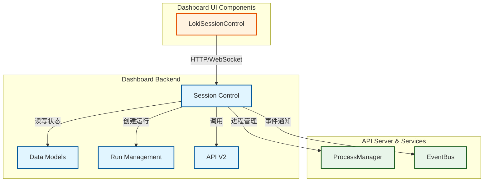

# Session Control 模块文档

## 1. 模块概述

Session Control模块是Loki Mode Dashboard后端的核心组件，负责提供会话生命周期管理功能。该模块通过FastAPI构建了一套完整的控制API，允许用户启动、停止、暂停和恢复Loki Mode会话，并实时监控会话状态。

### 1.1 设计目的

Session Control模块的设计旨在解决以下关键问题：
- 提供统一的会话控制接口，简化用户与Loki Mode系统的交互
- 确保会话状态的一致性和可靠性，防止并发操作导致的状态冲突
- 支持实时状态更新和事件流，为前端提供动态的用户体验
- 实现安全的路径验证和进程管理，保护系统免受潜在的安全威胁

### 1.2 核心功能

- **会话启动**: 支持配置不同的AI提供商、并行模式和PRD文档路径
- **会话控制**: 提供停止、暂停、恢复等会话生命周期管理功能
- **状态监控**: 实时获取会话当前状态、进度和任务信息
- **事件流**: 通过Server-Sent Events (SSE)提供实时事件推送
- **日志访问**: 支持获取会话日志的最近记录

## 2. 架构与组件关系

Session Control模块作为Dashboard Backend的子模块，与其他模块存在紧密的协作关系。

### 2.1 模块架构图



### 2.2 核心组件说明

Session Control模块的核心组件包括：

1. **FastAPI应用 (`app`)**: 作为HTTP服务入口，处理所有API请求
2. **请求模型 (`StartRequest`)**: 定义启动会话所需的参数结构和验证逻辑
3. **响应模型**: 包括`StatusResponse`和`ControlResponse`，规范API返回格式
4. **状态管理工具**: 包括`get_status()`函数和各种状态文件操作
5. **事件系统**: 支持事件记录和SSE流式传输
6. **进程管理**: 负责启动、监控和终止Loki Mode运行进程

### 2.3 文件结构与状态管理

Session Control模块通过文件系统实现状态持久化和进程间通信：

```
.loki/
├── state/              # 状态文件目录
│   ├── provider        # 当前使用的AI提供商
│   └── orchestrator.json # 编排器状态
├── logs/               # 日志目录
│   └── session.log     # 会话日志
├── loki.pid            # 运行进程的PID
├── STATUS.txt          # 状态文本信息
├── PAUSE               # 存在时表示会话已暂停
├── STOP                # 存在时表示正在停止会话
├── session.json        # 会话信息（用于技能调用的会话）
├── dashboard-state.json # 仪表板状态信息
├── events.jsonl        # 事件日志文件
└── VERSION             # 版本信息
```

## 3. 核心功能详解

### 3.1 会话启动

会话启动功能通过`/api/control/start`端点实现，允许用户配置多种参数启动Loki Mode会话。

#### 工作流程

1. **参数验证**: 首先验证AI提供商是否在允许列表中，然后验证PRD路径的安全性和存在性
2. **状态检查**: 检查是否已有会话在运行，防止重复启动
3. **命令构建**: 根据请求参数构建运行命令
4. **进程启动**: 使用`subprocess.Popen`启动后台进程
5. **状态保存**: 保存提供商信息并发出启动事件

#### 参数说明

`StartRequest`模型包含以下参数：

| 参数 | 类型 | 默认值 | 说明 |
|------|------|--------|------|
| `prd` | Optional[str] | None | PRD文档路径，可选 |
| `provider` | str | "claude" | AI提供商，支持"claude"、"codex"、"gemini" |
| `parallel` | bool | False | 是否启用并行模式 |
| `background` | bool | True | 是否在后台运行 |

#### 安全验证

`StartRequest`类实现了两个关键验证方法：

- `validate_provider()`: 确保所选AI提供商在允许列表中
- `validate_prd_path()`: 执行多重安全检查，包括：
  - 防止路径遍历攻击（检查".."序列）
  - 验证文件存在且为普通文件
  - 确保路径在允许的目录范围内（当前工作目录或用户主目录）

### 3.2 会话控制

Session Control模块提供了完整的会话生命周期管理功能，包括停止、暂停和恢复。

#### 停止会话 (`/api/control/stop`)

停止会话采用双重机制确保会话能够正确终止：

1. 创建`STOP`文件作为优雅关闭信号
2. 尝试直接向进程发送`SIGTERM`信号
3. 更新`session.json`文件标记会话状态为"stopped"
4. 发出会话停止事件

#### 暂停会话 (`/api/control/pause`)

暂停功能通过创建`PAUSE`文件实现，该文件会被Loki Mode运行时检测到，使其在完成当前任务后暂停执行。

#### 恢复会话 (`/api/control/resume`)

恢复功能通过删除`PAUSE`和`STOP`文件实现，允许会话继续执行。

### 3.3 状态监控

状态监控功能通过`/api/control/status`端点提供，返回当前会话的详细状态信息。

#### 状态检测逻辑

`get_status()`函数实现了复杂的状态检测逻辑：

1. 从`loki.pid`文件读取PID并检查进程是否运行
2. 检查`session.json`文件（处理技能调用的会话）
3. 根据`PAUSE`和`STOP`文件确定具体状态
4. 从各种状态文件收集额外信息，如当前阶段、任务、迭代次数等

#### 状态类型

系统定义了以下会话状态：

| 状态 | 说明 |
|------|------|
| `stopped` | 会话已停止 |
| `running` | 会话正在运行 |
| `paused` | 会话已暂停 |
| `stopping` | 会话正在停止过程中 |

### 3.4 事件流与日志

Session Control模块提供了两种方式获取实时信息：SSE事件流和日志API。

#### 事件流 (`/api/control/events`)

该端点实现了Server-Sent Events协议，提供两种类型的实时更新：

1. **状态更新**: 每2秒发送一次完整的会话状态
2. **日志事件**: 实时推送新的事件日志条目

事件流的实现使用了异步生成器模式，确保高效地推送更新而不会阻塞服务器。

#### 日志获取 (`/api/control/logs`)

该端点允许获取会话日志的最近记录，支持指定行数（默认50行，最多10000行）。

## 4. 核心类与函数

### 4.1 StartRequest 类

`StartRequest`是一个Pydantic模型，用于验证和结构化启动会话的请求参数。

```python
class StartRequest(BaseModel):
    prd: Optional[str] = None
    provider: str = "claude"
    parallel: bool = False
    background: bool = True
```

#### 主要方法

- `validate_provider()`: 验证提供商是否在允许列表中
- `validate_prd_path()`: 验证PRD路径的安全性和存在性

### 4.2 状态管理函数

#### get_status()

```python
def get_status() -> StatusResponse
```

该函数是状态监控的核心，负责收集和整合来自多个来源的状态信息，构建完整的`StatusResponse`对象。

**返回值**: 包含会话完整状态的`StatusResponse`对象

#### is_process_running()

```python
def is_process_running(pid: int) -> bool
```

检查指定PID的进程是否仍在运行。

**参数**:
- `pid`: 进程ID

**返回值**: 布尔值，表示进程是否在运行

### 4.3 文件操作函数

#### atomic_write_json()

```python
def atomic_write_json(file_path: Path, data: dict, use_lock: bool = True)
```

原子性地写入JSON数据到文件，防止竞态条件。

**参数**:
- `file_path`: 目标文件路径
- `data`: 要写入的字典数据
- `use_lock`: 是否使用文件锁

**实现机制**:
1. 创建临时文件
2. 可选地获取文件锁
3. 写入数据并确保刷新到磁盘
4. 原子性地重命名临时文件为目标文件

### 4.4 事件处理函数

#### emit_event()

```python
def emit_event(event_type: str, data: dict) -> None
```

发出事件到`events.jsonl`文件，格式与`run.sh`中的`emit_event_json()`保持一致。

**参数**:
- `event_type`: 事件类型
- `data`: 事件数据字典

## 5. API端点参考

### 5.1 健康检查

```http
GET /api/control/health
```

返回服务健康状态和版本信息。

### 5.2 获取状态

```http
GET /api/control/status
```

返回当前会话的详细状态信息。

**响应示例**:
```json
{
  "state": "running",
  "pid": 12345,
  "statusText": "Processing task...",
  "currentPhase": "implementation",
  "currentTask": "Create main module",
  "pendingTasks": 5,
  "provider": "claude",
  "version": "1.0.0",
  "lokiDir": "/path/to/.loki",
  "iteration": 3,
  "complexity": "standard",
  "timestamp": "2023-06-15T10:30:00Z"
}
```

### 5.3 启动会话

```http
POST /api/control/start
Content-Type: application/json

{
  "prd": "/path/to/prd.md",
  "provider": "claude",
  "parallel": false,
  "background": true
}
```

**响应示例**:
```json
{
  "success": true,
  "message": "Session started with provider claude",
  "pid": 12345
}
```

### 5.4 停止会话

```http
POST /api/control/stop
```

**响应示例**:
```json
{
  "success": true,
  "message": "Stop signal sent",
  "pid": 12345
}
```

### 5.5 暂停会话

```http
POST /api/control/pause
```

**响应示例**:
```json
{
  "success": true,
  "message": "Pause signal sent - session will pause after current task",
  "pid": 12345
}
```

### 5.6 恢复会话

```http
POST /api/control/resume
```

**响应示例**:
```json
{
  "success": true,
  "message": "Session resumed",
  "pid": 12345
}
```

### 5.7 事件流

```http
GET /api/control/events
```

建立SSE连接，接收实时状态和日志事件。

### 5.8 获取日志

```http
GET /api/control/logs?lines=100
```

**响应示例**:
```json
{
  "logs": ["log line 1", "log line 2", "..."],
  "total": 1500
}
```

## 6. 配置与部署

### 6.1 环境变量

Session Control模块支持以下环境变量配置：

| 变量名 | 默认值 | 说明 |
|--------|--------|------|
| `LOKI_DIR` | `.loki` | Loki状态文件目录 |
| `LOKI_DASHBOARD_CORS` | `http://localhost:57374,http://127.0.0.1:57374` | 允许的CORS源，逗号分隔 |
| `LOKI_DASHBOARD_PORT` | `57374` | 服务端口 |
| `LOKI_DASHBOARD_HOST` | `127.0.0.1` | 服务主机地址 |

### 6.2 部署方式

有两种主要方式部署Session Control服务：

1. **直接使用uvicorn**:
   ```bash
   uvicorn dashboard.control:app --host 0.0.0.0 --port 57374
   ```

2. **使用CLI命令**:
   ```bash
   loki dashboard start
   ```

3. **作为模块直接运行**:
   ```bash
   python -m dashboard.control
   ```

## 7. 安全考虑

Session Control模块实现了多层安全机制，确保系统安全可靠：

### 7.1 路径安全

- `validate_prd_path()`方法实现了严格的路径验证，防止路径遍历攻击
- 限制PRD文件只能位于当前工作目录或用户主目录下
- 检查路径中是否包含".."序列

### 7.2 CORS配置

- 默认只允许本地访问
- 支持通过环境变量配置允许的源
- 避免了过于宽松的CORS策略带来的安全风险

### 7.3 文件操作安全

- 使用原子写入操作防止竞态条件
- 可选的文件锁机制增强并发安全性
- 临时文件使用确保操作的完整性

## 8. 边缘情况与限制

### 8.1 会话超时处理

对于通过技能调用的会话（没有PID但有`session.json`文件），系统会进行超时检查：
- 如果会话状态为"running"但启动时间超过6小时，会自动标记为"stopped"
- 这防止了僵尸会话状态的持久存在

### 8.2 进程终止的可靠性

停止会话采用了多重机制，但仍存在以下限制：
- 如果进程无法响应`SIGTERM`信号，可能需要手动干预
- 在极端情况下，可能需要使用`SIGKILL`信号强制终止

### 8.3 状态文件的一致性

系统依赖多个状态文件来跟踪会话状态，这带来了一些潜在问题：
- 如果状态文件损坏或被意外删除，可能导致状态判断错误
- 并发访问状态文件可能导致竞态条件（尽管使用了原子写入）

### 8.4 事件流的可靠性

SSE事件流存在以下限制：
- 客户端断开连接期间的事件会丢失
- 没有事件确认或重传机制
- 依赖于网络连接的稳定性

## 9. 使用示例

### 9.1 基本启动会话

```python
import requests

response = requests.post("http://localhost:57374/api/control/start", json={
    "provider": "claude",
    "background": True
})
print(response.json())
```

### 9.2 带PRD的会话启动

```python
import requests

response = requests.post("http://localhost:57374/api/control/start", json={
    "prd": "/path/to/project/prd.md",
    "provider": "claude",
    "parallel": True,
    "background": True
})

if response.status_code == 200:
    data = response.json()
    print(f"Session started with PID: {data['pid']}")
else:
    print(f"Error: {response.json()['detail']}")
```

### 9.3 监控会话状态

```python
import requests
import time

def monitor_session():
    while True:
        response = requests.get("http://localhost:57374/api/control/status")
        status = response.json()
        
        print(f"State: {status['state']}")
        print(f"Current phase: {status['currentPhase']}")
        print(f"Current task: {status['currentTask']}")
        print(f"Pending tasks: {status['pendingTasks']}")
        print("-" * 50)
        
        if status['state'] == 'stopped':
            break
            
        time.sleep(5)

monitor_session()
```

### 9.4 使用SSE事件流

```python
import requests
import json

def stream_events():
    response = requests.get("http://localhost:57374/api/control/events", stream=True)
    
    for line in response.iter_lines():
        if line:
            decoded_line = line.decode('utf-8')
            if decoded_line.startswith('data: '):
                data = json.loads(decoded_line[6:])
                print(f"Received status update: {data['state']}")
            elif decoded_line.startswith('event: log'):
                # Next line will contain the log data
                pass

stream_events()
```

## 10. 与其他模块的关系

Session Control模块与系统中的多个其他模块有紧密联系：

1. **[Data Models](Data Models.md)**: 共享任务、项目和运行等数据模型
2. **[Run Management](Run Management.md)**: 协作处理运行的创建和监控
3. **[Server Core](Server Core.md)**: 共享配置、连接管理等基础设施
4. **[Task and Session Management Components](Task and Session Management Components.md)**: 为LokiSessionControl UI组件提供后端API
5. **[API Server & Services](API Server & Services.md)**: 可能与ProcessManager和EventBus协作

## 11. 未来改进方向

虽然Session Control模块已经提供了强大的功能，但仍有一些可能的改进方向：

1. **更强大的进程管理**: 实现进程组管理和更可靠的终止机制
2. **事件持久化与回放**: 支持存储所有事件并允许客户端请求历史事件
3. **会话快照与恢复**: 支持创建会话状态快照并在需要时恢复
4. **资源限制与监控**: 添加对会话资源使用的监控和限制功能
5. **WebSocket支持**: 除了SSE外，提供WebSocket作为另一种实时通信选项
6. **认证与授权**: 添加API密钥或OAuth等认证机制
7. **分布式会话管理**: 支持在多服务器环境中管理会话
