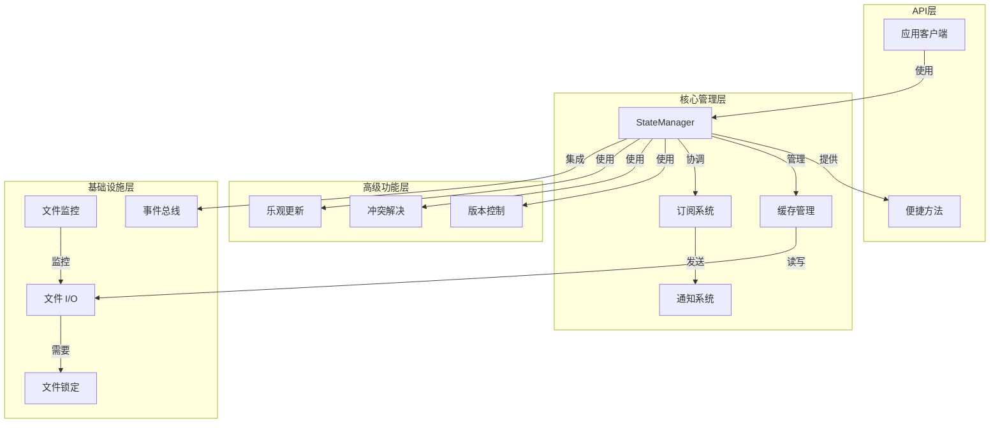

# State Management 模块文档

## 1. 简介

State Management 模块是一个功能全面的状态管理系统，提供了统一的状态管理解决方案，支持多种语言（Python 和 TypeScript）的实现。该模块旨在解决分布式系统中的状态同步、一致性和变更通知问题，具有缓存机制、版本控制、冲突解决和事件通知等高级特性。

### 设计目标

- **统一接口**：提供一致的 API，方便在不同语言环境中使用
- **高性能**：通过内存缓存提高读取速度
- **可靠性**：使用文件锁定确保并发安全
- **可追溯性**：版本历史记录与回滚功能
- **实时性**：文件监控与事件通知机制
- **协作支持**：乐观更新与冲突解决策略

## 2. 架构概览

State Management 模块采用多层架构设计，将不同的功能关注点分离，提供灵活可扩展的解决方案。



### 主要组件说明

1. **StateManager**：核心管理类，提供主要的状态管理接口
2. **缓存管理**：通过内存缓存提高访问性能
3. **订阅系统**：允许应用订阅状态变更通知
4. **版本控制**：维护状态历史，支持回滚操作
5. **冲突解决**：提供多种策略解决并发更新冲突
6. **文件监控**：监听文件变更，实时同步状态

## 3. 核心功能

### 3.1 状态文件管理

State Management 模块管理多种预定义的状态文件，通过 `ManagedFile` 枚举进行标识：

```python
# Python 实现
class ManagedFile(str, Enum):
    ORCHESTRATOR = "state/orchestrator.json"
    AUTONOMY = "autonomy-state.json"
    QUEUE_PENDING = "queue/pending.json"
    QUEUE_IN_PROGRESS = "queue/in-progress.json"
    QUEUE_COMPLETED = "queue/completed.json"
    QUEUE_FAILED = "queue/failed.json"
    QUEUE_CURRENT = "queue/current-task.json"
    MEMORY_INDEX = "memory/index.json"
    MEMORY_TIMELINE = "memory/timeline.json"
    DASHBOARD = "dashboard-state.json"
    AGENTS = "state/agents.json"
    RESOURCES = "state/resources.json"
```

这些文件涵盖了系统运行所需的各种状态，从编排器状态到任务队列，从内存索引到仪表板状态等。

### 3.2 缓存机制

为了提高性能，StateManager 实现了内存缓存层：

- 所有状态读取首先尝试从缓存获取
- 写入操作同时更新缓存和文件
- 缓存验证基于文件修改时间戳
- 支持手动刷新缓存以确保一致性

### 3.3 文件锁定与并发控制

为了确保多进程/多线程环境下的数据一致性，模块实现了文件锁定机制：

- 读操作使用共享锁
- 写操作使用排他锁
- 原子写入操作（先写临时文件，再重命名）
- 锁文件位于状态文件同目录，带有 `.lock` 扩展名

### 3.4 订阅与通知系统

模块提供了灵活的订阅机制，允许应用对状态变更做出反应：

```typescript
// TypeScript 示例
const manager = getStateManager();
const unsubscribe = manager.subscribe(
  (change: StateChange) => {
    console.log(`State changed: ${change.filePath}`);
    console.log(`Change type: ${change.changeType}`);
    console.log(`Diff:`, change.diff);
  },
  [ManagedFile.ORCHESTRATOR],  // 可选文件过滤器
  ["update"]                     // 可选变更类型过滤器
);

// 不再需要时取消订阅
unsubscribe();
```

### 3.5 通知通道

除了回调机制外，模块还支持多种通知通道：

- **FileNotificationChannel**：将变更通知写入文件，适合命令行工具使用
- **InMemoryNotificationChannel**：将通知保存在内存中，适合测试和嵌入场景

这些通道可以通过 `addNotificationChannel` 方法添加到 StateManager 中。

有关通知通道的详细信息、使用示例和扩展方法，请参考 [Notification Channels](Notification Channels.md) 文档。

## 4. 高级功能

### 4.1 版本历史与回滚 (SYN-015)

State Management 模块提供了完整的版本历史记录功能：

- 每次状态变更时自动保存历史版本
- 默认保留最近 10 个版本（可配置）
- 支持查看历史版本列表
- 支持获取特定版本的状态
- 支持回滚到之前的版本

```python
# Python 示例
manager = get_state_manager()

# 获取版本历史
history = manager.get_version_history(ManagedFile.ORCHESTRATOR)
for version_info in history:
    print(f"Version {version_info.version}: {version_info.timestamp}")

# 获取特定版本的状态
old_state = manager.get_state_at_version(ManagedFile.ORCHESTRATOR, 5)

# 回滚到特定版本
manager.rollback(ManagedFile.ORCHESTRATOR, 3, source="user-initiated")
```

### 4.2 乐观更新与冲突解决 (SYN-014)

为支持分布式协作，模块实现了乐观更新机制：

- 立即应用本地更新，提高响应性
- 使用版本向量跟踪变更来源
- 检测并发更新冲突
- 提供多种冲突解决策略：
  - LAST_WRITE_WINS：最后写入者获胜（默认）
  - MERGE：尝试合并兼容的变更
  - REJECT：拒绝冲突变更并通知调用者

```typescript
// TypeScript 示例
const manager = getStateManager();

// 设置冲突解决策略
manager.setConflictStrategy(ConflictStrategy.MERGE);

// 应用乐观更新
const pending = manager.optimisticUpdate(
  ManagedFile.ORCHESTRATOR,
  "currentPhase",
  "executing",
  "worker-1"
);

// 稍后与远程状态同步
const { resolvedState, conflicts, committed } = manager.syncWithRemote(
  ManagedFile.ORCHESTRATOR,
  remoteState,
  "remote-source"
);

console.log(`Resolved ${conflicts.length} conflicts`);
console.log(`Committed ${committed} updates`);
```

### 4.3 文件监控与外部变更检测

StateManager 可以监控文件系统的变更，自动同步外部修改：

- 使用 watchdog (Python) 或 chokidar (TypeScript) 监控文件
- 自动检测外部程序对状态文件的修改
- 更新缓存并通知订阅者
- 忽略锁文件和临时文件

## 5. API 参考

### 5.1 主要类与接口

#### StateManager

核心状态管理类，提供状态的读写、订阅和高级功能。

**构造函数参数**：
- `loki_dir`/`lokiDir`: 状态文件存储目录，默认为 `.loki`
- `enable_watch`/`enableWatch`: 是否启用文件监控，默认为 true
- `enable_events`/`enableEvents`: 是否启用事件总线集成，默认为 true
- `enable_versioning`/`enableVersioning`: 是否启用版本控制，默认为 true
- `version_retention`/`versionRetention`: 保留的版本数量，默认为 10

**核心方法**：

- `get_state(file_ref, default)` / `getState(fileRef, defaultValue)`: 获取状态
- `set_state(file_ref, data, source, save_version)` / `setState(fileRef, data, source, saveVersion)`: 设置状态
- `update_state(file_ref, updates, source)` / `updateState(fileRef, updates, source)`: 更新部分状态
- `delete_state(file_ref, source)` / `deleteState(fileRef, source)`: 删除状态文件
- `subscribe(callback, file_filter, change_types)` / `subscribe(callback, fileFilter, changeTypes)`: 订阅状态变更
- `get_version_history(file_ref)` / `getVersionHistory(fileRef)`: 获取版本历史
- `rollback(file_ref, version, source)`: 回滚到指定版本
- `optimistic_update(file_ref, key, value, source)` / `optimisticUpdate(fileRef, key, value, source)`: 应用乐观更新
- `sync_with_remote(file_ref, remote_state, remote_source, strategy)` / `syncWithRemote(fileRef, remoteState, remoteSource, strategy)`: 与远程状态同步

#### 其他核心类型

- `ManagedFile`: 管理的状态文件枚举
- `StateChange`: 状态变更事件数据结构
- `StateVersion`: 版本历史记录
- `VersionVector`: 用于冲突检测的版本向量
- `ConflictStrategy`: 冲突解决策略枚举
- `NotificationChannel`: 通知通道接口
- `FileNotificationChannel`: 文件通知通道实现
- `InMemoryNotificationChannel`: 内存通知通道实现

## 6. 使用示例

### 6.1 基本使用

```python
# Python 示例
from state.manager import StateManager, ManagedFile

# 创建状态管理器
manager = StateManager()

# 获取状态
orchestrator_state = manager.get_state(ManagedFile.ORCHESTRATOR, default={})
print(f"Current phase: {orchestrator_state.get('currentPhase', 'unknown')}")

# 更新状态
manager.update_state(
    ManagedFile.ORCHESTRATOR,
    {"currentPhase": "planning", "lastUpdated": "2023-05-15T10:30:00Z"},
    source="my-app"
)
```

```typescript
// TypeScript 示例
import { getStateManager, ManagedFile } from './state/manager';

// 获取状态管理器单例
const manager = getStateManager();

// 设置状态
manager.setState(
  ManagedFile.AUTONOMY,
  { status: "active", lastRun: new Date().toISOString() },
  "dashboard"
);

// 删除状态
manager.deleteState(ManagedFile.QUEUE_FAILED, "cleanup-script");
```

### 6.2 订阅状态变更

```typescript
// TypeScript 示例
import { getStateManager, ManagedFile, StateChange } from './state/manager';

const manager = getStateManager();

// 订阅特定文件的更新
const unsubscribe = manager.subscribe(
  (change: StateChange) => {
    console.log(`Orchestrator state changed: ${change.changeType}`);
    console.log(`Old value:`, change.oldValue);
    console.log(`New value:`, change.newValue);
  },
  [ManagedFile.ORCHESTRATOR],  // 只关注编排器状态
  ["update"]                     // 只关注更新操作
);

// 一段时间后取消订阅
setTimeout(unsubscribe, 60000);
```

### 6.3 使用通知通道

```python
# Python 示例
from state.manager import StateManager, FileNotificationChannel, ManagedFile
from pathlib import Path

manager = StateManager()

# 创建文件通知通道
notifications_file = Path(".loki/events/state-changes.jsonl")
channel = FileNotificationChannel(notifications_file)

# 添加通知通道
remove_channel = manager.add_notification_channel(channel)

# 现在所有状态变更都会写入通知文件
manager.set_state(ManagedFile.ORCHESTRATOR, {"phase": "testing"}, source="test")

# 之后可以移除通道
remove_channel()
```

有关通知通道的更多示例和高级用法，请参考 [Notification Channels](Notification Channels.md) 文档。

### 6.4 版本控制与回滚

```typescript
// TypeScript 示例
import { getStateManager, ManagedFile } from './state/manager';

const manager = getStateManager();

// 查看版本历史
const history = manager.getVersionHistory(ManagedFile.DASHBOARD);
console.log(`Found ${history.length} versions`);

// 获取特定版本
const version5 = manager.getStateAtVersion(ManagedFile.DASHBOARD, 5);
console.log("Version 5 data:", version5);

// 回滚到版本 3
const change = manager.rollback(ManagedFile.DASHBOARD, 3, "user-request");
if (change) {
  console.log(`Rolled back to version 3: ${change.timestamp}`);
}
```

### 6.5 乐观更新与远程同步

```python
# Python 示例
from state.manager import StateManager, ManagedFile, ConflictStrategy

manager = StateManager()

# 设置合并策略
manager.set_conflict_strategy(ConflictStrategy.MERGE)

# 应用乐观更新
pending = manager.optimistic_update(
    ManagedFile.QUEUE_CURRENT,
    "status",
    "processing",
    source="worker-node-1"
)

# 模拟获取远程状态
remote_state = {
    "taskId": "123",
    "status": "queued",  # 远程状态与本地有差异
    "_version_vector": {"worker-node-2": 1}
}

# 同步状态
resolved_state, conflicts, committed = manager.sync_with_remote(
    ManagedFile.QUEUE_CURRENT,
    remote_state,
    remote_source="coordinator",
    strategy=ConflictStrategy.MERGE
)

print(f"Resolved {len(conflicts)} conflicts")
print(f"Committed {committed} updates")
print(f"Final state: {resolved_state}")
```

## 7. 集成与依赖

### 7.1 依赖项

State Management 模块有一些可选依赖，用于提供高级功能：

**Python**:
- `watchdog`: 用于文件系统监控 (可选)
- 事件总线模块: 用于集成系统范围的事件通知 (可选)

**TypeScript**:
- `chokidar`: 用于文件系统监控 (可选)
- 事件总线模块: 用于集成系统范围的事件通知 (可选)

### 7.2 与其他模块的集成

State Management 模块设计为与系统的其他部分无缝集成：

- **API Server & Services**: 通过 `StateNotificationsManager` 接收状态变更通知
- **Dashboard Backend**: 管理仪表板状态文件，提供 UI 状态持久化
- **Memory System**: 管理内存索引和时间线状态文件
- **Swarm Multi-Agent**: 协调多代理系统的状态同步

关于其他模块的详细信息，请参考相应的模块文档：
- [API Server & Services](API Server & Services.md)
- [Dashboard Backend](Dashboard Backend.md)
- [Memory System](Memory System.md)
- [Swarm Multi-Agent](Swarm Multi-Agent.md)

## 8. 配置与部署

### 8.1 环境要求

- Python 3.7+ (Python 实现)
- Node.js 14+ (TypeScript 实现)
- 支持文件锁定的文件系统
- 对于文件监控，需要操作系统支持文件系统事件

### 8.2 部署注意事项

1. **状态目录位置**: 确保 `.loki` 目录有足够的磁盘空间和适当的权限
2. **版本保留策略**: 根据可用磁盘空间和历史需求调整 `version_retention` 参数
3. **文件监控**: 在网络文件系统上可能需要禁用文件监控，以避免性能问题
4. **并发访问**: 在高并发场景下，考虑使用更高级的冲突解决策略

## 9. 注意事项与限制

1. **原子性保证**: 单个状态文件操作是原子的，但跨多个文件的操作不是事务性的
2. **版本历史**: 版本历史仅保存在本地，不会自动同步到其他节点
3. **内存使用**: 大状态文件可能会占用较多内存，特别是启用版本历史时
4. **网络文件系统**: 在 NFS 等网络文件系统上，文件锁定可能不可靠
5. **通知延迟**: 文件系统事件可能有延迟，特别是在高负载下
6. **冲突解决**: 自动冲突解决可能不适合所有场景，复杂情况可能需要人工干预

## 10. 未来发展方向

- 支持更丰富的查询和筛选状态的 API
- 增强版本历史的比较和可视化工具
- 添加状态验证和模式检查功能
- 提供更灵活的备份和恢复机制
- 支持分布式状态同步协议
- 添加性能监控和指标收集
