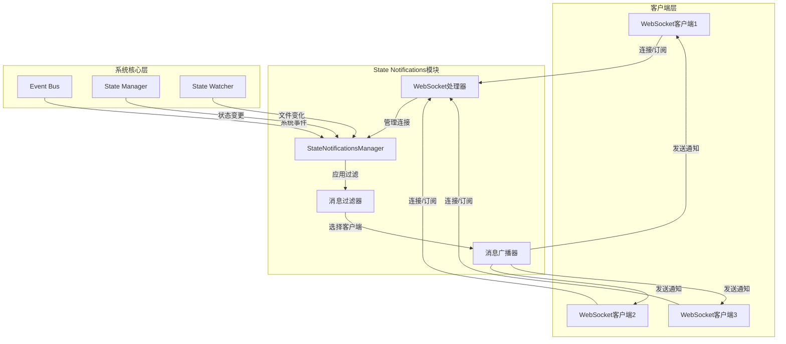
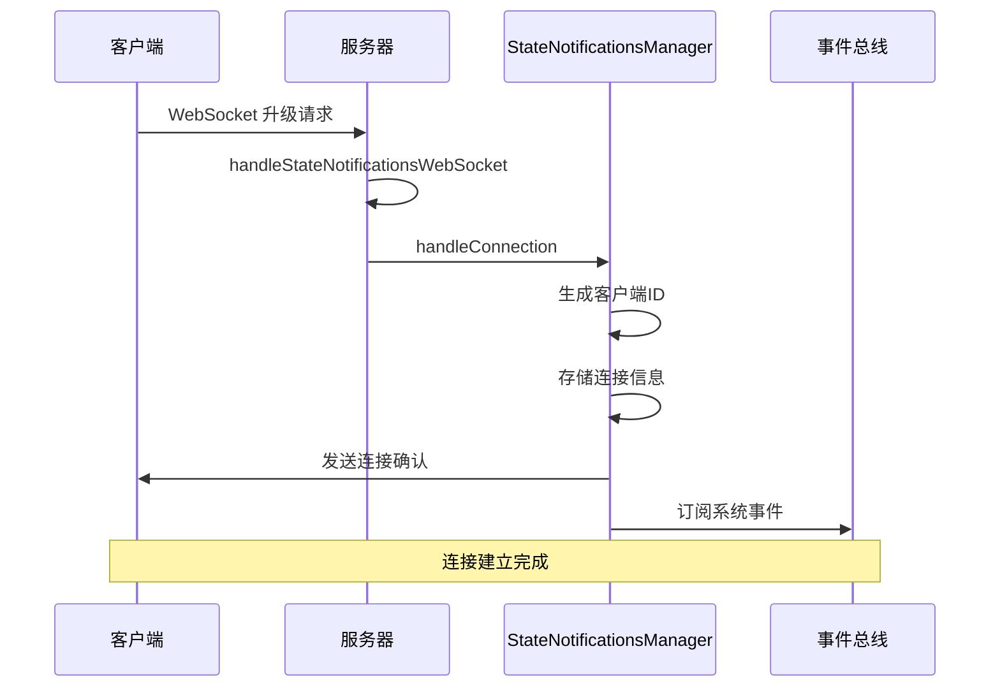
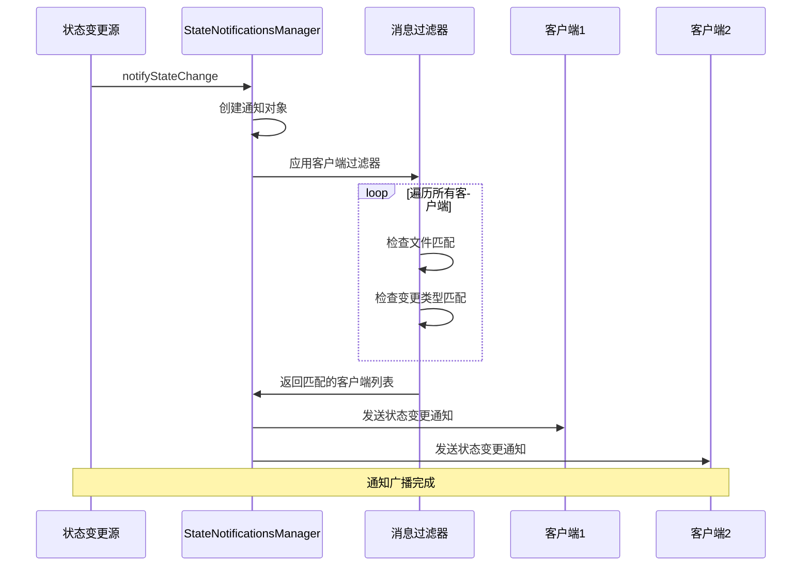

# State Notifications 模块文档

## 1. 模块概述

State Notifications 模块是一个基于 WebSocket 的实时状态变更通知服务，为 API 客户端提供即时的状态变更通知功能。该模块与集中式状态管理器和事件总线集成，确保客户端能够实时接收到系统状态的变化。

### 主要功能
- 管理 WebSocket 连接
- 支持客户端订阅特定文件和变更类型的通知
- 实时广播状态变更通知
- 与事件总线集成，监听系统事件

### 架构图



## 2. 核心组件

### StateNotificationsManager 类

`StateNotificationsManager` 是该模块的核心类，负责管理所有 WebSocket 连接、处理订阅请求并广播状态变更通知。

#### 主要属性
- `clients`: 存储所有连接的 WebSocket 客户端
- `messageCounter`: 消息计数器，用于生成唯一的消息 ID
- `eventSubscriptionId`: 事件总线订阅 ID

#### 内部工作原理

`StateNotificationsManager` 使用单例模式确保整个应用程序中只有一个实例。在构造函数中，它会自动设置事件总线监听器，以便捕获系统级别的事件并将其转换为状态变更通知。

客户端连接管理通过 `Map` 数据结构实现，每个客户端都有一个唯一的 ID，以及与之关联的 WebSocket 连接和订阅过滤器。过滤器使用 `Set` 数据结构，允许高效地检查通知是否匹配客户端的订阅条件。

#### 主要方法

##### `handleConnection(socket: WebSocket): string`
处理新的 WebSocket 连接，为客户端分配唯一 ID 并设置事件监听器。

**参数:**
- `socket`: WebSocket 连接对象

**返回值:**
- 客户端唯一 ID

**用法示例:**
```typescript
import { stateNotifications } from "./api/services/state-notifications.ts";

// 在服务器中处理 WebSocket 升级请求
function handleWebSocketUpgrade(req: Request): Response {
  const { socket, response } = Deno.upgradeWebSocket(req);
  const clientId = stateNotifications.handleConnection(socket);
  return response;
}
```

##### `broadcastStateChange(filePath: string, changeType: "create" | "update" | "delete", source: string, diff?: Diff): void`
向所有匹配的客户端广播状态变更通知。

**参数:**
- `filePath`: 变更的文件路径
- `changeType`: 变更类型（create/update/delete）
- `source`: 变更来源
- `diff`: 可选的变更差异对象

**用法示例:**
```typescript
import { notifyStateChange } from "./api/services/state-notifications.ts";

// 当文件状态发生变化时发送通知
notifyStateChange(
  "/path/to/file.json",
  "update",
  "state-manager",
  {
    added: { newField: "value" },
    removed: {},
    changed: { existingField: "newValue" }
  }
);
```

## 3. 数据结构

### StateNotification 接口
表示状态变更通知消息的结构。

```typescript
interface StateNotification {
  type: "state_change";
  id: string;
  timestamp: string;
  filePath: string;
  changeType: "create" | "update" | "delete";
  source: string;
  diff?: {
    added: Record<string, unknown>;
    removed: Record<string, unknown>;
    changed: Record<string, unknown>;
  };
}
```

### SubscriptionRequest 接口
表示客户端订阅/取消订阅请求的结构。

```typescript
interface SubscriptionRequest {
  type: "subscribe" | "unsubscribe";
  files?: string[];
  changeTypes?: ("create" | "update" | "delete")[];
}
```

## 4. 工作流程

### WebSocket 连接建立流程



1. 客户端发送 WebSocket 升级请求
2. 服务器调用 `handleStateNotificationsWebSocket` 处理请求
3. 调用 `StateNotificationsManager.handleConnection` 管理连接
4. 为客户端分配唯一 ID 并存储连接信息
5. 发送连接确认消息给客户端

### 状态变更通知流程



1. 状态管理器检测到文件状态变化
2. 调用 `notifyStateChange` 函数
3. `StateNotificationsManager` 创建通知对象
4. 遍历所有客户端，检查过滤器匹配
5. 向匹配的客户端发送通知

## 5. 与其他模块的关系

### 与 Event Bus 模块的关系
State Notifications 模块依赖 Event Bus 模块来监听系统级事件（如 session:started、phase:completed 等），并将这些事件转换为状态变更通知广播给客户端。

### 与 State Watcher 模块的关系
State Watcher 模块负责监控文件系统变化，当检测到变化时会调用 State Notifications 模块的 `notifyStateChange` 函数来通知客户端。

## 6. 配置与使用

### 客户端使用示例

#### 连接到 WebSocket 服务器
```javascript
const ws = new WebSocket('ws://localhost:8080/state-notifications');

ws.onopen = () => {
  console.log('Connected to state notifications server');
};

ws.onmessage = (event) => {
  const message = JSON.parse(event.data);
  console.log('Received message:', message);
};
```

#### 订阅特定文件的变更
```javascript
// 订阅单个文件的所有变更
ws.send(JSON.stringify({
  type: 'subscribe',
  files: ['/path/to/specific/file.json']
}));

// 订阅多个文件和特定变更类型
ws.send(JSON.stringify({
  type: 'subscribe',
  files: ['/path/to/file1.json', '/path/to/file2.json'],
  changeTypes: ['update', 'delete']
}));
```

#### 取消订阅
```javascript
ws.send(JSON.stringify({
  type: 'unsubscribe'
}));
```

### 服务器端集成示例

#### 集成到 HTTP 服务器
```typescript
import { handleStateNotificationsWebSocket } from "./api/services/state-notifications.ts";

// 在 HTTP 服务器中处理 WebSocket 升级请求
function handler(req: Request): Response {
  if (req.url.endsWith("/state-notifications")) {
    return handleStateNotificationsWebSocket(req);
  }
  // 处理其他请求...
}

Deno.serve(handler);
```

## 7. 错误处理与诊断

### 客户端错误处理

```typescript
const ws = new WebSocket('ws://localhost:8080/state-notifications');

ws.onerror = (error) => {
  console.error('WebSocket错误:', error);
  // 实现重连逻辑
  setTimeout(() => {
    // 尝试重新连接
  }, 5000);
};

ws.onclose = (event) => {
  console.log('WebSocket连接关闭，代码:', event.code, '原因:', event.reason);
  // 实现重连逻辑
};
```

### 服务器端错误处理

`StateNotificationsManager` 内置了基本的错误处理机制：
- 当客户端发送无效格式的消息时，会向该客户端发送错误通知
- 当发送消息失败时，会自动处理客户端断开连接
- 所有连接事件和错误都会通过日志系统记录

### 常见问题诊断

| 问题 | 可能原因 | 解决方案 |
|------|---------|---------|
| 客户端无法连接 | WebSocket端点配置错误 | 检查URL是否正确，服务器是否正常运行 |
| 收不到通知 | 订阅过滤器设置不正确 | 确认文件路径和变更类型是否匹配 |
| 频繁断开连接 | 网络不稳定或心跳机制缺失 | 实现客户端心跳和重连逻辑 |
| 消息延迟 | 服务器负载过高 | 考虑水平扩展或优化消息分发机制 |

## 8. 注意事项与限制

1. **连接限制**: 当前实现没有对同时连接的客户端数量进行限制，生产环境中应考虑添加连接数限制。
2. **消息大小**: WebSocket 消息大小受限于浏览器和服务器的配置，大型 diff 数据可能会导致消息传输问题。
3. **错误处理**: 客户端应实现重连逻辑，以处理网络中断或服务器重启的情况。
4. **安全性**: 当前实现没有对客户端进行身份验证，生产环境中应添加适当的认证机制。
5. **性能**: 当有大量客户端连接时，广播操作可能会成为性能瓶颈，应考虑实现更高效的消息分发机制。
6. **消息顺序**: 模块不保证消息的顺序传递，如果顺序重要，客户端应根据通知中的时间戳进行排序。
7. **消息丢失**: 在网络不稳定的情况下，可能会丢失消息，建议实现消息确认和重传机制。

## 9. 扩展与自定义

State Notifications 模块设计为可扩展的，可以通过以下方式进行自定义：

1. **自定义过滤器**: 可以扩展 `matchesFilter` 方法以支持更复杂的过滤逻辑。
2. **消息认证**: 可以在 `handleConnection` 方法中添加身份验证逻辑。
3. **消息压缩**: 可以在发送消息前添加压缩逻辑，减少网络传输量。
4. **持久化**: 可以添加消息持久化功能，确保客户端在断线重连后能够获取错过的通知。

### 自定义身份验证示例

```typescript
// 扩展 StateNotificationsManager 类添加身份验证
class AuthenticatedStateNotificationsManager extends StateNotificationsManager {
  override handleConnection(socket: WebSocket): string {
    // 在接受连接前验证身份
    // 例如，检查 URL 参数中的 token
    // 或等待客户端发送认证消息
    
    // 只有验证通过后才调用父类方法
    return super.handleConnection(socket);
  }
}
```

### 消息持久化示例

```typescript
// 创建一个支持消息持久化的通知管理器
class PersistentStateNotificationsManager extends StateNotificationsManager {
  private messageStore: Array<StateNotification> = [];
  
  override broadcastStateChange(
    filePath: string,
    changeType: "create" | "update" | "delete",
    source: string,
    diff?: {
      added: Record<string, unknown>;
      removed: Record<string, unknown>;
      changed: Record<string, unknown>;
    }
  ): void {
    // 保存消息到存储
    const notification: StateNotification = {
      type: "state_change",
      id: this.generateMessageId(),
      timestamp: new Date().toISOString(),
      filePath,
      changeType,
      source,
      diff,
    };
    
    this.messageStore.push(notification);
    
    // 定期清理旧消息
    if (this.messageStore.length > 1000) {
      this.messageStore = this.messageStore.slice(-500);
    }
    
    // 调用父类方法广播消息
    super.broadcastStateChange(filePath, changeType, source, diff);
  }
  
  // 添加方法让新连接的客户端获取历史消息
  getRecentNotifications(since: Date): StateNotification[] {
    return this.messageStore.filter(
      msg => new Date(msg.timestamp) > since
    );
  }
}
```

## 10. 相关模块参考

- [Event Bus](Event%20Bus.md) - State Notifications 模块依赖 Event Bus 来监听系统事件
- [State Watcher](State%20Watcher.md) - State Watcher 模块负责监控文件变化并触发状态通知
- [API Server Core](API%20Server%20Core.md) - 提供基础 API 服务和 WebSocket 支持

## 11. 总结

State Notifications 模块为系统提供了实时状态变更通知功能，是构建响应式应用的重要组件。通过 WebSocket 连接，客户端可以实时接收文件和系统状态的变化，而无需频繁轮询服务器。

该模块的设计遵循了关注点分离原则，将连接管理、消息过滤和通知分发等功能清晰地组织在 `StateNotificationsManager` 类中。同时，它提供了灵活的订阅机制，允许客户端根据文件路径和变更类型精确过滤所需的通知。

在实际应用中，开发者可以根据需要扩展该模块，添加身份验证、消息持久化、负载均衡等高级功能，以满足不同场景的需求。
