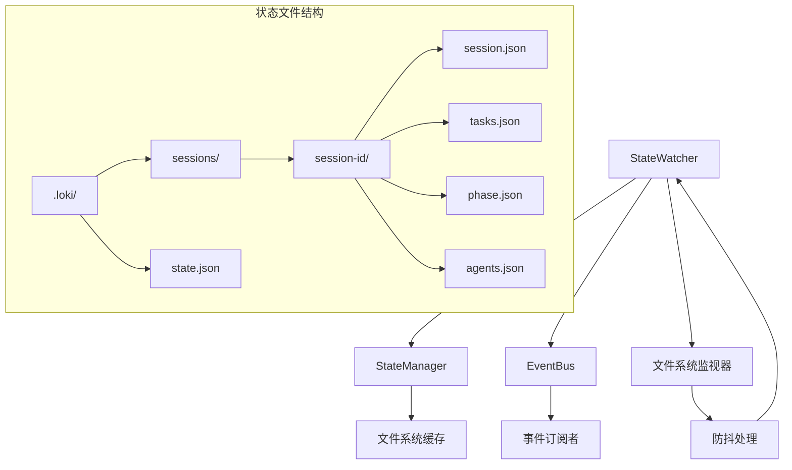
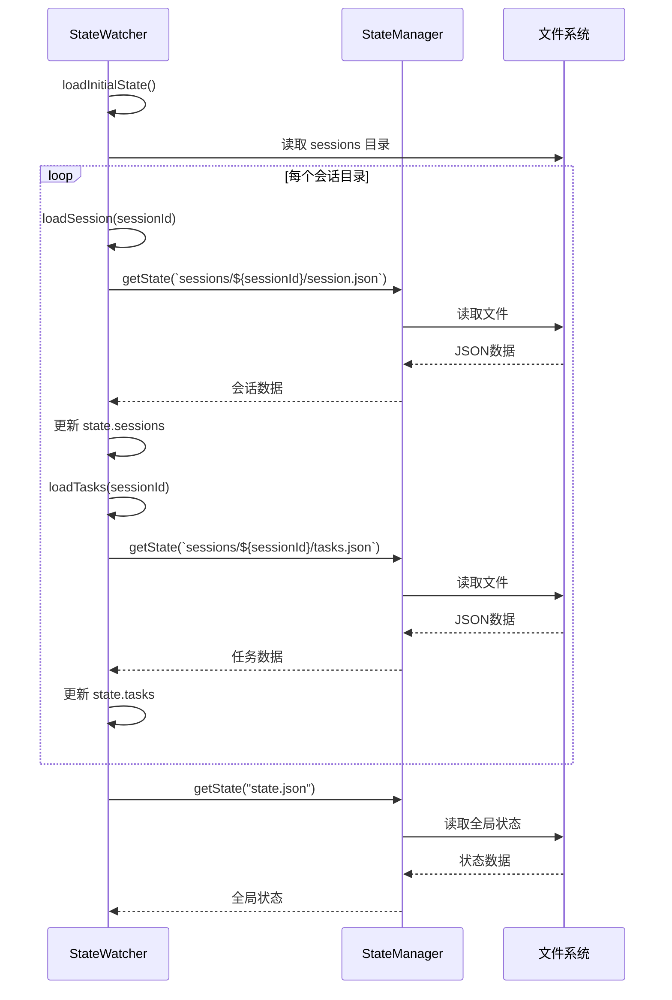
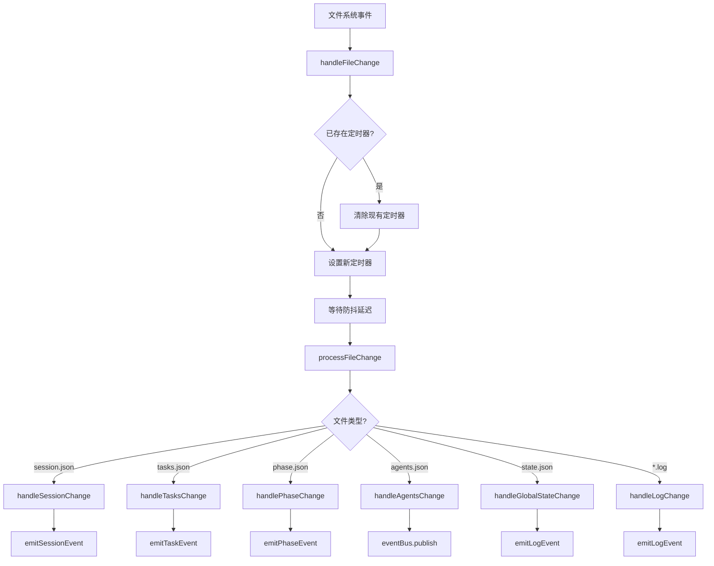

# State Watcher 模块文档

## 概述

State Watcher 模块是一个核心服务组件，负责监控 `.loki/` 目录中的状态文件变化并向系统其他部分发出相应事件。该模块与 StateManager 紧密集成，提供了集中式的状态访问、缓存和订阅功能。

### 主要功能

- **文件系统监控**: 实时监控 `.loki` 目录及其子目录中的文件变化
- **状态管理**: 与 StateManager 配合，提供高效的状态文件访问和缓存
- **事件分发**: 当检测到状态变化时，向 EventBus 发送相应的事件
- **心跳机制**: 定期发送系统状态心跳信息
- **会话和任务跟踪**: 维护会话和任务的内存状态，检测状态变更

## 架构设计

State Watcher 模块采用了观察者模式，结合了文件系统监听、状态管理和事件分发的多层架构。

### 组件关系图



### 核心数据结构

State Watcher 维护一个内存中的状态结构 `WatchedState`，用于跟踪系统的当前状态：

```typescript
interface WatchedState {
  sessions: Map<string, Session>;        // 会话ID到会话对象的映射
  tasks: Map<string, Task[]>;            // 会话ID到任务列表的映射
  lastModified: Map<string, number>;     // 文件路径到最后修改位置的映射（用于日志跟踪）
}
```

## 核心组件详解

### StateWatcher 类

StateWatcher 是模块的主要类，实现了单例模式，负责协调所有状态监控和事件分发功能。

#### 构造函数

```typescript
constructor()
```

构造函数初始化 StateWatcher 实例，设置以下关键属性：

- `lokiDir`: .loki 目录的路径，可通过环境变量 `LOKI_DIR` 配置，默认为项目根目录
- `watchDir`: 实际监控的目录路径，即 `${lokiDir}/.loki`
- `state`: 初始化空的 WatchedState 结构
- `startTime`: 记录实例创建时间
- `stateManager`: 初始化 StateManager 实例，配置为启用监控和事件功能

#### 主要方法

##### start()

```typescript
async start(): Promise<void>
```

启动状态监控服务的主方法，执行以下操作：

1. 确保 `.loki` 目录存在（如不存在则创建）
2. 调用 `loadInitialState()` 加载初始状态
3. 启动文件系统监视器
4. 设置心跳定时器（每10秒发送一次）
5. 开始处理监视事件
6. 输出启动日志

**使用示例**：
```typescript
import { stateWatcher } from "./api/services/state-watcher.ts";

async function main() {
  await stateWatcher.start();
  // 应用程序其他逻辑...
}
```

##### stop()

```typescript
stop(): void
```

停止状态监控服务，清理资源：

1. 关闭文件系统监视器
2. 清除心跳定时器
3. 清除所有防抖定时器
4. 停止 StateManager
5. 输出停止日志

##### getState()

```typescript
getState(): WatchedState
```

获取当前状态的快照，返回内存中的 WatchedState 结构。

#### 内部处理流程

##### 状态加载流程



##### 文件变化处理流程



## 事件系统

State Watcher 通过 EventBus 向系统其他部分发送各种事件，使组件能够响应状态变化。

### 事件类型

#### 会话事件

| 事件类型 | 触发条件 | 数据结构 |
|---------|---------|---------|
| `session:started` | 新会话创建 | `{ status: string, message: string }` |
| `session:paused` | 会话暂停 | `{ status: string, message: string }` |
| `session:resumed` | 会话恢复 | `{ status: string, message: string }` |
| `session:stopped` | 会话停止 | `{ status: string, message: string }` |
| `session:completed` | 会话完成 | `{ status: string, message: string }` |
| `session:failed` | 会话失败 | `{ status: string, message: string }` |

#### 任务事件

| 事件类型 | 触发条件 | 数据结构 |
|---------|---------|---------|
| `task:created` | 新任务创建 | `{ taskId: string, title: string, status: string }` |
| `task:started` | 任务开始执行 | `{ taskId: string, title: string, status: string, output?: any, error?: any }` |
| `task:progress` | 任务进行中 | `{ taskId: string, title: string, status: string, output?: any, error?: any }` |
| `task:completed` | 任务完成 | `{ taskId: string, title: string, status: string, output?: any, error?: any }` |
| `task:failed` | 任务失败 | `{ taskId: string, title: string, status: string, output?: any, error?: any }` |

#### 阶段事件

| 事件类型 | 触发条件 | 数据结构 |
|---------|---------|---------|
| `phase:started` | 新阶段开始 | `{ phase: string, previousPhase?: string, progress?: number }` |

#### 代理事件

| 事件类型 | 触发条件 | 数据结构 |
|---------|---------|---------|
| `agent:spawned` | 新代理生成 | `{ agentId: string, type: string, model?: string, task?: string }` |

#### 日志事件

| 事件类型 | 触发条件 | 数据结构 |
|---------|---------|---------|
| `log:info` | 日志文件更新 | 日志行内容 |

#### 心跳事件

| 事件类型 | 触发条件 | 数据结构 |
|---------|---------|---------|
| `heartbeat` | 每10秒 | `{ uptime: number, activeAgents: number, queuedTasks: number }` |

### 状态到事件的映射

State Watcher 内部维护了状态值到事件类型的映射关系：

#### 会话状态映射

```typescript
private getSessionEventType(
  status: string
): "session:started" | "session:paused" | "session:resumed" | "session:stopped" | "session:completed" | "session:failed" {
  const map = {
    starting: "session:started",
    running: "session:resumed",
    paused: "session:paused",
    stopping: "session:stopped",
    stopped: "session:stopped",
    completed: "session:completed",
    failed: "session:failed",
  };
  return map[status] || "session:started";
}
```

#### 任务状态映射

```typescript
private getTaskEventType(
  status: string
): "task:created" | "task:started" | "task:progress" | "task:completed" | "task:failed" {
  const map = {
    pending: "task:created",
    queued: "task:created",
    running: "task:started",
    "in progress": "task:started",
    completed: "task:completed",
    done: "task:completed",
    failed: "task:failed",
  };
  return map[status.toLowerCase()] || "task:progress";
}
```

## 配置与使用

### 环境变量

State Watcher 支持通过环境变量配置：

| 变量名 | 说明 | 默认值 |
|-------|------|-------|
| `LOKI_DIR` | .loki 目录的父目录路径 | 项目根目录 |

### 基本使用

State Watcher 被设计为单例模式，使用 `stateWatcher` 导出实例：

```typescript
import { stateWatcher } from "./api/services/state-watcher.ts";

// 启动状态监控
await stateWatcher.start();

// 获取当前状态
const currentState = stateWatcher.getState();
console.log("Active sessions:", currentState.sessions.size);

// 监听事件（通过EventBus）
import { eventBus } from "./api/services/event-bus.ts";

eventBus.subscribe({ types: ["session:started"] }, (event) => {
  console.log("Session started:", event.sessionId);
});

// 停止状态监控
// stateWatcher.stop();
```

### 扩展与集成

#### 自定义事件监听

通过 EventBus 可以监听 State Watcher 发出的所有事件，实现自定义业务逻辑：

```typescript
import { eventBus } from "./api/services/event-bus.ts";

// 监听所有任务相关事件
eventBus.subscribe(
  { types: ["task:created", "task:started", "task:completed", "task:failed"] },
  (event) => {
    console.log(`Task ${event.type.split(':')[1]}:`, event.data);
    // 自定义任务处理逻辑...
  }
);

// 监听特定会话的事件
eventBus.subscribe(
  { sessionId: "my-session-id" },
  (event) => {
    console.log(`Event for my session:`, event);
  }
);
```

## 性能与可靠性

### 防抖机制

为了避免频繁的文件系统事件导致的性能问题，State Watcher 实现了防抖机制：

```typescript
private handleFileChange(
  path: string,
  kind: Deno.FsEvent["kind"]
): void {
  // 防抖处理快速变化的同一文件
  const existingTimer = this.debounceTimers.get(path);
  if (existingTimer) {
    clearTimeout(existingTimer);
  }

  const timer = setTimeout(() => {
    this.debounceTimers.delete(path);
    this.processFileChange(path, kind);
  }, this.debounceDelay); // 默认100ms

  this.debounceTimers.set(path, timer);
}
```

这确保了在短时间内对同一文件的多次修改只会触发一次处理，提高了系统效率。

### 缓存与状态管理

通过与 StateManager 的集成，State Watcher 获得了以下优势：

- **高效的文件访问**: StateManager 维护了文件内容的内存缓存
- **版本控制**: 支持状态文件的历史版本管理
- **冲突解决**: 在多进程环境下提供冲突检测和解决机制
- **原子操作**: 确保文件写入的原子性，避免数据损坏

## 与其他模块的关系

### Event Bus 模块

State Watcher 依赖 Event Bus 模块来分发各种状态变化事件。它使用以下函数：

- `emitSessionEvent`: 发送会话相关事件
- `emitPhaseEvent`: 发送阶段相关事件
- `emitTaskEvent`: 发送任务相关事件
- `emitLogEvent`: 发送日志事件
- `emitHeartbeat`: 发送心跳事件

详情请参考 [Event Bus](Event Bus.md) 模块文档。

### State Management 模块

State Watcher 与 StateManager 紧密集成，使用它来：

- 读取状态文件（带有缓存）
- 管理状态变更通知
- 处理文件系统事件

详情请参考 [State Management](State Management.md) 模块文档。

### API Server & Services

State Watcher 是 API Server & Services 的核心组件之一，为其他服务提供状态监控和事件分发能力。详情请参考 [API Server & Services](API Server & Services.md) 模块文档。

## 限制与注意事项

### 已知限制

1. **文件系统依赖**: State Watcher 依赖 Deno 的文件系统 API，特别是 `Deno.watchFs`，在某些文件系统上可能有限制
2. **JSON文件假设**: 当前实现主要针对JSON文件和日志文件，其他文件类型会被忽略
3. **目录结构假设**: 对 `.loki` 目录下的文件结构有特定假设，不符合结构的文件不会被正确处理
4. **单进程设计**: 虽然 StateManager 提供了多进程支持，但 State Watcher 当前主要设计为单进程使用

### 错误处理

State Watcher 在多个地方使用了 try-catch 块来处理可能的错误：

- 文件读取错误
- JSON 解析错误
- 目录遍历错误

这些错误会被记录到控制台，但不会中断整个服务的运行。

### 资源管理

确保在应用程序退出时调用 `stop()` 方法，以正确清理资源：

```typescript
// 正确的清理示例
process.on("SIGINT", () => {
  console.log("Shutting down...");
  stateWatcher.stop();
  process.exit(0);
});
```

## 常见使用场景

### 实时状态监控仪表板

State Watcher 可以为仪表板后端提供实时状态更新，使前端能够显示系统的当前状态：

```typescript
// Dashboard 后端集成示例
import { stateWatcher } from "./api/services/state-watcher.ts";
import { eventBus } from "./api/services/event-bus.ts";

// 启动状态监控
await stateWatcher.start();

// 监听状态变化并发送到WebSocket客户端
eventBus.subscribe({}, (event) => {
  // 广播事件到所有连接的WebSocket客户端
  websocketServer.broadcast(event);
});
```

### 任务执行跟踪

通过监听任务事件，可以实现任务执行的详细跟踪和日志记录：

```typescript
import { eventBus } from "./api/services/event-bus.ts";

// 任务跟踪器
const taskTracker = new Map();

eventBus.subscribe(
  { types: ["task:created", "task:started", "task:completed", "task:failed"] },
  (event) => {
    const taskId = event.data.taskId;
    if (!taskTracker.has(taskId)) {
      taskTracker.set(taskId, { events: [] });
    }
    
    const task = taskTracker.get(taskId);
    task.events.push({
      type: event.type,
      timestamp: event.timestamp,
      data: event.data
    });
    
    // 当任务完成或失败时，记录完整的执行历史
    if (event.type === "task:completed" || event.type === "task:failed") {
      console.log(`Task ${taskId} execution history:`, task);
      // 可以保存到数据库或文件中
    }
  }
);
```

### 自动化工作流触发

State Watcher 的事件可以用于触发自动化工作流：

```typescript
import { eventBus } from "./api/services/event-bus.ts";

// 自动化工作流引擎
eventBus.subscribe(
  { types: ["session:started"] },
  async (event) => {
    console.log(`New session started: ${event.sessionId}`);
    // 触发初始化工作流
    await initializeSessionResources(event.sessionId);
  }
);

eventBus.subscribe(
  { types: ["task:completed"] },
  async (event) => {
    if (event.data.status === "completed") {
      // 触发后续任务
      await scheduleDependentTasks(event.sessionId, event.data.taskId);
    }
  }
);
```

## 总结

State Watcher 模块是系统的核心基础设施组件，提供了文件系统状态监控、事件分发和状态管理功能。通过与 StateManager 和 EventBus 的紧密集成，它为上层应用提供了可靠的状态变化检测和响应机制。

无论是构建实时监控仪表板、实现自动化工作流，还是跟踪任务执行历史，State Watcher 都提供了必要的基础设施支持。正确使用和配置该模块，可以大大简化状态相关的开发工作，提高系统的响应性和可靠性。
