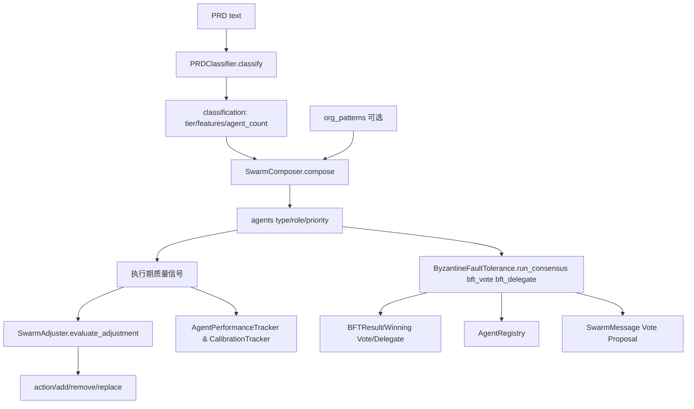
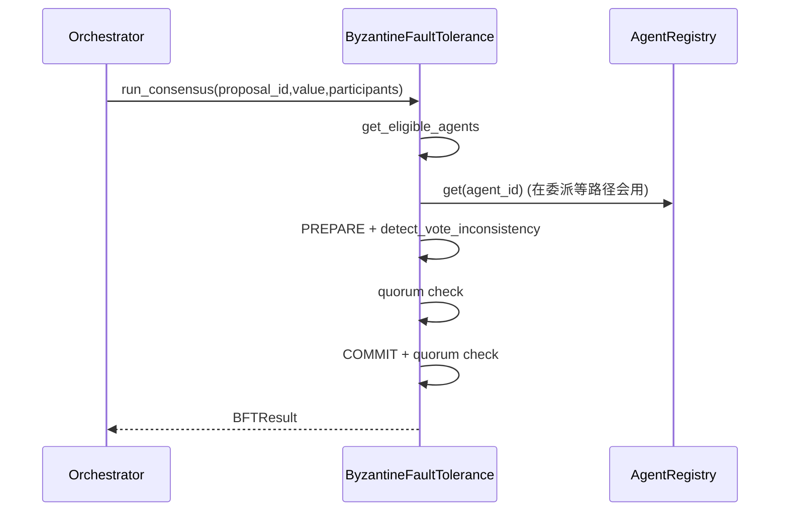
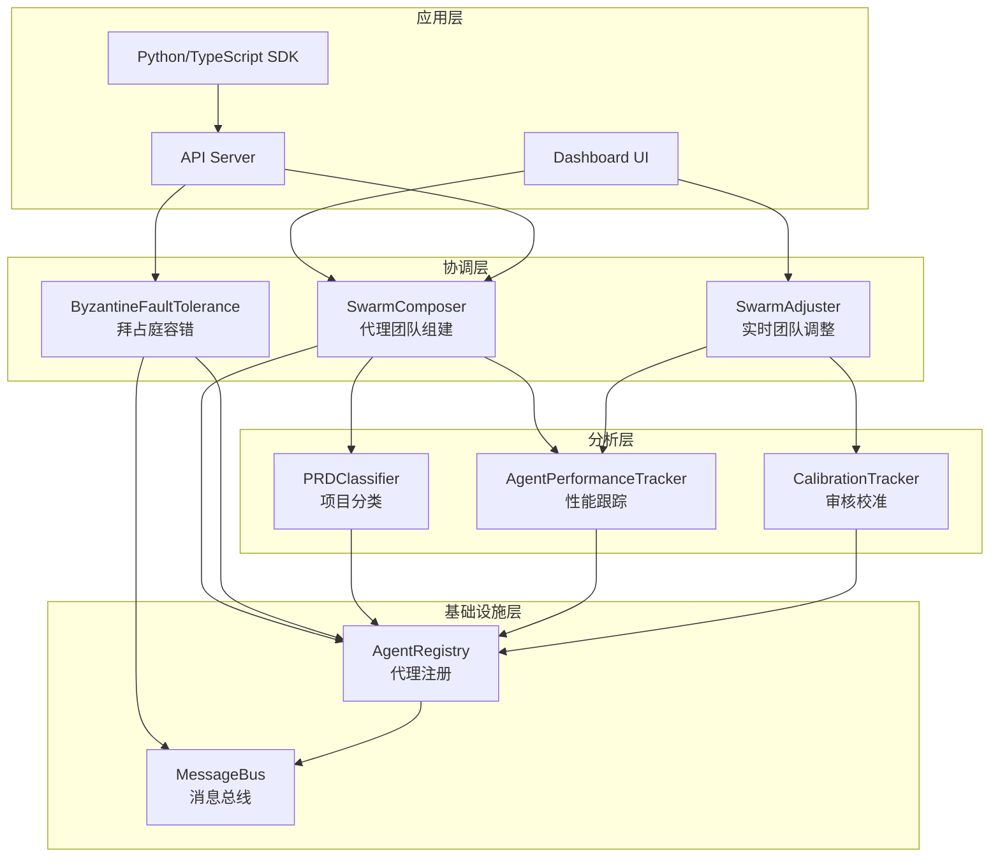
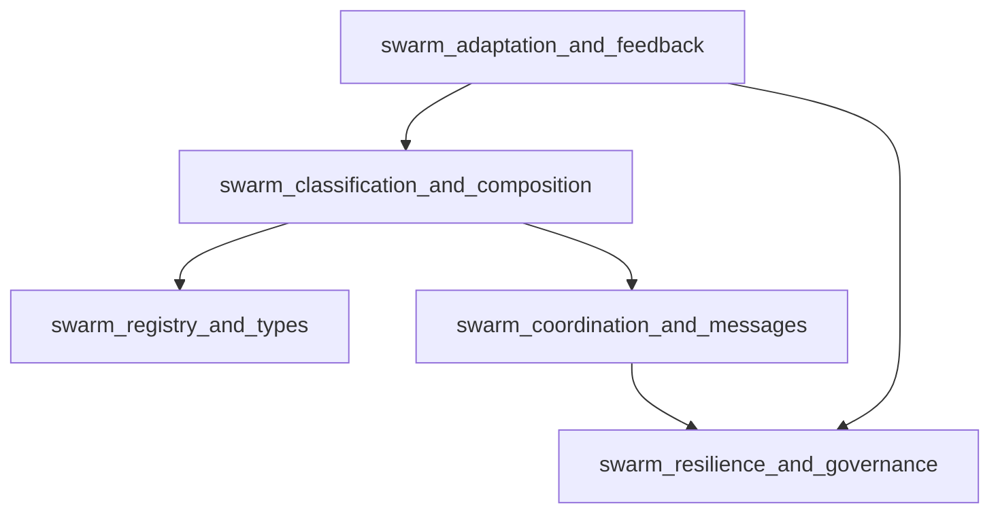
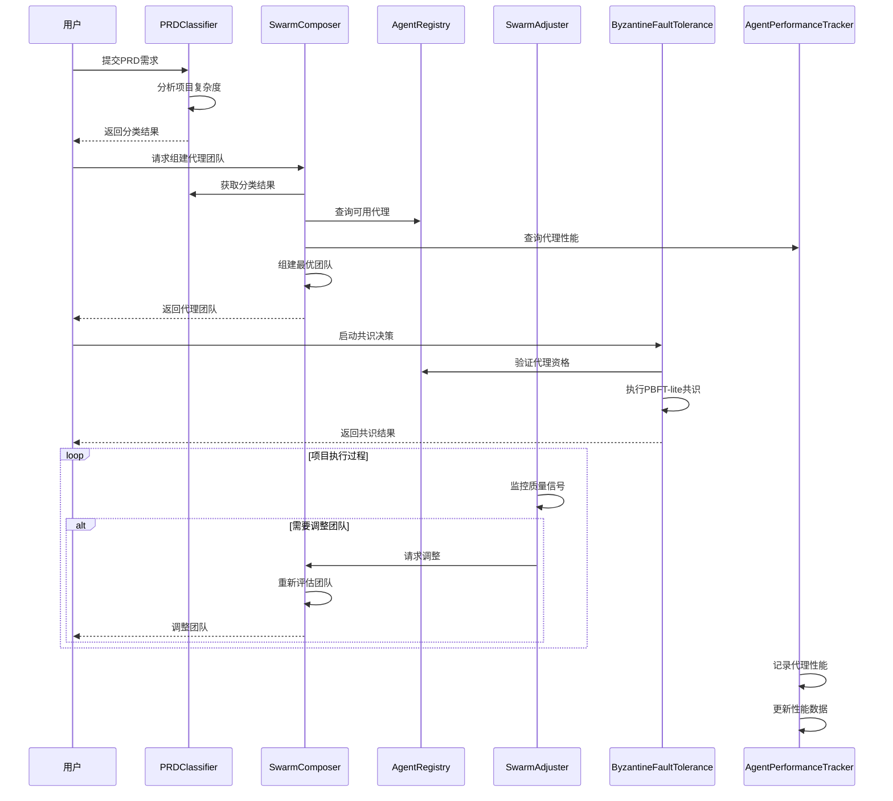

# Swarm Multi-Agent 模块技术深潜

> 给新加入团队的高级工程师一句话版本：
> **这个模块是“多智能体团队的参谋部 + 纪律委员会”**——它先判断项目复杂度，组建合适队形；执行中根据质量信号增删角色；在关键决策时用 PBFT-lite 和信誉体系抵御坏节点，让系统在不完美代理环境下仍能稳定产出。

---

## 1. 这个模块到底在解决什么问题（Why before What）

如果你把多智能体系统看成一个“临时组建的软件交付团队”，最难的不是“让每个 agent 能工作”，而是下面四件事：

1. **开局怎么配人**：项目是 3 人小队还是 12 人战时编制？
2. **中途怎么调队形**：质量门反复失败时是继续硬跑，还是补 QA / Security？
3. **决策怎么抗噪声**：当个别 agent 出现异常、摇摆、甚至恶意行为时，如何保证集体结论可用？
4. **经验怎么沉淀**：谁过去表现稳定、谁经常“看起来很自信但判断偏差大”？

`Swarm Multi-Agent` 就是把这四个问题产品化：
- `PRDClassifier` + `SwarmComposer` 解决“开局组队”；
- `SwarmAdjuster` 解决“运行中调队”；
- `ByzantineFaultTolerance` 解决“抗故障决策”；
- `AgentPerformanceTracker` + `CalibrationTracker` 解决“长期反馈学习”。

它刻意采用了大量**规则化、可解释、可落盘**的实现，而不是全交给 LLM 黑盒。原因很现实：这层是调度与治理基础设施，优先级是**确定性**和**可审计**，不是“最聪明”。

---

## 2. 心智模型：把它当成“作战指挥部”

你可以用这个类比理解：

- `PRDClassifier`：参谋情报官（评估战场复杂度）
- `SwarmComposer`：排兵布阵官（决定初始队形）
- `SwarmAdjuster`：战场督导官（按战况请求增援/撤编）
- `ByzantineFaultTolerance`：军纪与仲裁系统（防内鬼、防误报、给处罚）
- `AgentInfo` / registry：士兵档案与状态板（谁会什么、现在是否可用）
- `SwarmMessage` / `Proposal` / `TaskAssignment`：标准军令格式
- `AgentPerformanceTracker` / `CalibrationTracker`：战后复盘系统

这个模型有两个关键特征：
1. **策略与协议分离**：谁该上场（strategy）与怎么通信（protocol）是分开的。
2. **一次决策 + 持续修正**：先做“足够好”的初配，再用运行信号闭环优化，而不是追求一次性完美。

---

## 3. 架构总览（含数据流）



### 3.1 这张图怎么读

- **主干路径**：`classify -> compose -> execute -> adjust`，这是“组队-执行-纠偏”闭环。
- **高风险分支**：执行过程中的关键决策走 `ByzantineFaultTolerance`，它会读取 `AgentRegistry` 并消费 `Vote` 等协议对象。
- **反馈支路**：性能与校准模块不直接控制编排，但持续影响未来决策质量。

---

## 4. 关键端到端流程（按真实调用关系）

### 4.1 从 PRD 到初始团队

1. 调用 `PRDClassifier.classify(prd_text)`：
   - 内部先 `extract_features()` 统计 `FEATURE_KEYWORDS` 命中；
   - `_score_tier()` 依据总命中 + 活跃类别 + `ENTERPRISE_KEYWORDS` 判定 tier；
   - `_recommend_agents()` 给出推荐人数；
   - 若 `LOKI_COMPLEXITY` 环境变量合法，会直接覆盖 tier（`override=True`）。
2. 将 classification 传给 `SwarmComposer.compose(classification, org_patterns=None)`：
   - 先放 `BASE_TEAM`；
   - 按 `FEATURE_AGENT_MAP` 补专项角色；
   - enterprise 再补 `ENTERPRISE_AGENTS`；
   - 若有组织模式，`_apply_org_patterns()` 从 pattern 文本里匹配技术词并补位；
   - 最后按 `priority` 排序并截断到 `agent_count`。

**隐式契约**：`compose` 默认假设 classification 至少有 `tier/features/agent_count` 这些键。缺失时虽有默认值，但会弱化策略精度。

### 4.2 运行中动态调队

调用 `SwarmAdjuster.evaluate_adjustment(current_agents, quality_signals)`：

- 规则 1：`gate_pass_rate < 0.5 且 iteration_count > 3`，按 `failed_gates -> GATE_TO_AGENT` 补专才；
- 规则 2：`test_coverage < 0.6` 且无 `eng-qa`，补 QA；
- 规则 3：`review_pass_rate < 0.5` 且无 `review-security`，补安全评审；
- 规则 4：若三项信号都 > 0.8 且团队 >4 且无需新增，尝试移除 `priority>=3` 中最不关键者。

返回 `action`（`none/add/remove/replace`）和增删建议。

**设计意图**：不是自动“直接改编制”，而是先输出建议，给上层 orchestrator 再决策，避免策略层越权。

### 4.3 高风险决策与容错共识

`ByzantineFaultTolerance.run_consensus(...)` 关键路径：



更细一点：
- 先过滤信誉不足或已排除代理（`get_eligible_agents`）；
- 少于 4 个 eligible 直接失败（因为目标是具备至少 `n > 3f` 的容错意义）；
- 默认主节点选信誉最高者；
- PREPARE 阶段逐个检测改票（`detect_vote_inconsistency`），并更新信誉；
- 过法定票后进入 COMMIT；成功后返回 `BFTResult`。

同一类治理逻辑还体现在：
- `bft_vote()`：按信誉加权投票；
- `bft_delegate()`：按 `0.6*信誉 + 0.4*能力` 选委派对象，并给 fallback。

---

## 5. 关键设计取舍（Tradeoffs）

### 5.1 规则引擎 vs LLM 分类

- 选择：`PRDClassifier` 走关键词与阈值规则。
- 收益：快、可解释、可复现、可在 CI/CD 稳定运行。
- 代价：对隐含需求、语义变体不敏感；关键词覆盖决定上限。

### 5.2 Dict 契约 vs 强类型 DTO

- 选择：模块间大量使用 `Dict[str, Any]`（如 classification、quality_signals）。
- 收益：集成灵活，演进成本低。
- 代价：字段拼写错误/缺失在运行时才暴露，静态检查弱。

### 5.3 PBFT-lite 工程化简化 vs 完整分布式 PBFT

- 选择：保留阶段语义与 quorum 思想，但流程在单进程内模拟。
- 收益：实现简单、便于落地和测试。
- 代价：不是严格网络拜占庭协议实现，`max_view_changes` 等配置未在流程中充分展开。

### 5.4 文件持久化 vs 外部存储中间件

- 选择：信誉、配置、消息等均可落盘（如 `.loki/swarm/bft/reputations.json`、消息 pending/archive）。
- 收益：可审计、离线友好、调试成本低。
- 代价：高并发下 I/O 与锁竞争风险更高；重启场景下部分内存态（如 used nonce）不继承。

---

## 6. 新贡献者最该警惕的坑

1. **别把 PBFT-lite 当成完整 BFT 网络协议**
   - 当前更像“治理算法内核”，不是分布式协议栈。
2. **`DEFAULT_SECRET_KEY` 仅开发可用**
   - 生产必须外部注入 `secret_key`。
3. **`verify_authenticated_message()` 的防重放是进程内集合**
   - 重启后 nonce 历史不在；跨实例共享也没有。
4. **`MessageBus.receive()` 会静默跳过坏 JSON**
   - 鲁棒但可能掩盖数据损坏；需配套清理与告警。
5. **`SwarmAdjuster` 的规则阈值是硬编码策略**
   - 改阈值会直接改变行为边界，建议配实验数据回归。
6. **`SwarmComposer` 截断团队按 priority**
   - 新增 agent type 时要慎设 priority，否则可能被无意裁掉。
7. **信誉惩罚是累积的**
   - `update_reputation` 会触发 `_check_exclusion`，测试里常出现“代理突然被排除”现象。

---

## 7. 子模块导读（已拆分文档）

### 7.1 `swarm_topology_and_composition`
负责 `PRDClassifier`、`SwarmComposer`、`SwarmAdjuster` 的完整策略闭环：如何从文本需求得到队形、如何结合组织知识补位、如何在质量波动时提出增删替建议。
详见：[swarm_topology_and_composition.md](swarm_topology_and_composition.md)

### 7.2 `consensus_and_fault_tolerance`
负责 `ByzantineFaultTolerance` 与 `ConsensusPhase`：认证、信誉、故障记录、共识阶段推进、加权投票与容错委派。
详见：[consensus_and_fault_tolerance.md](consensus_and_fault_tolerance.md)

### 7.3 `communication_protocol`
负责 `SwarmMessage`、`Proposal`、`TaskAssignment` 等协议对象与文件消息总线语义，是跨 agent 协作的“标准语言层”。
详见：[communication_protocol.md](communication_protocol.md)

### 7.4 `agent_registry_and_capabilities`
负责 `AgentInfo` 及 registry 生态：代理能力、状态、可用性与匹配基础，是调度与容错筛选的事实来源。
详见：[agent_registry_and_capabilities.md](agent_registry_and_capabilities.md)

### 7.5 `performance_and_calibration`
负责 `AgentPerformanceTracker`、`CalibrationTracker`：执行质量趋势与评审可靠性画像，为长期优化提供反馈信号。
详见：[performance_and_calibration.md](performance_and_calibration.md)

---

## 8. 与其他模块的耦合关系（跨模块）

- 与 [API Server & Services](API Server & Services.md)：上层 API 暴露 swarm 编排/治理能力的入口。
- 与 [Memory System](Memory System.md)：二者都使用 `.loki` 下持久化资产，运行经验可被长期沉淀。
- 与 [Policy Engine](Policy Engine.md)：治理决策（尤其高风险动作）通常要受策略引擎约束。
- 与 [Dashboard Backend](Dashboard Backend.md) / [Dashboard Frontend](Dashboard Frontend.md)：提供编排与运行态可视化、运维调参入口。

> 说明：在当前提供代码中，上述跨模块调用链并未全部直接展示；这里描述的是架构层依赖角色，而非逐行函数调用。

---

## 9. 给新同学的落地建议（实操）

- 先读 `swarm_topology_and_composition.md`，理解“组队闭环”；
- 再读 `consensus_and_fault_tolerance.md`，理解“异常场景如何兜底”；
- 改策略前先补回归样例（尤其阈值与评分函数）；
- 任何新增 agent type，都要同步检查：
  - `registry` 能力字典；
  - `composer` feature/org pattern 映射；
  - `adjuster` gate 到 agent 的映射。

---


## 1. 模块概述

Swarm Multi-Agent 模块是一个智能多代理协作系统，旨在动态组建、协调和优化代理团队以完成复杂任务。该模块提供了从项目复杂性分析、代理团队组建、到代理性能跟踪和拜占庭容错的完整解决方案。

### 1.1 核心功能

- **PRD 复杂性分类**：基于规则的项目需求分析，自动评估项目复杂度（详情请参阅 [Swarm 团队组建文档](Swarm 团队组建.md)）
- **动态代理组合**：根据项目特征智能组建最优代理团队（详情请参阅 [Swarm 团队组建文档](Swarm 团队组建.md)）
- **代理性能跟踪**：持续监控和评估代理任务完成质量（详情请参阅 [性能跟踪与校准文档](性能跟踪与校准.md)）
- **拜占庭容错**：提供 PBFT-lite 共识协议，确保在存在恶意或故障代理时系统仍能正常运行（详情请参阅 [拜占庭容错文档](拜占庭容错.md)）
- **实时团队调整**：根据项目执行过程中的质量信号动态调整代理团队（详情请参阅 [Swarm 团队组建文档](Swarm 团队组建.md)）
- **审核者校准**：跟踪审核者的准确性和一致性，优化投票权重（详情请参阅 [性能跟踪与校准文档](性能跟踪与校准.md)）
- **代理间通信**：标准化的消息协议和通信基础设施（详情请参阅 [代理注册表与消息系统文档](代理注册表与消息系统.md)）

### 1.2 设计理念

该模块采用分层架构设计，每个组件负责特定的功能领域，同时保持松耦合以支持灵活的扩展和替换。系统设计注重以下原则：

- **适应性**：能够根据不同类型和规模的项目自动调整
- **可靠性**：通过拜占庭容错机制确保系统在面对故障时的稳健性
- **可扩展性**：支持添加新的代理类型和功能模块
- **数据驱动**：基于历史性能数据和实时反馈进行决策

### 1.3 与其他模块的关系

Swarm Multi-Agent 模块与系统中的其他关键模块紧密协作：

- **Memory System**：存储和检索代理性能数据、项目模式和历史经验（相关功能请参阅 [Memory System 文档](Memory System.md)）
- **Dashboard Backend**：提供代理协作的可视化界面和管理功能（相关功能请参阅 [Dashboard Backend 文档](Dashboard Backend.md)）
- **API Server & Services**：暴露 Swarm 功能供其他系统组件调用（相关功能请参阅 [API Server & Services 文档](API Server & Services.md)）
- **Policy Engine**：确保代理决策符合组织政策和质量标准（相关功能请参阅 [Policy Engine 文档](Policy Engine.md)）

## 2. 系统架构

Swarm Multi-Agent 模块采用分层架构设计，各层之间通过清晰的接口进行通信。



### 2.1 架构组件说明

**应用层**：提供用户界面和编程接口，允许用户和其他系统与 Swarm 模块交互。

**协调层**：包含核心协调逻辑，负责代理团队的组建、调整和容错处理。这一层是模块的大脑，做出关键的策略决策。

**分析层**：提供数据分析和评估功能，包括项目复杂度评估、代理性能跟踪和审核者校准。这些组件为协调层提供决策支持数据。

**基础设施层**：提供基础服务，包括代理注册管理和消息通信。这些组件确保系统的稳定运行和组件间的有效通信。

## 3. 核心子模块功能

Swarm Multi-Agent 当前已拆分为 5 个可独立阅读的子模块文档。主文档仅提供职责边界与调用关系，具体实现细节、参数说明、错误条件和扩展建议请进入对应文件查看。

### 3.1 群体拓扑与组队策略（`swarm_topology_and_composition`）

该子模块负责“项目启动前 + 运行中重配”的核心组队逻辑：先由 `PRDClassifier` 对需求文本做复杂度分层，再由 `SwarmComposer` 根据特征命中和组织模式生成初始团队，最后由 `SwarmAdjuster` 在执行阶段依据质量信号做增删替建议。它把“静态规划”和“动态调整”串成闭环，是 Swarm 的策略入口。详细说明见 [swarm_topology_and_composition.md](swarm_topology_and_composition.md)。

### 3.2 共识与拜占庭容错（`consensus_and_fault_tolerance`）

该子模块围绕 `ByzantineFaultTolerance` 与 `ConsensusPhase` 提供 PBFT-lite 共识、信誉评分、故障识别、消息认证与自动排除机制，确保在存在异常代理时仍能维持可信决策。它是高风险决策场景下的稳定器。详细说明见 [consensus_and_fault_tolerance.md](consensus_and_fault_tolerance.md)。

### 3.3 协作消息协议（`communication_protocol`）

该子模块定义 `SwarmMessage`、`Proposal`、`TaskAssignment` 等跨代理协作对象，用统一语义承载提案、投票、委派和状态更新。其核心价值是把协作行为标准化，降低编排器与执行器之间的协议摩擦。详细说明见 [communication_protocol.md](communication_protocol.md)。

### 3.4 代理注册与能力模型（`agent_registry_and_capabilities`）

该子模块以 `AgentInfo` 为核心数据契约，描述代理类型、能力、状态与心跳等运行态信息，并作为调度、委派与容错筛选的事实来源。它承担“谁可被调度、为什么被调度”的基础判断。详细说明见 [agent_registry_and_capabilities.md](agent_registry_and_capabilities.md)。

### 3.5 性能与校准反馈（`performance_and_calibration`）

该子模块由 `AgentPerformanceTracker` 与 `CalibrationTracker` 构成，分别关注代理执行质量趋势与评审者历史一致性，用于长期优化代理选择和投票权重。它让系统不仅能运行，还能随着历史反馈持续学习。详细说明见 [performance_and_calibration.md](performance_and_calibration.md)。

### 3.6 子模块关系图



该关系图反映了依赖方向：分类与组队依赖注册信息；协作消息为容错治理提供输入载体；反馈模块持续反哺组队与治理策略。

## 4. 工作流程

以下是 Swarm Multi-Agent 模块的典型工作流程：



### 4.1 工作流程说明

1. **项目分类阶段**：用户提交 PRD 需求，PRDClassifier 分析项目内容，确定复杂度级别（简单、标准、复杂、企业级）。

2. **团队组建阶段**：SwarmComposer 基于分类结果、组织知识模式和代理性能数据，组建最适合该项目的代理团队。

3. **任务执行与协调阶段**：代理团队开始执行任务，ByzantineFaultTolerance 确保决策过程的可靠性，即使存在故障或恶意代理。

4. **实时调整阶段**：SwarmAdjuster 持续监控项目执行过程中的质量信号，根据需要动态调整代理团队组成。

5. **性能记录阶段**：AgentPerformanceTracker 记录各代理的任务完成情况，为未来的团队组建提供数据支持。

## 5. 使用指南

### 5.1 基本使用流程

1. **初始化模块**：
   ```python
   from swarm.classifier import PRDClassifier
   from swarm.composer import SwarmComposer
   from swarm.registry import AgentRegistry
   
   # 初始化组件
   classifier = PRDClassifier()
   registry = AgentRegistry()
   composer = SwarmComposer()
   ```

2. **分类项目需求**：
   ```python
   prd_text = "您的项目需求文档内容..."
   classification = classifier.classify(prd_text)
   print(f"项目复杂度: {classification['tier']}")
   print(f"推荐代理数量: {classification['agent_count']}")
   ```

3. **组建代理团队**：
   ```python
   swarm = composer.compose(classification)
   print(f"团队组成: {[agent['type'] for agent in swarm['agents']]}")
   print(f"组建理由: {swarm['rationale']}")
   ```

### 5.2 配置选项

Swarm Multi-Agent 模块提供多种配置选项，可根据具体需求进行调整：

- **复杂度分类**：可通过环境变量 `LOKI_COMPLEXITY` 强制指定项目复杂度级别（详情请参阅 [Swarm 团队组建文档](Swarm 团队组建.md)）
- **拜占庭容错**：可配置声誉阈值、共识超时、故障检测窗口等参数（详情请参阅 [拜占庭容错文档](拜占庭容错.md)）
- **性能跟踪**：可调整历史数据保留数量、趋势计算方法等（详情请参阅 [性能跟踪与校准文档](性能跟踪与校准.md)）

### 5.3 常见使用场景

- **软件开发项目**：根据项目规模和技术栈自动组建开发团队（详情请参阅 [Swarm 团队组建文档](Swarm 团队组建.md)）
- **代码审查流程**：利用审核校准系统优化审查质量（详情请参阅 [性能跟踪与校准文档](性能跟踪与校准.md)）
- **关键决策制定**：使用拜占庭容错机制确保重要决策的可靠性（详情请参阅 [拜占庭容错文档](拜占庭容错.md)）
- **持续优化**：通过性能跟踪系统持续改进代理团队效能（详情请参阅 [性能跟踪与校准文档](性能跟踪与校准.md)）

## 6. 注意事项与限制

### 6.1 最佳实践

1. **数据质量**：确保提供的 PRD 文档内容充分，以获得准确的分类结果（详情请参阅 [Swarm 团队组建文档](Swarm 团队组建.md)）
2. **性能数据积累**：系统需要一定量的历史性能数据才能做出最优决策（详情请参阅 [性能跟踪与校准文档](性能跟踪与校准.md)）
3. **拜占庭容错阈值**：对于关键任务，建议至少使用 4 个代理以支持基本的容错能力（详情请参阅 [拜占庭容错文档](拜占庭容错.md)）
4. **定期校准**：定期检查和校准审核者数据，确保投票权重的准确性（详情请参阅 [性能跟踪与校准文档](性能跟踪与校准.md)）

### 6.2 已知限制

1. **规则基础分类**：PRDClassifier 基于关键词匹配，对于高度创新或非传统项目可能分类不准确（详情请参阅 [Swarm 团队组建文档](Swarm 团队组建.md)）
2. **性能数据依赖**：AgentPerformanceTracker 需要足够的历史数据才能有效评估代理性能（详情请参阅 [性能跟踪与校准文档](性能跟踪与校准.md)）
3. **拜占庭容错规模**：当前实现的 PBFT-lite 协议在代理数量超过 10 个时性能可能下降（详情请参阅 [拜占庭容错文档](拜占庭容错.md)）
4. **消息传递可靠性**：当前的消息总线基于文件系统，在高并发场景下可能存在性能瓶颈（详情请参阅 [代理注册表与消息系统文档](代理注册表与消息系统.md)）

### 6.3 故障排除

- **分类结果不准确**：检查 PRD 文本是否包含足够的技术细节，考虑使用环境变量覆盖分类结果（详情请参阅 [Swarm 团队组建文档](Swarm 团队组建.md)）
- **代理团队不合适**：检查 AgentPerformanceTracker 中的性能数据，确保数据是最新和准确的（详情请参阅 [性能跟踪与校准文档](性能跟踪与校准.md)）
- **共识无法达成**：检查是否有代理被排除在共识之外，考虑增加代理数量或调整容错阈值（详情请参阅 [拜占庭容错文档](拜占庭容错.md)）
- **消息传递失败**：检查 .loki/swarm/messages/ 目录的权限和磁盘空间（详情请参阅 [代理注册表与消息系统文档](代理注册表与消息系统.md)）

通过遵循上述指南和注意事项，您可以有效地使用 Swarm Multi-Agent 模块来组建和管理智能代理团队，提高复杂项目的执行效率和质量。
