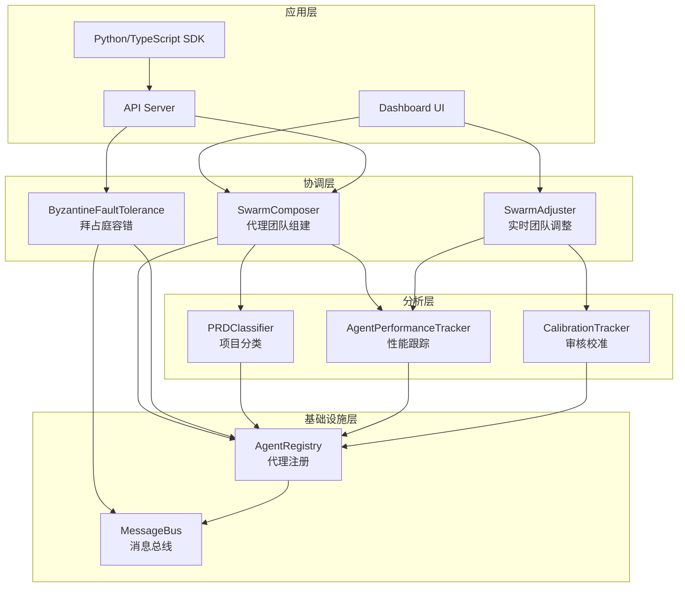
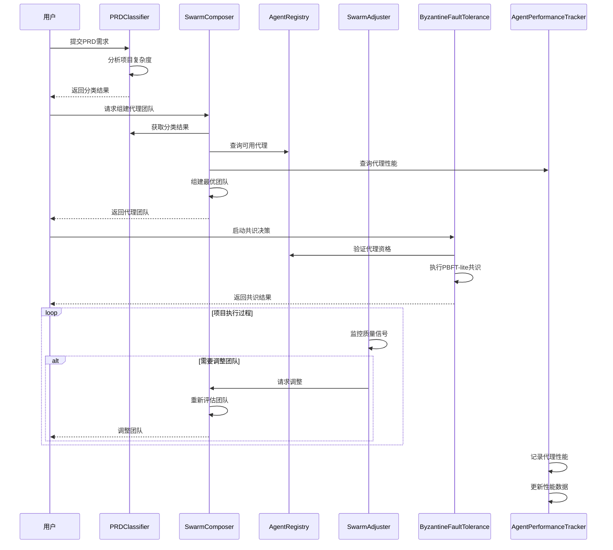

# Swarm Multi-Agent 模块文档

## 1. 模块概述

Swarm Multi-Agent 模块是一个智能多代理协作系统，旨在动态组建、协调和优化代理团队以完成复杂任务。该模块提供了从项目复杂性分析、代理团队组建、到代理性能跟踪和拜占庭容错的完整解决方案。

### 1.1 核心功能

- **PRD 复杂性分类**：基于规则的项目需求分析，自动评估项目复杂度（详情请参阅 [Swarm 团队组建文档](Swarm 团队组建.md)）
- **动态代理组合**：根据项目特征智能组建最优代理团队（详情请参阅 [Swarm 团队组建文档](Swarm 团队组建.md)）
- **代理性能跟踪**：持续监控和评估代理任务完成质量（详情请参阅 [性能跟踪与校准文档](性能跟踪与校准.md)）
- **拜占庭容错**：提供 PBFT-lite 共识协议，确保在存在恶意或故障代理时系统仍能正常运行（详情请参阅 [拜占庭容错文档](拜占庭容错.md)）
- **实时团队调整**：根据项目执行过程中的质量信号动态调整代理团队（详情请参阅 [Swarm 团队组建文档](Swarm 团队组建.md)）
- **审核者校准**：跟踪审核者的准确性和一致性，优化投票权重（详情请参阅 [性能跟踪与校准文档](性能跟踪与校准.md)）
- **代理间通信**：标准化的消息协议和通信基础设施（详情请参阅 [代理注册表与消息系统文档](代理注册表与消息系统.md)）

### 1.2 设计理念

该模块采用分层架构设计，每个组件负责特定的功能领域，同时保持松耦合以支持灵活的扩展和替换。系统设计注重以下原则：

- **适应性**：能够根据不同类型和规模的项目自动调整
- **可靠性**：通过拜占庭容错机制确保系统在面对故障时的稳健性
- **可扩展性**：支持添加新的代理类型和功能模块
- **数据驱动**：基于历史性能数据和实时反馈进行决策

### 1.3 与其他模块的关系

Swarm Multi-Agent 模块与系统中的其他关键模块紧密协作：

- **Memory System**：存储和检索代理性能数据、项目模式和历史经验（相关功能请参阅 [Memory System 文档](Memory System.md)）
- **Dashboard Backend**：提供代理协作的可视化界面和管理功能（相关功能请参阅 [Dashboard Backend 文档](Dashboard Backend.md)）
- **API Server & Services**：暴露 Swarm 功能供其他系统组件调用（相关功能请参阅 [API Server & Services 文档](API Server & Services.md)）
- **Policy Engine**：确保代理决策符合组织政策和质量标准（相关功能请参阅 [Policy Engine 文档](Policy Engine.md)）

## 2. 系统架构

Swarm Multi-Agent 模块采用分层架构设计，各层之间通过清晰的接口进行通信。



### 2.1 架构组件说明

**应用层**：提供用户界面和编程接口，允许用户和其他系统与 Swarm 模块交互。

**协调层**：包含核心协调逻辑，负责代理团队的组建、调整和容错处理。这一层是模块的大脑，做出关键的策略决策。

**分析层**：提供数据分析和评估功能，包括项目复杂度评估、代理性能跟踪和审核者校准。这些组件为协调层提供决策支持数据。

**基础设施层**：提供基础服务，包括代理注册管理和消息通信。这些组件确保系统的稳定运行和组件间的有效通信。

## 3. 核心子模块功能

Swarm Multi-Agent 模块包含多个功能明确的子模块，每个子模块负责特定的功能领域。以下是各子模块的概述：

### 3.1 代理团队组建与管理

该子模块负责根据项目需求智能组建和管理代理团队，包括 PRD 分类、Swarm 组合和实时调整功能。详细信息请参阅 [Swarm 团队组建文档](Swarm 团队组建.md)。

### 3.2 代理注册表与消息系统

提供代理注册管理和标准化的代理间通信基础设施，确保代理能够有效地发现和交互。详细信息请参阅 [代理注册表与消息系统文档](代理注册表与消息系统.md)。

### 3.3 性能跟踪与审核校准

负责跟踪代理性能、审核者准确性，并根据历史数据优化决策过程。详细信息请参阅 [性能跟踪与校准文档](性能跟踪与校准.md)。

### 3.4 拜占庭容错系统

提供 PBFT-lite 共识协议、代理声誉跟踪和故障检测机制，确保系统在存在恶意或故障代理时仍能正常运行。详细信息请参阅 [拜占庭容错文档](拜占庭容错.md)。

## 4. 工作流程

以下是 Swarm Multi-Agent 模块的典型工作流程：



### 4.1 工作流程说明

1. **项目分类阶段**：用户提交 PRD 需求，PRDClassifier 分析项目内容，确定复杂度级别（简单、标准、复杂、企业级）。

2. **团队组建阶段**：SwarmComposer 基于分类结果、组织知识模式和代理性能数据，组建最适合该项目的代理团队。

3. **任务执行与协调阶段**：代理团队开始执行任务，ByzantineFaultTolerance 确保决策过程的可靠性，即使存在故障或恶意代理。

4. **实时调整阶段**：SwarmAdjuster 持续监控项目执行过程中的质量信号，根据需要动态调整代理团队组成。

5. **性能记录阶段**：AgentPerformanceTracker 记录各代理的任务完成情况，为未来的团队组建提供数据支持。

## 5. 使用指南

### 5.1 基本使用流程

1. **初始化模块**：
   ```python
   from swarm.classifier import PRDClassifier
   from swarm.composer import SwarmComposer
   from swarm.registry import AgentRegistry
   
   # 初始化组件
   classifier = PRDClassifier()
   registry = AgentRegistry()
   composer = SwarmComposer()
   ```

2. **分类项目需求**：
   ```python
   prd_text = "您的项目需求文档内容..."
   classification = classifier.classify(prd_text)
   print(f"项目复杂度: {classification['tier']}")
   print(f"推荐代理数量: {classification['agent_count']}")
   ```

3. **组建代理团队**：
   ```python
   swarm = composer.compose(classification)
   print(f"团队组成: {[agent['type'] for agent in swarm['agents']]}")
   print(f"组建理由: {swarm['rationale']}")
   ```

### 5.2 配置选项

Swarm Multi-Agent 模块提供多种配置选项，可根据具体需求进行调整：

- **复杂度分类**：可通过环境变量 `LOKI_COMPLEXITY` 强制指定项目复杂度级别（详情请参阅 [Swarm 团队组建文档](Swarm 团队组建.md)）
- **拜占庭容错**：可配置声誉阈值、共识超时、故障检测窗口等参数（详情请参阅 [拜占庭容错文档](拜占庭容错.md)）
- **性能跟踪**：可调整历史数据保留数量、趋势计算方法等（详情请参阅 [性能跟踪与校准文档](性能跟踪与校准.md)）

### 5.3 常见使用场景

- **软件开发项目**：根据项目规模和技术栈自动组建开发团队（详情请参阅 [Swarm 团队组建文档](Swarm 团队组建.md)）
- **代码审查流程**：利用审核校准系统优化审查质量（详情请参阅 [性能跟踪与校准文档](性能跟踪与校准.md)）
- **关键决策制定**：使用拜占庭容错机制确保重要决策的可靠性（详情请参阅 [拜占庭容错文档](拜占庭容错.md)）
- **持续优化**：通过性能跟踪系统持续改进代理团队效能（详情请参阅 [性能跟踪与校准文档](性能跟踪与校准.md)）

## 6. 注意事项与限制

### 6.1 最佳实践

1. **数据质量**：确保提供的 PRD 文档内容充分，以获得准确的分类结果（详情请参阅 [Swarm 团队组建文档](Swarm 团队组建.md)）
2. **性能数据积累**：系统需要一定量的历史性能数据才能做出最优决策（详情请参阅 [性能跟踪与校准文档](性能跟踪与校准.md)）
3. **拜占庭容错阈值**：对于关键任务，建议至少使用 4 个代理以支持基本的容错能力（详情请参阅 [拜占庭容错文档](拜占庭容错.md)）
4. **定期校准**：定期检查和校准审核者数据，确保投票权重的准确性（详情请参阅 [性能跟踪与校准文档](性能跟踪与校准.md)）

### 6.2 已知限制

1. **规则基础分类**：PRDClassifier 基于关键词匹配，对于高度创新或非传统项目可能分类不准确（详情请参阅 [Swarm 团队组建文档](Swarm 团队组建.md)）
2. **性能数据依赖**：AgentPerformanceTracker 需要足够的历史数据才能有效评估代理性能（详情请参阅 [性能跟踪与校准文档](性能跟踪与校准.md)）
3. **拜占庭容错规模**：当前实现的 PBFT-lite 协议在代理数量超过 10 个时性能可能下降（详情请参阅 [拜占庭容错文档](拜占庭容错.md)）
4. **消息传递可靠性**：当前的消息总线基于文件系统，在高并发场景下可能存在性能瓶颈（详情请参阅 [代理注册表与消息系统文档](代理注册表与消息系统.md)）

### 6.3 故障排除

- **分类结果不准确**：检查 PRD 文本是否包含足够的技术细节，考虑使用环境变量覆盖分类结果（详情请参阅 [Swarm 团队组建文档](Swarm 团队组建.md)）
- **代理团队不合适**：检查 AgentPerformanceTracker 中的性能数据，确保数据是最新和准确的（详情请参阅 [性能跟踪与校准文档](性能跟踪与校准.md)）
- **共识无法达成**：检查是否有代理被排除在共识之外，考虑增加代理数量或调整容错阈值（详情请参阅 [拜占庭容错文档](拜占庭容错.md)）
- **消息传递失败**：检查 .loki/swarm/messages/ 目录的权限和磁盘空间（详情请参阅 [代理注册表与消息系统文档](代理注册表与消息系统.md)）

通过遵循上述指南和注意事项，您可以有效地使用 Swarm Multi-Agent 模块来组建和管理智能代理团队，提高复杂项目的执行效率和质量。
