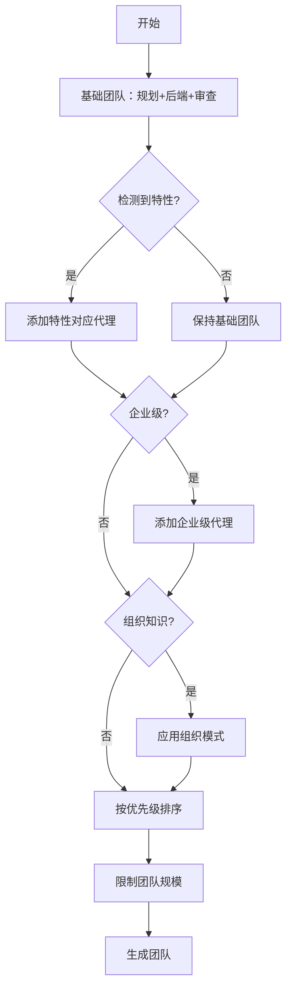
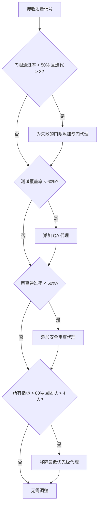
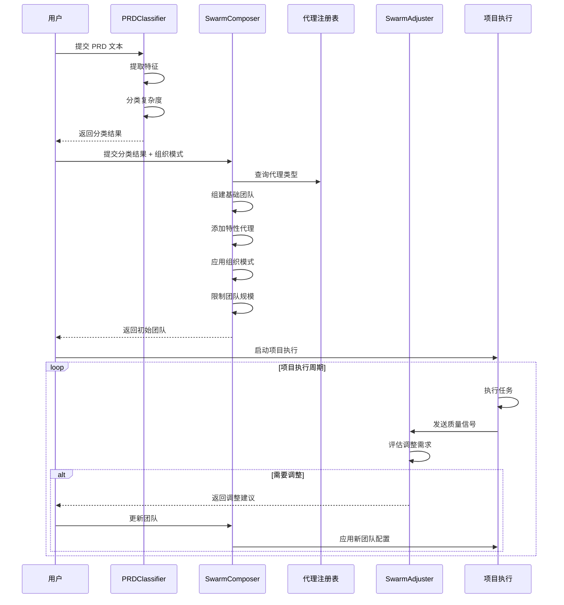
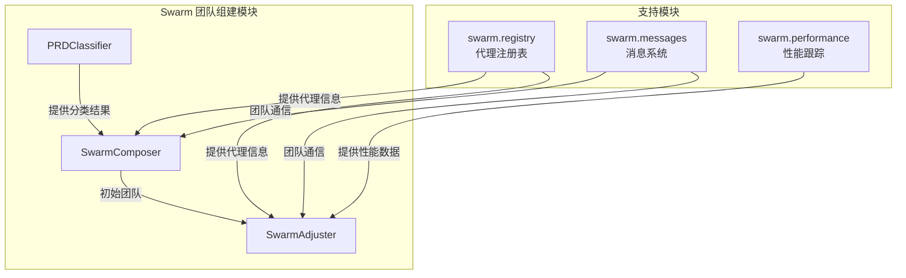

# Swarm 团队组建模块

## 概述

Swarm 团队组建模块是一个智能的多代理团队构建和管理系统，专门用于根据项目需求动态组建最优的 AI 代理团队。该模块通过三个核心组件协同工作：PRDClassifier 分析项目复杂度，SwarmComposer 构建初始团队，SwarmAdjuster 在项目执行过程中根据质量信号动态调整团队配置。

### 设计理念

该模块采用分层架构设计，将项目分析、团队组建和动态调整分离为独立但协同的组件。这种设计使得系统能够：

1. **快速响应**：基于规则的分类器无需 LLM 调用即可完成项目复杂度评估
2. **灵活配置**：团队组成可以基于项目特性、组织知识模式进行定制
3. **动态优化**：在项目执行过程中持续监控质量信号并调整团队
4. **可扩展**：各组件均可独立扩展和优化

## 核心组件

### PRDClassifier（PRD 复杂度分类器）

PRDClassifier 是一个基于规则的项目复杂度分析工具，通过关键词匹配和特征提取来快速分类项目复杂度，无需任何 LLM 调用。

#### 核心功能

- **特征提取**：从 PRD 文本中提取 7 个关键复杂度维度的特征
- **复杂度分级**：将项目分为 simple、standard、complex、enterprise 四个等级
- **置信度计算**：评估分类结果的置信程度
- **环境变量覆盖**：支持通过环境变量强制指定复杂度等级

#### 使用示例

```python
from swarm.classifier import PRDClassifier

classifier = PRDClassifier()
prd_text = """
我们需要构建一个多租户 SaaS 平台，包含用户认证（OAuth2、SSO）、
微服务架构、PostgreSQL 数据库、Docker 容器化部署、
CI/CD 流水线以及全面的端到端测试。需要满足 SOC2 合规要求。
"""

result = classifier.classify(prd_text)
print(f"复杂度等级: {result['tier']}")
print(f"推荐代理数量: {result['agent_count']}")
print(f"置信度: {result['confidence']}")
```

#### 复杂度分级

| 等级 | 描述 | 推荐代理数 | 典型项目类型 |
|------|------|-----------|-------------|
| simple | 简单项目 | 3 | 着陆页、单 API、UI 修复 |
| standard | 标准项目 | 6 | 带认证/数据库的全栈功能 |
| complex | 复杂项目 | 8 | 微服务、多环境、外部集成 |
| enterprise | 企业级项目 | 12 | 多租户、合规要求、高可用、25+ 功能 |

#### 特征维度

PRDClassifier 分析以下 7 个关键特征维度：

1. **service_count**：微服务、队列、事件总线等
2. **external_apis**：第三方 API、支付、邮件、OAuth 等
3. **database_complexity**：数据库类型、迁移、关系等
4. **deployment_complexity**：Docker、K8s、CI/CD 等
5. **testing_requirements**：E2E 测试、性能测试、安全扫描等
6. **ui_complexity**：响应式设计、国际化、实时功能等
7. **auth_complexity**：RBAC、多租户、SSO、2FA 等

### SwarmComposer（团队组建器）

SwarmComposer 负责基于 PRD 分类结果和可选的组织知识模式来组建最优的代理团队。

#### 核心功能

- **基础团队配置**：始终包含核心的规划、后端开发和代码审查代理
- **特性驱动扩展**：根据检测到的 PRD 特征添加专门代理
- **组织知识集成**：支持基于组织知识模式优化团队配置
- **优先级管理**：为代理分配优先级（1=关键，2=重要，3=可选）
- **团队规模控制**：根据复杂度等级限制团队规模

#### 团队组建流程



#### 使用示例

```python
from swarm.classifier import PRDClassifier
from swarm.composer import SwarmComposer

# 首先分类项目
classifier = PRDClassifier()
classification = classifier.classify(prd_text)

# 然后组建团队
composer = SwarmComposer()
result = composer.compose(
    classification=classification,
    org_patterns=[
        {
            "name": "React 前端模式",
            "pattern": "使用 React 构建用户界面",
            "category": "frontend"
        }
    ]
)

print(f"团队组成源: {result['composition_source']}")
print(f"团队: {[a['type'] for a in result['agents']]}")
print(f"理由: {result['rationale']}")
```

#### 代理类型映射

| 特性 | 代理类型 | 角色 | 优先级 |
|------|---------|------|--------|
| database_complexity | eng-database | engineering | 2 |
| ui_complexity | eng-frontend | engineering | 2 |
| external_apis | eng-api | engineering | 2 |
| deployment_complexity | ops-devops | operations | 2 |
| testing_requirements | eng-qa | engineering | 2 |
| auth_complexity | ops-security | operations | 2 |

#### 企业级额外代理

企业级项目会自动添加以下代理：
- ops-sre（站点可靠性工程）
- ops-compliance（合规）
- data-analytics（数据分析）

### SwarmAdjuster（团队调整器）

SwarmAdjuster 负责在项目执行过程中监控质量信号，并根据性能数据推荐代理的添加、移除或替换。

#### 核心功能

- **质量信号监控**：跟踪门限通过率、测试覆盖率、审查通过率等
- **智能调整推荐**：基于预定义规则推荐团队调整
- **失败门限映射**：将失败的质量门限映射到专门的代理类型
- **团队优化**：在质量良好时考虑精简团队

#### 调整规则



#### 使用示例

```python
from swarm.adjuster import SwarmAdjuster

adjuster = SwarmAdjuster()

current_agents = [
    {"type": "orch-planner", "priority": 1},
    {"type": "eng-backend", "priority": 1},
    {"type": "review-code", "priority": 1},
]

quality_signals = {
    "gate_pass_rate": 0.4,
    "test_coverage": 0.5,
    "review_pass_rate": 0.6,
    "iteration_count": 5,
    "failed_gates": ["security_scan", "test_coverage"]
}

result = adjuster.evaluate_adjustment(current_agents, quality_signals)
print(f"调整动作: {result['action']}")
print(f"要添加的代理: {result['agents_to_add']}")
print(f"要移除的代理: {result['agents_to_remove']}")
print(f"理由: {result['rationale']}")
```

#### 失败门限到代理类型的映射

| 失败门限类型 | 代理类型 |
|-------------|---------|
| 测试相关（mock_detector、test_coverage、testing 等） | eng-qa |
| 安全相关（security、security_scan、vulnerability 等） | ops-security |
| 代码质量（code_quality、code_review、lint 等） | review-code |
| 性能（performance、load_test、benchmark） | eng-perf |
| 部署（deployment、ci_cd） | ops-devops |
| 基础设施（infrastructure） | eng-infra |
| 数据库（database、migration） | eng-database |
| 前端（frontend、ui、accessibility） | eng-frontend |
| API | eng-api |
| 文档（documentation） | prod-techwriter |

## 架构与工作流

### 完整的团队组建和管理流程



### 组件依赖关系



## 配置与扩展

### 环境变量配置

| 环境变量 | 描述 | 可选值 |
|---------|------|-------|
| LOKI_COMPLEXITY | 强制复杂度等级覆盖 | simple, standard, complex, enterprise |

### 自定义关键词扩展

可以通过修改以下字典来自定义分类和调整规则：

```python
# 在 PRDClassifier 中添加新的特征关键词
FEATURE_KEYWORDS["my_custom_feature"] = ["keyword1", "keyword2"]

# 在 SwarmAdjuster 中添加新的门限映射
GATE_TO_AGENT["my_custom_gate"] = "specialist-agent-type"
```

### 组织知识模式

SwarmComposer 支持通过组织知识模式来优化团队组成。模式格式如下：

```python
org_patterns = [
    {
        "name": "模式名称",
        "pattern": "模式描述文本",
        "description": "详细说明",
        "category": "技术类别"
    }
]
```

系统会自动识别模式中的技术关键词并添加相应的代理。支持的技术包括：React、Vue、PostgreSQL、MongoDB、Docker、Kubernetes、Playwright、Stripe 等。

## 最佳实践

### 项目启动阶段

1. **提供详细的 PRD**：尽可能详细地描述项目需求，包括技术栈、非功能性需求等
2. **利用组织知识**：如果有历史项目模式，确保传入 org_patterns 参数
3. **验证分类结果**：检查分类结果是否合理，必要时使用环境变量覆盖

### 项目执行阶段

1. **定期监控质量信号**：建议在每个 RARV 迭代后调用 SwarmAdjuster
2. **渐进式调整**：避免频繁大幅调整团队，优先考虑添加代理而非替换
3. **记录调整原因**：保存调整建议和 rationale，便于后续分析

### 团队配置建议

- **simple 项目**：适合快速原型和小型功能，保持 3 人核心团队
- **standard 项目**：大多数项目的默认选择，平衡质量和效率
- **complex 项目**：确保包含 DevOps 和 QA 代理，提前规划测试策略
- **enterprise 项目**：关注合规性和可观测性，考虑添加自定义专业代理

## 限制与注意事项

### 已知限制

1. **基于规则的分类**：PRDClassifier 依赖关键词匹配，可能无法理解复杂的上下文
2. **静态映射关系**：GATE_TO_AGENT 和 FEATURE_AGENT_MAP 是预定义的，需要手动更新
3. **有限的组织模式**：当前只支持技术关键词匹配，不支持复杂的模式推理
4. **无状态设计**：SwarmAdjuster 不保存历史状态，每次调用都是独立的

### 错误处理

- **空 PRD 文本**：PRDClassifier 会返回默认的 simple 分类，置信度较低
- **无效的质量信号**：SwarmAdjuster 会使用默认值（通过率 1.0）来评估
- **未知代理类型**：系统会跳过未知的代理类型，不会导致错误

### 性能考虑

- PRDClassifier 的时间复杂度为 O(n)，其中 n 是 PRD 文本长度
- SwarmComposer 和 SwarmAdjuster 的操作都是内存中的快速操作
- 对于大型项目，建议在后台异步执行团队组建和调整操作

## 代理信息与注册表

Swarm 团队组建模块依赖于代理注册表来管理代理信息。每个代理都由 `AgentInfo` 类表示，包含以下核心属性：

| 属性 | 描述 |
|------|------|
| id | 代理的唯一标识符 |
| agent_type | 代理类型（如 "eng-frontend"、"ops-devops"） |
| swarm | 代理所属的类别（如 "engineering"、"operations"） |
| status | 代理当前状态（空闲、忙碌等） |
| capabilities | 代理能力列表 |
| tasks_completed | 完成的任务数 |
| tasks_failed | 失败的任务数 |
| current_task | 当前执行的任务 ID（如有） |
| created_at | 代理创建时间 |
| last_heartbeat | 最后心跳时间 |
| metadata | 额外的元数据 |

### 代理能力检查

`AgentInfo` 提供了方法来检查代理是否具有特定能力：

```python
from swarm.registry import AgentInfo

# 创建一个前端工程师代理
agent = AgentInfo.create("eng-frontend")

# 检查代理是否有特定能力
if agent.has_capability("react"):
    print("代理具有 React 能力")

# 获取具体的能力详情
capability = agent.get_capability("react")
if capability:
    print(f"React 能力等级: {capability.level}")
```

## 完整使用场景示例

### 场景 1：新项目初始化

```python
from swarm.classifier import PRDClassifier
from swarm.composer import SwarmComposer
from swarm.registry import AgentInfo

# 1. 分析 PRD
classifier = PRDClassifier()
prd = """
构建一个电商平台，包含用户认证、商品管理、购物车、
支付集成（Stripe）、PostgreSQL 数据库、React 前端、
Docker 部署和完整的 E2E 测试。
"""
classification = classifier.classify(prd)
print(f"项目复杂度: {classification['tier']}")
print(f"推荐代理数: {classification['agent_count']}")

# 2. 组建团队
composer = SwarmComposer()
org_patterns = [
    {
        "name": "电商项目模式",
        "pattern": "Stripe 支付集成，React 前端，PostgreSQL 数据库",
        "category": "ecommerce"
    }
]
composition = composer.compose(classification, org_patterns)
print(f"团队组成: {[a['type'] for a in composition['agents']]}")

# 3. 创建实际的代理实例
agents = []
for agent_def in composition['agents']:
    agent = AgentInfo.create(agent_def['type'])
    agent.metadata['priority'] = agent_def['priority']
    agent.metadata['role'] = agent_def['role']
    agents.append(agent)
    print(f"创建代理: {agent.id} ({agent.agent_type})")
```

### 场景 2：项目中途调整

```python
from swarm.adjuster import SwarmAdjuster

# 当前团队
current_agents = [
    {"type": "orch-planner", "priority": 1},
    {"type": "eng-backend", "priority": 1},
    {"type": "review-code", "priority": 1},
    {"type": "eng-frontend", "priority": 2},
]

# 质量信号（来自项目监控）
quality_signals = {
    "gate_pass_rate": 0.35,
    "test_coverage": 0.45,
    "review_pass_rate": 0.7,
    "iteration_count": 6,
    "failed_gates": ["test_coverage", "security_scan", "performance"]
}

# 评估调整需求
adjuster = SwarmAdjuster()
adjustment = adjuster.evaluate_adjustment(current_agents, quality_signals)

print(f"建议动作: {adjustment['action']}")
print(f"理由: {adjustment['rationale']}")

if adjustment['agents_to_add']:
    print("\n建议添加的代理:")
    for agent in adjustment['agents_to_add']:
        print(f"  - {agent['type']}: {agent['reason']}")

if adjustment['agents_to_remove']:
    print("\n建议移除的代理:")
    for agent in adjustment['agents_to_remove']:
        print(f"  - {agent['type']}: {agent['reason']}")
```

## 相关模块

- [代理注册表与消息系统](Swarm 代理注册表与消息系统.md)：提供代理类型信息和团队通信支持
- [性能跟踪与校准](Swarm 性能跟踪与校准.md)：提供代理性能数据用于调整决策
- [拜占庭容错](Swarm 拜占庭容错.md)：确保团队决策的可靠性
- [Memory System](Memory System.md)：存储和检索组织知识模式
