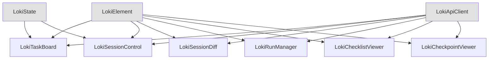

# Task and Session Management Components

## 概述

任务与会话管理组件模块是 Dashboard UI Components 系统的核心部分，提供了一套完整的 Web 组件，用于管理和可视化任务流程、会话生命周期、运行记录、检查点以及 PRD 检查清单。这些组件设计为可重用、自包含的 Web Components，可轻松集成到任何前端应用中。

本模块的主要目的是为用户提供直观的界面来监控和控制自动化任务执行过程，包括任务看板、会话控制、运行管理、检查点管理和 PRD 检查清单等功能。所有组件都支持浅色/深色主题切换，并遵循统一的设计语言。

## 架构

任务与会话管理组件采用模块化的 Web Components 架构，每个组件都是独立的自定义元素，继承自基础的 `LokiElement` 类。这种设计使得组件可以单独使用，也可以组合在一起形成更复杂的界面。



### 核心组件关系

1. **基础层**：所有组件都继承自 `LokiElement`，提供了统一的主题管理、样式处理和生命周期管理。
2. **API 层**：通过 `LokiApiClient` 与后端服务通信，获取数据并执行操作。
3. **状态层**：部分组件使用 `LokiState` 来管理本地状态和缓存。
4. **组件层**：各个功能组件独立实现特定的用户界面和交互逻辑。

## 核心组件

### 1. LokiTaskBoard

LokiTaskBoard 是一个看板式任务管理组件，提供了直观的任务可视化和拖拽排序功能。它将任务分为四个状态列：待处理、进行中、审核中和已完成。

**主要功能：**
- 拖拽任务在不同状态列之间移动
- 键盘导航支持
- 本地任务和服务器任务的合并显示
- 任务优先级可视化
- 响应式布局，支持不同屏幕尺寸

**使用示例：**
```html
<loki-task-board api-url="http://localhost:57374" project-id="1" theme="dark"></loki-task-board>
```

详细信息请参考 [LokiTaskBoard 组件文档](LokiTaskBoard.md)。

### 2. LokiSessionControl

LokiSessionControl 是一个会话生命周期管理组件，提供了启动、暂停、恢复和停止会话的控制按钮。它还显示会话的实时状态信息，包括连接状态、版本信息、代理数量和待处理任务数。

**主要功能：**
- 会话控制按钮（启动、暂停、恢复、停止）
- 实时状态显示
- 简洁和完整两种布局模式
- 连接状态监控
- 运行统计信息展示

**使用示例：**
```html
<loki-session-control api-url="http://localhost:57374" theme="dark" compact></loki-session-control>
```

详细信息请参考 [LokiSessionControl 组件文档](LokiSessionControl.md)。

### 3. LokiSessionDiff

LokiSessionDiff 组件显示自上次会话以来的更改内容，包括任务创建、完成、阻塞和错误数量的统计，以及重要亮点和决策记录。

**主要功能：**
- 会话期间变更摘要
- 可折叠的决策详情
- 定时轮询更新
- 时间段显示

**使用示例：**
```html
<loki-session-diff api-url="http://localhost:57374"></loki-session-diff>
```

详细信息请参考 [LokiSessionDiff 组件文档](LokiSessionDiff.md)。

### 4. LokiRunManager

LokiRunManager 是一个运行记录管理组件，以表格形式显示所有运行记录，提供取消和重放运行的功能。

**主要功能：**
- 运行记录表格展示
- 取消正在运行的任务
- 重放已完成或失败的任务
- 运行状态可视化
- 可见性感知的轮询机制

**使用示例：**
```html
<loki-run-manager api-url="http://localhost:57374" project-id="5" theme="dark"></loki-run-manager>
```

详细信息请参考 [LokiRunManager 组件文档](LokiRunManager.md)。

### 5. LokiChecklistViewer

LokiChecklistViewer 是一个 PRD 检查清单查看器，显示需求验证状态、进度条和分类折叠面板。支持对关键项目的豁免功能。

**主要功能：**
- 检查清单分类展示
- 验证状态可视化
- 进度条显示
- 项目豁免功能
- 委员会门控状态显示

**使用示例：**
```html
<loki-checklist-viewer api-url="http://localhost:57374" theme="dark"></loki-checklist-viewer>
```

详细信息请参考 [LokiChecklistViewer 组件文档](LokiChecklistViewer.md)。

### 6. LokiCheckpointViewer

LokiCheckpointViewer 是一个检查点管理组件，显示检查点历史记录，支持创建新检查点和回滚到历史检查点。

**主要功能：**
- 检查点历史列表
- 创建新检查点
- 回滚到历史检查点
- 确认对话框防止误操作
- 可见性感知的轮询机制

**使用示例：**
```html
<loki-checkpoint-viewer api-url="http://localhost:57374" theme="dark"></loki-checkpoint-viewer>
```

详细信息请参考 [LokiCheckpointViewer 组件文档](LokiCheckpointViewer.md)。

## 使用指南

### 基本使用

所有组件都可以作为自定义 HTML 元素直接使用，只需设置必要的属性即可：

```html
<!DOCTYPE html>
<html>
<head>
  <title>Task and Session Management</title>
</head>
<body>
  <!-- 任务看板 -->
  <loki-task-board api-url="http://localhost:57374" project-id="1"></loki-task-board>
  
  <!-- 会话控制 -->
  <loki-session-control api-url="http://localhost:57374"></loki-session-control>
  
  <!-- 运行管理 -->
  <loki-run-manager api-url="http://localhost:57374"></loki-run-manager>
  
  <script type="module">
    // 导入组件
    import 'dashboard-ui/components/loki-task-board.js';
    import 'dashboard-ui/components/loki-session-control.js';
    import 'dashboard-ui/components/loki-run-manager.js';
  </script>
</body>
</html>
```

### 事件处理

组件会触发各种自定义事件，可以通过标准的事件监听机制来处理：

```javascript
const taskBoard = document.querySelector('loki-task-board');

// 监听任务移动事件
taskBoard.addEventListener('task-moved', (e) => {
  console.log('Task moved:', e.detail);
});

// 监听任务点击事件
taskBoard.addEventListener('task-click', (e) => {
  console.log('Task clicked:', e.detail.task);
});

// 监听添加任务事件
taskBoard.addEventListener('add-task', (e) => {
  console.log('Add task for status:', e.detail.status);
});
```

### 主题配置

所有组件都支持 `theme` 属性，可以设置为 `light` 或 `dark`：

```html
<loki-task-board theme="dark"></loki-task-board>
<loki-session-control theme="light"></loki-session-control>
```

如果未设置主题，组件会自动检测系统的主题偏好。

## 与其他模块的关系

任务与会话管理组件模块与以下模块密切相关：

- **Dashboard Backend**：提供 API 服务，组件通过 API 客户端与后端通信。
- **Dashboard Frontend**：这些组件是前端应用的核心构建块。
- **Dashboard UI Components - Core Theme**：提供主题系统和基础组件类。
- **Memory and Learning Components**：某些组件可能会显示与记忆系统相关的信息。

更多信息请参考相关模块的文档：
- [Dashboard Backend](Dashboard Backend.md)
- [Dashboard Frontend](Dashboard Frontend.md)
- [Core Theme Components](Core Theme Components.md)

## 注意事项和限制

1. **API 依赖**：所有组件都需要与后端 API 通信，确保 `api-url` 属性正确设置。
2. **浏览器兼容性**：组件使用现代 Web 技术，建议在最新版本的 Chrome、Firefox、Safari 或 Edge 浏览器中使用。
3. **轮询机制**：许多组件使用定时轮询来更新数据，这可能会产生一定的网络流量。
4. **本地状态**：某些组件支持本地任务，但这些任务在页面刷新后会丢失。
5. **权限要求**：某些操作（如创建检查点、豁免检查项）可能需要特定的用户权限。
