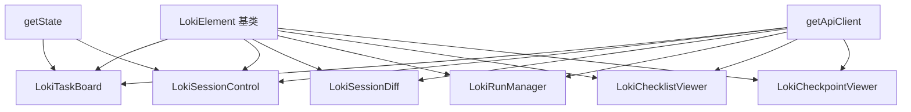
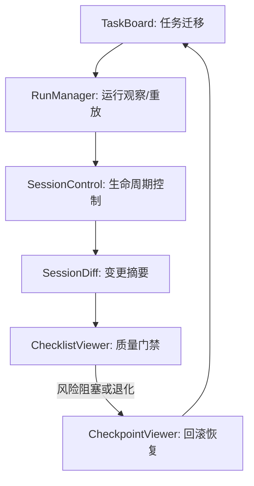

# Task and Session Management Components

## 概述

把这个模块想象成**自动化系统的“值班控制台”**：
- `LokiTaskBoard` 像调度室白板，告诉你“任务在哪一站”；
- `LokiSessionControl` 像总闸控制面板，决定系统是继续跑、暂停还是停机；
- `LokiRunManager` 像航班运行列表，显示每次执行实例的状态与可重放性；
- `LokiChecklistViewer` + `LokiCheckpointViewer` 则像“质量门禁 + 现场快照回退”。

它存在的根本原因不是“把数据画出来”，而是把**持续运行的自治流程**变成可干预、可审计、可回退的人机协作系统：当自动流程偏离预期时，操作者可以在 UI 上快速看见问题、做出动作，并且把风险控制在可恢复范围内。

## 这个模块解决的核心问题（Why）

如果只有后端 API，没有这层组件，团队会遇到三个典型痛点：

1. **状态碎片化**：任务状态、会话状态、运行状态分散在不同接口，操作者很难形成统一心智。
2. **控制与可见性脱节**：能看到状态不代表能立刻采取动作（pause/resume/rollback），反之亦然。
3. **缺少安全刹车**：没有质量门禁和检查点时，错误可能沿着任务链扩散。

本模块的设计意图是把这些痛点收敛成一条闭环：
**任务推进 → 会话控制 → 变化理解 → 质量判定 → 必要时回滚**。

## 架构总览



### 架构角色解读

- **`LokiElement`**：统一壳层（主题、基础样式、生命周期）。它让各组件在视觉和生命周期行为上保持一致，减少“每个组件都重新发明一套 UI 基础设施”。
- **`getApiClient`**：统一远程访问入口。六个组件都经由它调用后端（如 `listTasks`、`getStatus`、`_get('/api/session-diff')`、`_post('/api/v2/runs/:id/cancel')` 等）。
- **`getState`（仅两处）**：用于“本地态补偿”。`LokiTaskBoard` 用于本地任务合并/缓存，`LokiSessionControl` 用于会话同步（`updateSession`）。

这表明该模块在系统里扮演的是**前端编排层（orchestration UI）**，而不是业务规则引擎：它强调“可操作可观察”，并把强业务规则尽量放在后端 API 侧。
## 核心能力分层与子模块导航

为避免在主文档重复实现细节，本模块按职责拆分为三个子模块文档。主文档聚焦“整体设计、组件协作、接入与运维建议”；方法级实现、参数语义、边界条件和代码片段请进入对应子文档。

### A. 任务与运行操作面（执行层）

该层包含任务状态流转与运行实例控制，面向“正在做什么、做到哪一步、是否可中断/重放”的问题。`LokiTaskBoard` 负责任务看板与拖拽迁移，`LokiRunManager` 负责运行记录、取消与重放。两者共同构成执行面的核心入口。

- 子模块文档：[`task_board_and_run_operations.md`](task_board_and_run_operations.md)
- 适用场景：任务编排控制台、运行追踪面板、项目级执行复盘

### B. 会话生命周期与可见性（控制层）

该层包含会话生命周期控制与恢复摘要可视化。`LokiSessionControl` 提供 pause/resume/stop 控制与实时状态显示，`LokiSessionDiff` 提供“上次会话以来发生了什么”的变化摘要，帮助操作者快速恢复上下文。

- 子模块文档：[`session_lifecycle_visibility.md`](session_lifecycle_visibility.md)
- 适用场景：值班台、长时任务接管、跨班次协作交接

### C. 质量门禁与检查点恢复（保障层）

该层包含 PRD 检查清单门禁与检查点回滚。`LokiChecklistViewer` 负责质量判定和 waiver 操作，`LokiCheckpointViewer` 负责创建恢复点与确认式回滚。它们共同形成“先判定，再恢复”的风险闭环。

- 子模块文档：[`quality_gate_and_checkpoint_recovery.md`](quality_gate_and_checkpoint_recovery.md)
- 适用场景：上线前验收、退化处理、故障快速回退

## 组件协作与端到端流程



该闭环说明本模块并不是 6 个孤立组件的集合，而是一条可组合操作链：执行层产生活动，控制层暴露状态，保障层给出“是否可继续”与“如何安全回退”的决策支持。实际接入时，建议在宿主容器中统一监听关键事件（如 `task-moved`、`session-stop`、`checkpoint-action`），以实现跨面板联动刷新和审计记录。

## 接入与配置建议

在页面中可按需组合组件，而不必一次性全部加载。常见最小组合是：`LokiTaskBoard + LokiSessionControl + LokiRunManager`；当进入质量验收或高风险阶段时，再加入 `LokiChecklistViewer + LokiCheckpointViewer`。

```html
<loki-task-board api-url="http://localhost:57374" project-id="1"></loki-task-board>
<loki-session-control api-url="http://localhost:57374" compact></loki-session-control>
<loki-run-manager api-url="http://localhost:57374" project-id="1"></loki-run-manager>
```

统一配置建议：

- `api-url` 必须指向同一后端网关，避免跨组件读写不同数据源。
- 若存在项目隔离需求，`project-id` 应在 TaskBoard 与 RunManager 上保持一致。
- 在只读审计场景，为 TaskBoard 打开 `readonly`，避免误拖拽。

## 运行注意事项（边界与限制）

1. 组件普遍依赖轮询；虽已实现页面可见性暂停，但多组件同屏仍会叠加请求量。
2. 多数列表使用哈希去重（`JSON.stringify`），当后端字段顺序不稳定时可能触发额外重绘。
3. SessionControl 的 `session-start` 接口存在，但默认模板未提供 start 按钮入口；如需启用应在宿主层补充。
4. Checklist 的 waiver 依赖 `window.prompt`，在受限容器中可能不可用，建议改为内联表单扩展。
5. Checkpoint 创建输入前端限制长度可能小于后端限制，属 UI 约束而非 API 能力上限。

## 与其他模块文档的关系

- 后端契约与数据模型：见 [Dashboard Backend.md](Dashboard Backend.md)
- API 服务与事件流：见 [API Server & Services.md](API Server & Services.md)
- UI 基类与主题机制：见 [Core Theme.md](Core Theme.md)、[Unified Styles.md](Unified Styles.md)
- API 客户端行为：见 [API 客户端.md](API 客户端.md)
- 模块总览：见 [Dashboard UI Components.md](Dashboard UI Components.md)

通过以上文档分层阅读，开发者可以先理解全局协作，再进入子模块掌握具体实现与扩展策略。
