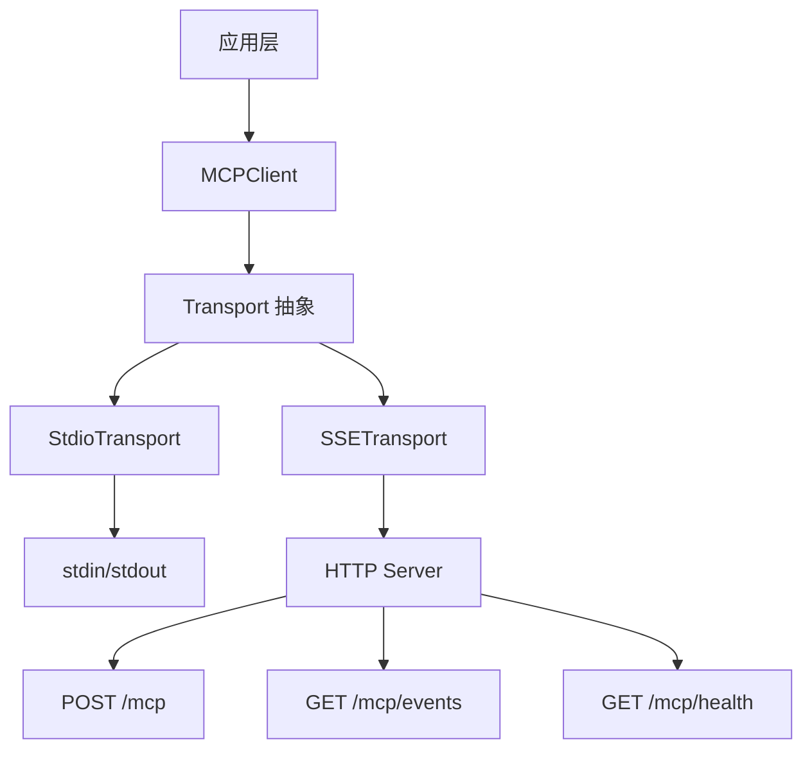
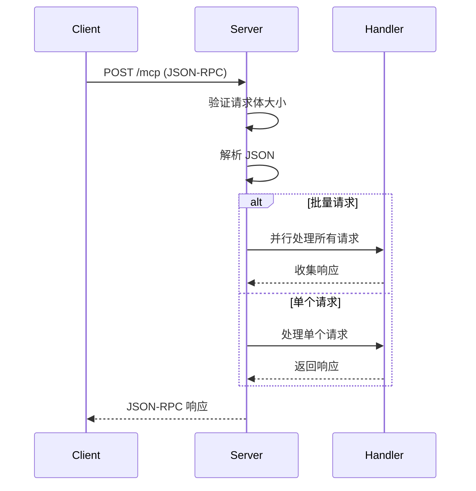
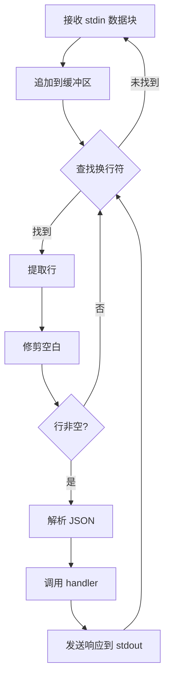

# Transport 模块文档

## 概述

Transport 模块为 MCP (Model Context Protocol) 提供灵活的通信传输层实现，支持两种核心传输协议：

- **StdioTransport**：基于标准输入/输出的轻量级传输，适用于本地进程间通信
- **SSETransport**：基于 Server-Sent Events 的 HTTP 传输，支持服务器推送和实时通知

该模块是 MCP 协议实现的基础设施，负责 JSON-RPC 2.0 消息的可靠传输，被 [MCPClient](MCPClient.md) 和 [MCPClientManager](MCPClientManager.md) 等上层组件依赖使用。

## 架构设计



Transport 模块采用了简洁的接口设计模式，两种传输实现都提供统一的生命周期管理接口：
- `start()` - 启动传输服务
- `stop()` - 停止传输服务
- 消息处理通过构造函数注入的 `handler` 回调实现

## SSETransport 详解

### 功能特性

SSETransport 实现了完整的 HTTP 服务器，提供以下端点：

| 端点 | 方法 | 功能 |
|------|------|------|
| `/mcp` | POST | 接收 JSON-RPC 2.0 请求并返回响应 |
| `/mcp/events` | GET | SSE 事件流，用于服务器推送通知 |
| `/mcp/health` | GET | 健康检查端点 |

### 配置选项

```javascript
const transport = new SSETransport(handler, {
  port: 8421,              // 监听端口，默认 8421
  host: '127.0.0.1',       // 绑定地址，默认 localhost
  corsOrigin: 'http://localhost:8421'  // CORS 源配置
});
```

**安全注意事项**：
- 默认绑定到 `127.0.0.1`，避免暴露到局域网
- CORS 源默认限制为同源，仅在明确需要时设置为 `'*'`
- 最大请求体限制为 10MB

### 核心方法

#### `constructor(handler, options)`

创建 SSETransport 实例。

**参数**：
- `handler` - JSON-RPC 请求处理函数，接收请求对象，返回响应 Promise
- `options` - 可选配置对象
  - `port` - 监听端口
  - `host` - 绑定主机地址
  - `corsOrigin` - CORS 允许的源

#### `start()`

启动 HTTP 服务器，开始监听请求。

**副作用**：
- 创建并启动 HTTP 服务器
- 向 stderr 输出监听地址信息

#### `stop()`

停止服务器并清理所有资源。

**副作用**：
- 关闭所有 SSE 客户端连接
- 停止 HTTP 服务器

#### `broadcast(event, data)`

向所有连接的 SSE 客户端广播事件。

**参数**：
- `event` - 事件名称
- `data` - 事件数据对象

**示例**：
```javascript
transport.broadcast('tool_executed', { 
  tool: 'read_file', 
  success: true 
});
```

### 内部实现细节

#### 请求处理流程



#### SSE 连接管理

SSETransport 维护一个活跃客户端连接集合：
- 新连接通过 `_handleSSE` 方法建立，立即发送 `connected` 事件
- 客户端断开时通过 `close` 事件自动清理
- `broadcast` 方法向所有当前连接的客户端推送消息

## StdioTransport 详解

### 功能特性

StdioTransport 提供基于标准输入输出的 JSON-RPC 传输：
- 从 stdin 读取**换行符分隔**的 JSON 消息
- 将 JSON 响应写入 stdout
- 日志输出到 stderr 以避免污染 RPC 通道

### 核心方法

#### `constructor(handler)`

创建 StdioTransport 实例。

**参数**：
- `handler` - JSON-RPC 请求处理函数

#### `start()`

开始监听 stdin 数据。

**副作用**：
- 设置 stdin 编码为 utf8
- 注册 `data` 和 `end` 事件监听器
- 恢复 stdin 流

#### `stop()`

停止监听并清理资源。

**副作用**：
- 暂停 stdin 流
- 设置 `_running` 标志为 false

### 内部实现细节

#### 数据处理流程



#### 批处理支持

StdioTransport 支持 JSON-RPC 2.0 批量请求：
- 检测到数组格式的请求时，并行处理所有子请求
- 收集所有非 null 响应后批量返回
- 即使部分请求失败，也会返回其他成功的响应

## 使用指南

### SSETransport 使用示例

```javascript
const { SSETransport } = require('./src/protocols/transport/sse');

// 定义请求处理器
async function handleRequest(request) {
  switch (request.method) {
    case 'initialize':
      return {
        protocolVersion: '2024-11-05',
        serverInfo: { name: 'my-mcp-server', version: '1.0.0' },
        capabilities: { tools: {} }
      };
    case 'tools/list':
      return { tools: [] };
    case 'tools/call':
      return { content: [{ type: 'text', text: 'Hello!' }] };
    default:
      throw { code: -32601, message: 'Method not found' };
  }
}

// 创建并启动传输
const transport = new SSETransport(handleRequest, {
  port: 3000,
  host: '0.0.0.0',
  corsOrigin: '*'
});

transport.start();

// 广播事件
setTimeout(() => {
  transport.broadcast('notification', { message: 'Server started' });
}, 1000);

// 优雅关闭
process.on('SIGINT', () => {
  transport.stop();
  process.exit(0);
});
```

### StdioTransport 使用示例

```javascript
const { StdioTransport } = require('./src/protocols/transport/stdio');

async function handleRequest(request) {
  // 处理请求...
  console.error('Processing request:', request.method); // 使用 stderr 记录日志
  return { result: 'success' };
}

const transport = new StdioTransport(handleRequest);
transport.start();

// 进程结束时停止
process.on('SIGTERM', () => transport.stop());
```

## 错误处理

### JSON-RPC 错误码

两种传输都遵循 JSON-RPC 2.0 规范的错误码：

| 错误码 | 含义 | 触发场景 |
|--------|------|----------|
| -32700 | Parse error | JSON 解析失败 |
| -32600 | Invalid Request | 请求格式错误或 404 |
| -32603 | Internal error | 处理器抛出异常 |

### SSETransport 特有错误

- **413 Request Entity Too Large**：请求体超过 10MB 限制
- **404 Not Found**：访问未定义的端点

## 扩展和定制

### 创建自定义传输

要创建新的传输实现，只需遵循以下接口约定：

```javascript
class CustomTransport {
  constructor(handler) {
    this._handler = handler;
  }
  
  start() {
    // 启动传输
  }
  
  stop() {
    // 停止传输，清理资源
  }
  
  // 可选：如果需要服务器推送
  broadcast(event, data) {
    // 实现广播逻辑
  }
}
```

## 安全注意事项

1. **SSETransport 默认绑定 localhost**：生产环境如需外网访问，明确配置 `host: '0.0.0.0'`
2. **CORS 配置**：避免在生产环境使用 `corsOrigin: '*'`，应配置具体的允许源
3. **输入验证**：两种传输都对请求大小进行了限制，但应用层仍需验证数据内容
4. **StdioTransport 日志**：确保所有调试日志写入 stderr，避免干扰 JSON-RPC 通信

## 相关模块

- [MCPClient](MCPClient.md) - 使用 Transport 的客户端实现
- [MCPClientManager](MCPClientManager.md) - MCP 客户端管理器
- [CircuitBreaker](CircuitBreaker.md) - 熔断器模式实现
