# Type Definitions 模块文档

## 概述

Type Definitions 模块是 Loki Mode Dashboard UI 的核心类型定义系统，为整个 Dashboard UI Components 库提供完整的 TypeScript 类型支持。该模块定义了主题配置、设计令牌、API 客户端、状态管理、Web 组件等各个方面的类型，确保在 React 应用、VS Code 扩展和其他 TypeScript 项目中使用组件库时的类型安全性。

### 核心价值

- **类型安全**：为所有 UI 组件和 API 交互提供编译时类型检查
- **开发体验**：通过 TypeScript 智能提示提升开发效率
- **一致性保证**：确保整个组件库的类型定义保持一致
- **可扩展性**：支持主题定制、组件扩展和状态管理的类型安全

### 版本信息
- 当前版本：1.2.0
- 主要依赖：TypeScript 4.0+
- 兼容性：支持现代浏览器环境和 VS Code 扩展

---

## 架构概览

Type Definitions 模块采用分层架构设计，将类型定义组织为多个逻辑相关的部分：

```mermaid
graph TB
    A[Type Definitions] --> B[Theme Types]
    A --> C[Design Token Types]
    A --> D[Keyboard Shortcut Types]
    A --> E[ARIA Pattern Types]
    A --> F[API Client Types]
    A --> G[State Management Types]
    A --> H[Theme Manager Types]
    A --> I[Web Component Types]
    
    B --> B1[ThemeName]
    B --> B2[ThemeDefinition]
    B --> B3[ThemeContext]
    
    C --> C1[SpacingScale]
    C --> C2[RadiusScale]
    C --> C3[TypographyConfig]
    C --> C4[AnimationConfig]
    C --> C5[BreakpointsConfig]
    C --> C6[ZIndexScale]
    
    F --> F1[LokiApiClient]
    F --> F2[Task]
    F --> F3[Project]
    F --> F4[Memory Types]
    
    G --> G1[AppState]
    G --> G2[LokiState]
    G --> G3[Store]
    
    H --> H1[UnifiedThemeManager]
    H --> H2[KeyboardHandler]
    
    I --> I1[LokiElement]
    I --> I2[LokiTaskBoard]
    I --> I3[LokiSessionControl]
    I --> I4[LokiLogStream]
    I --> I5[LokiMemoryBrowser]
    I --> I6[LokiLearningDashboard]
```



这个架构图展示了 Type Definitions 模块的组织结构。核心类型分为几个主要类别，每个类别负责不同的功能领域。从主题和设计令牌开始，到 API 客户端、状态管理，最后是 Web 组件的类型定义，形成了一个完整的类型系统。

---

## 核心类型详解

### 主题类型 (Theme Types)

主题类型定义了组件库的主题系统，支持多种主题变体和自动检测功能。

#### ThemeName

定义了所有可用的主题名称：

```typescript
export type ThemeName =
  | 'light'
  | 'dark'
  | 'high-contrast'
  | 'vscode-light'
  | 'vscode-dark';
```

**用途**：指定组件使用的主题，支持标准主题和 VS Code 集成主题。

#### ThemeContext

定义了主题自动检测的上下文环境：

```typescript
export type ThemeContext = 'browser' | 'vscode' | 'cli';
```

**用途**：帮助 `UnifiedThemeManager` 确定在哪个环境中运行，从而选择合适的默认主题。

#### CSSCustomProperty

定义了所有可用的 CSS 自定义属性名称：

```typescript
export type CSSCustomProperty =
  // 背景颜色
  | '--loki-bg-primary'
  | '--loki-bg-secondary'
  // ... 更多属性
  // 阴影
  | '--loki-shadow-sm'
  | '--loki-shadow-md'
  | '--loki-shadow-lg'
  | '--loki-shadow-focus';
```

**用途**：确保在代码中引用 CSS 自定义属性时的类型安全，避免拼写错误。

#### ThemeDefinition

完整的主题定义：

```typescript
export type ThemeDefinition = {
  [K in CSSCustomProperty]: string;
};
```

**用途**：定义一个完整主题的所有 CSS 自定义属性值。

### 设计令牌类型 (Design Token Types)

设计令牌类型定义了组件库的视觉设计系统，包括间距、圆角、字体、动画等。

#### SpacingScale

间距尺寸系统：

```typescript
export interface SpacingScale {
  xs: string;
  sm: string;
  md: string;
  lg: string;
  xl: string;
  '2xl': string;
  '3xl': string;
}
```

**用途**：统一组件库中的间距使用，确保视觉一致性。

#### RadiusScale

圆角尺寸系统：

```typescript
export interface RadiusScale {
  none: string;
  sm: string;
  md: string;
  lg: string;
  xl: string;
  full: string;
}
```

**用途**：定义不同大小的圆角，用于按钮、卡片等组件。

#### TypographyConfig

字体配置系统：

```typescript
export interface TypographyConfig {
  fontFamily: {
    sans: string;
    mono: string;
  };
  fontSize: {
    xs: string;
    sm: string;
    base: string;
    md: string;
    lg: string;
    xl: string;
    '2xl': string;
    '3xl': string;
  };
  fontWeight: {
    normal: string;
    medium: string;
    semibold: string;
    bold: string;
  };
  lineHeight: {
    tight: string;
    normal: string;
    relaxed: string;
  };
}
```

**用途**：定义字体家族、字号、字重和行高，确保文本渲染的一致性。

#### AnimationConfig

动画配置系统：

```typescript
export interface AnimationConfig {
  duration: {
    fast: string;
    normal: string;
    slow: string;
    slower: string;
  };
  easing: {
    default: string;
    in: string;
    out: string;
    bounce: string;
  };
}
```

**用途**：定义动画时长和缓动函数，用于过渡和微交互效果。

#### BreakpointsConfig

响应式断点配置：

```typescript
export interface BreakpointsConfig {
  sm: string;
  md: string;
  lg: string;
  xl: string;
  '2xl': string;
}
```

**用途**：定义响应式设计的断点，用于适配不同屏幕尺寸。

#### ZIndexScale

Z-index 层级系统：

```typescript
export interface ZIndexScale {
  base: string;
  dropdown: string;
  sticky: string;
  modal: string;
  popover: string;
  tooltip: string;
  toast: string;
}
```

**用途**：定义 UI 元素的层级关系，确保正确的堆叠顺序。

### 键盘快捷键类型 (Keyboard Shortcut Types)

键盘快捷键类型定义了组件库支持的所有键盘操作。

#### KeyboardShortcut

单个快捷键定义：

```typescript
export interface KeyboardShortcut {
  key: string;
  modifiers: Array<'Ctrl' | 'Meta' | 'Shift' | 'Alt'>;
}
```

**用途**：定义快捷键的按键和修饰键组合。

#### KeyboardShortcuts

所有可用的快捷键集合：

```typescript
export interface KeyboardShortcuts {
  // 导航
  'navigation.nextItem': KeyboardShortcut;
  'navigation.prevItem': KeyboardShortcut;
  'navigation.nextSection': KeyboardShortcut;
  'navigation.prevSection': KeyboardShortcut;
  'navigation.confirm': KeyboardShortcut;
  'navigation.cancel': KeyboardShortcut;
  // 操作
  'action.refresh': KeyboardShortcut;
  'action.search': KeyboardShortcut;
  'action.save': KeyboardShortcut;
  'action.close': KeyboardShortcut;
  // 主题
  'theme.toggle': KeyboardShortcut;
  // 任务
  'task.create': KeyboardShortcut;
  'task.complete': KeyboardShortcut;
  // 视图
  'view.toggleLogs': KeyboardShortcut;
  'view.toggleMemory': KeyboardShortcut;
}
```

**用途**：定义所有可配置的键盘快捷键，支持导航、操作、主题切换等功能。

### ARIA 模式类型 (ARIA Pattern Types)

ARIA 模式类型定义了可访问性支持的标准模式。

#### AriaPattern

单个 ARIA 模式定义：

```typescript
export interface AriaPattern {
  role?: string;
  tabIndex?: number;
  ariaSelected?: boolean;
  ariaLive?: 'polite' | 'assertive' | 'off';
  ariaAtomic?: boolean;
  ariaModal?: boolean;
  ariaRelevant?: string;
}
```

**用途**：定义 ARIA 属性集合，用于增强组件的可访问性。

#### AriaPatterns

所有可用的 ARIA 模式集合：

```typescript
export interface AriaPatterns {
  button: AriaPattern;
  tablist: AriaPattern;
  tab: AriaPattern;
  tabpanel: AriaPattern;
  list: AriaPattern;
  listitem: AriaPattern;
  livePolite: AriaPattern;
  liveAssertive: AriaPattern;
  dialog: AriaPattern;
  alertdialog: AriaPattern;
  status: AriaPattern;
  alert: AriaPattern;
  log: AriaPattern;
}
```

**用途**：提供标准的 ARIA 模式库，组件可以通过 `getAriaPattern` 方法获取并应用。

### API 客户端类型 (API Client Types)

API 客户端类型定义了与后端 API 交互的所有类型。

#### ApiClientConfig

API 客户端配置：

```typescript
export interface ApiClientConfig {
  baseUrl?: string;
  wsUrl?: string;
  pollInterval?: number;
  timeout?: number;
  retryAttempts?: number;
  retryDelay?: number;
}
```

**用途**：配置 API 客户端的连接参数、超时和重试策略。

#### ApiEventTypes

API 事件类型：

```typescript
export interface ApiEventTypes {
  CONNECTED: 'api:connected';
  DISCONNECTED: 'api:disconnected';
  ERROR: 'api:error';
  STATUS_UPDATE: 'api:status-update';
  TASK_CREATED: 'api:task-created';
  TASK_UPDATED: 'api:task-updated';
  TASK_DELETED: 'api:task-deleted';
  PROJECT_CREATED: 'api:project-created';
  PROJECT_UPDATED: 'api:project-updated';
  AGENT_UPDATE: 'api:agent-update';
  LOG_MESSAGE: 'api:log-message';
  MEMORY_UPDATE: 'api:memory-update';
}
```

**用途**：定义 API 客户端可能发出的所有事件类型，用于事件监听和处理。

#### Task

任务对象：

```typescript
export interface Task {
  id: number | string;
  title: string;
  description?: string;
  status: 'pending' | 'in_progress' | 'review' | 'done';
  priority?: 'critical' | 'high' | 'medium' | 'low';
  type?: string;
  project_id?: number;
  assigned_agent_id?: number;
  isLocal?: boolean;
  createdAt?: string;
  updatedAt?: string;
}
```

**用途**：表示任务管理系统中的单个任务，包含状态、优先级、分配等信息。

#### Project

项目对象：

```typescript
export interface Project {
  id: number;
  name: string;
  description?: string;
  status?: string;
  created_at?: string;
  updated_at?: string;
}
```

**用途**：表示项目管理系统中的单个项目。

#### SystemStatus

系统状态：

```typescript
export interface SystemStatus {
  status: string;
  version?: string;
  uptime_seconds?: number;
  running_agents?: number;
  pending_tasks?: number;
  phase?: string;
  iteration?: number;
  complexity?: string;
}
```

**用途**：表示后端系统的运行状态，用于监控和显示。

#### MemorySummary

内存摘要：

```typescript
export interface MemorySummary {
  episodic?: {
    count: number;
    latestDate?: string;
  };
  semantic?: {
    patterns: number;
    antiPatterns: number;
  };
  procedural?: {
    skills: number;
  };
  tokenEconomics?: TokenEconomics;
}
```

**用途**：表示记忆系统的摘要信息，包括情景记忆、语义记忆和程序记忆的统计数据。

#### LokiApiClient

API 客户端类：

```typescript
export declare class LokiApiClient extends EventTarget {
  static getInstance(config?: ApiClientConfig): LokiApiClient;
  static clearInstances(): void;

  constructor(config?: ApiClientConfig);

  readonly baseUrl: string;
  readonly isConnected: boolean;

  // 连接管理
  connect(): Promise<void>;
  disconnect(): void;
  startPolling(callback?: (status: SystemStatus) => void, interval?: number): void;
  stopPolling(): void;

  // 状态 API
  getStatus(): Promise<SystemStatus>;
  healthCheck(): Promise<{ status: string }>;

  // 项目 API
  listProjects(status?: string | null): Promise<Project[]>;
  getProject(projectId: number): Promise<Project>;
  createProject(data: Partial<Project>): Promise<Project>;
  updateProject(projectId: number, data: Partial<Project>): Promise<Project>;
  deleteProject(projectId: number): Promise<void>;

  // 任务 API
  listTasks(filters?: TaskFilters): Promise<Task[]>;
  getTask(taskId: number): Promise<Task>;
  createTask(data: Partial<Task>): Promise<Task>;
  updateTask(taskId: number, data: Partial<Task>): Promise<Task>;
  moveTask(taskId: number, status: string, position: number): Promise<Task>;
  deleteTask(taskId: number): Promise<void>;

  // 内存 API
  getMemorySummary(): Promise<MemorySummary>;
  // ... 更多内存 API 方法
}
```

**用途**：提供与后端 API 交互的完整客户端，支持单例模式和事件通知。

### 状态管理类型 (State Management Types)

状态管理类型定义了客户端状态管理的结构和操作。

#### AppState

完整的应用状态：

```typescript
export interface AppState {
  ui: UIState;
  session: SessionState;
  localTasks: LocalTask[];
  cache: CacheState;
  preferences: PreferencesState;
}
```

**用途**：定义应用的完整状态结构，包括 UI 状态、会话状态、本地任务、缓存和用户偏好。

#### UIState

UI 状态：

```typescript
export interface UIState {
  theme: ThemeName;
  sidebarCollapsed: boolean;
  activeSection: string;
  terminalAutoScroll: boolean;
}
```

**用途**：定义 UI 相关的状态，如主题、侧边栏状态等。

#### SessionState

会话状态：

```typescript
export interface SessionState {
  connected: boolean;
  lastSync: string | null;
  mode: string;
  phase: string | null;
  iteration: number | null;
}
```

**用途**：定义当前会话的状态，如连接状态、运行阶段等。

#### LokiState

状态管理类：

```typescript
export declare class LokiState extends EventTarget {
  static STORAGE_KEY: string;
  static getInstance(): LokiState;

  constructor();

  // 状态访问
  get(path?: string | null): unknown;
  set(path: string, value: unknown, persist?: boolean): void;
  update(updates: Record<string, unknown>, persist?: boolean): void;
  subscribe(path: string, callback: StateChangeCallback): () => void;
  reset(path?: string | null): void;

  // 本地任务的便捷方法
  addLocalTask(task: Partial<LocalTask>): LocalTask;
  updateLocalTask(taskId: string, updates: Partial<LocalTask>): LocalTask | null;
  deleteLocalTask(taskId: string): void;
  moveLocalTask(taskId: string, newStatus: string, position?: number | null): LocalTask | null;

  // 会话和缓存辅助方法
  updateSession(updates: Partial<SessionState>): void;
  updateCache(data: Partial<CacheState>): void;
  getMergedTasks(): Task[];
  getTasksByStatus(status: string): Task[];
}
```

**用途**：提供客户端状态管理功能，支持持久化、订阅和便捷的状态操作方法。

#### Store

响应式存储接口：

```typescript
export interface Store<T> {
  get(): T;
  set(value: T): void;
  subscribe(callback: StateChangeCallback): () => void;
}
```

**用途**：定义响应式存储的接口，用于创建绑定到特定状态路径的存储。

### 主题管理器类型 (Theme Manager Types)

主题管理器类型定义了主题切换和管理的功能。

#### UnifiedThemeManager

统一主题管理器：

```typescript
export declare class UnifiedThemeManager {
  static STORAGE_KEY: string;
  static CONTEXT_KEY: string;

  static detectContext(): ThemeContext;
  static detectVSCodeTheme(): 'light' | 'dark' | 'high-contrast' | null;
  static getTheme(): ThemeName;
  static setTheme(theme: ThemeName): void;
  static toggle(): ThemeName;
  static getVariables(theme?: ThemeName | null): ThemeDefinition;
  static generateCSS(theme?: ThemeName | null): string;
  static init(): void;
}
```

**用途**：提供主题检测、切换和 CSS 生成功能，支持多种环境的自动适配。

#### KeyboardHandler

键盘处理器：

```typescript
export declare class KeyboardHandler {
  constructor();

  register(action: KeyboardAction, handler: (event: KeyboardEvent) => void): void;
  unregister(action: KeyboardAction): void;
  setEnabled(enabled: boolean): void;
  handleEvent(event: KeyboardEvent): boolean;
  attach(element: HTMLElement): void;
  detach(element: HTMLElement): void;
}
```

**用途**：管理键盘快捷键的注册和处理，支持全局和元素级别的键盘事件监听。

### Web 组件类型 (Web Component Types)

Web 组件类型定义了所有 Loki UI 组件的公共接口和事件。

#### LokiElement

所有 Loki Web 组件的基类：

```typescript
export declare class LokiElement extends HTMLElement {
  constructor();

  protected _theme: ThemeName;
  protected _keyboardHandler: KeyboardHandler;

  connectedCallback(): void;
  disconnectedCallback(): void;

  getBaseStyles(): string;
  getAriaPattern(patternName: keyof AriaPatterns): AriaPattern;
  applyAriaPattern(element: HTMLElement, patternName: keyof AriaPatterns): void;
  registerShortcut(action: KeyboardAction, handler: (event: KeyboardEvent) => void): void;
  render(): void;

  onThemeChange?(theme: ThemeName): void;
}
```

**用途**：提供所有 Loki 组件的基础功能，包括主题管理、ARIA 模式、键盘快捷键和生命周期钩子。

#### LokiTaskBoard

任务看板组件：

```typescript
export declare class LokiTaskBoard extends LokiElement {
  static readonly observedAttributes: string[];

  constructor();

  addEventListener(
    type: 'task-moved',
    listener: (event: CustomEvent<TaskMovedEventDetail>) => void,
    options?: boolean | AddEventListenerOptions
  ): void;
  addEventListener(
    type: 'add-task',
    listener: (event: CustomEvent<AddTaskEventDetail>) => void,
    options?: boolean | AddEventListenerOptions
  ): void;
  addEventListener(
    type: 'task-click',
    listener: (event: CustomEvent<TaskClickEventDetail>) => void,
    options?: boolean | AddEventListenerOptions
  ): void;
  addEventListener(
    type: string,
    listener: EventListenerOrEventListenerObject,
    options?: boolean | AddEventListenerOptions
  ): void;
}
```

**用途**：提供 Kanban 风格的任务看板，支持拖拽排序、任务创建和点击事件。

#### 其他组件

类似地，模块还定义了以下组件的类型：

- `LokiSessionControl`：会话控制面板
- `LokiLogStream`：实时日志流组件
- `LokiMemoryBrowser`：记忆系统浏览器
- `LokiLearningDashboard`：学习指标仪表板

---

## 使用指南

### 基本初始化

使用 `init` 函数初始化整个组件库：

```typescript
import { init } from 'dashboard-ui/types';

// 初始化并自动检测环境
const result = init({
  apiUrl: 'http://localhost:57374',
  autoDetectContext: true
});

console.log(`当前主题: ${result.theme}, 环境: ${result.context}`);
```

### 主题管理

使用 `UnifiedThemeManager` 管理主题：

```typescript
import { UnifiedThemeManager, ThemeName } from 'dashboard-ui/types';

// 初始化主题管理器
UnifiedThemeManager.init();

// 获取当前主题
const currentTheme = UnifiedThemeManager.getTheme();

// 设置主题
UnifiedThemeManager.setTheme('dark');

// 切换主题
const newTheme = UnifiedThemeManager.toggle();

// 生成主题 CSS
const css = UnifiedThemeManager.generateCSS('light');
```

### API 客户端使用

使用 `LokiApiClient` 与后端交互：

```typescript
import { getApiClient } from 'dashboard-ui/types';

// 获取默认 API 客户端实例
const apiClient = getApiClient({
  baseUrl: 'http://localhost:57374',
  pollInterval: 5000
});

// 连接并开始轮询
await apiClient.connect();
apiClient.startPolling((status) => {
  console.log('系统状态:', status);
});

// 获取项目列表
const projects = await apiClient.listProjects();

// 创建任务
const newTask = await apiClient.createTask({
  title: '新任务',
  description: '任务描述',
  status: 'pending',
  priority: 'medium'
});

// 监听事件
apiClient.addEventListener('api:task-created', (event) => {
  console.log('任务创建:', event.detail);
});
```

### 状态管理

使用 `LokiState` 管理客户端状态：

```typescript
import { getState, createStore } from 'dashboard-ui/types';

// 获取状态管理实例
const state = getState();

// 获取和设置状态
const currentTheme = state.get('ui.theme');
state.set('ui.theme', 'dark', true); // 第三个参数表示持久化

// 订阅状态变化
const unsubscribe = state.subscribe('ui.theme', (newValue, oldValue) => {
  console.log(`主题从 ${oldValue} 变为 ${newValue}`);
});

// 创建响应式存储
const themeStore = createStore<ThemeName>('ui.theme');
themeStore.set('light');
const unsubscribeStore = themeStore.subscribe((newValue) => {
  console.log('主题变化:', newValue);
});

// 使用本地任务
const localTask = state.addLocalTask({
  title: '本地任务',
  status: 'pending'
});

state.moveLocalTask(localTask.id, 'in_progress');
```

### Web 组件使用

在 HTML 中使用 Loki Web 组件：

```html
<!DOCTYPE html>
<html>
<head>
  <title>Loki Dashboard</title>
</head>
<body>
  <!-- 任务看板 -->
  <loki-task-board 
    api-url="http://localhost:57374"
    theme="dark"
  ></loki-task-board>

  <!-- 会话控制 -->
  <loki-session-control></loki-session-control>

  <!-- 日志流 -->
  <loki-log-stream auto-scroll></loki-log-stream>

  <script type="module">
    import { init } from 'dashboard-ui/types';
    
    // 初始化组件库
    init({ autoDetectContext: true });
    
    // 监听组件事件
    const taskBoard = document.querySelector('loki-task-board');
    taskBoard.addEventListener('task-moved', (event) => {
      console.log('任务移动:', event.detail);
    });
    
    taskBoard.addEventListener('task-click', (event) => {
      console.log('任务点击:', event.detail);
    });
  </script>
</body>
</html>
```

在 React 中使用 Web 组件：

```tsx
import React, { useEffect, useRef } from 'react';
import { init, Task, TaskMovedEventDetail } from 'dashboard-ui/types';

const TaskBoard: React.FC = () => {
  const boardRef = useRef<HTMLElement>(null);
  
  useEffect(() => {
    // 初始化组件库
    init({ autoDetectContext: true });
    
    const board = boardRef.current;
    if (board) {
      // 监听事件
      const handleTaskMoved = (event: CustomEvent<TaskMovedEventDetail>) => {
        console.log('任务移动:', event.detail);
      };
      
      board.addEventListener('task-moved', handleTaskMoved as EventListener);
      
      return () => {
        board.removeEventListener('task-moved', handleTaskMoved as EventListener);
      };
    }
  }, []);
  
  return (
    <loki-task-board 
      ref={boardRef}
      api-url="http://localhost:57374"
      theme="dark"
    ></loki-task-board>
  );
};

export default TaskBoard;
```

---

## 配置选项

### InitConfig

初始化配置：

```typescript
export interface InitConfig {
  apiUrl?: string;          // API 基础 URL，默认: http://localhost:57374
  theme?: ThemeName;        // 初始主题，默认: 自动检测
  autoDetectContext?: boolean; // 是否自动检测环境，默认: true
}
```

### ApiClientConfig

API 客户端配置：

```typescript
export interface ApiClientConfig {
  baseUrl?: string;         // API 基础 URL
  wsUrl?: string;           // WebSocket URL
  pollInterval?: number;    // 轮询间隔（毫秒），默认: 5000
  timeout?: number;         // 请求超时（毫秒），默认: 30000
  retryAttempts?: number;   // 重试次数，默认: 3
  retryDelay?: number;      // 重试延迟（毫秒），默认: 1000
}
```

### 组件属性配置

每个 Web 组件都有自己的属性配置，例如：

#### LokiTaskBoard 属性

- `api-url`: API 基础 URL，默认: http://localhost:57374
- `project-id`: 按项目 ID 过滤任务
- `theme`: 主题名称，默认: 自动检测
- `readonly`: 禁用拖拽和编辑

#### LokiLogStream 属性

- `api-url`: API 基础 URL
- `max-lines`: 最大日志行数，默认: 500
- `auto-scroll`: 启用自动滚动到底部
- `theme`: 主题名称
- `log-file`: 日志文件路径，用于文件更新

---

## 常量和导出

模块导出了许多有用的常量：

```typescript
// 版本信息
export declare const VERSION: string;

// 事件名称
export declare const STATE_CHANGE_EVENT: 'loki-state-change';

// API 事件
export declare const ApiEvents: ApiEventTypes;

// 主题定义
export declare const THEMES: ThemeDefinitions;

// 设计令牌
export declare const SPACING: SpacingScale;
export declare const RADIUS: RadiusScale;
export declare const TYPOGRAPHY: TypographyConfig;
export declare const ANIMATION: AnimationConfig;
export declare const BREAKPOINTS: BreakpointsConfig;
export declare const Z_INDEX: ZIndexScale;

// 键盘快捷键
export declare const KEYBOARD_SHORTCUTS: KeyboardShortcuts;

// ARIA 模式
export declare const ARIA_PATTERNS: AriaPatterns;

// 基础样式
export declare const BASE_STYLES: string;
```

使用这些常量可以确保在应用中保持一致的设计：

```typescript
import { SPACING, TYPOGRAPHY, ANIMATION } from 'dashboard-ui/types';

// 使用设计令牌
const styles = `
  .my-component {
    padding: ${SPACING.md};
    font-family: ${TYPOGRAPHY.fontFamily.sans};
    font-size: ${TYPOGRAPHY.fontSize.base};
    transition: all ${ANIMATION.duration.normal} ${ANIMATION.easing.default};
  }
`;
```

---

## 全局类型增强

模块为全局类型提供了增强，使 TypeScript 能够识别自定义元素：

```typescript
declare global {
  interface HTMLElementTagNameMap {
    'loki-task-board': LokiTaskBoard;
    'loki-session-control': LokiSessionControl;
    'loki-log-stream': LokiLogStream;
    'loki-memory-browser': LokiMemoryBrowser;
    'loki-learning-dashboard': LokiLearningDashboard;
  }

  interface HTMLElementEventMap {
    'loki-theme-change': CustomEvent<ThemeChangeEventDetail>;
    'loki-state-change': CustomEvent<StateChangeEventDetail>;
  }
}
```

这使得在 TypeScript 中使用自定义元素时获得完整的类型支持：

```typescript
// TypeScript 知道这是一个 LokiTaskBoard 元素
const board = document.querySelector('loki-task-board');
if (board) {
  // 有完整的类型提示和检查
  board.addEventListener('task-moved', (event) => {
    console.log(event.detail.taskId);
  });
}
```

---

## 注意事项和最佳实践

### 单例模式

`LokiApiClient` 和 `LokiState` 都使用单例模式，确保整个应用中只有一个实例：

```typescript
// 推荐：使用 getInstance 获取单例
const apiClient = LokiApiClient.getInstance();
const state = LokiState.getInstance();

// 或者使用便捷函数
const apiClient = getApiClient();
const state = getState();

// 不推荐：直接构造函数（虽然可以，但可能导致多个实例）
const apiClient = new LokiApiClient();
const state = new LokiState();
```

### 主题切换

主题切换时会触发 `loki-theme-change` 事件，所有继承自 `LokiElement` 的组件都会自动响应：

```typescript
// 监听全局主题变化
window.addEventListener('loki-theme-change', (event) => {
  console.log('主题变化:', event.detail.theme, '环境:', event.detail.context);
});

// 自定义组件实现 onThemeChange 钩子
class MyComponent extends LokiElement {
  onThemeChange(theme: ThemeName) {
    // 自定义主题切换逻辑
    this.render();
  }
}
```

### 状态持久化

`LokiState` 支持状态持久化，默认存储在 `localStorage` 中：

```typescript
// 持久化存储
state.set('ui.theme', 'dark', true);

// 不持久化（仅内存中）
state.set('ui.activeSection', 'tasks', false);

// 批量更新时指定持久化
state.update({
  'ui.theme': 'dark',
  'ui.sidebarCollapsed': true
}, true); // 所有更新都会持久化
```

### 错误处理

API 客户端操作可能会失败，应该适当处理错误：

```typescript
try {
  const projects = await apiClient.listProjects();
  // 处理成功
} catch (error) {
  console.error('获取项目列表失败:', error);
  // 显示错误信息给用户
}

// 监听 API 错误事件
apiClient.addEventListener('api:error', (event) => {
  console.error('API 错误:', event.detail);
});
```

### 性能考虑

- 状态订阅应该尽量精细，只订阅需要的部分
- 避免在状态变化回调中执行昂贵的操作
- 日志流组件设置适当的 `max-lines` 限制，防止内存占用过高
- API 轮询间隔不要设置得太短，避免给服务器造成过大压力

---

## 向后兼容性

模块保留了一些旧版 API 以保持向后兼容性，但建议使用新的 API：

```typescript
// 旧版（已废弃）
import { LokiTheme, THEME_VARIABLES, COMMON_STYLES } from 'dashboard-ui/types';

// 新版（推荐）
import { UnifiedThemeManager, THEMES, BASE_STYLES } from 'dashboard-ui/types';
```

---

## 相关模块

Type Definitions 模块与以下模块密切相关：

- [Dashboard UI Components](Dashboard UI Components.md) - 实际的 UI 组件实现
- [Core Theme](Core Theme.md) - 主题系统的核心实现
- [Unified Styles](Unified Styles.md) - 统一的样式系统

---

## 总结

Type Definitions 模块是 Loki Mode Dashboard UI 的基础，提供了完整的 TypeScript 类型支持和核心功能定义。通过这个模块，开发者可以：

1. 获得完整的类型安全保障
2. 使用统一的主题和设计系统
3. 方便地与后端 API 交互
4. 管理客户端状态
5. 使用高质量的 Web 组件

这个模块的设计注重可扩展性和一致性，使得整个组件库能够在不同环境（浏览器、VS Code 等）中保持一致的行为和外观。
