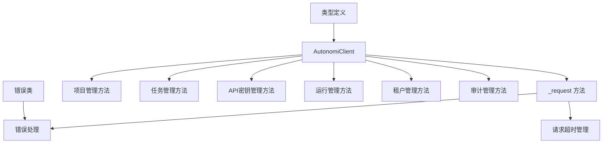

# TypeScript SDK

## 概述

TypeScript SDK 是 Autonomi 控制平面 API 的官方客户端库，提供了一套完整的类型安全接口，用于与 Autonomi 平台进行交互。该 SDK 设计简洁高效，仅使用 Node.js 18+ 内置的 fetch API，无需任何外部依赖，确保了轻量化和可靠性。

本 SDK 的核心价值在于为开发者提供类型安全的 API 访问，通过 TypeScript 接口定义和编译时检查，减少运行时错误，提高开发效率。它封装了与 Autonomi 控制平面的所有交互细节，包括身份验证、错误处理、请求超时管理等，让开发者可以专注于业务逻辑实现。

## 架构

TypeScript SDK 采用简洁的分层架构设计，主要由以下几个核心部分组成：



### 核心组件说明

1. **AutonomiClient**：SDK 的核心类，提供所有 API 交互的入口点。它封装了 HTTP 请求的构建、发送和响应处理逻辑。

2. **类型定义系统**：通过 TypeScript 接口定义了所有数据结构，包括 Project、Task、Run、Tenant 等，确保类型安全。

3. **错误处理系统**：提供了专门的错误类（AutonomiError、AuthenticationError、ForbiddenError、NotFoundError），用于精确处理不同类型的 API 错误。

4. **请求管理系统**：内置了请求超时控制、参数序列化、响应解析等功能，简化了 API 调用过程。

## 功能模块

### 1. 客户端初始化与配置

AutonomiClient 是 SDK 的主类，通过构造函数初始化，接受 ClientOptions 配置对象。配置项包括 baseUrl（API 基础地址）、token（身份验证令牌）和 timeout（请求超时时间，默认 30 秒）。

### 2. 项目管理

提供了完整的项目生命周期管理功能，包括列出项目、获取单个项目详情和创建新项目。项目是 Autonomi 平台中的核心组织单元，用于组织相关的任务和运行。

### 3. 任务管理

支持任务的创建、查询和列表操作。任务是具体的工作项，可以分配给项目，并具有状态和优先级属性。可以按项目 ID 和状态筛选任务列表。

### 4. API 密钥管理

提供 API 密钥的创建、列出、轮换和删除功能。API 密钥用于身份验证，支持设置角色和权限范围。轮换功能允许在保留旧密钥有效期的同时创建新密钥，确保平滑过渡。

### 5. 运行管理

运行是任务的具体执行实例。SDK 提供了运行的列表、详情获取、取消、重放和时间线查看功能。可以按项目 ID 和状态筛选运行列表，时间线功能提供了运行过程的详细事件记录。

### 6. 租户管理

支持多租户架构，提供租户的创建、列表、详情获取和删除功能。租户是平台的最高级组织单元，用于隔离不同组织或团队的数据。

### 7. 审计管理

提供审计日志查询和验证功能。审计日志记录了平台上的所有操作，可以按日期范围、操作类型和数量限制进行查询。验证功能用于检查审计日志的完整性和有效性。

## 核心类说明

### AutonomiClient

AutonomiClient 是 SDK 的核心类，负责与 Autonomi 控制平面 API 进行所有交互。

#### 构造函数

```typescript
constructor(options: ClientOptions)
```

**参数：**
- `options.baseUrl`：API 服务器的基础 URL
- `options.token`：可选的身份验证令牌
- `options.timeout`：可选的请求超时时间（毫秒），默认 30000

**功能：**
初始化客户端实例，配置基础 URL、身份验证令牌和请求超时时间。会自动移除 baseUrl 末尾的斜杠，确保 URL 构建的一致性。

#### _request 方法

```typescript
async _request<T>(
  method: string,
  path: string,
  body?: unknown,
  params?: Record<string, string>
): Promise<T>
```

**参数：**
- `method`：HTTP 方法（GET、POST、DELETE 等）
- `path`：API 路径
- `body`：可选的请求体
- `params`：可选的查询参数

**返回值：**
Promise<T>，解析为 API 响应的 JSON 数据

**功能：**
这是一个私有辅助方法，负责构建和发送 HTTP 请求，处理响应和错误。它会自动添加必要的请求头，处理查询参数序列化，实现请求超时控制，并根据响应状态码抛出相应的错误。

#### 公共方法

AutonomiClient 提供了丰富的公共方法，覆盖了所有 API 功能：

- `getStatus()`：获取 API 服务器状态
- `listProjects()`：列出所有项目
- `getProject(projectId)`：获取指定项目的详情
- `createProject(name, description?)`：创建新项目
- `listTasks(projectId?, status?)`：列出任务，可按项目和状态筛选
- `getTask(taskId)`：获取指定任务的详情
- `createTask(projectId, title, description?)`：创建新任务
- `listApiKeys()`：列出所有 API 密钥
- `createApiKey(name, role?)`：创建新 API 密钥
- `rotateApiKey(identifier, gracePeriodHours?)`：轮换 API 密钥
- `deleteApiKey(identifier)`：删除 API 密钥
- `listRuns(projectId?, status?)`：列出运行，可按项目和状态筛选
- `getRun(runId)`：获取指定运行的详情
- `cancelRun(runId)`：取消运行
- `replayRun(runId)`：重放运行
- `getRunTimeline(runId)`：获取运行时间线
- `listTenants()`：列出所有租户
- `getTenant(tenantId)`：获取指定租户的详情
- `createTenant(name, description?)`：创建新租户
- `deleteTenant(tenantId)`：删除租户
- `queryAudit(params?)`：查询审计日志
- `verifyAudit()`：验证审计日志完整性

## 使用示例

### 基本初始化

```typescript
import { AutonomiClient } from '@autonomi/sdk';

// 初始化客户端
const client = new AutonomiClient({
  baseUrl: 'https://api.autonomi.example.com',
  token: 'your-api-token-here',
  timeout: 60000 // 可选，设置 60 秒超时
});
```

### 项目管理

```typescript
// 列出所有项目
const projects = await client.listProjects();
console.log('Projects:', projects);

// 创建新项目
const newProject = await client.createProject(
  'My New Project',
  'This is a sample project description'
);
console.log('Created project:', newProject);

// 获取特定项目详情
const project = await client.getProject(newProject.id);
console.log('Project details:', project);
```

### 任务管理

```typescript
// 创建新任务
const task = await client.createTask(
  project.id,
  'Implement new feature',
  'Detailed description of the feature to implement'
);
console.log('Created task:', task);

// 列出项目中的所有任务
const tasks = await client.listTasks(project.id);
console.log('Project tasks:', tasks);

// 列出特定状态的任务
const pendingTasks = await client.listTasks(project.id, 'pending');
console.log('Pending tasks:', pendingTasks);
```

### API 密钥管理

```typescript
// 创建新 API 密钥
const apiKey = await client.createApiKey('My Deployment Key', 'deployer');
console.log('Created API key:', apiKey);
// 注意：token 只在创建时返回一次，请妥善保存

// 列出所有 API 密钥
const apiKeys = await client.listApiKeys();
console.log('API keys:', apiKeys);

// 轮换 API 密钥
await client.rotateApiKey(apiKey.id, 24); // 24 小时宽限期
console.log('API key rotated');

// 删除 API 密钥
await client.deleteApiKey(apiKey.id);
console.log('API key deleted');
```

### 运行管理

```typescript
// 列出所有运行
const runs = await client.listRuns();
console.log('All runs:', runs);

// 获取特定运行详情
const run = await client.getRun(runs[0].id);
console.log('Run details:', run);

// 取消运行
const cancelledRun = await client.cancelRun(run.id);
console.log('Cancelled run:', cancelledRun);

// 重放运行
const replayedRun = await client.replayRun(run.id);
console.log('Replayed run:', replayedRun);

// 获取运行时间线
const timeline = await client.getRunTimeline(run.id);
console.log('Run timeline:', timeline);
```

### 审计管理

```typescript
// 查询审计日志
const auditLogs = await client.queryAudit({
  start_date: '2023-01-01',
  end_date: '2023-12-31',
  action: 'create',
  limit: 100
});
console.log('Audit logs:', auditLogs);

// 验证审计日志完整性
const verification = await client.verifyAudit();
console.log('Audit verification:', verification);
```

## 错误处理

SDK 提供了专门的错误类，用于处理不同类型的 API 错误：

```typescript
import { AutonomiClient, AuthenticationError, NotFoundError } from '@autonomi/sdk';

const client = new AutonomiClient({
  baseUrl: 'https://api.autonomi.example.com',
  token: 'invalid-token'
});

try {
  const projects = await client.listProjects();
  console.log(projects);
} catch (error) {
  if (error instanceof AuthenticationError) {
    console.error('身份验证失败，请检查您的 API 令牌');
  } else if (error instanceof NotFoundError) {
    console.error('请求的资源不存在');
  } else {
    console.error('发生错误:', error.message);
  }
}
```

## 注意事项与限制

1. **Node.js 版本要求**：SDK 使用 Node.js 18+ 内置的 fetch API，因此需要 Node.js 18.0.0 或更高版本。

2. **API 令牌安全**：创建 API 密钥时，令牌只在创建响应中返回一次，请确保妥善保存，不要将其提交到版本控制系统。

3. **请求超时**：默认请求超时时间为 30 秒，对于长时间运行的操作，可以适当增加超时时间。

4. **日期格式**：所有日期参数应使用 ISO 8601 格式（如 '2023-01-01'）。

5. **分页**：当前版本的 SDK 不支持分页，大量数据的查询可能需要分批处理。

6. **错误重试**：SDK 不内置自动重试逻辑，对于临时性网络错误，建议在应用层实现重试机制。

7. **类型安全**：虽然 SDK 提供了完整的 TypeScript 类型定义，但 API 响应可能会因服务器版本更新而变化，建议在生产环境中添加适当的运行时数据验证。

## 与其他模块的关系

TypeScript SDK 是 Autonomi 平台的客户端接口，与多个核心模块有直接关系：

- **API Server & Services**：SDK 是 API Server & Services 模块的客户端实现，封装了与该模块的所有交互。
- **Dashboard Backend**：SDK 提供的 API 与 Dashboard Backend 模块使用相同的后端服务，可以实现类似的功能。
- **Python SDK**：TypeScript SDK 与 Python SDK 功能相似，只是针对不同的编程语言环境。

更多关于这些模块的信息，请参考相应的文档：
- [API Server & Services](API Server & Services.md)
- [Dashboard Backend](Dashboard Backend.md)
- [Python SDK](Python SDK.md)
