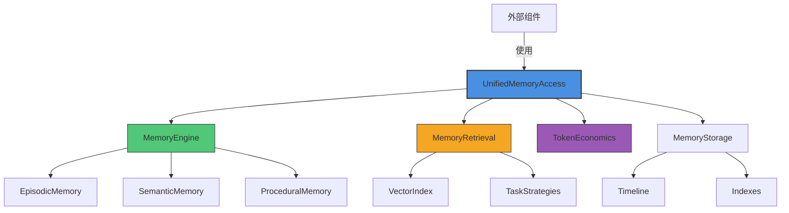
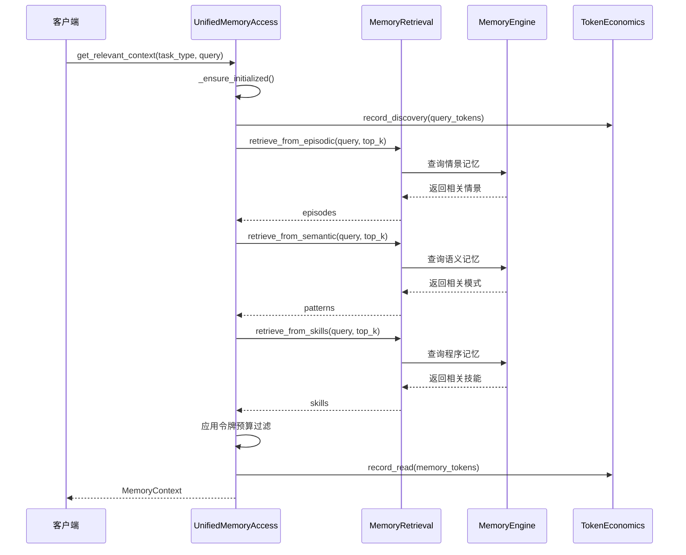
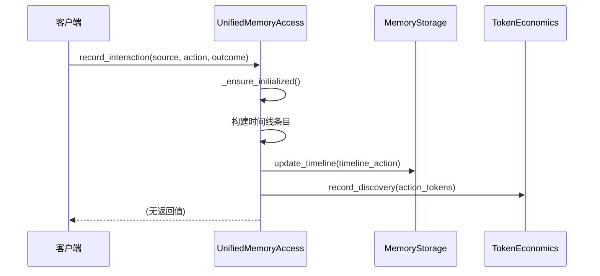

# Unified Access 模块文档

## 目录

1. [模块概述](#模块概述)
2. [核心组件](#核心组件)
3. [架构设计](#架构设计)
4. [详细功能说明](#详细功能说明)
5. [使用指南](#使用指南)
6. [配置与扩展](#配置与扩展)
7. [注意事项与限制](#注意事项与限制)
8. [参考资料](#参考资料)

---

## 模块概述

### 模块简介

Unified Access 模块是 Loki Mode 内存系统的统一访问层，为所有系统组件提供单一的内存操作接口。该模块抽象了多种内存类型（情景记忆、语义记忆、程序记忆）的复杂性，并提供高级操作接口用于上下文检索和交互记录。

### 设计理念

Unified Access 模块的设计基于以下核心理念：

- **单一入口点**：所有内存操作通过统一接口进行，简化了内存系统的使用复杂度
- **任务感知**：根据不同任务类型优化上下文检索策略
- **自动令牌管理**：内置令牌预算管理机制，确保内存检索不会超出令牌限制
- **上下文智能**：基于当前上下文自动生成相关建议

### 主要功能

- 提供统一的内存系统访问接口
- 支持任务类型感知的上下文检索
- 自动管理令牌预算和使用统计
- 记录系统交互和完整的任务执行轨迹
- 基于当前上下文生成智能建议
- 提供内存系统统计信息和状态监控

---

## 核心组件

### MemoryContext

`MemoryContext` 是一个数据容器类，用于存储为特定任务检索到的相关内存上下文。

```python
@dataclass
class MemoryContext:
    relevant_episodes: List[Dict[str, Any]] = field(default_factory=list)
    applicable_patterns: List[Dict[str, Any]] = field(default_factory=list)
    suggested_skills: List[Dict[str, Any]] = field(default_factory=list)
    token_budget: int = 0
    task_type: str = "implementation"
    retrieval_stats: Dict[str, Any] = field(default_factory=dict)
```

#### 主要属性

| 属性 | 类型 | 描述 |
|------|------|------|
| `relevant_episodes` | `List[Dict[str, Any]]` | 相关的情景记忆列表 |
| `applicable_patterns` | `List[Dict[str, Any]]` | 适用的语义模式列表 |
| `suggested_skills` | `List[Dict[str, Any]]` | 可能有用的技能列表 |
| `token_budget` | `int` | 检索后剩余的令牌预算 |
| `task_type` | `str` | 检测到或指定的任务类型 |
| `retrieval_stats` | `Dict[str, Any]` | 检索过程的统计信息 |

#### 主要方法

##### `to_dict()`

将 `MemoryContext` 对象转换为字典格式，用于 JSON 序列化。

**返回值**：包含所有属性的字典

##### `from_dict(data: Dict[str, Any])`

从字典创建 `MemoryContext` 对象。

**参数**：
- `data`：包含 MemoryContext 属性的字典

**返回值**：新的 `MemoryContext` 实例

##### `is_empty()`

检查上下文是否包含任何内存项。

**返回值**：如果没有内存项则返回 `True`，否则返回 `False`

##### `total_items()`

获取内存项的总数。

**返回值**：所有类型内存项的数量之和

##### `estimated_tokens()`

估计此上下文使用的令牌数。

**返回值**：估计的令牌总数

---

### UnifiedMemoryAccess

`UnifiedMemoryAccess` 是整个内存系统的统一接口类，提供所有内存操作的入口点。

```python
class UnifiedMemoryAccess:
    DEFAULT_TOKEN_BUDGET = 4000
    
    def __init__(
        self,
        base_path: str = ".loki/memory",
        engine: Optional[MemoryEngine] = None,
        session_id: Optional[str] = None,
    ):
        # 初始化代码
```

#### 主要属性

| 属性 | 类型 | 描述 |
|------|------|------|
| `base_path` | `str` | 内存存储的基础路径 |
| `engine` | `MemoryEngine` | 内存引擎实例 |
| `retrieval` | `MemoryRetrieval` | 内存检索系统实例 |
| `token_economics` | `TokenEconomics` | 令牌经济实例，用于跟踪令牌使用 |
| `default_token_budget` | `int` | 检索的默认令牌预算 |

#### 主要方法

##### `initialize()`

初始化内存系统，确保所有必需的目录和文件存在。可以安全地多次调用。

**参数**：无

**返回值**：无

**异常**：如果初始化失败，会记录错误并重新抛出异常

---

##### `get_relevant_context(task_type: str, query: str, token_budget: Optional[int] = None, top_k: int = 5)`

获取任务的相关上下文。

使用任务类型感知的加权策略从所有集合（情景、语义、程序）检索记忆。

**参数**：
- `task_type`：任务类型（exploration、implementation、debugging、review、refactoring）
- `query`：搜索查询或任务描述
- `token_budget`：上下文使用的最大令牌数（默认：4000）
- `top_k`：每个类别的最大项目数

**返回值**：包含相关记忆和剩余令牌预算的 `MemoryContext` 对象

**示例**：
```python
access = UnifiedMemoryAccess()
context = access.get_relevant_context("implementation", "Build REST API")
print(f"Found {context.total_items()} memory items")
```

---

##### `record_interaction(source: str, action: Dict[str, Any], outcome: Optional[str] = None)`

记录与系统的交互。

创建时间线条目，并可选地为重要交互存储情景轨迹。

**参数**：
- `source`：交互源（cli、api、mcp、agent）
- `action`：操作详细信息字典，包含：
  - `action`：操作类型（read_file、write_file 等）
  - `target`：操作目标（文件路径等）
  - `result`：操作结果（可选）
  - `goal`：操作目标（可选）
- `outcome`：可选的结果（success、failure、partial）

**返回值**：无

**示例**：
```python
access.record_interaction(
    "cli", 
    {"action": "read_file", "target": "api.py", "result": "File content..."},
    "success"
)
```

---

##### `record_episode(task_id: str, agent: str, goal: str, actions: List[Dict[str, Any]], outcome: str = "success", phase: str = "ACT", duration_seconds: int = 0)`

记录完整的情景轨迹。

**参数**：
- `task_id`：正在执行的任务 ID
- `agent`：执行任务的代理类型
- `goal`：任务尝试完成的目标
- `actions`：情景期间采取的操作列表
- `outcome`：结果（success、failure、partial）
- `phase`：RARV 阶段
- `duration_seconds`：情景花费的时间

**返回值**：如果成功，返回情景 ID；否则返回 None

**示例**：
```python
episode_id = access.record_episode(
    "task-123",
    "code-agent",
    "Implement user authentication",
    [
        {"action": "read_file", "target": "models.py"},
        {"action": "write_file", "target": "auth.py", "result": "Created auth module"}
    ],
    "success",
    "ACT",
    45
)
```

---

##### `get_suggestions(context: str, max_suggestions: int = 5)`

基于当前上下文获取建议。

分析上下文并检索相关模式和技能以生成可操作的建议。

**参数**：
- `context`：当前上下文或任务描述
- `max_suggestions`：返回的最大建议数

**返回值**：建议字符串列表

**示例**：
```python
suggestions = access.get_suggestions("implementing authentication")
for suggestion in suggestions:
    print(f"- {suggestion}")
```

---

##### `get_stats()`

获取内存系统统计信息。

**参数**：无

**返回值**：包含内存计数和令牌经济信息的字典

**示例**：
```python
stats = access.get_stats()
print(f"Episodes: {stats.get('episodes_count', 0)}")
print(f"Tokens used: {stats.get('token_economics', {}).get('total_read', 0)}")
```

---

##### `save_session()`

保存当前会话数据，包括令牌经济信息。

**参数**：无

**返回值**：无

---

##### `get_index()`

获取内存索引。

**参数**：无

**返回值**：包含内存索引的字典

---

##### `get_timeline()`

获取内存时间线。

**参数**：无

**返回值**：包含内存时间线的字典

---

## 架构设计

### 系统架构图



### 组件交互流程

#### 上下文检索流程



#### 交互记录流程



### 数据流向

Unified Access 模块的数据流向遵循以下模式：

1. **输入层**：接收来自外部组件的请求（上下文检索、交互记录等）
2. **协调层**：UnifiedMemoryAccess 协调各子系统的工作
3. **检索层**：MemoryRetrieval 处理具体的记忆检索逻辑
4. **存储层**：MemoryEngine 和 MemoryStorage 处理底层数据存储
5. **统计层**：TokenEconomics 跟踪和管理令牌使用
6. **输出层**：将处理结果返回给调用者

---

## 详细功能说明

### 上下文检索机制

Unified Access 模块的上下文检索是其核心功能之一，具有以下特点：

#### 任务类型感知

系统支持以下任务类型，并根据不同类型优化检索策略：

| 任务类型 | 描述 | 对应的 RARV 阶段 |
|---------|------|-----------------|
| `exploration` | 代码探索和理解 | REASON |
| `implementation` | 功能实现和开发 | ACT |
| `debugging` | 问题排查和修复 | ACT |
| `review` | 代码审查和评估 | REFLECT |
| `refactoring` | 代码重构和优化 | ACT |

#### 多源记忆整合

检索过程会从三个记忆源获取信息：

1. **情景记忆**：过去的任务执行记录和完整轨迹
2. **语义记忆**：识别出的模式和最佳实践
3. **程序记忆**：可复用的技能和步骤指南

#### 令牌预算管理

系统会严格控制检索结果的令牌使用量：

- 首先估计每个记忆项的令牌消耗
- 按优先级顺序添加记忆项，直到达到令牌预算
- 记录每个记忆层的令牌使用情况
- 返回剩余的令牌预算供后续使用

### 交互记录系统

交互记录系统支持两种级别的记录：

#### 轻量级交互记录

使用 `record_interaction()` 方法记录单个操作，适用于日常操作追踪：

- 记录操作类型、来源、目标和结果
- 添加时间戳和可选的结果状态
- 更新系统时间线
- 跟踪令牌消耗

#### 完整情景记录

使用 `record_episode()` 方法记录完整的任务执行情景：

- 捕获整个任务的执行过程
- 记录所有相关操作序列
- 保存任务目标、结果和持续时间
- 支持后续分析和学习

### 建议生成系统

建议生成系统基于以下几个维度提供智能建议：

1. **相关模式**：从语义记忆中提取适用的模式
2. **相关技能**：从程序记忆中推荐有用的技能
3. **任务类型特定建议**：根据任务类型提供针对性建议
4. **上下文理解**：分析当前上下文以生成相关建议

---

## 使用指南

### 基本使用流程

#### 1. 初始化 UnifiedMemoryAccess

```python
from memory.unified_access import UnifiedMemoryAccess

# 使用默认配置初始化
access = UnifiedMemoryAccess()

# 或者使用自定义配置
access = UnifiedMemoryAccess(
    base_path="/custom/path/to/memory",
    session_id="my-session-123"
)

# 确保系统已初始化
access.initialize()
```

#### 2. 检索相关上下文

```python
# 获取实现任务的上下文
context = access.get_relevant_context(
    task_type="implementation",
    query="Build a REST API endpoint for user management",
    token_budget=3000,
    top_k=5
)

# 检查是否有找到相关记忆
if not context.is_empty():
    print(f"Found {context.total_items()} relevant memory items")
    print(f"Remaining token budget: {context.token_budget}")
    
    # 访问不同类型的记忆
    for episode in context.relevant_episodes:
        print(f"Episode: {episode.get('goal', 'N/A')}")
    
    for pattern in context.applicable_patterns:
        print(f"Pattern: {pattern.get('name', 'N/A')}")
    
    for skill in context.suggested_skills:
        print(f"Skill: {skill.get('name', 'N/A')}")
```

#### 3. 记录交互

```python
# 记录单个操作
access.record_interaction(
    source="cli",
    action={
        "action": "read_file",
        "target": "src/api/users.py",
        "result": "Read 150 lines of code",
        "goal": "Understand user API structure"
    },
    outcome="success"
)

# 记录完整情景
actions = [
    {"action": "read_file", "target": "models.py", "result": "Read user model"},
    {"action": "write_file", "target": "api/users.py", "result": "Created user endpoint"},
    {"action": "write_file", "target": "tests/test_users.py", "result": "Added tests"}
]

episode_id = access.record_episode(
    task_id="task-001",
    agent="code-assistant",
    goal="Create user management API",
    actions=actions,
    outcome="success",
    phase="ACT",
    duration_seconds=180
)

if episode_id:
    print(f"Episode recorded with ID: {episode_id}")
```

#### 4. 获取建议

```python
# 获取基于上下文的建议
suggestions = access.get_suggestions(
    context="Implementing user authentication with JWT tokens",
    max_suggestions=5
)

print("Suggestions:")
for i, suggestion in enumerate(suggestions, 1):
    print(f"{i}. {suggestion}")
```

#### 5. 获取统计信息

```python
# 获取内存系统统计
stats = access.get_stats()

print("Memory System Statistics:")
print(f"Session ID: {stats.get('session_id')}")
print(f"Episodes: {stats.get('episodes_count', 0)}")
print(f"Patterns: {stats.get('patterns_count', 0)}")
print(f"Skills: {stats.get('skills_count', 0)}")

token_stats = stats.get('token_economics', {})
print(f"Total tokens read: {token_stats.get('total_read', 0)}")
print(f"Total tokens discovered: {token_stats.get('total_discovery', 0)}")

# 保存会话
access.save_session()
```

### 高级用法

#### 自定义 MemoryEngine

```python
from memory.engine import MemoryEngine
from memory.unified_access import UnifiedMemoryAccess

# 创建自定义配置的 MemoryEngine
custom_engine = MemoryEngine(
    storage=my_custom_storage,
    base_path="/custom/path"
)

# 使用自定义引擎初始化 UnifiedMemoryAccess
access = UnifiedMemoryAccess(
    engine=custom_engine,
    session_id="custom-session"
)
```

#### 批量操作处理

```python
# 处理一系列操作并记录
operations = [
    {"type": "read", "target": "file1.py"},
    {"type": "write", "target": "file2.py", "content": "..."},
    {"type": "test", "target": "test_file.py"}
]

for op in operations:
    access.record_interaction(
        source="batch-processor",
        action={
            "action": op["type"],
            "target": op["target"],
            "result": f"Processed {op['target']}"
        }
    )
```

---

## 配置与扩展

### 配置选项

#### 初始化参数

| 参数 | 类型 | 默认值 | 描述 |
|------|------|--------|------|
| `base_path` | `str` | `".loki/memory"` | 内存存储的基础路径 |
| `engine` | `Optional[MemoryEngine]` | `None` | 预配置的 MemoryEngine 实例 |
| `session_id` | `Optional[str]` | `None` | 用于令牌跟踪的会话 ID |

#### 常量配置

| 常量 | 默认值 | 描述 |
|------|--------|------|
| `DEFAULT_TOKEN_BUDGET` | `4000` | 检索的默认令牌预算 |

### 扩展点

#### 自定义任务类型

可以通过扩展 `_task_type_to_phase()` 方法来添加新的任务类型：

```python
class CustomUnifiedMemoryAccess(UnifiedMemoryAccess):
    def _task_type_to_phase(self, task_type: str) -> str:
        custom_mapping = {
            "testing": "VERIFY",
            "documentation": "REFLECT",
            # 添加更多自定义映射
        }
        # 合并默认映射和自定义映射
        mapping = {
            **super()._task_type_to_phase(task_type),
            **custom_mapping
        }
        return mapping.get(task_type, "ACT")
```

#### 自定义建议生成

可以通过重写 `_get_task_type_suggestions()` 方法来添加自定义建议：

```python
class CustomUnifiedMemoryAccess(UnifiedMemoryAccess):
    def _get_task_type_suggestions(self, task_type: str) -> List[str]:
        custom_suggestions = {
            "testing": [
                "Start with unit tests for core functionality",
                "Consider edge cases and error conditions",
            ],
            # 添加更多自定义建议
        }
        # 合并默认建议和自定义建议
        suggestions = super()._get_task_type_suggestions(task_type)
        suggestions.extend(custom_suggestions.get(task_type, []))
        return suggestions
```

---

## 注意事项与限制

### 重要注意事项

1. **初始化要求**：在使用任何功能前，必须确保调用 `initialize()` 方法或通过其他操作隐式初始化系统。

2. **令牌预算**：默认令牌预算为 4000，但实际可用令牌数可能因模型和使用场景而异，建议根据实际情况调整。

3. **会话管理**：每个 `UnifiedMemoryAccess` 实例应有唯一的会话 ID，以确保令牌统计的准确性。

4. **错误处理**：大多数方法都有内置的错误处理，会记录错误但不一定抛出异常，应检查返回值以确认操作成功。

5. **线程安全**：当前实现未明确保证线程安全，在多线程环境中使用时应添加适当的同步机制。

### 已知限制

1. **内存大小**：随着记忆项的增加，检索性能可能会下降，建议定期清理或归档旧的记忆。

2. **建议质量**：建议生成的质量依赖于记忆库中已有内容的质量和相关性。

3. **任务类型限制**：系统预定义了有限的任务类型，添加新类型需要修改代码。

4. **令牌估计**：令牌估计是近似值，实际令牌消耗可能有所不同。

### 性能考虑

1. **检索性能**：大量记忆项时，检索操作可能需要较长时间，考虑使用缓存机制。

2. **批量操作**：进行大量记录操作时，考虑批量处理以减少 I/O 开销。

3. **内存使用**：加载大量记忆到内存可能会占用较多 RAM，注意监控内存使用情况。

---

## 参考资料

### 相关模块

- [Memory Engine](Memory Engine.md) - 内存引擎模块，提供底层记忆存储和检索功能
- [Retrieval](Retrieval.md) - 检索模块，处理记忆检索策略和算法
- [Embeddings](Embeddings.md) - 嵌入模块，处理文本向量化
- [Schemas](Schemas.md) - 模式模块，定义记忆数据结构

### 数据类型参考

- `EpisodeTrace` - 情景轨迹数据结构，参阅 [Schemas 文档](Schemas.md)
- `SemanticPattern` - 语义模式数据结构，参阅 [Schemas 文档](Schemas.md)
- `ProceduralSkill` - 程序技能数据结构，参阅 [Schemas 文档](Schemas.md)
- `ActionEntry` - 操作条目数据结构，参阅 [Schemas 文档](Schemas.md)

### 示例代码

完整的示例代码可以在项目示例目录中找到，包括：
- 基本用法示例
- 高级配置示例
- 集成示例
