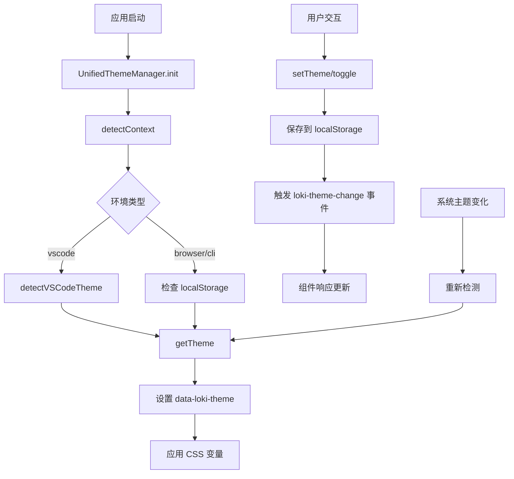
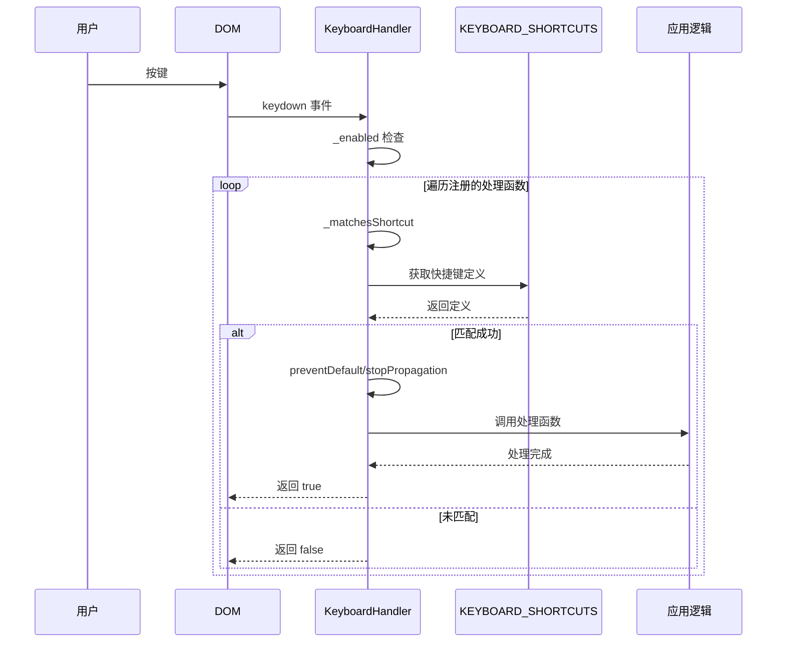

# Unified Styles 模块文档

## 概述

Unified Styles 模块是一个跨上下文的统一样式系统，为 Loki Mode 提供一致的视觉体验和交互模式。该模块设计用于在多种环境中无缝工作，包括浏览器、VS Code 扩展、CLI 嵌入式 HTML 等，确保用户在不同场景下获得连贯的体验。

### 设计理念

该模块采用设计令牌（Design Tokens）的方法，将视觉设计抽象为可重用的样式变量，包括：
- 主题颜色系统（浅色、深色、高对比度等）
- 间距和圆角缩放
- 排版系统
- 动画和过渡
- 响应式断点
- Z-index 层级管理

通过 CSS 自定义属性（CSS Custom Properties）实现，使样式系统既灵活又可维护，同时支持运行时主题切换。

## 核心组件

### UnifiedThemeManager

`UnifiedThemeManager` 是主题系统的核心管理类，负责主题的检测、切换、持久化和上下文感知。

```javascript
import { UnifiedThemeManager } from 'dashboard-ui/core/loki-unified-styles';
```

#### 主要功能

1. **上下文检测**：自动识别运行环境（浏览器、VS Code、CLI）
2. **主题选择**：根据上下文和用户偏好选择合适的主题
3. **主题切换**：提供 API 进行主题切换和持久化
4. **CSS 生成**：动态生成完整的主题样式

#### 方法说明

##### `detectContext()`

检测当前运行环境。

**返回值**：`'browser' | 'vscode' | 'cli'`

**工作原理**：
- 检查 `acquireVsCodeApi` 或 VS Code 特定的 CSS 变量来识别 VS Code 环境
- 检查 `data-loki-context` 属性识别 CLI 环境
- 默认返回浏览器环境

**示例**：
```javascript
const context = UnifiedThemeManager.detectContext();
console.log(`当前运行在: ${context}`);
```

##### `detectVSCodeTheme()`

检测 VS Code 的主题类型。

**返回值**：`'light' | 'dark' | 'high-contrast' | null`

**工作原理**：
- 首先检查 `vscode-body` 类名
- 回退到检查 `--vscode-editor-background` 的亮度来推断主题

**示例**：
```javascript
if (UnifiedThemeManager.detectContext() === 'vscode') {
  const vsTheme = UnifiedThemeManager.detectVSCodeTheme();
  console.log(`VS Code 主题: ${vsTheme}`);
}
```

##### `getTheme()`

获取当前应使用的主题名称。

**返回值**：主题名称字符串

**工作原理**：
- 在 VS Code 环境中，根据检测到的 VS Code 主题返回对应的映射主题
- 在浏览器/CLI 环境中，优先使用 localStorage 中保存的主题
- 如无保存，检查系统 `prefers-color-scheme` 偏好
- 默认采用浅色主题，除非系统明确偏好深色

**示例**：
```javascript
const currentTheme = UnifiedThemeManager.getTheme();
console.log(`当前主题: ${currentTheme}`);
```

##### `setTheme(theme)`

设置并保存主题。

**参数**：
- `theme` (string): 主题名称，必须是预定义主题之一

**副作用**：
- 保存到 localStorage
- 在文档根元素设置 `data-loki-theme` 属性
- 触发 `loki-theme-change` 自定义事件

**示例**：
```javascript
UnifiedThemeManager.setTheme('dark');
```

##### `toggle()`

在浅色和深色主题之间切换。

**返回值**：新的主题名称

**示例**：
```javascript
const newTheme = UnifiedThemeManager.toggle();
console.log(`切换到: ${newTheme}`);
```

##### `getVariables(theme?)`

获取主题的 CSS 变量对象。

**参数**：
- `theme` (string, 可选): 主题名称，默认为当前主题

**返回值**：包含所有 CSS 自定义属性的对象

**示例**：
```javascript
const variables = UnifiedThemeManager.getVariables('dark');
console.log(variables['--loki-accent']); // 输出深色主题的强调色
```

##### `generateCSS(theme?)`

生成完整的 CSS 字符串。

**参数**：
- `theme` (string, 可选): 主题名称，默认为当前主题

**返回值**：包含主题、设计令牌和基础样式的完整 CSS 字符串

**示例**：
```javascript
const styleElement = document.createElement('style');
styleElement.textContent = UnifiedThemeManager.generateCSS();
document.head.appendChild(styleElement);
```

##### `init()`

初始化主题系统。

**副作用**：
- 设置初始主题
- 监听系统主题偏好变化
- 在 VS Code 环境中监听主题变化

**示例**：
```javascript
// 在应用启动时调用
UnifiedThemeManager.init();
```

### KeyboardHandler

`KeyboardHandler` 是统一的键盘快捷键处理器，提供跨组件的快捷键管理。

```javascript
import { KeyboardHandler } from 'dashboard-ui/core/loki-unified-styles';
```

#### 主要功能

1. **快捷键注册**：为预定义的操作注册处理函数
2. **事件匹配**：智能匹配键盘事件和快捷键定义
3. **启用/禁用**：支持全局启用或禁用快捷键处理

#### 方法说明

##### `constructor()`

创建新的键盘处理器实例。

**示例**：
```javascript
const keyboard = new KeyboardHandler();
```

##### `register(action, handler)`

注册快捷键处理函数。

**参数**：
- `action` (string): 操作名称，来自 `KEYBOARD_SHORTCUTS`
- `handler` (Function): 处理函数

**示例**：
```javascript
keyboard.register('theme.toggle', (event) => {
  UnifiedThemeManager.toggle();
});

keyboard.register('action.search', (event) => {
  searchInput.focus();
});
```

##### `unregister(action)`

注销处理函数。

**参数**：
- `action` (string): 操作名称

**示例**：
```javascript
keyboard.unregister('theme.toggle');
```

##### `setEnabled(enabled)`

启用或禁用快捷键处理。

**参数**：
- `enabled` (boolean): 是否启用

**示例**：
```javascript
// 在模态框打开时禁用快捷键
keyboard.setEnabled(false);
// 关闭后重新启用
keyboard.setEnabled(true);
```

##### `handleEvent(event)`

处理键盘事件。

**参数**：
- `event` (KeyboardEvent): 键盘事件

**返回值**：是否处理了该事件

**示例**：
```javascript
document.addEventListener('keydown', (e) => {
  if (keyboard.handleEvent(e)) {
    // 事件已被处理
  }
});
```

##### `attach(element)`

将处理器附加到 DOM 元素。

**参数**：
- `element` (HTMLElement): 要附加的元素

**示例**：
```javascript
keyboard.attach(document.body);
```

##### `detach(element)`

从 DOM 元素分离处理器。

**参数**：
- `element` (HTMLElement): 要分离的元素

**示例**：
```javascript
keyboard.detach(document.body);
```

## 设计系统

### 主题系统

模块包含 5 个预定义主题：

1. **light** - 标准浅色主题（Autonomi 奶油色/编辑风格）
2. **dark** - 标准深色主题（Autonomi 午夜/Agent View）
3. **high-contrast** - 高对比度可访问性主题
4. **vscode-light** - VS Code 浅色主题映射
5. **vscode-dark** - VS Code 深色主题映射

每个主题定义了完整的 CSS 自定义属性集，包括：

#### 背景层
- `--loki-bg-primary` - 主要背景
- `--loki-bg-secondary` - 次要背景
- `--loki-bg-tertiary` - 三级背景
- `--loki-bg-card` - 卡片背景
- `--loki-bg-hover` - 悬停背景
- `--loki-bg-active` - 激活背景
- `--loki-bg-overlay` - 覆盖层背景

#### 强调色
- `--loki-accent` - 主要强调色
- `--loki-accent-hover` - 悬停强调色
- `--loki-accent-active` - 激活强调色
- `--loki-accent-light` - 浅色强调
- `--loki-accent-muted` - 柔和强调

#### 文本层次
- `--loki-text-primary` - 主要文本
- `--loki-text-secondary` - 次要文本
- `--loki-text-muted` - 柔和文本
- `--loki-text-disabled` - 禁用文本
- `--loki-text-inverse` - 反色文本

#### 语义状态色
- `--loki-success` - 成功状态
- `--loki-warning` - 警告状态
- `--loki-error` - 错误状态
- `--loki-info` - 信息状态
- 及其对应的 `-muted` 柔和版本

#### 阴影
- `--loki-shadow-sm` - 小阴影
- `--loki-shadow-md` - 中阴影
- `--loki-shadow-lg` - 大阴影
- `--loki-shadow-focus` - 聚焦阴影

### 设计令牌

#### 间距 (SPACING)

```javascript
{
  xs: '4px',
  sm: '8px',
  md: '12px',
  lg: '16px',
  xl: '24px',
  '2xl': '32px',
  '3xl': '48px',
}
```

CSS 变量：`--loki-space-xs` 到 `--loki-space-3xl`

#### 圆角 (RADIUS)

```javascript
{
  none: '0',
  sm: '2px',
  md: '4px',
  lg: '5px',
  xl: '5px',
  full: '9999px',
}
```

CSS 变量：`--loki-radius-none` 到 `--loki-radius-full`

#### 排版 (TYPOGRAPHY)

```javascript
{
  fontFamily: {
    sans: "'Inter', system-ui, -apple-system, BlinkMacSystemFont, sans-serif",
    serif: "'DM Serif Display', Georgia, 'Times New Roman', serif",
    mono: "'JetBrains Mono', 'Fira Code', 'SF Mono', Menlo, monospace",
  },
  fontSize: {
    xs: '10px', sm: '11px', base: '12px', md: '13px',
    lg: '14px', xl: '16px', '2xl': '18px', '3xl': '24px',
  },
  fontWeight: {
    normal: '400',
    medium: '500',
    semibold: '600',
    bold: '700',
  },
  lineHeight: {
    tight: '1.25',
    normal: '1.5',
    relaxed: '1.75',
  },
}
```

#### 动画 (ANIMATION)

```javascript
{
  duration: {
    fast: '100ms',
    normal: '200ms',
    slow: '300ms',
    slower: '500ms',
  },
  easing: {
    default: 'cubic-bezier(0.4, 0, 0.2, 1)',
    in: 'cubic-bezier(0.4, 0, 1, 1)',
    out: 'cubic-bezier(0, 0, 0.2, 1)',
    bounce: 'cubic-bezier(0.68, -0.55, 0.265, 1.55)',
  },
}
```

#### 响应式断点 (BREAKPOINTS)

```javascript
{
  sm: '640px',
  md: '768px',
  lg: '1024px',
  xl: '1280px',
  '2xl': '1536px',
}
```

#### Z-index 层级 (Z_INDEX)

```javascript
{
  base: '0',
  dropdown: '100',
  sticky: '200',
  modal: '300',
  popover: '400',
  tooltip: '500',
  toast: '600',
}
```

### 键盘快捷键

预定义的统一快捷键：

| 操作 | 快捷键 | 描述 |
|------|--------|------|
| `navigation.nextItem` | ArrowDown | 下一项 |
| `navigation.prevItem` | ArrowUp | 上一项 |
| `navigation.nextSection` | Tab | 下一区域 |
| `navigation.prevSection` | Shift+Tab | 上一区域 |
| `navigation.confirm` | Enter | 确认 |
| `navigation.cancel` | Escape | 取消 |
| `action.refresh` | Cmd/Ctrl+R | 刷新 |
| `action.search` | Cmd/Ctrl+K | 搜索 |
| `action.save` | Cmd/Ctrl+S | 保存 |
| `action.close` | Cmd/Ctrl+W | 关闭 |
| `theme.toggle` | Cmd/Ctrl+Shift+D | 切换主题 |
| `task.create` | Cmd/Ctrl+N | 新建任务 |
| `task.complete` | Cmd/Ctrl+Enter | 完成任务 |
| `view.toggleLogs` | Cmd/Ctrl+Shift+L | 切换日志 |
| `view.toggleMemory` | Cmd/Ctrl+Shift+M | 切换记忆 |

### ARIA 模式

预定义的可访问性模式：

- `button` - 按钮模式
- `tablist` / `tab` / `tabpanel` - 标签页模式
- `list` / `listitem` - 列表模式
- `livePolite` / `liveAssertive` - 实时区域
- `dialog` / `alertdialog` - 对话框
- `status` / `alert` - 状态通知
- `log` - 日志区域

## 基础样式

模块包含一组预定义的基础样式类：

### 按钮

```html
<button class="btn btn-primary">主要按钮</button>
<button class="btn btn-secondary">次要按钮</button>
<button class="btn btn-ghost">幽灵按钮</button>
<button class="btn btn-danger">危险按钮</button>

<button class="btn btn-primary btn-sm">小按钮</button>
<button class="btn btn-primary btn-lg">大按钮</button>
```

### 状态指示器

```html
<div class="status-dot active"></div>
<div class="status-dot idle"></div>
<div class="status-dot paused"></div>
<div class="status-dot stopped"></div>
<div class="status-dot error"></div>
```

### 卡片

```html
<div class="card">普通卡片</div>
<div class="card card-interactive">可交互卡片</div>
```

### 输入框

```html
<input type="text" class="input" placeholder="输入内容...">
```

### 徽章

```html
<span class="badge badge-success">成功</span>
<span class="badge badge-warning">警告</span>
<span class="badge badge-error">错误</span>
<span class="badge badge-info">信息</span>
<span class="badge badge-neutral">中性</span>
```

### 其他工具类

- `.mono` - 等宽字体
- `.empty-state` - 空状态
- `.spinner` - 加载旋转器
- `.sr-only` - 屏幕阅读器专用
- `.hide-mobile` / `.hide-desktop` - 响应式隐藏

## 架构与数据流

### 主题系统架构



### 键盘事件流程



## 使用指南

### 基础设置

#### 1. 初始化主题系统

```javascript
import { UnifiedThemeManager } from 'dashboard-ui/core/loki-unified-styles';

// 在应用启动时初始化
UnifiedThemeManager.init();
```

#### 2. 应用样式

**在 Web Components 中使用：
```javascript
class MyComponent extends HTMLElement {
  constructor() {
    super();
    this.attachShadow({ mode: 'open' });
  }

  connectedCallback() {
    const style = document.createElement('style');
    style.textContent = UnifiedThemeManager.generateCSS();
    this.shadowRoot.appendChild(style);
    
    // 监听主题变化
    window.addEventListener('loki-theme-change', (e) => {
      style.textContent = UnifiedThemeManager.generateCSS();
    });
  }
}
```

**在普通 CSS 中使用：
```css
/* 只需使用 CSS 变量，主题系统会处理值的切换 */
.my-element {
  background: var(--loki-bg-primary);
  color: var(--loki-text-primary);
  padding: var(--loki-space-md);
  border-radius: var(--loki-radius-md);
}
```

### 键盘快捷键设置

```javascript
import { KeyboardHandler } from 'dashboard-ui/core/loki-unified-styles';

const keyboard = new KeyboardHandler();

// 注册快捷键
keyboard.register('theme.toggle', () => {
  UnifiedThemeManager.toggle();
});

keyboard.register('action.search', () => {
  document.querySelector('#search').focus();
});

// 附加到文档
keyboard.attach(document.body);
```

### 主题切换 UI 示例

```javascript
// 创建主题切换按钮
function createThemeToggle() {
  const button = document.createElement('button');
  button.className = 'btn btn-ghost';
  button.innerHTML = '🌓 切换主题';
  button.setAttribute('aria-label', '切换深色/浅色主题');
  
  button.addEventListener('click', () => {
    const newTheme = UnifiedThemeManager.toggle();
    button.setAttribute('aria-pressed', newTheme.includes('dark'));
  });
  
  // 监听主题变化更新按钮状态
  window.addEventListener('loki-theme-change', (e) => {
    button.setAttribute('aria-pressed', e.detail.theme.includes('dark'));
  });
  
  return button;
}
```

### 自定义主题

虽然当前版本主要使用预定义主题，但可以通过以下方式扩展：

```javascript
import { THEMES, generateThemeCSS } from 'dashboard-ui/core/loki-unified-styles';

// 添加自定义主题（注意：这是示例，实际实现可能需要修改源文件）
THEMES['my-custom-theme'] = {
  '--loki-bg-primary': '#...',
  '--loki-text-primary': '#...',
  // ... 其他变量
};

// 然后可以使用
UnifiedThemeManager.setTheme('my-custom-theme');
```

## 配置与选项

### InitConfig 接口

虽然当前实现中 `init()` 不直接接受配置，但可以通过以下方式自定义行为：

```javascript
// 手动设置初始主题
const preferredTheme = 'dark'; // 或从配置获取
if (preferredTheme) {
  localStorage.setItem(UnifiedThemeManager.STORAGE_KEY, preferredTheme);
}
UnifiedThemeManager.init();
```

## 注意事项与限制

### 边缘情况

1. **VS Code 主题检测**
   - 某些自定义 VS Code 主题可能无法正确检测
   - 回退机制基于背景色亮度，可能不准确
   - 建议：提供手动主题覆盖选项

2. **localStorage 不可用**
   - 在某些受限环境中 localStorage 可能不可用
   - 当前实现没有优雅降级
   - 注意：可能导致 `setItem` 调用抛出错误

3. **Web Component 样式隔离**
   - 每个 Shadow DOM 需要单独注入样式
   - 主题变化时需要更新所有组件的样式

4. **键盘快捷键冲突**
   - 快捷键可能与浏览器或系统快捷键冲突
   - `handleEvent` 会调用 `preventDefault`，可能影响原生行为
   - 建议：在可编辑区域等特殊场景禁用快捷键处理

### 性能考虑

1. **CSS 生成**
   - `generateCSS()` 每次调用都生成完整 CSS 字符串
   - 对于频繁主题切换，考虑缓存结果

2. **MutationObserver**
   - VS Code 环境中使用 MutationObserver 监听主题变化
   - 这是轻量级的，但在极端情况下可能影响性能

3. **事件监听**
   - 监听系统 `prefers-color-scheme` 变化
   - 确保在不需要时清理监听器（虽然当前没有提供卸载方法）

### 可访问性

1. **高对比度主题**
   - 提供了专门的高对比度主题
   - 确保在 WCAG AA 标准下的可读性

2. **键盘导航**
   - 所有交互元素都应支持键盘操作
   - 使用提供的 ARIA 模式确保可访问性

3. **焦点样式**
   - 基础样式包含 `:focus-visible` 样式
   - 不要移除或覆盖焦点轮廓

## 与其他模块的关系

### Core Theme 模块

Unified Styles 与 [Core Theme](Core Theme.md) 模块紧密协作：
- `LokiTheme` 可能使用 `UnifiedThemeManager` 来管理主题
- `LokiElement` 基础类可能集成统一样式系统

### Dashboard UI Components

所有 [Dashboard UI Components](Dashboard UI Components.md) 都应使用统一样式系统：
- 组件通过 CSS 变量使用设计令牌
- 组件应响应 `loki-theme-change` 事件
- 使用提供的基础样式类和工具类

### Dashboard Frontend

[Dashboard Frontend](Dashboard Frontend.md) 是主要消费者：
- 在应用启动时初始化主题系统
- 集成键盘快捷键处理
- 提供主题切换 UI

## 示例

### 完整应用集成

```javascript
import { 
  UnifiedThemeManager, 
  KeyboardHandler,
  KEYBOARD_SHORTCUTS 
} from 'dashboard-ui/core/loki-unified-styles';

class App {
  constructor() {
    this.keyboard = new KeyboardHandler();
    this.init();
  }

  init() {
    // 1. 初始化主题系统
    UnifiedThemeManager.init();
    
    // 2. 设置键盘快捷键
    this.setupKeyboardShortcuts();
    
    // 3. 创建 UI
    this.createUI();
    
    // 4. 监听主题变化
    window.addEventListener('loki-theme-change', (e) => {
      this.onThemeChange(e.detail.theme);
    });
  }

  setupKeyboardShortcuts() {
    this.keyboard.register('theme.toggle', () => {
      UnifiedThemeManager.toggle();
    });
    
    this.keyboard.register('action.refresh', () => {
      this.refresh();
    });
    
    this.keyboard.attach(document.body);
  }

  createUI() {
    // 创建主题切换按钮
    const themeToggle = document.createElement('button');
    themeToggle.className = 'btn btn-ghost';
    themeToggle.textContent = '切换主题';
    themeToggle.addEventListener('click', () => UnifiedThemeManager.toggle());
    document.body.appendChild(themeToggle);
    
    // 创建示例卡片
    const card = document.createElement('div');
    card.className = 'card';
    card.innerHTML = `
      <h2 style="color: var(--loki-text-primary); margin: 0 0 var(--loki-space-md) 0;">
        欢迎使用 Unified Styles
      </h2>
      <p style="color: var(--loki-text-secondary); margin: 0;">
        这是一个使用统一样式系统的示例。
      </p>
      <div style="margin-top: var(--loki-space-lg); display: flex; gap: var(--loki-space-sm);">
        <button class="btn btn-primary">主要操作</button>
        <button class="btn btn-secondary">次要操作</button>
      </div>
    `;
    document.body.appendChild(card);
  }

  onThemeChange(theme) {
    console.log(`主题已更改为: ${theme}`);
    // 可以在这里执行其他主题相关的更新
  }

  refresh() {
    console.log('刷新应用...');
  }
}

// 启动应用
document.addEventListener('DOMContentLoaded', () => {
  new App();
});
```

### Web Component 集成

```javascript
import { UnifiedThemeManager, ARIA_PATTERNS } from 'dashboard-ui/core/loki-unified-styles';

class LokiButton extends HTMLElement {
  constructor() {
    super();
    this.attachShadow({ mode: 'open' });
  }

  static get observedAttributes() {
    return ['variant', 'size', 'disabled'];
  }

  connectedCallback() {
    this.render();
    this.applyStyles();
    
    // 应用 ARIA 模式
    Object.assign(this, ARIA_PATTERNS.button);
    
    // 监听主题变化
    this._themeListener = () => this.applyStyles();
    window.addEventListener('loki-theme-change', this._themeListener);
  }

  disconnectedCallback() {
    window.removeEventListener('loki-theme-change', this._themeListener);
  }

  applyStyles() {
    const existingStyle = this.shadowRoot.querySelector('style');
    if (existingStyle) {
      existingStyle.remove();
    }
    
    const style = document.createElement('style');
    style.textContent = UnifiedThemeManager.generateCSS();
    this.shadowRoot.insertBefore(style, this.shadowRoot.firstChild);
  }

  render() {
    const variant = this.getAttribute('variant') || 'primary';
    const size = this.getAttribute('size') || 'md';
    const disabled = this.hasAttribute('disabled');
    
    let classes = ['btn', `btn-${variant}'];
    if (size !== 'md') classes.push(`btn-${size}`);
    
    this.shadowRoot.innerHTML = `
      <button class="${classes.join(' ')}" ${disabled ? 'disabled' : ''}>
        <slot></slot>
      </button>
    `;
  }

  attributeChangedCallback() {
    if (this.shadowRoot) {
      this.render();
    }
  }
}

customElements.define('loki-button', LokiButton);
```

## 总结

Unified Styles 模块提供了一个完整、一致的设计系统，使 Loki Mode 的 UI 组件能够在多种环境中保持统一的外观和行为。通过设计令牌、主题系统和统一的键盘快捷键，该模块大大简化了 UI 开发工作，同时确保了可访问性和用户体验的一致性。

主要优势：
- 跨上下文一致性（浏览器、VS Code、CLI）
- 完整的设计令牌系统
- 灵活的主题切换
- 统一的键盘快捷键
- 内置可访问性支持
- 实用的基础样式类

该模块是整个 Dashboard UI 系统的基础，所有 UI 组件都应该基于此系统构建。
